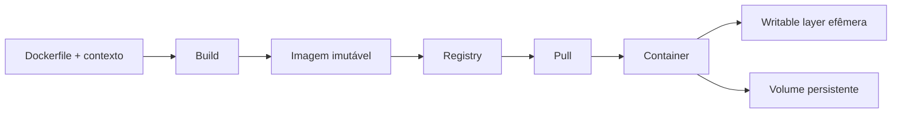

# Docker

Docker combina build de imagens, distribuição e execução de containers. O valor é um contrato operacional repetível; o risco é esconder sistema operacional, rede e supply chain atrás de comandos simples.

## O problema que Docker resolve

Sem empacotamento reproduzível, aplicações podem depender de bibliotecas, ferramentas e configurações instaladas manualmente em cada máquina. O clássico “funciona na minha máquina” aparece quando build e runtime não compartilham contrato.

Docker ajuda a transformar aplicação + runtime userspace em um artefato versionável e distribuível. Ele **não virtualiza o kernel inteiro** como uma VM e não elimina diferenças de arquitetura, filesystem, rede ou recursos do host.

## Modelo mental

Uma imagem é manifesto/configuração mais layers content-addressed distribuídas por registry. Um container é a execução dessa imagem com namespaces, cgroups e uma camada gravável copy-on-write.



O contrato importante é: **imagem deve ser reproduzível e container deve ser descartável**. Estado de negócio persistente precisa ficar fora da writable layer.

## Layers, copy-on-write e registries

Cada instrução relevante do build cria filesystem diff reutilizável; o digest identifica conteúdo. Ao alterar arquivo existente durante execução, o storage driver faz **copy-up** para a writable layer antes da escrita. Isso preserva imagem, mas adiciona overhead e mantém arquivo copiado mesmo se só parte mudou. Remover arquivo em layer posterior cria marcador/whiteout; não reduz bytes da layer anterior. Por isso secret copiado e apagado em outra instrução continua recuperável: use secret mount e multi-stage.

Registry armazena manifests, configs e blobs; tag é ponteiro mutável, digest é identidade imutável. Pipeline publica uma vez, verifica scan/assinatura/provenance e promove o mesmo digest. Configure IAM por repositório, TLS, retenção/garbage collection e proteção contra overwrite; replica/mirror precisa política de freshness e trust. Cliente faz pull apenas de blobs ausentes, beneficiando cache de layers compartilhadas.

## Dockerfile de produção

```dockerfile
# syntax=docker/dockerfile:1
FROM golang:1.25 AS build
WORKDIR /src
COPY go.mod go.sum ./
RUN --mount=type=cache,target=/go/pkg/mod go mod download
COPY . .
RUN CGO_ENABLED=0 go build -trimpath -o /out/api ./cmd/api

FROM gcr.io/distroless/static-debian12:nonroot
COPY --from=build /out/api /api
USER nonroot:nonroot
EXPOSE 8080
ENTRYPOINT ["/api"]
```

Fixe base por digest quando reprodução/auditoria exigir e automatize atualização. Multi-stage remove toolchain do runtime. `.dockerignore` reduz contexto e vazamento. Cache/secret mounts do BuildKit não devem virar layers.

## Build como pipeline determinístico

Um build deveria produzir o mesmo artefato para o mesmo source e conjunto declarado de dependências. Na prática, fontes de não determinismo incluem:

- `apt-get update` sem versão/pin;
- downloads por URL mutável;
- timestamps embutidos;
- dependência `latest`;
- arquitetura diferente do builder;
- scripts que consultam rede externa sem lock.

Quanto mais supply chain exige auditoria, mais importante fixar versões, digests e provenance.

## Runtime

- exec form preserva sinais; shell form cria camada e parsing extra;
- `HEALTHCHECK` responde a uma pergunta específica, não prova saúde sistêmica;
- publish de porta expõe host; rede bridge fornece DNS entre serviços;
- bind mount acopla host; named volume é gerenciado pelo engine;
- limite memória/CPU/PIDs e teste shutdown dentro do grace period;
- logs vão a stdout/stderr com política de rotação no runtime.

Docker Compose descreve serviços, redes, volumes, configs e dependencies para desenvolvimento/testes locais. `depends_on` modela ordem/condição suportada, não transforma dependência em disponível para sempre: aplicação ainda precisa timeout/retry. Perfis e override files evitam manifesto duplicado; não use Compose como substituto automático de um scheduler de produção.

## PID 1, sinais e shutdown

O primeiro processo do container recebe sinais do runtime e também possui responsabilidade especial sobre processos filhos. Aplicações precisam tratar `SIGTERM`, parar de aceitar trabalho, drenar requests/jobs e encerrar antes do grace period.

Se o entrypoint usa shell form, o shell pode ficar como PID 1 e não encaminhar sinais como esperado. Prefira exec form ou um init apropriado quando necessário.

Teste o shutdown. “Funciona quando dou `docker stop`” precisa ser observado: requests em voo foram concluídas? jobs ficaram duplicados? conexão foi drenada?

## Rede

Containers em bridge network recebem namespace de rede próprio. Publicar `8080:8080` cria caminho host → container. Dentro de uma network, serviços podem resolver nomes configurados pelo runtime.

Problemas comuns:

- aplicação escuta apenas em `127.0.0.1` dentro do container;
- DNS/service name incorreto;
- porta publicada confunde porta host e container;
- MTU/proxy/firewall causam falhas fora do ambiente local;
- serviço assume que `localhost` é outro container.

Use `docker inspect`, testes de conexão e logs do app para separar problema de rede de problema da aplicação.

## Storage e persistência

A writable layer é adequada para estado temporário. Dados duráveis usam volumes ou serviços externos. Bind mounts são úteis em desenvolvimento, mas acoplam layout/permissões do host.

Para workloads write-heavy, overlay filesystem pode adicionar overhead. Bancos normalmente precisam de volume apropriado, fsync e políticas de backup. Containerizar PostgreSQL não elimina requisitos de storage durável.

## Recursos e cgroups

Sem limites, containers competem pelos recursos do host. Configure memory, CPU e PIDs conforme objetivo.

### Memória

Quando o processo ultrapassa o limite, pode ocorrer OOM kill. A aplicação talvez desapareça sem conseguir logar a causa. Observe eventos do runtime e métricas do cgroup.

### CPU

Quota reduz tempo de CPU disponível. Um serviço pode mostrar CPU média moderada e ainda sofrer throttling em bursts, aumentando p99.

### PIDs

Limitar PIDs ajuda contra fork bomb e runaway process creation.

A configuração precisa ser testada sob carga realista, não apenas aplicada.

## Build eficiente

Ordene layers do estável ao volátil; copie manifestos e baixe dependências antes do source. Evite package-manager cache na imagem final. Não use `latest` como identidade. Gere SBOM, escaneie vulnerabilidades com contexto, como exploitability/reachability, e assine artefatos conforme política.

Performance depende de syscall, filesystem/network virtualization, cgroups, NUMA e limites do host. Meça no container com limites reais; não conclua por tamanho da imagem. Overlay filesystem pode piorar write-heavy workloads, e CPU throttling pode elevar p99 mesmo com média baixa.

## Segurança

Princípios básicos:

- rode como usuário não-root;
- remova capabilities não necessárias;
- evite `--privileged`;
- use filesystem read-only quando possível;
- não monte `/var/run/docker.sock` sem entender que isso equivale a alto privilégio no host;
- mantenha base atualizada e pequena;
- use secret mounts no build e secret manager no runtime;
- verifique provenance e assinatura quando supply chain exigir.

Container é isolamento útil, mas compartilha kernel. Workloads hostis/multi-tenant podem exigir VM, sandbox ou runtime adicional.

## Observabilidade

Meça container e aplicação juntos:

- CPU usage/throttling;
- memory working set/OOM;
- PIDs;
- filesystem/volume usage;
- network bytes/errors;
- restart count;
- application latency/errors;
- startup e shutdown duration.

Se um container reinicia repetidamente, o restart policy pode mascarar o problema. Investigue causa, não apenas mantenha o processo “verde”.

## Debug

Inspecione `docker image history`, `docker inspect`, eventos, stats, rede e processos. Imagem minimalista pode não ter shell: use debug container/namespace controlado, sem transformar produção em imagem cheia de ferramentas.

Fluxo básico:

1. confirme qual imagem/digest está rodando;
2. veja exit code e eventos;
3. inspecione limites e mounts;
4. compare env/config sem expor secrets;
5. observe rede/processos;
6. reproduza com o mesmo digest e limites.

## Failure modes

- **OOM kill:** memória excede cgroup;
- **CPU throttling:** p99 cresce sob burst;
- **disk full:** volume ou storage do engine satura;
- **image pull failure:** registry/auth/network indisponível;
- **crash loop:** restart policy repete falha de configuração;
- **graceful shutdown quebrado:** requests/jobs ficam incompletos;
- **secret em layer:** remoção posterior não elimina histórico;
- **tag mutável:** deploys diferentes usam imagens diferentes sob o mesmo nome.

## Laboratório

Construa uma API simples em Docker.

1. Crie Dockerfile multi-stage e `.dockerignore`.
2. Rode como non-root.
3. Fixe a imagem base por digest.
4. Limite memória e provoque OOM de forma controlada; observe exit/evento.
5. Limite CPU e compare p99 com e sem throttling.
6. Implemente shutdown por `SIGTERM` e teste requests em voo.
7. Use volume para um dado persistente e prove que ele sobrevive à remoção do container.
8. Faça build com secret mount e confirme que o segredo não aparece em `docker history`.
9. Gere SBOM e registre digest final.
10. Suba dois serviços via Compose e torne uma dependência indisponível; confirme timeout/retry no app.

## Anti-patterns

- secret em `ARG`, `ENV`, layer ou build context;
- executar como root e adicionar `--privileged` para “funcionar”;
- instalar/atualizar pacote ao iniciar;
- volume para sobrescrever código em produção;
- depender da ordem do Compose sem readiness/retry;
- copiar `.git`, credenciais ou todo monorepo;
- usar `latest` como identidade de release;
- restart infinito para esconder crash.

## Perguntas de revisão

- Qual parte do container é imutável e qual é efêmera?
- Por que apagar secret em layer seguinte não resolve vazamento?
- O que acontece quando o PID 1 recebe `SIGTERM`?
- Por que mais containers podem saturar o mesmo banco?
- Quando volume é necessário?
- Qual diferença prática entre tag e digest?

## Referências oficiais

- Docker. [Build best practices](https://docs.docker.com/build/building/best-practices/).
- Docker. [Dockerfile reference](https://docs.docker.com/reference/dockerfile/).
- Docker. [Storage](https://docs.docker.com/engine/storage/).
- OCI. [Image specification](https://github.com/opencontainers/image-spec).
- OCI. [Distribution specification](https://github.com/opencontainers/distribution-spec).

---

[← Containers](../README.md) · [↑ Containers](../README.md) · [Segurança →](../security.md)
