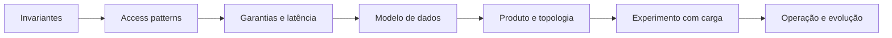

# Bancos de dados

Bancos preservam fatos e materializam decisões de consistência. Esta trilha começa pelo modelo de acesso e pelas garantias necessárias; só depois escolhe produto, índices e topologia.

## Mapa da trilha

| Guia | Questão central |
| --- | --- |
| [Comparação](comparison.md) | SQL, NoSQL, NewSQL e vetorial: qual modelo atende acesso e invariantes? |
| [Transações e consistência](transactions-and-consistency.md) | O que atomicidade e isolamento realmente garantem? |
| [SQL](sql/README.md) | Como consultar, agregar, analisar planos e evoluir modelos relacionais? |
| [PostgreSQL](postgresql/README.md) | Como operar um banco relacional extensível e confiável? |
| [MongoDB](mongodb/README.md) | Quando documentos e agregados reduzem impedância? |
| [Redis](redis/README.md) | Como usar estruturas em memória sem tratar cache como verdade? |
| [DynamoDB](dynamodb/README.md) | Como desenhar access patterns para uma tabela particionada gerenciada? |
| [Exercícios](exercises.md) | Modelagem, planos, falhas e migração em quatro níveis |

## Panorama do ecossistema

Os quatro Codices profundos não esgotam as famílias. As entradas abaixo
posicionam alternativas para expansão e apontam à fonte oficial; uma categoria
não substitui benchmark com o workload real.

| Tecnologia | Família / avalie quando | Documentação oficial |
| --- | --- | --- |
| MySQL | relacional; ecossistema MySQL/InnoDB, replicação e operação já presentes na equipe | [MySQL](https://dev.mysql.com/doc/) |
| SQLite | relacional embarcado; estado local, arquivo único e poucas writers concorrentes | [SQLite](https://sqlite.org/docs.html) |
| Cassandra | wide-column; escrita distribuída e consultas conhecidas por partition key | [Apache Cassandra](https://cassandra.apache.org/doc/latest/) |
| Elasticsearch | busca; full-text, ranking e agregações como projeção reconstruível | [Elastic](https://www.elastic.co/docs) |
| OpenSearch | busca; API/ecossistema aberto e operação própria ou gerenciada | [OpenSearch](https://docs.opensearch.org/latest/) |
| Neo4j | grafo; travessias variáveis sobre relações densas | [Neo4j](https://neo4j.com/docs/) |
| pgvector | vetorial no PostgreSQL; transação/metadata juntas e escala compatível | [pgvector](https://github.com/pgvector/pgvector) |
| Qdrant | vetorial especializado; filtros, operação distribuída e API dedicada | [Qdrant](https://qdrant.tech/documentation/) |
| Milvus | vetorial distribuído; grandes coleções e operação de cluster justificadas | [Milvus Docs](https://github.com/milvus-io/milvus-docs) |
| Pinecone | vetorial gerenciado; reduzir operação aceitando custo e dependência do serviço | [Pinecone](https://docs.pinecone.io/) |

## Processo de decisão

1. Liste fatos, cardinalidade, volume, crescimento e retenção.
2. Expresse invariantes e fronteiras transacionais.
3. Descreva leituras e escritas com frequência, seletividade e SLO.
4. Defina tolerância a staleness, indisponibilidade e perda (RPO/RTO).
5. Modele, meça com distribuição realista e execute restore/failover.

## Princípios

- O banco primário é fonte de verdade; cache, índice de busca e warehouse são projeções reconstruíveis.
- Índice troca escrita, espaço e manutenção por uma leitura específica; valide com plano real.
- Replicação não substitui backup, e backup sem restore testado é uma hipótese.
- Constraints no banco protegem todos os escritores; validação na aplicação melhora a experiência.
- Migrações devem manter versões adjacentes compatíveis: expandir, migrar, contrair.
- Particionamento adiciona routing, rebalanceamento e transações distribuídas; use por necessidade medida.

## Checklist de produção

- owner, classificação e retenção de cada dado;
- constraints, chaves e política de concorrência explícitas;
- pooling limitado, timeouts e cancelamento ponta a ponta;
- encryption in transit/at rest, identidade curta e least privilege;
- backup independente, restore drill e runbook de failover;
- métricas de saturação, latência por percentil, locks, lag e erros;
- schema/API versionados e plano de reversão.

## Referências essenciais

- Kleppmann & Riccomini. [*Designing Data-Intensive Applications*, 2ª ed.](https://www.oreilly.com/library/view/designing-data-intensive-applications/9781098119058/).
- Gray & Reuter. [*Transaction Processing*](https://www.microsoft.com/en-us/research/publication/transaction-processing-concepts-and-techniques/).
- PostgreSQL. [Documentação](https://www.postgresql.org/docs/current/).
- AWS. [DynamoDB Developer Guide](https://docs.aws.amazon.com/amazondynamodb/latest/developerguide/Introduction.html).

---

[← Sistemas distribuídos](../distributed-systems/README.md) · [↑ Início](../README.md) · [Comparação →](comparison.md)
