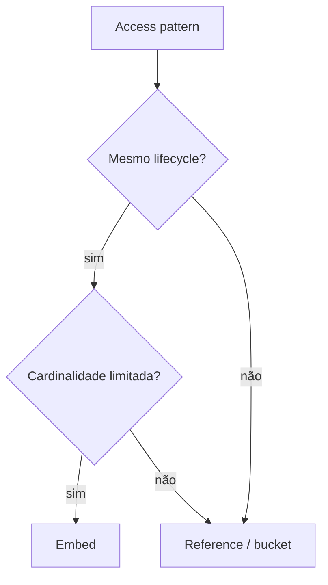
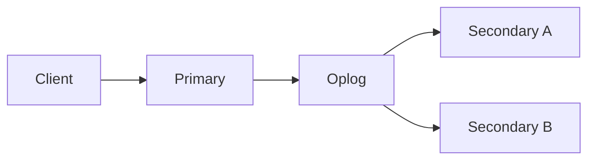
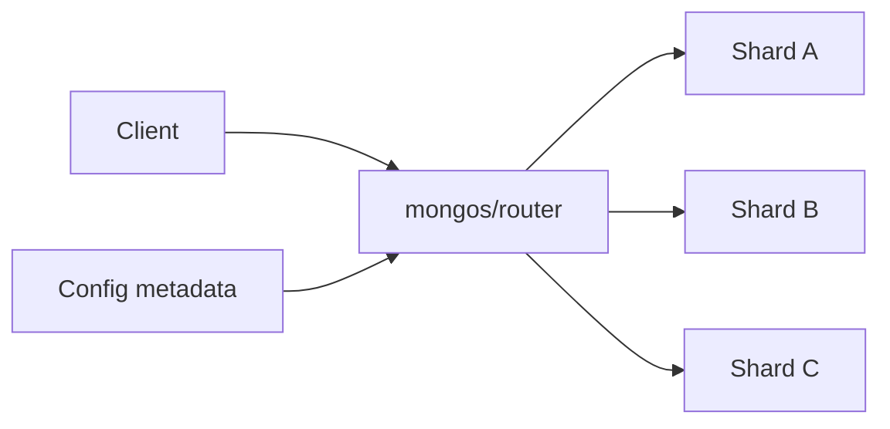

# MongoDB

MongoDB armazena documentos BSON em collections. O principal ganho não é "não
ter schema": é poder modelar um agregado que costuma ser lido e alterado junto
como uma unidade atômica.

A pergunta mais importante vem antes do índice ou do cluster: **qual é o access
pattern e qual dado realmente compartilha lifecycle?**

## 1. Documento como unidade de modelagem

Um documento pode representar um agregado completo:

```json
{
  "_id": "order-123",
  "customer_id": "c-8",
  "status": "paid",
  "items": [
    {"sku": "A", "quantity": 2},
    {"sku": "B", "quantity": 1}
  ]
}
```

Se pedido e itens possuem ownership comum, são carregados juntos e o conjunto
permanece bounded, embed reduz joins e permite alteração atômica do documento.

O mesmo desenho fica ruim se `items` cresce sem limite ou precisa ser consultado
e atualizado de forma independente em enorme escala.

## 2. Embed versus reference



### Embed quando

- ownership é comum;
- leitura ocorre em conjunto;
- cardinalidade é limitada;
- consistência atômica do agregado é útil.

### Reference quando

- entidades são compartilhadas;
- cardinalidade cresce sem bound;
- lifecycle é independente;
- cada parte precisa de consulta/indexação própria.

Duplicação deliberada pode ser correta, mas precisa definir qual cópia é
autoritativa e como reconciliar drift.

## 3. Schema ainda existe

Mesmo sem DDL relacional rígido, aplicação pressupõe estrutura:

```text
status existe
created_at possui tipo conhecido
items contém objetos com sku
```

Use schema validation e versionamento para transformar suposição implícita em
contrato observável.

Mudança de schema precisa considerar documentos históricos e rolling deploy.

## 4. Atomicidade de documento

Uma escrita em um documento é atômica. Isso torna modelagem por agregado
especialmente valiosa.

Exemplo: atualizar status e append de audit metadata no mesmo documento pode
preservar invariantes sem uma transação multi-documento.

Se toda operação de negócio exige transação envolvendo dezenas de collections,
o modelo provavelmente está lutando contra a unidade natural de consistência.

## 5. Transações multi-documento

Transações existem e são úteis quando invariantes realmente atravessam documentos.
Elas adicionam coordenação e não devem ser evitadas dogmaticamente.

Mas use com intenção:

- escopo pequeno;
- duração curta;
- retry correto;
- nenhum HTTP externo dentro da transação;
- métricas de abort/latência.

Transação não corrige access pattern mal modelado.

## 6. Read concern

`readConcern` define garantias de visibilidade/consistência da leitura conforme o
nível escolhido.

Não escolha pelo nome mais forte por reflexo. Traduza em requisito:

- pode ler dado que ainda não está majoritariamente confirmado?
- precisa snapshot consistente durante transação?
- staleness é aceitável?

Garantia maior pode custar disponibilidade/latência em falhas.

## 7. Write concern

`writeConcern` define confirmação exigida para considerar a escrita concluída.

A aplicação deve saber o que "sucesso" significa. Uma confirmação local ao
primary possui failure model diferente de confirmação envolvendo maioria das
réplicas.

Combine write concern com journaling/durabilidade conforme requisito, e teste
falha logo após o ack.

## 8. Read preference

Read preference decide de quais membros leituras podem vir.

Ler de secondary pode reduzir carga do primary ou aproximar leitura geográfica,
mas introduz potencial staleness.

Se uma API executa write e imediatamente precisa read-your-writes, mandar a
leitura a uma secondary atrasada pode surpreender o usuário.

Consistência é parte do contrato da feature.

## 9. Replica set

Um replica set mantém cópias do dataset e elege um primary para writes.



Secondaries reproduzem operações a partir do oplog. Lag depende de rede, disco e
capacidade de aplicação das mudanças.

## 10. Elections

Quando primary fica indisponível, membros elegíveis podem eleger outro primary.
Durante a transição, clients podem observar erros e precisam usar driver com
server discovery/retry compatível.

Meça:

- tempo de detecção;
- election;
- reconexão do driver;
- requests que falham;
- writes que podem ser revertidos conforme garantia escolhida.

HA não significa ausência de erro perceptível.

## 11. Oplog

O oplog é um log limitado de operações usado para replicação. Seu tamanho e taxa
de escrita determinam a janela histórica disponível para membros que ficaram
atrasados.

Se uma secondary fica offline por tempo maior que a janela útil, pode precisar de
resync mais pesado.

Monitore oplog window junto de replication lag.

## 12. Rollback após eleição

Writes que não atingiram garantia suficiente podem não sobreviver a mudança de
primary em certos failure modes.

Não prometa RPO zero porque existem três réplicas. O contrato depende de write
concern, topology e falha.

## 13. Sharding

Sharding divide uma collection entre shards para escalar dataset/throughput.



O router usa shard key e metadata para direcionar operações quando possível.
Queries sem informação útil da shard key podem virar scatter-gather.

## 14. Shard key é decisão de access pattern

Uma boa shard key considera:

- distribuição;
- cardinalidade;
- frequência;
- query routing;
- crescimento;
- hotspots;
- necessidade de operações multi-documento.

Escolher somente "algo aleatório para distribuir" pode espalhar writes e obrigar
toda leitura a consultar vários shards.

## 15. Hotspots

Chave monotônica pode concentrar novas escritas numa faixa quente dependendo da
estratégia.

Exemplos de risco:

- timestamp puro;
- contador sequencial;
- tenant gigante em chave pouco distribuída.

Hash pode distribuir melhor, mas reduz range locality. Não há shard key gratuita.

## 16. Chunks e balanceamento

O cluster distribui ranges/chunks conforme sua estratégia e metadata. Movimento
de dados consome rede, disco e pode competir com tráfego de aplicação.

Observe balancer/resharding durante períodos de crescimento e não trate migração
de chunks como custo invisível.

## 17. Índices

Índices reduzem documents examined ao custo de memória, storage e write
amplification.

Não indexe toda propriedade por prevenção. Cada insert/update pode manter vários
índices.

Analise:

- query shape;
- sort;
- seletividade;
- frequência de write;
- tamanho do índice;
- working set.

## 18. Índice composto

Uma heurística comum considera Equality, Sort e Range, mas precisa ser validada
com `explain` e distribuição real.

Exemplo:

```javascript
{ tenant_id: 1, status: 1, created_at: -1 }
```

Pode ser adequado para listar pedidos de um tenant/status por data. Não significa
que toda combinação parcial aproveite igualmente o índice.

## 19. `explain`

Observe:

- winning plan;
- keys examined;
- docs examined;
- nReturned;
- sort em memória;
- stage de routing em sharded cluster.

Uma query que retorna 10 documentos após examinar 2 milhões tem um problema de
access path, mesmo que laboratório pequeno pareça rápido.

## 20. Multikey

Índices sobre arrays viram multikey e possuem regras específicas. Arrays enormes
podem multiplicar entradas de índice e custo de update.

Se uma lista cresce indefinidamente, modelagem por bucket/reference pode ser mais
sustentável que embutir para sempre.

## 21. TTL indexes

TTL ajuda expirar dados operacionais como sessions ou telemetria temporária.

A remoção não é scheduler de precisão. Não modele obrigação de negócio que
precisa acontecer exatamente no instante do TTL.

E deletion gera trabalho de storage/replicação. Expirar milhões de documentos ao
mesmo tempo pode criar pico operacional.

## 22. Partial e sparse/wildcard

Índices seletivos podem reduzir custo quando apenas subset precisa ser indexado.
Wildcard oferece flexibilidade em estruturas variáveis, mas pode aumentar custo e
não substitui conhecimento de query patterns.

Use flexibilidade onde o domínio realmente é flexível.

## 23. Aggregation pipeline

Pipeline de aggregation é poderoso, mas ordem de stages importa.

Prefira filtrar/projetar cedo quando possível para reduzir dados processados.

Pipelines que fazem `$lookup`, unwind e sort sobre grandes conjuntos podem virar
joins distribuídos caros. Analise plano e memória.

## 24. `$lookup`

`$lookup` é válido para certos relacionamentos. Se toda request precisa reconstruir
um modelo relacional complexo com múltiplos lookups, revise o boundary de
documentos.

A pergunta não é "Mongo suporta join?". É "este access pattern é natural e
previsível neste modelo?".

## 25. Change streams

Change streams permitem observar mudanças a partir do mecanismo de replicação e
são úteis para integração/eventos derivados.

Consumers precisam lidar com:

- resume tokens;
- reconnect;
- idempotência;
- schema evolution;
- lag;
- retenção necessária para retomar.

Change stream não transforma qualquer alteração de documento em evento de domínio
bem desenhado. Payload e semântica precisam de contrato.

## 26. Backup

Backup deve ser coerente com topology e requisito.

Defina:

- RPO;
- RTO;
- retenção;
- encryption;
- restore em cluster separado;
- proteção contra operador apagar backup junto com produção.

Replica set não é backup: delete legítimo replica.

## 27. Working set

Performance depende fortemente de quanto do working set cabe em cache/memória.
Quando páginas precisam vir de storage com frequência, p99 muda.

Observe:

- cache utilization;
- disk I/O;
- page faults/contexto equivalente;
- index sizes;
- collection growth.

Benchmarks com dataset que cabe inteiro na RAM podem esconder production profile.

## 28. Conexões

Drivers mantêm pools. Multiplicar:

```text
serviços × réplicas × pool máximo
```

pode gerar conexões muito acima da concorrência útil.

Configure min/max, timeout e observabilidade. Failover também pode causar onda de
reconexões.

## 29. Schema evolution

Durante deploy, versões antigas e novas convivem.

Padrão seguro:

1. nova versão aceita campos antigos;
2. começa a escrever novo formato compatível;
3. backfill quando necessário;
4. readers migram;
5. campos antigos só são removidos depois.

Documentos antigos podem sobreviver anos. Parser precisa conhecer essa realidade.

## 30. Segurança

Use:

- TLS;
- autenticação;
- RBAC mínimo;
- rede privada;
- secrets rotacionáveis;
- encryption at rest conforme plataforma;
- proteção de backups;
- audit logs onde requisito pede.

Não coloque PII em documentos só porque BSON aceita qualquer campo. Minimize dado
na origem.

## 31. Observabilidade

Monitore:

- operation latency;
- opcounters/throughput;
- connection pool;
- cache/working set;
- disk;
- replication lag;
- elections;
- oplog window;
- locks/tickets/saturation conforme versão;
- query shapes;
- chunk movement/balancer;
- erro por shard.

Em sharded cluster, média global pode esconder um shard quente.

## 32. Falhas recorrentes

| Falha | Sintoma | Evidência | Resposta |
| --- | --- | --- | --- |
| array sem limite | documento cresce | doc/index size | bucket/reference |
| índice errado | docs examined alto | explain | redesenhar índice/query |
| secondary stale | leitura "volta no tempo" | replication lag | read preference/concern |
| hot shard | um shard satura | ops/data por shard | shard key/reshard |
| scatter-gather | latência cresce com shards | explain/router | incluir shard key/modelar |
| election | erros transitórios | topology events | driver/retry/idempotência |
| oplog curto | secondary não alcança | oplog window | sizing/resync |
| migration pesada | cluster degrada | balancer/I/O | controlar movimentação |

## 33. Troubleshooting: query lenta

1. a query é direcionada a um shard ou todos?
2. winning plan usa índice esperado?
3. keys/docs examined versus nReturned?
4. sort ocorre em memória?
5. working set cabe em cache?
6. algum shard é hotspot?
7. schema/array cresceu?
8. latency vem de storage ou CPU?
9. deployment mudou read preference/concern?

## 34. Troubleshooting: failover

1. quem era primary?
2. election ocorreu?
3. driver descobriu novo primary?
4. qual write concern era usado?
5. houve writes que não sobreviveram?
6. secondaries estavam atrasadas?
7. reconnect storm pressionou cluster?
8. aplicação fez retry idempotente?

## 35. Laboratórios

### Beginner

- modele catálogo/pedidos em versões embed e reference;
- compare quantidade de queries e atomicidade;
- adicione schema validation.

### Intermediate

- crie índices compostos para filtros + sort;
- compare `docsExamined`/`keysExamined`;
- force um índice redundante e meça custo de write.

### Advanced

- monte replica set e derrube primary;
- compare read preferences durante lag;
- consuma change stream com resume/idempotência.

### Expert

Monte cluster sharded multi-tenant. Escolha uma shard key, gere um tenant gigante,
force scatter-gather e simule election durante resharding. Documente quais
consultas são targeted, onde o hotspot aparece, qual RPO o write concern entrega
e como recuperar sem violar invariantes de negócio.

## Referências oficiais

- MongoDB. [Manual](https://www.mongodb.com/docs/manual/).
- MongoDB. [Data Modeling](https://www.mongodb.com/docs/manual/data-modeling/).
- MongoDB. [Transactions](https://www.mongodb.com/docs/manual/core/transactions/).
- MongoDB. [Sharding](https://www.mongodb.com/docs/manual/sharding/).

---

[← PostgreSQL](../postgresql/README.md) · [↑ Bancos](../README.md) · [Redis →](../redis/README.md)
