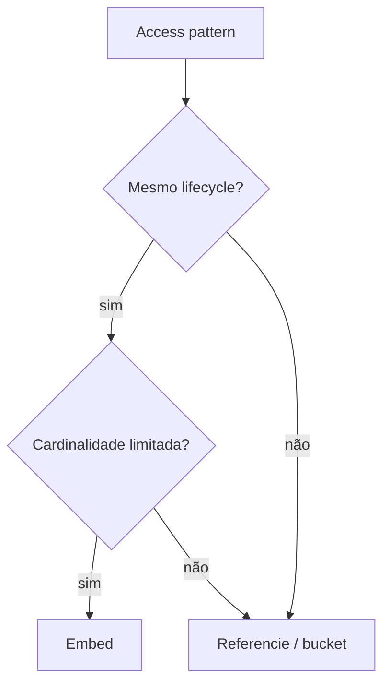

# MongoDB

MongoDB armazena documentos BSON em collections. O principal ganho não é “não ter schema”, mas modelar um agregado lido e alterado junto em uma unidade atômica.

## Embed ou referenciar

**Embed** quando dados têm ownership comum, cardinalidade limitada e acesso conjunto. **Referencie** quando entidades crescem sem limite, são compartilhadas, mudam em ritmos diferentes ou precisam de consulta independente. Duplicação deliberada exige uma autoridade e processo de reconciliação.

## Garantias e escala

Uma escrita em um documento é atômica. Transações multi-documento existem, mas não corrigem modelo ruim e custam coordenação. `readConcern`, `writeConcern` e `readPreference` definem durabilidade, visibilidade e origem de leitura; configure por requisito.

Replica sets elegem um primary e replicam oplog. Sharding distribui chunks segundo shard key. A chave precisa boa cardinalidade, distribuição e suporte às queries; chave monotônica pode criar hotspot. Mudá-la depois é possível em cenários suportados, porém ainda é uma decisão cara.

## Índices e consultas

Índices compostos seguem igualdade, sort e range como heurística, validada com `explain`. Multikey indexa arrays com restrições. TTL é expiração operacional, não garantia exata de exclusão no instante. Índice wildcard ajuda schemas variáveis, com custo. Evite regex sem prefixo e pipelines que movem tudo antes de filtrar.

## Operação e segurança

- valide documentos com JSON Schema e versione mudanças;
- limite tamanho/crescimento de arrays e documentos;
- monitore working set, page faults, replication lag, cache, opcounters e conexões;
- teste backup consistente, restore e eleição sob carga;
- use TLS, RBAC, autenticação e rede privada; proteja backups e audit logs;
- use drivers oficiais e Stable API quando compatibilidade for requisito.

## Anti-patterns

- collection por tenant sem plano de escala;
- arrays ilimitados dentro do documento;
- usar `$lookup` repetidamente para reconstruir um relacional;
- shard key escolhida só por distribuição, ignorando routing das queries;
- ler de secondary e esperar read-your-writes implicitamente;
- guardar valor monetário em ponto flutuante.

## Exercícios

1. Modele catálogo e pedidos com dois desenhos embed/reference e compare queries.
2. Crie índices para filtros + sort, examine keys/docs examined e remova índice redundante.
3. Escolha shard key para telemetria multi-tenant e faça análise de hotspot.
4. Derrube o primary em laboratório e documente erros, retry e janela de indisponibilidade.

## Referências oficiais

- MongoDB. [Manual](https://www.mongodb.com/docs/manual/).
- [Data Modeling](https://www.mongodb.com/docs/manual/data-modeling/).
- [Transactions](https://www.mongodb.com/docs/manual/core/transactions/).
- [Sharding](https://www.mongodb.com/docs/manual/sharding/).

---

[← PostgreSQL](../postgresql/README.md) · [↑ Bancos](../README.md) · [Redis →](../redis/README.md)
