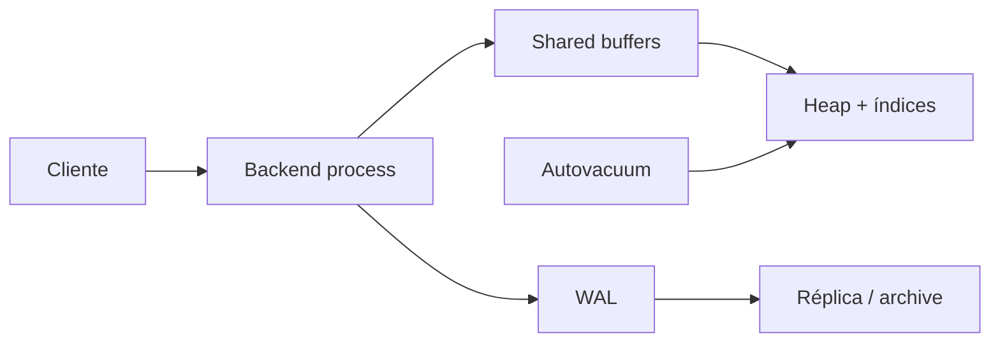
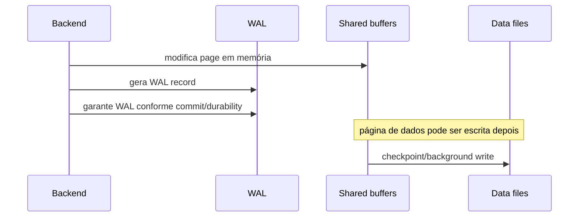

# PostgreSQL

PostgreSQL é um SGBD relacional open source, extensível e orientado a correção. É
uma escolha inicial forte quando há relações, invariantes transacionais, consultas
variáveis e necessidade de uma base operacional madura.

Para operá-lo bem, pense em quatro mecanismos que se cruzam:

1. páginas/tuplas e buffer cache;
2. MVCC e vacuum;
3. WAL e recovery;
4. planner/executor e índices.

## 1. Modelo mental



Cada conexão normalmente recebe um backend process. Muitos backends competem por
memória, locks, CPU e I/O, por isso pooling faz parte da arquitetura.

## 2. Heap, pages e tuples

Tabelas são armazenadas em páginas. Linhas são representadas por versões de
tuplas dentro dessas páginas.

Uma query não "lê uma linha abstrata" diretamente. Ela percorre páginas pelo heap
ou via índice e verifica quais versões são visíveis ao snapshot daquela
transação/comando.

Esse detalhe explica por que:

- update pode criar nova versão em vez de sobrescrever no lugar;
- delete deixa versão morta até vacuum;
- tabela pode ocupar muito espaço mesmo após remover milhões de linhas;
- visibilidade e armazenamento são problemas relacionados.

## 3. MVCC

Multi-Version Concurrency Control permite readers e writers coexistirem com menos
bloqueio do que um modelo que sobrescreve linhas imediatamente.

Ao atualizar:

```text
versão antiga continua existindo
→ nova versão é criada
→ snapshots decidem qual versão enxergam
→ vacuum recupera espaço quando versão antiga deixa de ser necessária
```

MVCC troca contenção por manutenção de versões.

## 4. Snapshots

Um snapshot representa a visão de transações/versões visíveis para uma operação.
O momento em que ele é obtido depende do isolation level.

Isso explica por que duas queries idênticas dentro de uma mesma transação podem
ver resultados diferentes em `Read Committed`, mas não da mesma maneira em
`Repeatable Read`.

Não use "transaction" como sinônimo de "ninguém mais muda nada enquanto eu
trabalho".

## 5. Read Committed

É o isolation padrão. Cada statement obtém visão compatível com seu momento de
execução.

Isso é adequado para muitos casos, mas workflows read-modify-write precisam
considerar concorrência.

Exemplo perigoso:

```text
SELECT balance
if balance >= amount
UPDATE balance = balance - amount
```

Duas transações podem tomar decisões sobre estados que mudam entre operações.
Use operação atômica, lock, constraint ou isolation apropriado conforme a
invariante.

## 6. Repeatable Read

Mantém uma visão consistente por transação e evita diversas anomalias. Ainda assim,
conflitos de escrita podem exigir retry e invariantes envolvendo várias linhas
precisam ser avaliadas no modelo real.

Não escolha isolation level pelo nome mais forte. Escolha pela anomalia que a
regra de negócio não pode tolerar.

## 7. Serializable

PostgreSQL usa Serializable Snapshot Isolation para oferecer comportamento
serializável sem transformar tudo em lock global.

Uma consequência importante: transações podem ser abortadas com serialization
failure e precisam de retry.

Retry precisa ser:

- da transação inteira;
- bounded;
- com novo snapshot;
- seguro em relação a efeitos externos.

Não envie email no meio de uma transação serializable esperando repetir tudo sem
consequência.

## 8. Locks

Além de MVCC, PostgreSQL usa locks de vários níveis para coordenar operações.

Row locks ajudam em workflows concorrentes. Table/DDL locks podem bloquear muito
mais tráfego do que a migration aparenta.

Transação deve ficar aberta pelo menor tempo necessário. Nunca mantenha lock
enquanto espera usuário ou API externa.

## 9. Deadlocks

Deadlock ocorre quando transações esperam recursos em ciclo.

Exemplo:

```text
T1 trava pedido A
T2 trava pedido B
T1 espera B
T2 espera A
```

O banco detecta e aborta uma participante. A aplicação precisa tratar o erro e
pode reduzir ocorrência mantendo ordem consistente de aquisição.

Deadlock não é motivo para desabilitar locking. É motivo para entender ordem e
escopo da transação.

## 10. HOT updates

Quando atualização pode permanecer na mesma página sem precisar alterar entradas
de índice relevantes, PostgreSQL pode usar Heap-Only Tuple (HOT) e reduzir write
amplification de índices.

Esse mecanismo mostra por que "adicionar índice em toda coluna" possui custo em
writes e vacuum. Índice acelera determinadas leituras, mas aumenta manutenção em
insert/update/delete.

## 11. Vacuum

`VACUUM` identifica versões que já não precisam ficar disponíveis e permite
reutilizar espaço, além de participar da manutenção necessária para IDs de
transação.

Vacuum normal não significa necessariamente devolver arquivo ao sistema
operacional. Ele torna espaço reutilizável internamente.

Autovacuum é mecanismo de saúde, não tarefa cosmética.

## 12. Long-running transactions

Transações antigas podem manter versões necessárias por muito tempo e impedir
vacuum de avançar como esperado.

Sintomas:

- bloat crescente;
- transaction age alta;
- espaço não recuperado;
- replication/recovery pressionados em alguns cenários.

Monitore `idle in transaction` e duração de transações. Uma conexão esquecida pode
ser mais destrutiva que uma query pesada curta.

## 13. WAL

Write-Ahead Log registra alterações necessárias à recuperação antes que páginas
de dados modificadas precisem estar persistidas em seu local final.



Essa separação permite commit durável sem escrever cada página de tabela
sincronamente no momento do commit.

## 14. Checkpoints

Checkpoint estabelece um ponto de recovery e força progresso na persistência de
páginas sujas.

Checkpoints frequentes demais podem criar I/O intenso. Distantes demais aumentam
WAL/recovery e outros custos.

Observe:

- frequência;
- duração;
- bytes de WAL;
- write I/O;
- impacto em p99.

Não ajuste checkpoint por receita copiada de outro workload.

## 15. Durabilidade

Parâmetros relacionados a commit, fsync e replicação representam trade-offs de
durabilidade/latência.

Antes de reduzir garantias, traduza a mudança em linguagem de negócio:

> "Se o host perder energia neste momento, aceitamos perder quais commits?"

Se ninguém consegue responder, tuning de durabilidade está sendo feito sem
requisito.

## 16. Crash recovery

Após crash, PostgreSQL usa WAL para levar arquivos de dados a um estado
consistente correspondente ao histórico durável.

Crash recovery não substitui backup. WAL local também pode ser perdido junto com
o storage.

## 17. PITR

Point-in-Time Recovery combina base backup com arquivamento de WAL para restaurar
até um ponto desejado.

Cenário clássico:

```text
10:00 backup base
14:32 DROP TABLE acidental
```

Com WAL arquivado adequadamente, é possível restaurar o backup e reproduzir
alterações até imediatamente antes do erro.

Mas PITR só existe se restore foi testado. Arquivos armazenados não são uma
capacidade de recovery até alguém provar o processo.

## 18. Replicação física

Streaming replication envia WAL para réplicas que reproduzem estado físico.

É útil para HA e leituras conforme arquitetura, mas normalmente possui algum grau
de atraso e precisa de processo de failover.

Réplica não é backup:

```text
DROP TABLE no primary
→ alteração legítima entra no WAL
→ réplica reproduz DROP TABLE
```

HA preserva disponibilidade. Backup protege contra classes diferentes de perda.

## 19. Replicação síncrona e assíncrona

Replicação assíncrona reduz latência/acoplamento, mas pode perder commits recentes
se primary morre antes de réplica persistir.

Replicação síncrona aumenta garantia e adiciona dependência de réplicas ao commit.

Traduza para RPO/RTO:

- quanto dado pode ser perdido?
- quanto tempo pode ficar indisponível?
- qual falha de zona/região precisa sobreviver?

## 20. Replicação lógica

Logical replication publica mudanças em nível lógico e é útil para integração,
migração e alguns cenários de replicação seletiva.

Ela possui semântica diferente da física. DDL, sequences e objetos auxiliares
precisam ser tratados conforme o cenário e versão.

Não chame "replicação" sem dizer qual tipo e qual dado realmente cobre.

## 21. Planner

O planner estima custos para escolher scan, joins e ordens de execução.

Ele depende de statistics. Quando estimativas estão erradas, pode escolher plano
ruim mesmo com índices corretos.

Perguntas em `EXPLAIN`:

- estimated rows perto de actual rows?
- qual node domina tempo?
- quantos loops?
- houve sort/hash spill?
- buffers vieram de cache ou storage?

## 22. `EXPLAIN (ANALYZE, BUFFERS)`

`ANALYZE` executa a query. Em `UPDATE`/`DELETE`, use ambiente/transação segura.

Não olhe apenas `Execution Time`. Leia árvore e multiplicação:

```text
10 ms por loop × 10.000 loops = problema
```

Um N+1 dentro do plano ou da aplicação pode parecer barato isoladamente e caro no
total.

## 23. Statistics

Planner estima distribuição de valores por amostras/statistics.

Correlação entre colunas pode confundir estimativas quando tratada como
independência. Statistics estendidas e modelagem apropriada podem ajudar em
consultas específicas.

Atualize/analyse conforme workload. Não force planner com hacks antes de entender
por que estimou errado.

## 24. B-tree

B-tree atende igualdade, ranges e ordenação conforme colunas/ordem do índice.

Índice composto deve refletir access pattern. A ordem importa porque o prefixo
utilizável e o sort dependem da consulta.

Exemplo:

```sql
CREATE INDEX idx_orders_customer_created
ON orders (customer_id, created_at DESC);
```

É natural para consultas filtrando cliente e ordenando por data. Pode não ajudar
uma consulta apenas por `created_at` da mesma forma.

## 25. Índices parciais

Indexar somente subset reduz tamanho/manutenção quando predicado é estável e
consultas o utilizam.

Exemplo:

```sql
CREATE INDEX idx_jobs_ready
ON jobs (created_at)
WHERE state = 'ready';
```

É excelente para fila interna de jobs prontos, mas cria conhecimento implícito:
queries precisam ser compatíveis com o predicado.

## 26. Index-only scan

Em alguns casos PostgreSQL pode responder usando índice sem buscar heap para cada
tupla, dependendo das colunas e visibilidade.

Isso não significa que adicionar todas as colunas ao índice seja grátis. Índices
maiores aumentam storage/cache/write cost.

Otimize access pattern medido.

## 27. GIN, GiST e BRIN

- **GIN:** útil para conjuntos de tokens/arrays/JSONB/full-text conforme operador;
- **GiST/SP-GiST:** estruturas extensíveis para tipos/operadores especializados;
- **BRIN:** resume ranges físicos e pode ser eficiente para tabelas enormes com
  correlação natural, usando índice muito pequeno.

Escolha operador/query primeiro, tipo de índice depois.

## 28. JSONB

JSONB é útil para atributos semi-estruturados e payloads que realmente variam.

Não use para escapar de modelar invariantes centrais.

Se toda query precisa de:

```sql
payload->'customer'->>'id'
```

para uma relação obrigatória, talvez a coluna/foreign key mereça existir
explicitamente.

## 29. Partitioning

Partitioning divide tabela por regra declarada e pode ajudar gestão, pruning e
alguns workloads grandes.

Ele não torna toda query rápida. Escolha partition key alinhada a:

- filtros frequentes;
- retenção;
- manutenção;
- distribuição temporal/tenant;
- constraints aplicáveis.

Partições demais também custam planning/metadata/operação.

## 30. Connection pooling

Uma conexão PostgreSQL possui custo de processo/memória/estado. Milhares de
microservices abrindo pools grandes podem esgotar banco antes de usar CPU.

Orçamento:

```text
número de serviços
× réplicas máximas
× pool máximo
```

Compare com limite e concorrência realmente sustentável do banco.

Pooler pode reduzir conexões backend, mas modos de pooling possuem implicações para
estado de sessão, prepared statements e features. Entenda o modo escolhido.

## 31. Transação não deve incluir rede externa

Exemplo ruim:

```text
BEGIN
UPDATE order
HTTP para adquirente por 5 s
COMMIT
```

Durante a chamada, locks e snapshot permanecem. Se HTTP falha, não existe atomicidade
entre banco e adquirente.

Use outbox/workflow/idempotência para atravessar fronteiras distribuídas.

## 32. `SKIP LOCKED`

Para fila interna de jobs:

```sql
BEGIN;
SELECT id
FROM jobs
WHERE state = 'ready'
ORDER BY created_at
FOR UPDATE SKIP LOCKED
LIMIT 1;

UPDATE jobs
SET state = 'running', started_at = now()
WHERE id = $1;
COMMIT;
```

Workers concorrentes pulam rows já bloqueadas.

Ainda faltam semânticas que broker oferece:

- retry policy;
- lease de job abandonado;
- DLQ;
- retenção;
- replay;
- backpressure.

Não confunda padrão SQL útil com sistema de mensageria completo.

## 33. Migrations

DDL pode adquirir locks fortes. Uma migration pequena em linhas pode ser grande em
disponibilidade.

Use expand/contract:

1. adicionar estrutura compatível;
2. deploy que escreve/lê ambos quando necessário;
3. backfill controlado;
4. migrar consumidores;
5. remover estrutura antiga depois.

Meça lock duration e impacto em réplica/WAL.

## 34. Backup e restore

Defina:

- RPO;
- RTO;
- retenção;
- encryption;
- local secundário;
- teste de restore;
- owner do processo.

Backup sem restore drill é esperança comprimida em arquivo.

## 35. Segurança

Use:

- TLS;
- SCRAM/autenticação adequada;
- roles sem superuser;
- `pg_hba.conf` restritivo;
- secrets rotacionáveis;
- parameterized queries;
- auditoria de grants/extensões;
- proteção dos backups.

Identificador dinâmico não pode ser parameterizado da mesma forma que valor.
Use allowlist/quoting apropriado.

## 36. Row-Level Security

RLS pode reforçar isolamento multi-tenant no banco.

Teste:

- table owner;
- roles com `BYPASSRLS`;
- policies para SELECT/INSERT/UPDATE/DELETE;
- background jobs;
- migrations;
- conexão administrativa.

RLS é camada adicional, não substituto para authorization coerente na aplicação.

## 37. Observabilidade

Monitore pelo menos:

- active/idle/idle-in-transaction connections;
- transaction age;
- lock waits/deadlocks;
- query latency;
- buffer/cache/I/O;
- temp files/spill;
- autovacuum;
- bloat estimado;
- WAL rate;
- checkpoints;
- replication lag;
- storage utilization.

Correlacione query fingerprint e deployment. Não logue parâmetros sensíveis sem
necessidade.

## 38. Falhas recorrentes

| Falha | Sintoma | Evidência | Resposta |
| --- | --- | --- | --- |
| pool excessivo | connections esgotam | sessions por app | budget/pooler |
| tx longa | bloat/vacuum preso | tx age | reduzir scope/timeout |
| estimativa ruim | plano inesperado | estimated vs actual | stats/modelagem |
| índice demais | writes lentos | index usage/write I/O | remover redundância |
| checkpoint agressivo | I/O em ondas | checkpoint/WAL metrics | tuning medido |
| réplica atrasada | stale reads/RPO risco | replay lag | reduzir carga/capacidade |
| migration bloqueante | requests param | lock graph | expand/contract |
| disk cheio | writes param | storage/WAL | capacity + emergência |

## 39. Troubleshooting: query lenta

1. é uma query ou workload inteiro?
2. `EXPLAIN ANALYZE` mostra onde está o tempo?
3. estimated rows estão erradas?
4. existe spill para disco?
5. quantos loops?
6. lock wait existe?
7. I/O mudou?
8. cache esfriou?
9. índice/schema/statistics mudaram?
10. concorrência aumentou?

Não crie índice antes de localizar o trabalho dominante.

## 40. Troubleshooting: banco saturado

Separe:

- CPU;
- storage latency/throughput;
- locks;
- connections;
- memory/spill;
- WAL/checkpoint;
- autovacuum;
- uma query dominante.

"CPU 90%" pode ser sintoma de plano ruim, mais tráfego ou capacidade legítima.
Diagnóstico exige causa de trabalho.

## 41. Laboratórios

### Beginner

- modele pedidos com PK/FK/UNIQUE/CHECK;
- provoque violações;
- compare comportamento com validação só na aplicação.

### Intermediate

- gere 1 milhão de rows;
- execute `EXPLAIN (ANALYZE, BUFFERS)`;
- crie índice alinhado ao access pattern e compare.

### Advanced

- reproduza deadlock;
- reproduza write skew e trate com `SERIALIZABLE` + retry;
- deixe transação aberta e observe efeito em vacuum.

### Expert

Configure backup base + WAL/PITR e réplica. Injete `DROP TABLE`, crash do primary,
replica lag e migration bloqueante. Meça RPO/RTO real e documente quais mecanismos
protegem contra cada falha. Depois execute restore completo sem reutilizar o
ambiente original.

## Referências oficiais

- PostgreSQL. [Documentation](https://www.postgresql.org/docs/current/).
- PostgreSQL. [Indexes](https://www.postgresql.org/docs/current/indexes.html).
- PostgreSQL. [Routine Vacuuming](https://www.postgresql.org/docs/current/routine-vacuuming.html).
- PostgreSQL. [High Availability, Load Balancing, and Replication](https://www.postgresql.org/docs/current/high-availability.html).

---

[← SQL](../sql/README.md) · [↑ Bancos](../README.md) · [MongoDB →](../mongodb/README.md)
