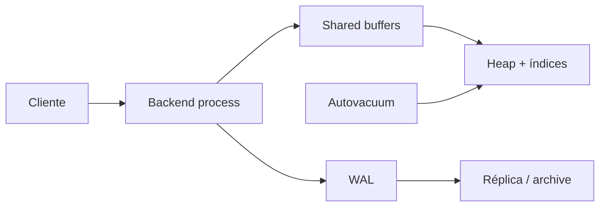

# PostgreSQL

PostgreSQL é um SGBD relacional open source, extensível e orientado a correção. É uma escolha inicial forte quando há relações, invariantes transacionais, consultas mutáveis e necessidade de uma base operacional madura.

## Modelo mental



Cada conexão normalmente recebe um backend; pooling evita gastar memória e processos sem limite. Mudanças escrevem WAL antes das páginas de dados. MVCC cria versões de linhas; `VACUUM` torna versões mortas reutilizáveis e protege contra wraparound.

## Modelagem e índices

- use `PRIMARY KEY`, `FOREIGN KEY`, `UNIQUE`, `CHECK` e `NOT NULL` para invariantes locais;
- escolha tipos semânticos (`timestamptz`, `numeric`, ranges), não `text` universal;
- B-tree atende igualdade, ordenação e ranges; GIN atende arrays/JSONB/full-text; GiST/SP-GiST/BRIN têm nichos próprios;
- a ordem de colunas de índice segue filtros, ordenação e seletividade reais;
- índices parciais e por expressão são poderosos, mas aumentam conhecimento implícito.

Use `EXPLAIN (ANALYZE, BUFFERS)` em ambiente seguro: `ANALYZE` executa a instrução. Compare estimado versus real, loops, buffers e spill; não force índice por intuição.

## Concorrência e isolamento

O padrão `Read Committed` cria novo snapshot por comando. `Repeatable Read` usa snapshot por transação e impede várias anomalias; `Serializable` usa Serializable Snapshot Isolation e pode abortar transações que devem ser repetidas. Locks explícitos resolvem workflows, mas ordem inconsistente gera deadlock.

## Operação

- configure pooling e orçamento de conexões por serviço;
- monitore transaction age, bloat, checkpoints, WAL, replication lag, locks e temp files;
- faça backup base + WAL/PITR, e restaure regularmente;
- use replicação física para HA/leitura e lógica para migração/integração, conhecendo lacunas;
- faça migrações expand/contract; operações DDL podem adquirir locks fortes;
- não ajuste dezenas de parâmetros antes de medir working set, I/O e concorrência.

## Segurança

Use TLS, SCRAM, roles sem superuser, `pg_hba.conf` restritivo e credenciais rotativas. Row-Level Security pode reforçar tenancy, mas teste owners e `BYPASSRLS`. Parameterize SQL; identificadores dinâmicos exigem allowlist/quoting próprio. Audite grants e extensões.

## Exemplo: claim concorrente

```sql
BEGIN;
SELECT id
FROM jobs
WHERE state = 'ready'
ORDER BY created_at
FOR UPDATE SKIP LOCKED
LIMIT 1;

UPDATE jobs SET state = 'running', started_at = now() WHERE id = $1;
COMMIT;
```

`SKIP LOCKED` é útil para fila interna de trabalho, mas não oferece recursos de broker como retenção/replay. Jobs abandonados precisam de lease/recuperação.

## Anti-patterns

- conexão por request sem pool ou pool ilimitado;
- transação aberta durante chamada de rede;
- índice em toda coluna e nenhum acompanhamento de write amplification;
- `SELECT *`, paginação por offset enorme e N+1 queries;
- autovacuum desabilitado para “reduzir I/O”;
- réplica tratada como backup;
- `jsonb` usado para evitar invariantes relacionais.

## Exercícios

1. Modele pedidos com constraints e provoque violações úteis.
2. Gere 1 milhão de linhas, examine uma consulta, crie índice e compare buffers/tempo.
3. Reproduza write skew e trate com `SERIALIZABLE` + retry bounded.
4. Configure PITR em laboratório, exclua uma tabela e restaure até antes do evento.

## Referências oficiais

- [PostgreSQL Documentation](https://www.postgresql.org/docs/current/).
- [Indexes](https://www.postgresql.org/docs/current/indexes.html).
- [Routine Vacuuming](https://www.postgresql.org/docs/current/routine-vacuuming.html).
- [High Availability, Load Balancing, and Replication](https://www.postgresql.org/docs/current/high-availability.html).

---

[← SQL](../sql/README.md) · [↑ Bancos](../README.md) · [MongoDB →](../mongodb/README.md)
