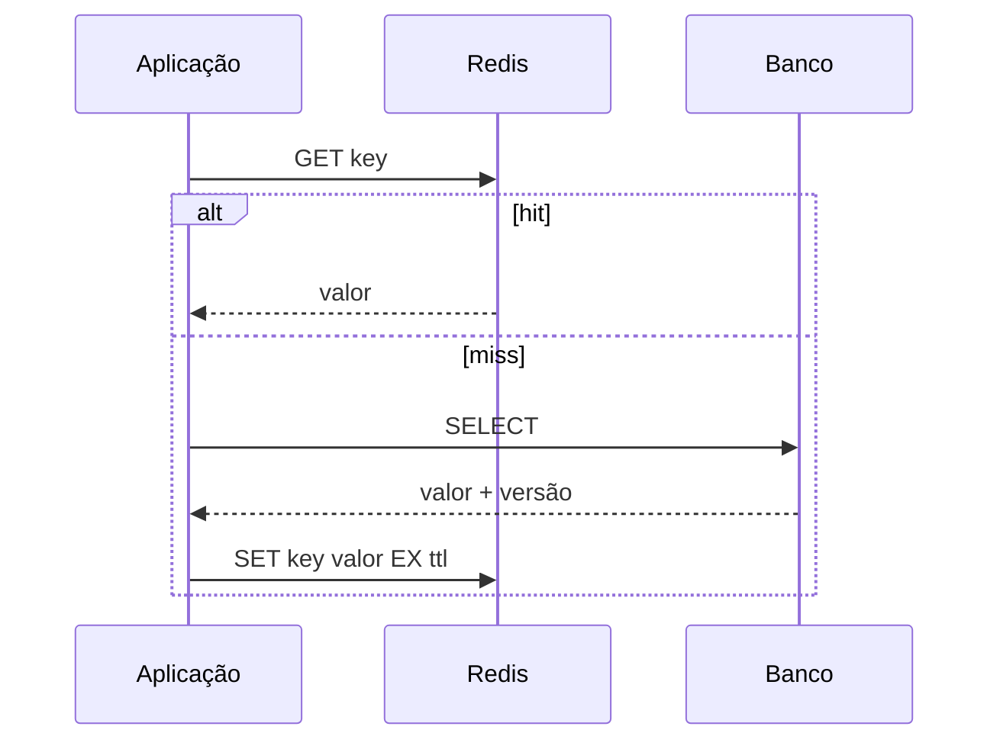

# Redis

Redis é um data store em memória com estruturas como strings, hashes, sets, sorted sets e streams. Sua baixa latência é útil para dados derivados e coordenação limitada; ela não elimina limites de rede, memória nem falhas.

## Escolha a estrutura

| Necessidade | Estrutura/operação |
| --- | --- |
| cache simples | string + TTL |
| contador | `INCR` |
| membership | set |
| ranking | sorted set |
| campos de objeto | hash |
| fila/log com consumer groups | stream |
| rate limit | contador ou sorted set + Lua/Functions |

## Cache-aside correto

TTL limita staleness, não garante coerência. Invalidação após commit pode falhar; aceite janela explícita, use outbox/CDC ou versioned keys quando necessário. Adicione jitter ao TTL e single-flight/lock bounded para evitar stampede.

## Persistência, replicação e cluster

RDB cria snapshots; AOF registra operações e pode reduzir janela de perda conforme `appendfsync`. Replicação é assíncrona: failover pode perder escritas confirmadas. Sentinel gerencia failover sem sharding; Redis Cluster particiona keyspace por hash slots. Operações multi-key no cluster precisam do mesmo slot, normalmente via hash tags.

## Limites e segurança

- defina `maxmemory` e eviction policy compatível; `noeviction` falha writes;
- evite keys/values gigantes e comandos O(N) no caminho quente;
- limite clientes, pipelines e Lua; uma execução longa bloqueia progresso;
- use TLS/ACLs, rede privada e rotação; não exponha Redis à internet;
- namespace, TTL ownership e cardinalidade devem ser observáveis.

## Anti-patterns

- cache como única cópia de dado irrecuperável;
- distributed lock sem lease, fencing token e análise de falhas;
- `KEYS *` em produção;
- TTL idêntico em milhões de chaves;
- assumir que `SET NX` sozinho resolve exclusão crítica;
- usar Pub/Sub quando retenção, replay ou confirmação são requisitos.

## Exercícios

1. Implemente cache-aside com TTL jitter e negative caching limitado.
2. Construa token bucket atômico com script e teste concorrência.
3. Compare RDB/AOF derrubando o processo e medindo perda/recuperação.
4. Gere hot key, observe latência e redesenhe particionamento/replicação.

## Referências oficiais

- Redis. [Documentation](https://redis.io/docs/latest/).
- [Data types](https://redis.io/docs/latest/develop/data-types/).
- [Persistence](https://redis.io/docs/latest/operate/oss_and_stack/management/persistence/).
- [Redis Cluster specification](https://redis.io/docs/latest/operate/oss_and_stack/reference/cluster-spec/).

---

[← MongoDB](../mongodb/README.md) · [↑ Bancos](../README.md) · [DynamoDB →](../dynamodb/README.md)
