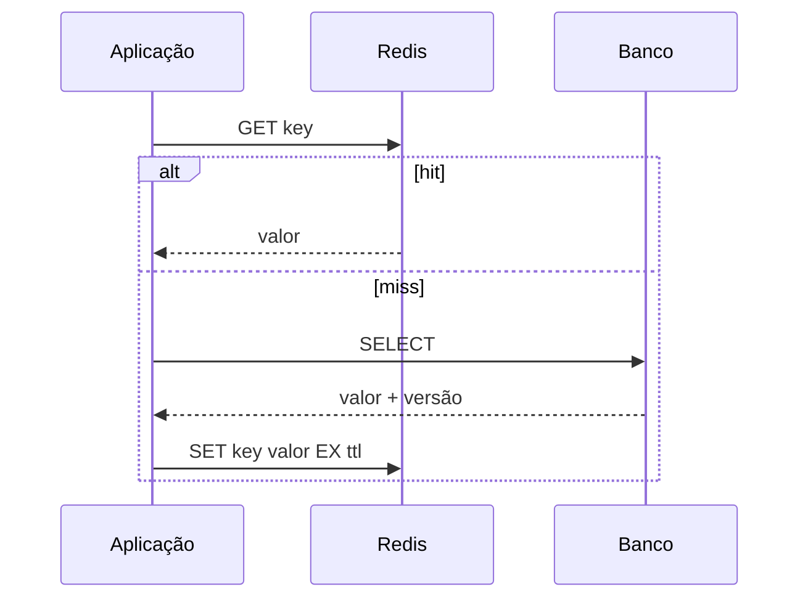
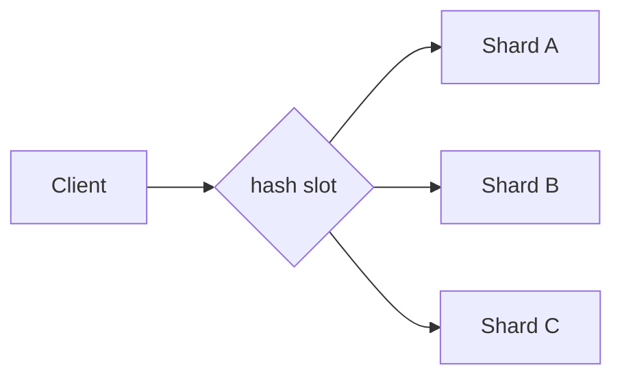

# Redis

Redis é um data store orientado a estruturas de dados, normalmente mantidas em
memória, com persistência e replicação opcionais. A baixa latência é consequência
de um modelo específico de execução e working set, não uma garantia de que toda
operação seja barata.

Redis funciona muito bem quando a estrutura escolhida representa diretamente o
problema. Fica perigoso quando é tratado como "RAM compartilhada sem limites".

## 1. Estruturas de dados

| Necessidade | Estrutura/operação |
| --- | --- |
| cache simples | string + TTL |
| contador | `INCR` |
| membership | set |
| ranking | sorted set |
| campos de objeto | hash |
| fila/log | stream |
| rate limit | contador/sorted set + script/function |
| bitmap de presença | bitmap |

A escolha da estrutura define custo de memória, complexidade das operações e
formas de consulta.

## 2. Modelo de execução

Grande parte do processamento de comandos ocorre de forma serializada no caminho
principal de execução. Isso simplifica atomicidade de comandos individuais, mas
significa que uma operação longa pode atrasar outras.

"Redis é rápido" não autoriza:

- `KEYS *` em keyspace grande;
- script que percorre milhões de itens;
- value gigantesco;
- operações O(N) no hot path sem limite.

A complexidade do comando ainda importa.

## 3. Network round trips

Mesmo operação O(1) paga rede, parsing e serialização. Fazer 10 mil `GET`
sequenciais pode ser muito mais lento que agrupar chamadas adequadamente.

Pipelining reduz round trips ao enviar múltiplos comandos antes de esperar todas
as respostas.

Trade-off:

- batch grande melhora eficiência;
- aumenta memória/buffer;
- pode adicionar latência ao primeiro item;
- uma resposta enorme continua cara de transferir.

Meça no ambiente real.

## 4. Cache-aside



Cache-aside mantém banco como fonte de verdade e carrega cache sob demanda.

TTL limita staleness, mas não garante coerência perfeita.

## 5. Invalidation

O problema clássico:

```text
COMMIT no banco
→ processo cai
→ DEL do cache não acontece
→ valor antigo permanece até TTL
```

Opções dependem do requisito:

- aceitar janela de staleness bounded por TTL;
- invalidar por outbox/CDC;
- versionar keys;
- write-through com failure model explícito.

Não prometa consistência forte se a atualização cruza dois sistemas sem
coordenação adequada.

## 6. Cache stampede

Quando uma key popular expira, centenas de requests podem consultar o banco ao
mesmo tempo.

Mitigações:

- TTL com jitter;
- single-flight local/distribuído bounded;
- refresh antecipado;
- stale-while-revalidate quando aceitável;
- cache em camadas.

Um lock de refresh precisa de timeout e caminho de falha. Não bloqueie todos os
usuários indefinidamente porque o atualizador morreu.

## 7. Negative caching

Cachear "não encontrado" reduz carga para IDs inexistentes ou ataques de
consulta repetida.

Use TTL menor e diferencie:

- inexistente estável;
- dado ainda em criação;
- erro temporário do banco.

Nunca transforme timeout do backend em "não existe" cacheado por horas.

## 8. TTL e expiry

TTL define expiração lógica. A remoção física pode ocorrer por mecanismos de
expiração ativos/passivos conforme implementação.

Por isso TTL é semântica de validade, não scheduler exato para executar ação às
12:00:00.000.

Se o negócio precisa executar workflow em horário exato, use mecanismo de
agendamento apropriado.

## 9. Jitter

Milhões de keys criadas juntas com TTL idêntico podem expirar juntas e causar:

```text
miss storm
→ banco sobrecarrega
→ requests ficam lentos
→ retries aumentam
```

Adicione jitter proporcional ao requisito de freshness para espalhar refresh.

## 10. Eviction

`maxmemory` e eviction policy definem o que acontece quando memória chega ao
limite.

Dependendo da policy, Redis pode:

- rejeitar novas escritas;
- remover keys com TTL;
- aproximar LRU/LFU;
- remover qualquer key elegível.

Se dados permanentes e cache descartável dividem a mesma instância, uma eviction
policy adequada para cache pode destruir estado que alguém considerava durável.
Separe workloads ou defina ownership rigoroso.

## 11. Memória não é só tamanho do payload

Consumo inclui:

- objetos/metadata;
- estruturas internas;
- fragmentation;
- replication buffers;
- client buffers;
- copy-on-write durante fork/snapshot em cenários aplicáveis;
- overhead de collections.

Uma estimativa de `sum(value_size)` subestima capacidade real.

Monitore RSS, used memory, fragmentation e buffer pressure conforme ambiente.

## 12. Big keys

Uma key com hash/set/string gigantesco pode causar:

- comando lento;
- resposta enorme;
- bloqueio do event loop/caminho principal;
- replication lag;
- dificuldade de delete;
- hotspot de rede.

Divida quando o domínio permite. Use operações incrementais/SCAN apropriadas e
limites de cardinalidade.

## 13. Hot keys

Sharding distribui keys, não uma única key extremamente popular.

Um ranking global ou contador único pode concentrar toda a carga em um shard.

Mitigações possíveis:

- sharded counters + agregação;
- read replicas quando semântica aceita;
- cache local;
- pré-computação;
- redesenho da key.

Hot key é problema de access pattern, não falta de nodes.

## 14. RDB

RDB cria snapshots em pontos do tempo. É compacto e útil para backup/restart,
mas mudanças após o último snapshot podem ser perdidas em falha.

O processo de snapshot pode interagir com memória e I/O. Teste com dataset e
write rate reais.

## 15. AOF

Append Only File registra operações para reconstrução. Política de fsync altera
janela potencial de perda e custo de durabilidade.

AOF também precisa de rewrite/compactação operacional para não crescer sem bound.

Escolher RDB, AOF ou combinação é decisão de RPO/RTO, não preferência estética.

## 16. Persistência não transforma Redis em PostgreSQL

Mesmo com AOF/RDB, ainda avalie:

- constraints;
- modelo de consulta;
- transações;
- backup;
- recovery;
- replication loss;
- tooling operacional.

Redis pode ser source of truth em sistemas projetados para isso, mas não deve
virar a única cópia de dado irrecuperável por acidente.

## 17. Replicação

Replicação normalmente é assíncrona. Uma réplica acompanha o primary e pode ficar
atrasada sob carga/rede.

Se primary aceita uma escrita e falha antes de a réplica recebê-la, failover pode
perder essa escrita.

Traduza isso para requisito de negócio antes de usar "tem réplica" como sinônimo
de zero data loss.

## 18. Sentinel

Sentinel monitora e coordena failover em topologias sem sharding de Redis OSS.
Ele melhora disponibilidade, mas clientes ainda precisam descobrir/reconectar ao
novo primary e lidar com operações em voo.

Teste failover com tráfego. Meça:

- detecção;
- eleição;
- promoção;
- reconexão;
- erros observados;
- perda potencial de writes.

## 19. Redis Cluster

Redis Cluster distribui keyspace em hash slots. Cada key pertence a um slot e
slots são atribuídos a shards.



Clientes precisam entender redirects/topologia conforme driver.

Cluster aumenta capacidade horizontal, mas adiciona:

- resharding;
- slot ownership;
- failover por shard;
- operações multi-key restritas;
- hot slots/keys.

## 20. Hash tags

Keys com hash tag podem ser forçadas ao mesmo slot para permitir certas operações
multi-key.

Exemplo conceitual:

```text
order:{123}:header
order:{123}:items
```

Isso preserva colocation, mas pode criar hotspot se a tag agrupa carga demais.
Use somente quando atomicidade/localidade realmente exige.

## 21. Transactions

`MULTI`/`EXEC` agrupa comandos no Redis, mas não possui rollback tradicional de
erro de negócio como bancos relacionais.

WATCH pode oferecer optimistic concurrency em alguns fluxos.

Antes de usar, responda:

- qual estado precisa ser atômico?
- tudo está no mesmo shard?
- retry é seguro?
- um script seria mais simples?
- a regra pertence ao Redis?

## 22. Lua e Functions

Scripts/functions permitem executar lógica atomically no servidor dentro do
modelo suportado.

Isso reduz round trips e race conditions, mas código longo bloqueia outras
operações.

Mantenha:

- execução bounded;
- input validado;
- versionamento;
- testes;
- observabilidade;
- nenhuma chamada externa arbitrária.

Redis não deve virar application server oculto.

## 23. Rate limiting

Token bucket/sliding window pode ser implementado com operações atômicas.

Defina:

- key por tenant/user/IP;
- janela;
- burst;
- clock usado;
- TTL;
- comportamento se Redis falha;
- cardinalidade máxima.

Fail-open versus fail-closed depende do risco. Login abuse e analytics possuem
threat models diferentes.

## 24. Distributed locks

`SET NX` com expiry pode ser útil para coordenação limitada, mas exclusão mútua
sob falhas distribuídas precisa de mais raciocínio.

Problema:

```text
cliente A recebe lock por 10 s
A pausa 15 s
lock expira
B recebe lock
A volta e ainda acredita que pode escrever
```

Para recurso externo crítico, fencing token monotônico permite que o recurso
rejeite owner antigo.

Lock sem fencing pode impedir concorrência na maioria dos casos e ainda falhar no
caso mais importante.

## 25. Pub/Sub

Pub/Sub envia mensagens a subscribers conectados, sem ser um log durável de
replay.

Use quando perda durante desconexão é aceitável. Se precisa:

- retenção;
- ack;
- consumer groups;
- replay;

avalie Redis Streams ou broker apropriado.

## 26. Streams

Streams mantêm entries ordenadas e suportam consumer groups.

Eles podem ser úteis para workflows locais/integrações, mas exigem operação:

- trimming/retention;
- pending entries;
- consumers abandonados;
- retry;
- idempotência;
- claim de mensagens.

Não escolha Streams apenas porque Redis já existe no cluster.

## 27. Segurança

Use:

- TLS;
- ACLs;
- rede privada;
- autenticação;
- credenciais rotativas;
- comandos administrativos restritos;
- backups protegidos.

Não exponha Redis diretamente à internet. Um datastore de baixa latência com
comandos administrativos acessíveis é uma superfície de alto impacto.

## 28. Observabilidade

Monitore:

- ops/s e latency por comando;
- hit/miss;
- memory/RSS/fragmentation;
- evictions/expired keys;
- connected clients;
- blocked clients;
- network I/O;
- replication offset/lag;
- slow log;
- keyspace cardinality;
- cluster slot/health.

Hit rate alta não prova valor. Um cache de 99% pode ser inútil se o 1% de miss
ocorre exatamente no endpoint crítico e derruba o banco.

## 29. Falhas recorrentes

| Falha | Sintoma | Evidência | Resposta |
| --- | --- | --- | --- |
| stampede | DB dispara após expiry | miss rate | jitter/single-flight |
| big key | p99/replication piora | key size/slowlog | dividir estrutura |
| hot key | um shard satura | ops por key/shard | reparticionar/cache local |
| eviction errada | dado some | evicted_keys | policy/separação |
| script longo | tudo pausa | slowlog/script time | bounded logic |
| replica lag | stale/failover loss | replication offset | capacity/RPO |
| client buffer | memória explode | client metrics | limits/batching |
| lock expirado | owners concorrentes | lease timeline | fencing/idempotência |

## 30. Troubleshooting

Quando Redis está lento:

1. todos os comandos ou um tipo?
2. existe big/hot key?
3. slow log mostra operação cara?
4. CPU está saturada?
5. rede/client buffers cresceram?
6. memória/fragmentation/eviction mudaram?
7. snapshot/AOF rewrite está ativo?
8. replica/cluster está saudável?
9. número de clients/pipelines mudou?
10. workload mudou de O(1) para O(N)?

## 31. Laboratórios

### Beginner

- implemente cache-aside com TTL;
- adicione jitter;
- compare hit/miss e carga no banco.

### Intermediate

- crie stampede intencional;
- adicione single-flight;
- simule negative caching e falha do banco.

### Advanced

- compare RDB/AOF sob crash;
- crie hot key em Cluster;
- implemente rate limit atômico.

### Expert

Monte Redis como cache + coordenação de jobs. Injete OOM/eviction, replica lag,
failover, big key, hot key e lease expirado. Para cada incidente, documente se o
dado é fonte de verdade ou derivado, qual RPO/RTO existe e qual mecanismo impede
que uma otimização de cache vire falha de consistência do negócio.

## Referências oficiais

- Redis. [Documentation](https://redis.io/docs/latest/).
- Redis. [Data types](https://redis.io/docs/latest/develop/data-types/).
- Redis. [Persistence](https://redis.io/docs/latest/operate/oss_and_stack/management/persistence/).
- Redis. [Redis Cluster specification](https://redis.io/docs/latest/operate/oss_and_stack/reference/cluster-spec/).

---

[← MongoDB](../mongodb/README.md) · [↑ Bancos](../README.md) · [DynamoDB →](../dynamodb/README.md)
