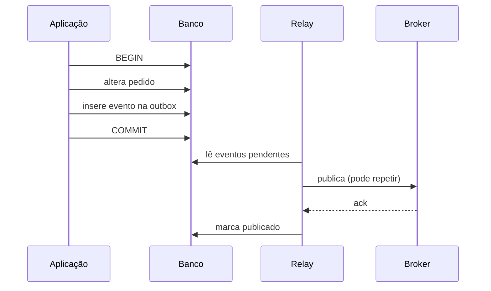

# Transações e consistência

Uma transação delimita quais estados intermediários podem ser observados e como
concorrência é resolvida. O problema não é decorar ACID. É proteger invariantes
quando múltiplos atores leem e escrevem ao mesmo tempo, inclusive quando existe
replicação, retry ou efeito fora do banco.

## Modelo mental: invariantes antes do nível de isolamento

Comece pela pergunta de negócio:

> Qual propriedade precisa continuar verdadeira mesmo com concorrência e falhas?

Exemplos:

- um assento não pode ser vendido duas vezes;
- saldo disponível não pode ficar negativo;
- dois médicos não podem sair simultaneamente se pelo menos um deve permanecer;
- um pedido confirmado precisa ter exatamente um estado financeiro compatível.

Depois identifique **onde a invariante vive** e qual mecanismo realmente a
protege: constraint, lock, compare-and-set, serializable, fila, single writer ou
redesenho do boundary.

## ACID na prática

### Atomicidade

As escritas de uma transação tornam-se visíveis juntas ou não se tornam visíveis.
Isso vale dentro da fronteira transacional coberta pelo banco.

Atomicidade não inclui automaticamente:

- HTTP para outro serviço;
- publicação em broker separado;
- email;
- filesystem remoto;
- gateway de pagamento.

Para atravessar fronteiras, use padrões como outbox, idempotência, saga ou
reconciliação.

### Consistência

No ACID, consistência significa que constraints e regras preservadas pelo sistema
levam um estado válido a outro. Não é o mesmo “C” de CAP.

O banco protege apenas invariantes que conhece. Se a regra existe somente em
código de aplicação sem constraint ou lock compatível, a transação não a inventa.

### Isolamento

Isolamento define quais interações concorrentes podem ser observadas. Níveis mais
fortes reduzem anomalias, mas podem aumentar conflitos, aborts e custo.

### Durabilidade

Depois do commit confirmado, dados devem sobreviver às falhas cobertas pela
configuração de storage, WAL/log e replicação. Durabilidade não significa
“sobrevive a qualquer desastre”. RPO, backup e restore continuam necessários.

## Anomalias clássicas

| Fenômeno | Exemplo | Risco |
| --- | --- | --- |
| dirty read | lê escrita ainda não commitada | decisão sobre estado que pode sumir |
| non-repeatable read | mesma linha muda durante a transação | cálculo inconsistente |
| phantom | consulta por predicado recebe novas linhas | regra sobre conjunto muda |
| lost update | dois writers sobrescrevem valor | efeito de uma operação desaparece |
| write skew | duas decisões válidas isoladamente violam regra conjunta | invariante entre linhas quebra |

### Lost update

Dois callers leem `version=7`, calculam novo valor e salvam. Sem proteção, o
último pode sobrescrever o primeiro.

Mitigações:

- `SELECT ... FOR UPDATE`;
- coluna de versão com compare-and-set;
- operação atômica no banco;
- isolamento serializable;
- modelagem que evita read-modify-write externo.

### Write skew

Dois médicos estão de plantão. Cada transação vê o outro disponível e remove a si
mesma. Não há colisão na mesma linha, mas a regra “pelo menos um permanece” é
violada.

Esse é um bom exemplo de por que “não houve lost update” não significa que a
transação preservou toda invariante.

## MVCC como modelo de execução

MVCC mantém múltiplas versões para permitir que leitores observem snapshots sem
bloquear todo writer.

Simplificando:

1. cada transação enxerga um snapshot conforme o nível de isolamento;
2. updates criam novas versões;
3. versões antigas precisam permanecer enquanto algum snapshot pode usá-las;
4. depois podem ser limpas por vacuum/garbage collection.

Trade-offs:

- leituras ficam menos bloqueantes;
- transações longas retêm versões antigas;
- storage/bloat pode crescer;
- conflitos de escrita continuam existindo;
- snapshot não implica serialização perfeita.

## Optimistic versus pessimistic concurrency

### Optimistic

Assume que conflitos são raros. O caller lê uma versão e só grava se ela ainda
for atual.

Funciona bem quando:

- contenção é baixa;
- retry de conflito é barato;
- operação não segura recursos externos por muito tempo.

### Pessimistic

Adquire lock antes de continuar. É útil quando conflito é provável ou quando
reexecutar a operação é caro.

O custo é espera, deadlock potencial e menor paralelismo.

## Locks e deadlocks

Locks podem existir por linha, página, tabela, range ou predicado, dependendo do
banco.

Deadlock aparece quando existe ciclo de espera:

```text
T1 possui A e espera B
T2 possui B e espera A
```

Bancos normalmente detectam e abortam uma transação. A aplicação precisa tratar
essa falha como retryable quando a operação for segura.

Reduza risco com:

- ordem consistente de aquisição;
- transações curtas;
- índices adequados para evitar lock excessivo;
- evitar chamadas de rede dentro da transação;
- medir lock wait e deadlock rate.

## Isolamento não é apenas nome

`READ COMMITTED`, `REPEATABLE READ` e `SERIALIZABLE` podem ter detalhes distintos
entre implementações. Leia a documentação do banco usado e teste a anomalia que
importa.

A pergunta correta não é “qual é o melhor nível?”, mas:

- qual invariante precisa ser protegida?
- qual anomalia pode violá-la?
- qual custo de conflito é aceitável?
- uma constraint explícita seria melhor?

## Serializable

Serializable tenta produzir efeito equivalente a alguma execução serial das
transações. Implementações podem usar locks, predicate locks ou detecção
otimista de dependências.

O preço pode aparecer como:

- espera;
- abort/retry;
- menor throughput sob contenção;
- necessidade de tratamento correto de serialization failure.

Serializable não corrige efeito externo realizado antes do commit.

## Linearizabilidade versus serializabilidade

São propriedades diferentes.

### Serializabilidade

Fala sobre transações: resultado equivale a alguma ordem serial válida.

### Linearizabilidade

Fala sobre operações e tempo real: se operação A terminou antes de B começar, a
ordem observada deve respeitar isso.

Um banco pode oferecer transações serializáveis sem que toda leitura distribuída
seja linearizável em qualquer réplica.

## Consistência distribuída

### Strong/linearizable read

Leitura observa o estado mais recente compatível com a ordem real exigida pelo
sistema. Custa coordenação e pode sacrificar disponibilidade/latência durante
partições.

### Eventual consistency

Réplica pode ficar stale, mas converge quando atualizações cessam e comunicação
volta. Isso não diz **quanto tempo** a convergência leva nem quais leituras
intermediárias são permitidas.

### Causal consistency

Preserva dependências causais. Se B foi produzido após observar A, clientes que
observam B também precisam observar A, dentro das hipóteses do sistema.

Defina a garantia por operação. Um mesmo produto pode aceitar eventual
consistency em feed e exigir linearizabilidade em alocação de inventário.

## Read-your-writes e monotonic reads

Garantias de sessão podem melhorar UX sem exigir linearizabilidade global.

- **read-your-writes:** usuário vê a própria atualização;
- **monotonic reads:** depois de observar versão nova, não volta para versão antiga.

Elas são úteis em sistemas com réplicas assíncronas.

## Replicação e lag

Ao escrever no líder e ler de réplica, existe janela de lag. Pergunte:

- quanto stale é aceitável?
- como medir lag em tempo, não apenas bytes/offset?
- o que acontece durante failover?
- o novo líder contém a escrita confirmada?

A política de ack define parte da garantia de durabilidade. “Tem três réplicas”
não basta sem saber quando o commit é confirmado.

## Padrão outbox



A outbox fecha a janela “estado commitado, evento perdido”. Ela não elimina
duplicidade. O relay pode publicar e cair antes de marcar como publicado.
Consumers precisam idempotência ou inbox.

## Two-phase commit

2PC coordena participantes compatíveis em duas fases:

1. **prepare:** participantes prometem poder commit;
2. **commit/abort:** coordinator decide.

Ele fornece atomicidade forte entre participantes que obedecem ao protocolo, mas
introduz:

- coordinator;
- locks/estado preparado;
- recuperação de decisões incompletas;
- maior latência;
- menor disponibilidade em alguns failure modes.

Não é sempre errado. Também não deve ser usado para esconder boundaries mal
desenhados.

## Consistência em APIs com retry

Um timeout não prova que a transação falhou. O servidor pode ter commitado e a
resposta ter sido perdida.

Por isso operações de escrita expostas a retry precisam de:

- idempotency key;
- status consultável;
- conditional request/version;
- ou semântica explícita de “pode repetir efeito”.

Sem isso, falha de rede vira duplicidade de negócio.

## Performance e contenção

Meça:

- transaction duration;
- lock wait;
- deadlocks;
- serialization failures;
- rows scanned/locked;
- commits/aborts por segundo;
- replication lag;
- WAL/log throughput;
- p95/p99 de operações críticas.

Transação longa é especialmente cara: mantém locks/snapshot, aumenta conflito e
retém versões MVCC.

## Observabilidade

Durante incidente, consiga responder:

- quem está bloqueando quem?
- qual query mantém a transação aberta?
- existe réplica atrasada?
- houve aumento de serialization retry?
- qual invariante falhou?
- o problema é banco, aplicação ou contrato de retry?

Logs devem carregar transaction/request IDs quando possível, sem registrar dados
sensíveis desnecessários.

## Segurança

Consistência também protege segurança. Exemplos:

- consumir token de uso único precisa ser atômico;
- rate limit distribuído precisa evitar double spend de quota quando isso importa;
- mudança de autorização e leitura stale podem criar janela de privilégio.

Least privilege no banco reduz impacto de aplicação comprometida. Não dê ao
serviço permissão de alterar tabelas fora do boundary só porque estão no mesmo
cluster.

## Testes

### Teste de concorrência

Use duas conexões reais e barreiras para controlar interleaving. Reproduza a
anomalia antes de afirmar que a correção funciona.

### Teste de falha

Mate processo/conexão:

- antes do commit;
- após commit e antes da resposta;
- entre publish e ack da outbox;
- durante failover.

### Property testing

Para ledger, inventário ou reservas, gere sequências concorrentes e confirme a
invariante após cada execução.

## Laboratório progressivo

### Beginner

Abra duas sessões SQL e reproduza lost update.

### Intermediate

Implemente optimistic concurrency com `version` e compare com lock pessimista.

### Advanced

Reproduza write skew e corrija com constraint/modelagem ou serializable. Meça
conflitos e retries.

### Expert

Implemente outbox, mate o relay em diferentes pontos e execute failover de réplica.
Documente quais garantias permanecem e quais dependem da infraestrutura.

## Projeto

Modele reserva de assentos:

1. reserva expira após janela definida;
2. dois usuários competem pelo mesmo assento;
3. pagamento é externo;
4. confirmação publica evento;
5. retry de API não pode duplicar cobrança;
6. leitura de disponibilidade pode usar réplica, mas confirmação não pode aceitar
   estado stale incompatível.

Escreva um ADR justificando isolation, idempotência, outbox e consistência de
leitura.

## Anti-patterns

- confiar apenas em `if` da aplicação para invariante concorrente;
- manter transação aberta enquanto chama API externa;
- usar réplica stale para decisão que exige estado atual;
- retry cego de toda serialization failure sem budget;
- tratar eventual consistency como desculpa para ausência de SLA;
- assumir que ACID cobre broker e serviços externos;
- usar distributed lock quando conditional update na autoridade seria suficiente.

## Referências

- PostgreSQL. [Transaction Isolation](https://www.postgresql.org/docs/current/transaction-iso.html).
- Berenson et al. [A Critique of ANSI SQL Isolation Levels](https://www.microsoft.com/en-us/research/publication/a-critique-of-ansi-sql-isolation-levels/).
- Jepsen. [Consistency Models](https://jepsen.io/consistency).

---

[← Comparação](comparison.md) · [↑ Bancos](README.md) · [SQL →](sql/README.md)
