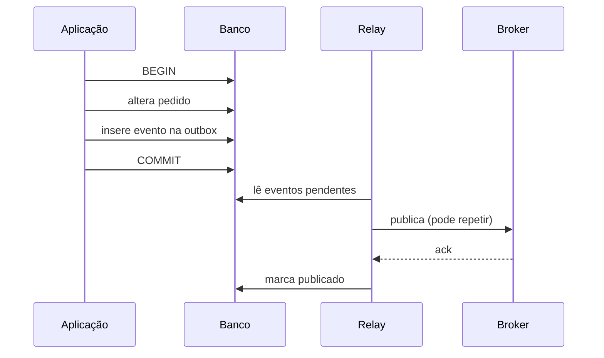

# Transações e consistência

Uma transação delimita quais estados intermediários podem ser observados e como concorrência é resolvida. ACID não define um único isolamento nem implica distribuição transparente.

## ACID na prática

- **Atomicidade:** commit completo ou efeitos não visíveis; efeitos externos exigem outbox/idempotência.
- **Consistência:** a aplicação e constraints levam um estado válido a outro; não é o mesmo “C” de CAP.
- **Isolamento:** controla interferências concorrentes; varia por nível e implementação.
- **Durabilidade:** após confirmação, dados sobrevivem às falhas cobertas pela configuração—não a qualquer desastre.

## Anomalias e escolhas

| Fenômeno | Exemplo | Mitigação |
| --- | --- | --- |
| lost update | dois writers sobrescrevem saldo | lock, compare-and-set ou serializable |
| non-repeatable read | mesma linha muda na transação | snapshot/repeatable read conforme semântica |
| phantom | consulta por predicado ganha linhas | predicate/range lock ou serializable |
| write skew | médicos saem de plantão em linhas distintas | constraint/modelagem ou serializable |

MVCC mantém versões para leitores e writers progredirem, mas transações longas retêm lixo e snapshots. Optimistic concurrency detecta conflito no commit; pessimistic locking impede progresso incompatível antes.

## Consistência distribuída

Linearizabilidade faz cada operação parecer instantânea entre chamada e retorno. Serializabilidade ordena transações, mas não exige relação com tempo real. Causalidade preserva dependências; eventual consistency apenas promete convergência sob condições. Diga qual objeto e operação recebe qual garantia.

## Padrão outbox

O relay pode publicar duas vezes; consumidores precisam ser idempotentes. “Exactly once” é sempre uma propriedade limitada a fronteiras e hipóteses específicas.

## Exercícios

1. Reproduza lost update em duas sessões e corrija com version column.
2. Modele reserva de assento com lock pessimista e optimistic concurrency; compare contenção.
3. Implemente outbox, mate o relay entre publish e ack e demonstre deduplicação.
4. Escreva uma história de consistência para leitura após escrita entre regiões.

## Referências

- PostgreSQL. [Transaction Isolation](https://www.postgresql.org/docs/current/transaction-iso.html).
- Berenson et al. [A Critique of ANSI SQL Isolation Levels](https://www.microsoft.com/en-us/research/publication/a-critique-of-ansi-sql-isolation-levels/).
- Jepsen. [Consistency Models](https://jepsen.io/consistency).

---

[← Comparação](comparison.md) · [↑ Bancos](README.md) · [SQL →](sql/README.md)
