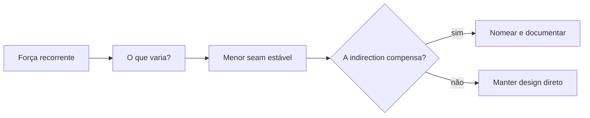

# Design Patterns

> Estado inicial: catálogo conceitual dos 23 GoF consolidado; Strategy é o
> capítulo de referência completo em cinco linguagens. Os demais patterns serão
> expandidos incrementalmente nesse mesmo formato, preservando profundidade.

Patterns são um vocabulário para forças recorrentes de design—não receitas nem objetivos. Comece pelo problema, faça o design mais simples funcionar e introduza um pattern apenas quando ele torna um trade-off explícito.

## Resultados de aprendizagem

Ao terminar a trilha, você deverá conseguir:

- reconhecer os 23 patterns Gang of Four (GoF) sem forçá-los em todo design;
- distinguir problemas de criação, composição e colaboração;
- comparar um pattern OO clássico com alternativas nativas da linguagem;
- explicar indirection, superfície de testes e impacto operacional adicionados;
- refatorar em direção a um pattern e também removê-lo quando deixa de compensar.

## Mapa

| Capítulo | Pergunta central | Patterns |
| --- | --- | --- |
| [Criacionais](creational.md) | Quem escolhe e monta objetos concretos? | Factory Method, Abstract Factory, Builder, Prototype, Singleton |
| [Estruturais](structural.md) | Como objetos e interfaces se compõem? | Adapter, Bridge, Composite, Decorator, Facade, Flyweight, Proxy |
| [Comportamentais](behavioral.md) | Como algoritmos e responsabilidades colaboram? | Chain of Responsibility, Command, Interpreter, Iterator, Mediator, Memento, Observer, State, Strategy, Template Method, Visitor |
| [Strategy completo](strategy.md) | Como variar um algoritmo independentemente do cliente? | Exemplo em Python, JavaScript, TypeScript, Go e Kotlin |
| [Prática](exercises.md) | Consigo reconhecer as forças antes de nomear a solução? | Quatro níveis progressivos |

## Como estudar um pattern

1. Escreva a mudança concreta que hoje é cara.
2. Identifique o que deve permanecer estável e o que varia.
3. Desenhe a direção de dependências antes de escolher um nome.
4. Implemente o menor seam e meça a nova complexidade.
5. Teste comportamento pela interface estável.
6. Registre quando o seam deverá ser removido.

## Relações entre patterns

- **Abstract Factory** frequentemente cria famílias implementadas com **Factory Methods**.
- **Builder** varia montagem; **Abstract Factory** varia famílias de produtos.
- **Decorator** e **Proxy** têm forma de wrapper, mas Decorator adiciona comportamento e Proxy controla acesso.
- **Bridge** costuma ser escolhido cedo para separar dois eixos; **Adapter** reconcilia uma incompatibilidade existente.
- **State** e **Strategy** têm estrutura parecida: State representa transições do domínio; Strategy é política selecionável.
- **Command** transforma ação em dado, habilitando fila, retry, histórico e às vezes undo com **Memento**.
- **Composite** frequentemente expõe **Iterator**; **Visitor** adiciona operações quando a hierarquia de elementos é estável.

## Anti-patterns comuns

- **Pattern-first design:** escolher nomes antes de descobrir forças.
- **Indirection sem variação:** interface + factory + implementação para dependência que nunca muda.
- **Singleton como estado global oculto:** testes dependentes de ordem e acoplamento implícito.
- **Herança por padrão:** hierarquias frágeis quando composição isolaria a mudança.
- **Diagram drift:** documentação representa abstrações que já não existem no código.

## Próximos estudos

- [Princípios de Engenharia de Software](../software-engineering/README.md)
- [Arquitetura](../architecture/README.md)
- [Domain-Driven Design](../software-engineering/ddd/README.md)

## Referências centrais

- Gamma, Helm, Johnson, Vlissides. *Design Patterns: Elements of Reusable Object-Oriented Software*. [Pearson](https://www.pearson.com/en-us/subject-catalog/p/design-patterns-elements-of-reusable-object-oriented-software/P200000009480/9780201633610).
- Freeman & Robson. *Head First Design Patterns*, 2ª ed. [O'Reilly](https://www.oreilly.com/library/view/head-first-design/9781492077992/).
- Fowler. *Patterns of Enterprise Application Architecture*. [Catálogo do autor](https://martinfowler.com/books/eaa.html).
- [Catálogo Refactoring.Guru](https://refactoring.guru/design-patterns) — referência visual complementar.

---

[← Alexandria](../README.md) · [↑ Índice principal](../README.md) · [Criacionais →](creational.md)
