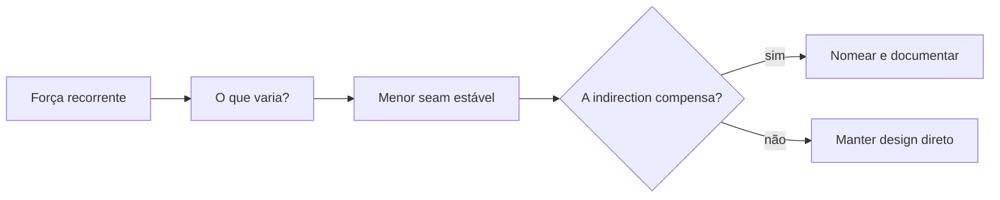

# Design Patterns

Patterns são um vocabulário para forças recorrentes de design, não receitas nem objetivos. Comece pelo problema, faça o design mais simples funcionar e introduza um pattern apenas quando ele torna um trade-off explícito.

O valor de estudar patterns não é conseguir nomear 23 diagramas. É reconhecer **qual parte do design precisa variar, qual parte deve permanecer estável e quanto custa introduzir uma nova indirection**.

## Resultados de aprendizagem

Ao terminar a trilha, você deverá conseguir:

- reconhecer os 23 patterns Gang of Four (GoF) sem forçá-los em todo design;
- distinguir problemas de criação, composição e colaboração;
- comparar um pattern OO clássico com alternativas nativas da linguagem;
- explicar indirection, superfície de testes e impacto operacional adicionados;
- refatorar em direção a um pattern e também removê-lo quando deixa de compensar;
- identificar quais garantias pertencem ao pattern e quais continuam dependentes da implementação.

## Mapa

| Capítulo | Pergunta central | Patterns |
| --- | --- | --- |
| [Criacionais](creational.md) | Quem escolhe e monta objetos concretos? | Factory Method, Abstract Factory, Builder, Prototype, Singleton |
| [Estruturais](structural.md) | Como objetos e interfaces se compõem? | Adapter, Bridge, Composite, Decorator, Facade, Flyweight, Proxy |
| [Comportamentais](behavioral.md) | Como algoritmos e responsabilidades colaboram? | Chain of Responsibility, Command, Interpreter, Iterator, Mediator, Memento, Observer, State, Strategy, Template Method, Visitor |
| [Strategy completo](strategy.md) | Como variar um algoritmo independentemente do cliente? | Exemplo em Python, JavaScript, TypeScript, Go e Kotlin |
| [Prática](exercises.md) | Consigo reconhecer as forças antes de nomear a solução? | Quatro níveis progressivos |

## Modelo mental: força → seam → custo

Um pattern normalmente cria um **seam**, uma fronteira onde algo pode variar sem reescrever tudo ao redor.

A indirection tem custo: mais tipos, configuração, lifecycle, testes e navegação. O pattern compensa quando esse custo é menor que o custo da variação que ele contém.

## O que patterns garantem e o que não garantem

Um pattern descreve **estrutura e intenção**, não qualidade automática.

### O que pode garantir quando bem aplicado

- uma direção de dependência mais clara;
- um ponto explícito de extensão;
- separação de responsabilidades específicas;
- um contrato comum para variantes;
- um vocabulário compartilhado para discutir design.

### O que não garante

- performance;
- thread safety;
- segurança;
- consistência distribuída;
- idempotência;
- testabilidade automática;
- baixo acoplamento semântico;
- necessidade futura da abstração.

Um Proxy remoto continua sujeito a timeout e falha parcial. Observer não garante ordem. Singleton não garante unicidade distribuída. Decorator não garante que a ordem dos wrappers seja irrelevante. Strategy não garante que todas as variantes tenham o mesmo custo operacional.

Por isso o estudo precisa conectar cada pattern a **garantias e limites observáveis**.

## Como estudar um pattern

1. Escreva a mudança concreta que hoje é cara.
2. Identifique o que deve permanecer estável e o que varia.
3. Desenhe a direção de dependências antes de escolher um nome.
4. Implemente o menor seam e meça a nova complexidade.
5. Teste comportamento pela interface estável.
6. Injete uma falha relevante se houver I/O, estado ou concorrência.
7. Registre quando o seam deverá ser removido.

### Perguntas úteis

- Qual força concreta justifica o pattern?
- O contrato é realmente comum às variantes?
- Existe alternativa mais simples na linguagem?
- Que failure mode foi escondido pela abstração?
- O novo seam pode ser testado sem acoplar teste à implementação?
- Como saberemos que o pattern deixou de compensar?

## Patterns clássicos versus recursos modernos

GoF foi escrito em contexto fortemente orientado a objetos. Linguagens modernas frequentemente reduzem a cerimônia.

| Intenção clássica | Alternativa frequente |
| --- | --- |
| Strategy | função/callable/higher-order function |
| Command | record/data class + handler |
| Iterator | protocolo nativo, generator, sequence |
| Visitor | algebraic data type + pattern matching |
| Factory Method | função factory ou DI explícita |
| Singleton | lifetime no composition root/module |
| Template Method | composição de funções/Strategies |

A intenção pode continuar válida mesmo quando a forma muda. Não force classes para “provar” que usou um pattern.

## Relações entre patterns

- **Abstract Factory** frequentemente cria famílias implementadas com **Factory Methods**.
- **Builder** varia montagem; **Abstract Factory** varia famílias de produtos.
- **Decorator** e **Proxy** têm forma de wrapper, mas Decorator adiciona comportamento e Proxy controla acesso.
- **Bridge** costuma ser escolhido cedo para separar dois eixos; **Adapter** reconcilia uma incompatibilidade existente.
- **State** e **Strategy** têm estrutura parecida: State representa transições do domínio; Strategy é política selecionável.
- **Command** transforma ação em dado, habilitando fila, retry, histórico e às vezes undo com **Memento**.
- **Composite** frequentemente expõe **Iterator**; **Visitor** adiciona operações quando a hierarquia de elementos é estável.

## Runtime e operação importam

Patterns aparentemente “de código” podem alterar runtime.

- **Decorator** de retry pode multiplicar chamadas.
- **Proxy** remoto adiciona rede, timeout e serialização.
- **Observer** pode criar notification storm ou leak de subscribers.
- **Flyweight** economiza memória, mas adiciona lookup/compartilhamento.
- **Command** em fila precisa de schema, deduplicação e autorização.
- **Singleton** mutável pode criar contenção e ordem de inicialização.

Ao adotar um pattern em caminho crítico, meça impacto. Não trate diagramas como se fossem custo zero.

## Segurança

Indirection também cria trust boundaries.

- factories não devem instanciar classes arbitrárias vindas de input não confiável;
- Proxy de autorização precisa falhar fechado quando a política exigir;
- Command distribuído deve autenticar autor e validar payload;
- Prototype não deve copiar secrets/identidade por acidente;
- plugin baseado em Strategy/Factory precisa de allowlist e isolamento conforme risco.

Pattern é organização de código, não mecanismo de segurança por si só.

## Testes orientados à intenção

Teste o contrato do pattern, não a existência de classes.

Exemplos:

- Strategy: todas as variantes preservam invariantes comuns;
- Adapter: tradução mantém unidade e semântica de erro;
- Decorator: composição preserva contrato e ordem é testada;
- Observer: unsubscribe funciona e falha de subscriber segue política;
- State: apenas transições válidas são permitidas;
- Builder: `build()` nunca produz objeto inválido.

Um teste que apenas verifica `instanceof` raramente protege a força que justificou o pattern.

## Refatorar para e para fora de patterns

Patterns não precisam nascer no design inicial. Um caminho saudável é:

1. implementar diretamente;
2. observar duplicação/variação real;
3. caracterizar comportamento com testes;
4. introduzir seam mínimo;
5. migrar variantes;
6. medir se a indirection melhorou mudança.

O caminho inverso também importa. Se só resta uma variante e a abstração virou navegação, remover Factory/Strategy pode simplificar o sistema.

## Anti-patterns comuns

- **Pattern-first design:** escolher nomes antes de descobrir forças.
- **Indirection sem variação:** interface + factory + implementação para dependência que nunca muda.
- **Singleton como estado global oculto:** testes dependentes de ordem e acoplamento implícito.
- **Herança por padrão:** hierarquias frágeis quando composição isolaria a mudança.
- **Diagram drift:** documentação representa abstrações que já não existem no código.
- **Pattern stacking:** Factory cria Strategy que retorna Decorator sem driver claro.
- **Pattern cargo cult:** repetir estrutura de livro sem adaptar à linguagem.

## Laboratório de refatoração

Pegue um checkout com um `switch` crescente de frete e logging/retry misturados.

1. Caracterize comportamento com testes.
2. Extraia Strategy apenas para política de frete.
3. Use Decorator apenas se logging/retry forem responsabilidades realmente composáveis.
4. Adapte um carrier legado com Adapter.
5. Meça número de arquivos tocados ao adicionar uma nova transportadora antes/depois.
6. Injete timeout no carrier remoto e garanta que o pattern não esconda a falha.
7. Substitua a Strategy por funções de primeira classe e compare clareza.
8. Escreva uma decisão: qual versão manteria e por quê?

O objetivo é aprender que o nome do pattern é secundário à força e ao custo de mudança.

## Próximos estudos

- [Princípios de Engenharia de Software](../software-engineering/README.md)
- [Arquitetura](../architecture/README.md)
- [Domain-Driven Design](../software-engineering/ddd/README.md)

## Referências centrais

- Gamma, Helm, Johnson, Vlissides. *Design Patterns: Elements of Reusable Object-Oriented Software*. [Pearson](https://www.pearson.com/en-us/subject-catalog/p/design-patterns-elements-of-reusable-object-oriented-software/P200000009480/9780201633610).
- Freeman & Robson. *Head First Design Patterns*, 2ª ed. [O'Reilly](https://www.oreilly.com/library/view/head-first-design/9781492077992/).
- Fowler. *Patterns of Enterprise Application Architecture*. [Catálogo do autor](https://martinfowler.com/books/eaa.html).
- [Catálogo Refactoring.Guru](https://refactoring.guru/design-patterns) — referência visual complementar.

---

[← Alexandria](../README.md) · [↑ Índice principal](../README.md) · [Criacionais →](creational.md)
