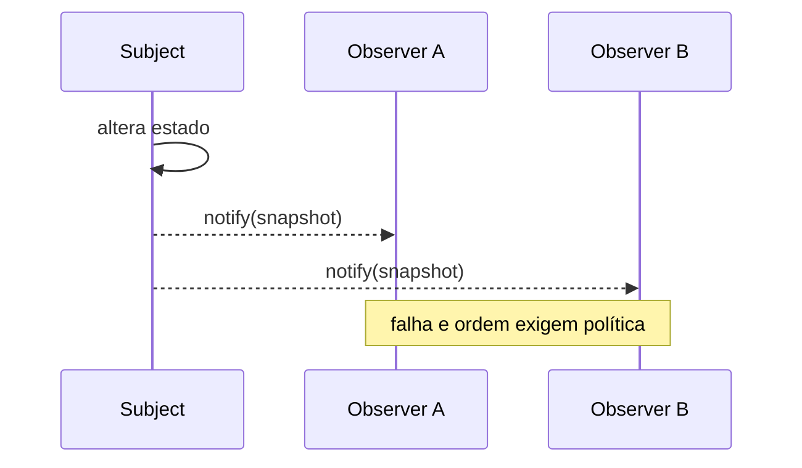

# Patterns comportamentais

Patterns comportamentais distribuem algoritmos e comunicação. São úteis quando a mudança trata de *quem age, em qual ordem, com qual estado* e *como colaboradores permanecem desacoplados*.

## Catálogo

| Pattern | Encapsula/varia | Risco principal |
| --- | --- | --- |
| Chain of Responsibility | handlers ordenados | fall-through/ordem invisível |
| Command | request como objeto/valor | classes de comando inchadas |
| Interpreter | gramática e avaliação | linguagem interna cresce sem tooling |
| Iterator | percurso | invalidação/concorrência |
| Mediator | hub de colaboração | god mediator |
| Memento | snapshot opaco | memória/privacidade/versão |
| Observer | notificação um-para-muitos | leaks, storms, ordem |
| State | comportamento por lifecycle | transições fragmentadas |
| Strategy | algoritmo intercambiável | família desnecessária de tipos |
| Template Method | esqueleto de algoritmo | herança rígida |
| Visitor | operação sobre tipos estáveis | novo elemento caro |

## Chain of Responsibility

**Intenção:** passar request por handlers ordenados até um tratar ou todos contribuírem. Middleware pode parsear credencial, autorizar e auditar. **Use** para pipeline configurável cujo sender não conhece receiver. **Evite** se etapas obrigatórias/ordem merecem workflow explícito. **Trade-offs:** composição flexível versus fluxo/erro/fall-through difíceis. Defina término, ordem e observabilidade. Lista de funções costuma bastar.

## Command

**Intenção:** representar ação e input como valor. `CapturePayment(orderId, amount, idempotencyKey)` pode ser enfileirado, auditado e retried. **Use** em scheduling, transação, histórico ou fronteira de processo. **Evite** uma classe para chamada trivial local. **Trade-offs:** separa invoker/receiver e habilita histórico; schema evolution, dedup e command explosion aparecem. Comando distribuído é mensagem: versione, autentique e não suponha exactly-once.

## Interpreter

**Intenção:** representar uma gramática e avaliar sentenças dessa linguagem por uma árvore de expressões. Ex.: filtros `status = "paid" AND total > 1000` viram nós `And`, `Equals` e `GreaterThan` avaliados sobre um contexto. **Use** para uma linguagem pequena, estável e específica cujo parsing/avaliação precisa ser extensível. **Evite** gramática grande, ambígua, hostil ou que exija mensagens, otimização e tooling sofisticados; use parser generator, AST + Visitor ou engine consolidada. **Trade-offs:** regras ficam explícitas/combináveis, mas uma classe por produção, segurança de input, precedência e performance aumentam rápido. Limite profundidade/tamanho e nunca interprete código arbitrário de usuário. Specification, combinadores de parser e pattern matching são alternativas modernas.

## Iterator

**Intenção:** percorrer agregado sem revelar representação. **Use** para ordens diferentes, lazy stream ou API estável. **Evite** reinventar protocolo nativo. **Trade-offs:** acesso uniforme/lazy; contrato precisa definir mutação, fechamento, paginação, falha e thread safety. Cursor de banco é Iterator com I/O: exponha cancelamento e lifecycle.

## Mediator

**Intenção:** mover colaboração muitos-para-muitos a um coordenador. Um dialog mediator coordena campos, validação e botões. **Use** quando dependências entre peers formam grafo denso e a interação é conceito. **Evite** transferir toda regra a um god object. **Trade-offs:** peers simples, mediator complexo/acoplado a mensagens. Event bus assíncrono é alternativa com delivery semantics diferentes.

## Memento

**Intenção:** capturar/restaurar estado sem expor internals. **Use** para undo local, checkpoint e especulação. **Evite** grafos grandes mutáveis, secrets ou história durável com schema evolution; Event Sourcing não é “Memento persistido”. **Trade-offs:** encapsula restore, custa memória/cópia/privacidade/versão. Prefira snapshots imutáveis ou compensação quando efeito externo não reverte.

## Observer

**Intenção:** notificar observers registrados quando subject muda. **Use** para reação in-process um-para-muitos sem o publisher nomear consumers. **Evite** workflow crítico que exige sucesso/ordem/transação explícitos. **Trade-offs:** extensão versus fluxo oculto, leaks, reentrância, storms e ordem incerta. Defina unsubscribe e isolamento de falha. Broker distribuído adiciona consistência eventual e entrega.

## State

**Intenção:** comportamento muda com estado do lifecycle, com transições explícitas. Pedido `Pending`, `Paid` ou `Cancelled` aceita comandos diferentes. **Use** quando condicionais se repetem e transições têm regras. **Evite** dois flags estáveis ou quando tabela/FSM é mais clara. **Trade-offs:** comportamento local e transições válidas versus mais tipos/risco de dispersão. Persista identificador de estado e modele concorrência/evento inválido.

## Strategy

**Intenção:** encapsular algoritmos intercambiáveis. **Use** quando política varia por tenant/request ou merece testes independentes. **Evite** quando função simples ou algoritmo direto basta. **Trade-offs:** substituição/extensão versus seleção/configuração. Veja o [capítulo completo de Strategy](strategy.md).

## Template Method

**Intenção:** classe base fixa esqueleto e subclasses sobrescrevem etapas. Importação sempre carrega, valida, transforma e confirma; formatos alteram parsing. **Use** em framework controlado com lifecycle invariável. **Evite** herança profunda, vários eixos e composição runtime. **Trade-offs:** reuso/ordem versus fragile base class e hooks implícitos. Higher-order functions ou Strategies costumam ser mais explícitas.

## Visitor

**Intenção:** adicionar operações a conjunto estável de elementos sem mudá-los. AST aceita type-check, format e codegen. **Use** quando variantes de elemento são estáveis e operações crescem. **Evite** se novos elementos são frequentes: todo Visitor muda. **Trade-offs:** operações coesas/double dispatch versus internals expostos e evolução assimétrica. ADTs + pattern matching podem ser alternativas.

## Escolha entre semelhantes

- **State × Strategy:** State seleciona a si pelas transições; cliente/config seleciona Strategy.
- **Observer × Mediator:** Observer transmite mudança; Mediator possui protocolo de colaboração.
- **Command × Strategy:** Command captura *faça isto*; Strategy fornece *como calcular*.
- **Template Method × Strategy:** um varia hooks por herança; outro compõe política.
- **Memento × Event Sourcing:** snapshot para restore versus fatos como fonte de verdade.

## Referências

- [Livro GoF — Pearson](https://www.pearson.com/en-us/subject-catalog/p/design-patterns-elements-of-reusable-object-oriented-software/P200000009480/9780201633610)
- [Refactoring.Guru — comportamentais](https://refactoring.guru/design-patterns/behavioral-patterns)

---

[← Estruturais](structural.md) · [↑ Índice](README.md) · [Strategy →](strategy.md)
