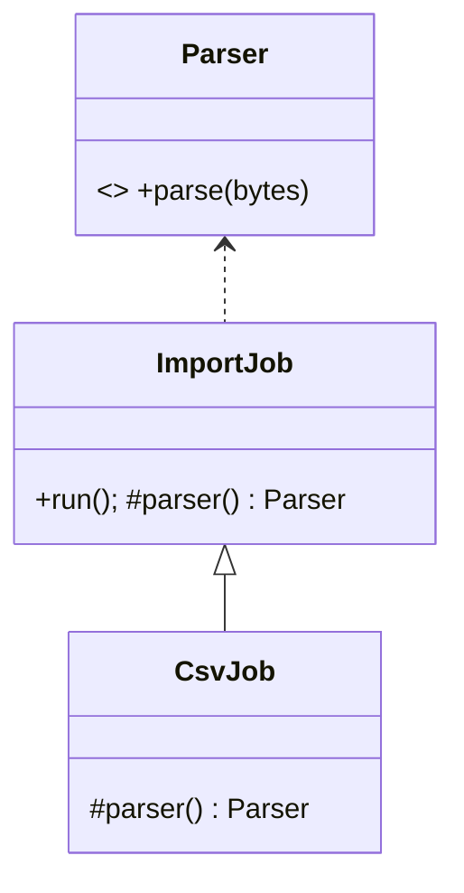

# Patterns criacionais

Patterns criacionais afastam decisões de construção do código de negócio. O custo é indirection; o benefício aparece quando tipos concretos, etapas, lifecycle ou famílias de produtos realmente variam.

## Guia de decisão

| Força | Prefira | Cuidado |
| --- | --- | --- |
| Subclasse decide um produto | Factory Method | subclasses criadas só para escolher tipo |
| Produtos precisam ser compatíveis em família | Abstract Factory | novo tipo de produto altera todas as factories |
| Construção tem etapas/opções | Builder | builder que apenas espelha construtor |
| Copiar configuração é melhor que reconstruir | Prototype | cópia rasa de grafo mutável |
| Uma instância local é invariante real | Singleton | estado global e duplicatas distribuídas |

## Factory Method

**Problema/intenção.** Um fluxo sabe usar um produto, mas não deve se ligar à classe concreta. O creator expõe o factory method e mantém o workflow estável.



**Use quando:** extensão ocorre por tipo de produto e um framework controla o lifecycle. **Evite quando:** função parâmetro ou binding de DI comunica a escolha diretamente. **Trade-offs:** plugins estendem criação sem editar workflow, mas navegação e erro cruzam mais um limite.

**Exemplo conceitual:** `ImportJob.run()` abre, valida e persiste; `parser()` devolve CSV, JSON ou XML. Código moderno frequentemente substitui subclassing por `parserFactory` como função.

**Anti-patterns:** `switch` duplicado em vários callers; factory que também faz I/O, cache e service location.

## Abstract Factory

**Problema/intenção.** Criar vários objetos relacionados que não podem ser misturados, como client de storage + lock + transaction de um provider. A factory representa a família compatível.

**Estrutura:** cliente → `PersistenceFactory`; factories PostgreSQL e in-memory criam `Repository`, `UnitOfWork` e `Lock` coerentes.

**Use quando:** compatibilidade de produtos é invariante ou plataforma/ambiente muda como unidade. **Evite quando:** produtos evoluem separadamente ou só um varia. **Trade-offs:** troca de família é atômica e um fake pode ser coerente; adicionar um produto muda toda factory.

**Alternativas modernas:** módulos de DI, provider objects e composição explícita de construtores. Container de DI não é automaticamente Abstract Factory.

**Anti-patterns:** misturar produtos de famílias; “factory da aplicação” que vira service locator.

## Builder

**Problema/intenção.** Um objeto válido requer etapas, opções ou múltiplas representações. Builder nomeia passos e valida em `build()`.

```text
ReportBuilder.title(...).period(...).addSection(...).build()
```

**Use quando:** regras de construção são mais ricas que a API final, ou o processo gera HTML/PDF. **Evite quando:** parâmetros nomeados e construtor pequeno bastam. **Trade-offs:** montagem legível e validação central versus tipos adicionais, estado parcial e ordem ambígua.

**Alternativas:** valores imutáveis com `copy`, records, parâmetros default/nomeados e type-state builders quando ordem em compile time importa.

**Anti-patterns:** builder mutável compartilhado entre requests; `build()` produz inválido; confundir Builder com fluent interface (fluência é sintaxe, Builder é responsabilidade).

## Prototype

**Problema/intenção.** Novos objetos partem de exemplar configurado e copiar é mais adequado que chamar construtores concretos.

**Use quando:** configuração runtime define variantes, setup é caro ou simulação ramifica snapshots. **Evite quando:** identidade, handles externos, locks, ciclos ou mutabilidade tornam cópia ambígua. **Trade-offs:** menos classes e branching rápido, mas deep/shallow copy vira contrato.

**Exemplo:** clone template de campanha já validado, depois atribua identidade e tenant novos. Documente campos resetados.

**Alternativas:** estruturas persistentes imutáveis, `copyWith` explícito ou round-trip de serialização quando o custo de schema/versionamento é aceitável.

**Anti-patterns:** duplicar ID de banco, compartilhar filhos mutáveis e usar clone para ignorar invariantes.

## Singleton

**Problema/intenção.** Oferecer uma instância acessível de recurso cuja unicidade **no processo** é necessária.

**Use raramente:** registry realmente controlado pelo runtime pode ser caso válido. **Evite para:** repository, clock, configuração, logger ou client que aplicação/teste deve injetar. Em vários processos/pods, há um Singleton por processo, não por sistema.

**Trade-offs:** acesso central/lazy é conveniente; dependência oculta, estado mutável, races de lifecycle e contaminação de testes são comuns. Inicialização thread-safe não resolve acoplamento semântico.

**Alternativas:** lifetime no composition root, instância de módulo, ownership explícito ou coordenação distribuída quando unicidade é global.

**Anti-patterns:** “reset para testes”, inicialização dependente de ordem/env e Singleton usado como lock distribuído.

## Checkpoint

Para um renderer com cinco campos opcionais e dois formatos, pergunte separadamente: “a montagem varia?” (Builder) e “famílias compatíveis variam?” (Abstract Factory). Construtores parecidos podem representar forças diferentes.

## Referências

- [Livro GoF — Pearson](https://www.pearson.com/en-us/subject-catalog/p/design-patterns-elements-of-reusable-object-oriented-software/P200000009480/9780201633610)
- [Refactoring.Guru — criacionais](https://refactoring.guru/design-patterns/creational-patterns)

---

[← Design Patterns](README.md) · [↑ Índice](README.md) · [Estruturais →](structural.md)
