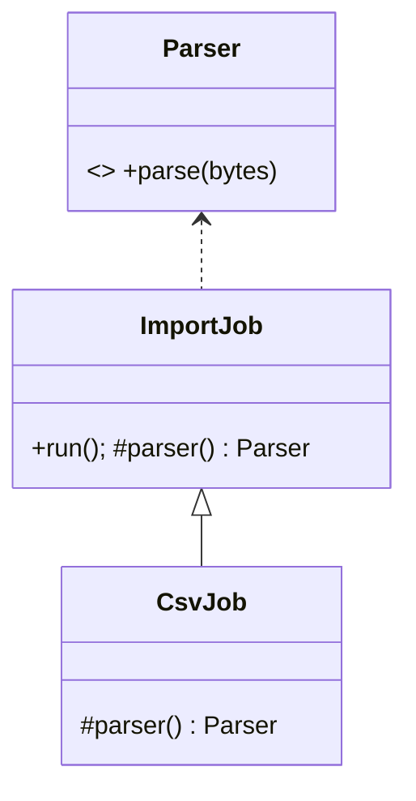

# Patterns criacionais

Patterns criacionais afastam decisões de construção do código de negócio. O custo é indirection; o benefício aparece quando tipos concretos, etapas, lifecycle ou famílias de produtos realmente variam.

## O problema

Construção parece simples até começar a carregar decisões demais: provider, configuração, validação, cache, lifecycle, dependências, identidade e ordem de inicialização. Quando cada consumidor repete essas decisões, troca de implementação e testes ficam caros.

Patterns criacionais tentam localizar **quem decide como um objeto válido nasce**. Eles não significam “nunca usar construtor”. Um construtor direto continua sendo a melhor opção quando criação é simples e estável.

## Modelo mental

Pergunte qual aspecto da criação varia:

- **tipo concreto:** Factory Method;
- **família compatível de objetos:** Abstract Factory;
- **etapas/opções de montagem:** Builder;
- **configuração derivada de exemplar:** Prototype;
- **lifetime único no processo:** Singleton.

A forma pode ser diferente em linguagens modernas, mas a força continua útil.

## Guia de decisão

| Força | Prefira | Cuidado |
| --- | --- | --- |
| Subclasse decide um produto | Factory Method | subclasses criadas só para escolher tipo |
| Produtos precisam ser compatíveis em família | Abstract Factory | novo tipo de produto altera todas as factories |
| Construção tem etapas/opções | Builder | builder que apenas espelha construtor |
| Copiar configuração é melhor que reconstruir | Prototype | cópia rasa de grafo mutável |
| Uma instância local é invariante real | Singleton | estado global e duplicatas distribuídas |

## Factory Method

**Problema/intenção.** Um fluxo sabe usar um produto, mas não deve se ligar à classe concreta. O creator expõe o factory method e mantém o workflow estável.



**Use quando:** extensão ocorre por tipo de produto e um framework controla o lifecycle. **Evite quando:** função parâmetro ou binding de DI comunica a escolha diretamente.

**Trade-offs:** plugins estendem criação sem editar workflow, mas navegação e erro cruzam mais um limite.

**Exemplo conceitual:** `ImportJob.run()` abre, valida e persiste; `parser()` devolve CSV, JSON ou XML. Código moderno frequentemente substitui subclassing por `parserFactory` como função.

**Anti-patterns:** `switch` duplicado em vários callers; factory que também faz I/O, cache e service location.

### Falha comum

Factory escolhida a partir de string de input não confiável pode instanciar implementação indevida. Use mapeamento/allowlist explícito e valide configuração no startup.

## Abstract Factory

**Problema/intenção.** Criar vários objetos relacionados que não podem ser misturados, como client de storage + lock + transaction de um provider. A factory representa a família compatível.

**Estrutura:** cliente → `PersistenceFactory`; factories PostgreSQL e in-memory criam `Repository`, `UnitOfWork` e `Lock` coerentes.

**Use quando:** compatibilidade de produtos é invariante ou plataforma/ambiente muda como unidade. **Evite quando:** produtos evoluem separadamente ou só um varia.

**Trade-offs:** troca de família é atômica e um fake pode ser coerente; adicionar um produto muda toda factory.

**Alternativas modernas:** módulos de DI, provider objects e composição explícita de construtores. Container de DI não é automaticamente Abstract Factory.

**Anti-patterns:** misturar produtos de famílias; “factory da aplicação” que vira service locator.

### Teste importante

Rode o mesmo contract test sobre cada família. Um `InMemoryPersistenceFactory` só é substituto válido se respeita as garantias que os testes precisam, ou se as diferenças estão documentadas.

## Builder

**Problema/intenção.** Um objeto válido requer etapas, opções ou múltiplas representações. Builder nomeia passos e valida em `build()`.

```text
ReportBuilder.title(...).period(...).addSection(...).build()
```

**Use quando:** regras de construção são mais ricas que a API final, ou o processo gera HTML/PDF. **Evite quando:** parâmetros nomeados e construtor pequeno bastam.

**Trade-offs:** montagem legível e validação central versus tipos adicionais, estado parcial e ordem ambígua.

**Alternativas:** valores imutáveis com `copy`, records, parâmetros default/nomeados e type-state builders quando ordem em compile time importa.

**Anti-patterns:** builder mutável compartilhado entre requests; `build()` produz inválido; confundir Builder com fluent interface, pois fluência é sintaxe e Builder é responsabilidade.

### Garantia esperada

Depois de `build()`, o objeto deveria estar em estado válido. Se callers ainda precisam chamar `validate()` antes de usar, o Builder não está cumprindo sua principal função.

## Prototype

**Problema/intenção.** Novos objetos partem de exemplar configurado e copiar é mais adequado que chamar construtores concretos.

**Use quando:** configuração runtime define variantes, setup é caro ou simulação ramifica snapshots. **Evite quando:** identidade, handles externos, locks, ciclos ou mutabilidade tornam cópia ambígua.

**Trade-offs:** menos classes e branching rápido, mas deep/shallow copy vira contrato.

**Exemplo:** clone template de campanha já validado, depois atribua identidade e tenant novos. Documente campos resetados.

**Alternativas:** estruturas persistentes imutáveis, `copyWith` explícito ou round-trip de serialização quando o custo de schema/versionamento é aceitável.

**Anti-patterns:** duplicar ID de banco, compartilhar filhos mutáveis e usar clone para ignorar invariantes.

### Segurança e privacidade

Prototype pode copiar tokens, dados pessoais, audit metadata ou tenant ID. Uma operação de clone precisa declarar o que é compartilhado, regenerado e removido. “Deep copy” não é política de segurança.

## Singleton

**Problema/intenção.** Oferecer uma instância acessível de recurso cuja unicidade **no processo** é necessária.

**Use raramente:** registry realmente controlado pelo runtime pode ser caso válido. **Evite para:** repository, clock, configuração, logger ou client que aplicação/teste deve injetar. Em vários processos/pods, há um Singleton por processo, não por sistema.

**Trade-offs:** acesso central/lazy é conveniente; dependência oculta, estado mutável, races de lifecycle e contaminação de testes são comuns. Inicialização thread-safe não resolve acoplamento semântico.

**Alternativas:** lifetime no composition root, instância de módulo, ownership explícito ou coordenação distribuída quando unicidade é global.

**Anti-patterns:** “reset para testes”, inicialização dependente de ordem/env e Singleton usado como lock distribuído.

### Concorrência

Singleton mutável precisa das mesmas regras de concorrência que qualquer estado compartilhado. “Há uma instância” não significa “é thread-safe”. Em runtimes async, callbacks concorrentes também podem intercalar estado lógico.

## Lifecycle é parte da criação

Criar um objeto que abre socket, thread, file descriptor ou pool também cria obrigação de encerramento. Factories e builders precisam deixar ownership claro.

Pergunte:

- quem chama `close()`?
- o objeto pode ser reutilizado entre requests?
- a inicialização pode falhar parcialmente?
- recursos são liberados se a factory falhar no meio?
- shutdown acontece em ordem segura?

Uma factory que esconde lifecycle pode criar leak difícil de localizar.

## Performance

Indirection criacional costuma ser barata, mas construção pode não ser.

- criar HTTP client por request destrói pooling;
- reconstruir parser/modelo pesado aumenta latência;
- Builder pode copiar estruturas grandes a cada etapa;
- Prototype pode economizar setup ou duplicar grafos enormes;
- Singleton pode reduzir criação e criar contenção global.

Meça custo de construção e lifetime. Reuso só é seguro quando estado e concorrência permitem.

## Observabilidade

Para recursos importantes, observe inicialização e lifecycle:

- tempo de startup;
- falhas de criação;
- pool size/connections;
- instances ativas;
- cache de prototypes/factories;
- shutdown errors.

Evite logar secrets/configuração sensível durante factory failure.

## Testes

- Factory Method: cada produto satisfaz contrato comum.
- Abstract Factory: produtos da mesma família são compatíveis.
- Builder: combinações válidas e inválidas, inclusive ordem.
- Prototype: deep/shallow semantics e campos regenerados.
- Singleton: lifetime, concorrência e isolamento entre testes.

Teste também falha durante criação: se o terceiro recurso falha, os dois primeiros são liberados?

## Laboratório

Construa um sistema de geração de relatórios.

1. Comece com construtores diretos.
2. Use Builder apenas para configuração realmente opcional/validada.
3. Crie duas famílias de renderer/storage com Abstract Factory.
4. Implemente Factory Method ou função factory para escolher parser por formato.
5. Use Prototype para duplicar um template, regenerando identidade e removendo dados privados.
6. Introduza um Singleton global de configuração e observe como testes se contaminam; depois substitua por lifetime no composition root.
7. Meça custo de criar client remoto por request versus reutilizar pool.
8. Injete falha durante inicialização e prove cleanup.
9. Escreva quais patterns manteria em produção e quais removeria.

## Checkpoint

Para um renderer com cinco campos opcionais e dois formatos, pergunte separadamente: “a montagem varia?” (Builder) e “famílias compatíveis variam?” (Abstract Factory). Construtores parecidos podem representar forças diferentes.

## Anti-patterns gerais

- factory que apenas chama `new Foo()` sem decisão real;
- Builder para três parâmetros claros;
- Singleton para evitar passar dependência;
- Prototype copiando identidade/segredos;
- Abstract Factory que vira container genérico de serviços;
- criação com I/O escondido e sem lifecycle explícito.

## Referências

- [Livro GoF — Pearson](https://www.pearson.com/en-us/subject-catalog/p/design-patterns-elements-of-reusable-object-oriented-software/P200000009480/9780201633610)
- [Refactoring.Guru — criacionais](https://refactoring.guru/design-patterns/creational-patterns)

---

[← Design Patterns](README.md) · [↑ Índice](README.md) · [Estruturais →](structural.md)
