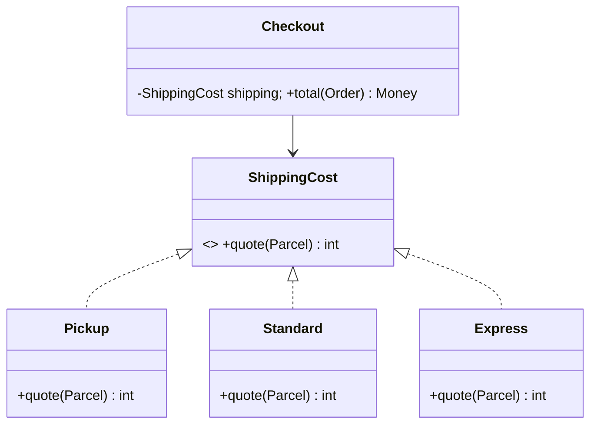

# Strategy

## Problema

Um checkout calcula frete por retirada, transportadora padrão ou expressa. Se toda política adiciona um branch a `Checkout`, regra de preço, infraestrutura e orquestração ficam acopladas. Testes percorrem um conditional crescente e políticas sem relação mudam juntas.

## Intenção

Definir uma família de algoritmos atrás de um contrato, testar cada política independentemente e deixar o limite de composição selecionar uma. Strategy serve quando o algoritmo varia; não justifica envolver todo cálculo em classe.

## Estrutura



A parte estável é o contrato de input/output; a variável é a política. Seleção pertence ao composition root (configuração, mapping da request ou DI), não escondida no consumidor.

## Quando usar

- políticas variam independentemente e têm nomes/testes significativos;
- seleção ocorre por tenant, plano, feature flag ou request;
- um algoritmo precisa ser substituído sem editar clientes;
- variantes carregam colaboradores como rate table ou carrier client.

## Quando evitar

- existe um cálculo pequeno sem variação plausível;
- callers precisam inspecionar tipos concretos para usá-los corretamente;
- variantes têm contratos incompatíveis;
- uma função de primeira classe comunica o mesmo design melhor.

## Trade-offs

| Ganho | Custo / mitigação |
| --- | --- |
| extensão e testes isolados | mais conceitos; nomeie pela política do domínio |
| seleção runtime | configuração inválida; valide na inicialização/fronteira |
| cliente independente do algoritmo | contrato mínimo demais; separe quando variantes divergirem |
| substituição simples | tipos/alocações extras; use funções/instâncias stateless |

## Exemplo conceitual

Todos os valores monetários usam centavos inteiros. Os exemplos mantêm seleção fora de `Checkout` e rejeitam input inválido. Carrier real também exige timeout, typed errors, cache e observabilidade.

## Python

Python expressa Strategy com `Protocol`; callable simples é alternativa mais leve.

```python
from dataclasses import dataclass
from typing import Protocol

@dataclass(frozen=True)
class Parcel:
    weight_grams: int

class ShippingCost(Protocol):
    def quote(self, parcel: Parcel) -> int: ...

class Pickup:
    def quote(self, parcel: Parcel) -> int:
        return 0

class Standard:
    def quote(self, parcel: Parcel) -> int:
        return 500 + 2 * parcel.weight_grams

def checkout(subtotal_cents: int, parcel: Parcel, shipping: ShippingCost) -> int:
    if subtotal_cents < 0 or parcel.weight_grams <= 0:
        raise ValueError("invalid checkout input")
    return subtotal_cents + shipping.quote(parcel)

assert checkout(10_000, Parcel(750), Standard()) == 12_000
```

Se variantes são stateless e pequenas, prefira `Callable[[Parcel], int]` e passe `standard_quote` diretamente.

## JavaScript

Funções de primeira classe evitam cerimônia e preservam a intenção.

```javascript
const pickup = () => 0;
const standard = ({ weightGrams }) => 500 + 2 * weightGrams;

function checkout(subtotalCents, parcel, shippingCost) {
  if (subtotalCents < 0 || parcel.weightGrams <= 0) {
    throw new RangeError("invalid checkout input");
  }
  return subtotalCents + shippingCost(parcel);
}

console.assert(
  checkout(10_000, { weightGrams: 750 }, standard) === 12_000,
);
```

Para carrier externo, feche sobre client explícito: `const express = client => async parcel => ...`. O contrato passa a ser assíncrono para **todas** as strategies; não misture número e promise.

## TypeScript

Structural typing permite objetos ou funções. Interface é útil quando o contrato merece nome de domínio.

```typescript
type Parcel = Readonly<{ weightGrams: number }>;

interface ShippingCost {
  quote(parcel: Parcel): number;
}

const pickup: ShippingCost = { quote: () => 0 };
const standard: ShippingCost = {
  quote: ({ weightGrams }) => 500 + 2 * weightGrams,
};

function checkout(
  subtotalCents: number,
  parcel: Parcel,
  shipping: ShippingCost,
): number {
  if (!Number.isSafeInteger(subtotalCents) || parcel.weightGrams <= 0) {
    throw new RangeError("invalid checkout input");
  }
  return subtotalCents + shipping.quote(parcel);
}

checkout(10_000, { weightGrams: 750 }, standard); // 12000
```

Evite union de nomes concretos dentro de `checkout`; isso recria o conditional que a abstração removeu.

## Go

Go aceita interface e function adapter, mantendo variants simples compactas.

```go
package shipping

import "fmt"

type Parcel struct{ WeightGrams int }

type Cost interface {
	Quote(Parcel) (int, error)
}

type CostFunc func(Parcel) (int, error)

func (f CostFunc) Quote(p Parcel) (int, error) { return f(p) }

var Pickup Cost = CostFunc(func(Parcel) (int, error) { return 0, nil })
var Standard Cost = CostFunc(func(p Parcel) (int, error) {
	if p.WeightGrams <= 0 {
		return 0, fmt.Errorf("weight must be positive")
	}
	return 500 + 2*p.WeightGrams, nil
})

func Checkout(subtotal int, p Parcel, cost Cost) (int, error) {
	shipping, err := cost.Quote(p)
	if err != nil { return 0, fmt.Errorf("quote shipping: %w", err) }
	return subtotal + shipping, nil
}
```

Defina interfaces perto do consumidor. Se a strategy remota precisa cancelamento, inclua `context.Context` no contrato desde o início.

## Kotlin

`fun interface` torna políticas nomeadas e lambdas interoperáveis.

```kotlin
data class Parcel(val weightGrams: Int)

fun interface ShippingCost {
    fun quote(parcel: Parcel): Int
}

val pickup = ShippingCost { 0 }
val standard = ShippingCost { parcel ->
    require(parcel.weightGrams > 0) { "weight must be positive" }
    500 + 2 * parcel.weightGrams
}

fun checkout(
    subtotalCents: Int,
    parcel: Parcel,
    shipping: ShippingCost,
): Int {
    require(subtotalCents >= 0)
    return Math.addExact(subtotalCents, shipping.quote(parcel))
}

check(checkout(10_000, Parcel(750), standard) == 12_000)
```

Para política remota suspending, declare `suspend fun quote(...)`; não bloqueie dentro de strategy síncrona.

## Testando a fronteira

Teste cada política por exemplos e invariantes, depois uma colaboração de `Checkout`:

- frete nunca retorna valor negativo;
- pacote mais pesado não fica mais barato na mesma faixa, salvo regra explícita;
- limites (999/1000 g) são cobertos;
- erro do carrier preserva retryability e não cobra pedido;
- configuração mapeia todo modo suportado para uma política.

Contract tests ajudam quando strategies chamam providers diferentes e prometem a mesma semântica.

## Anti-patterns relacionados

- **Strategy zoo:** dezenas de classes de uma linha sem política independente.
- **Contrato vazando:** caller testa `instanceof Express` para escolher timeout/input.
- **Strategy mutável compartilhada:** dado de request em Singleton causa race.
- **Seletor escondido:** “strategy” contém o `switch` original.
- **Interface inflada:** métodos opcionais que poucos algoritmos implementam.

## Alternativas modernas

- higher-order functions/callables para algoritmos stateless;
- lookup tables para regras orientadas a dados;
- ADTs + pattern matching exaustivo quando variantes são deliberadamente fechadas;
- rules engine somente se auditabilidade, edição por não-devs ou combinatória pagam a operação;
- Template Method quando a força é lifecycle fixo de framework, não algoritmo inteiro.

## Referências

- Gamma et al. *Design Patterns*. [Pearson](https://www.pearson.com/en-us/subject-catalog/p/design-patterns-elements-of-reusable-object-oriented-software/P200000009480/9780201633610).
- [Refactoring.Guru — Strategy](https://refactoring.guru/design-patterns/strategy)
- Fowler. [Patterns of Enterprise Application Architecture](https://martinfowler.com/books/eaa.html).

---

[← Comportamentais](behavioral.md) · [↑ Índice](README.md) · [Exercícios →](exercises.md)
