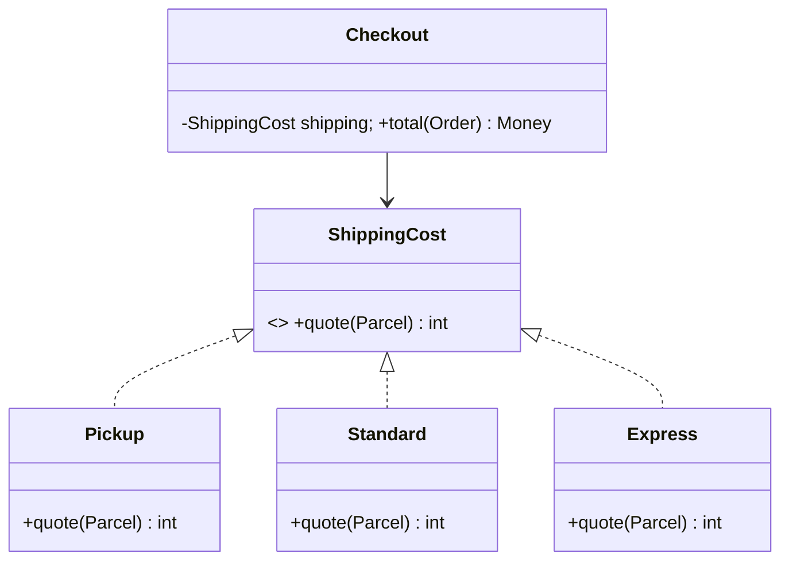

# Strategy

## Problema

Um checkout calcula frete por retirada, transportadora padrão ou expressa. Se toda política adiciona um branch a `Checkout`, regra de preço, infraestrutura e orquestração ficam acopladas. Testes percorrem um conditional crescente e políticas sem relação mudam juntas.

## Intenção

Definir uma família de algoritmos atrás de um contrato, testar cada política independentemente e deixar o limite de composição selecionar uma. Strategy serve quando o algoritmo varia; não justifica envolver todo cálculo em classe.

## Modelo mental

Strategy separa **a decisão de qual algoritmo usar** da **execução do algoritmo**. O consumidor conhece o contrato, não a lista de variantes.

Isso cria duas responsabilidades diferentes:

1. **selection policy:** escolhe `Pickup`, `Standard` ou `Express` a partir de tenant, plano, request ou configuração;
2. **strategy:** calcula o resultado obedecendo ao mesmo contrato sem saber por que foi escolhida.

Misturar as duas recria o `switch` original dentro de uma abstração nova.

## Estrutura



A parte estável é o contrato de input/output; a variável é a política. Seleção pertence ao composition root, como configuração, mapping da request ou DI, não escondida no consumidor.

## Garantias e limites

Strategy garante desacoplamento **somente se as variantes realmente compartilham semântica**. Se uma estratégia retorna centavos localmente e outra retorna uma Promise que pode falhar depois de chamar rede, o contrato não é equivalente.

Um contrato saudável define:

- unidade e tipo do resultado;
- erros possíveis;
- sync/async;
- timeout/cancelamento quando há I/O;
- efeitos colaterais permitidos;
- invariantes comuns.

Strategy não garante que novas variantes sejam seguras, rápidas ou corretas. Isso precisa de contract tests e observabilidade.

## Quando usar

- políticas variam independentemente e têm nomes/testes significativos;
- seleção ocorre por tenant, plano, feature flag ou request;
- um algoritmo precisa ser substituído sem editar clientes;
- variantes carregam colaboradores como rate table ou carrier client.

## Quando evitar

- existe um cálculo pequeno sem variação plausível;
- callers precisam inspecionar tipos concretos para usá-los corretamente;
- variantes têm contratos incompatíveis;
- uma função de primeira classe comunica o mesmo design melhor.

## Trade-offs

| Ganho | Custo / mitigação |
| --- | --- |
| extensão e testes isolados | mais conceitos; nomeie pela política do domínio |
| seleção runtime | configuração inválida; valide na inicialização/fronteira |
| cliente independente do algoritmo | contrato mínimo demais; separe quando variantes divergirem |
| substituição simples | tipos/alocações extras; use funções/instâncias stateless |

## Exemplo conceitual

Todos os valores monetários usam centavos inteiros. Os exemplos mantêm seleção fora de `Checkout` e rejeitam input inválido. Carrier real também exige timeout, typed errors, cache e observabilidade.

## Python

Python expressa Strategy com `Protocol`; callable simples é alternativa mais leve.

```python
from dataclasses import dataclass
from typing import Protocol

@dataclass(frozen=True)
class Parcel:
    weight_grams: int

class ShippingCost(Protocol):
    def quote(self, parcel: Parcel) -> int: ...

class Pickup:
    def quote(self, parcel: Parcel) -> int:
        return 0

class Standard:
    def quote(self, parcel: Parcel) -> int:
        return 500 + 2 * parcel.weight_grams

def checkout(subtotal_cents: int, parcel: Parcel, shipping: ShippingCost) -> int:
    if subtotal_cents < 0 or parcel.weight_grams <= 0:
        raise ValueError("invalid checkout input")
    return subtotal_cents + shipping.quote(parcel)

assert checkout(10_000, Parcel(750), Standard()) == 12_000
```

Se variantes são stateless e pequenas, prefira `Callable[[Parcel], int]` e passe `standard_quote` diretamente.

## JavaScript

Funções de primeira classe evitam cerimônia e preservam a intenção.

```javascript
const pickup = () => 0;
const standard = ({ weightGrams }) => 500 + 2 * weightGrams;

function checkout(subtotalCents, parcel, shippingCost) {
  if (subtotalCents < 0 || parcel.weightGrams <= 0) {
    throw new RangeError("invalid checkout input");
  }
  return subtotalCents + shippingCost(parcel);
}
```

Para carrier externo, feche sobre client explícito. O contrato passa a ser assíncrono para **todas** as strategies; não misture número e promise.

## TypeScript

Structural typing permite objetos ou funções. Interface é útil quando o contrato merece nome de domínio.

```typescript
type Parcel = Readonly<{ weightGrams: number }>;

interface ShippingCost {
  quote(parcel: Parcel): number;
}

const pickup: ShippingCost = { quote: () => 0 };
const standard: ShippingCost = {
  quote: ({ weightGrams }) => 500 + 2 * weightGrams,
};
```

Evite union de nomes concretos dentro de `checkout`; isso recria o conditional que a abstração removeu.

## Go

Go aceita interface e function adapter, mantendo variants simples compactas.

```go
type Parcel struct{ WeightGrams int }

type Cost interface {
    Quote(Parcel) (int, error)
}
```

Defina interfaces perto do consumidor. Se a strategy remota precisa cancelamento, inclua `context.Context` no contrato desde o início.

## Kotlin

`fun interface` torna políticas nomeadas e lambdas interoperáveis.

```kotlin
fun interface ShippingCost {
    fun quote(parcel: Parcel): Int
}
```

Para política remota suspending, declare `suspend fun quote(...)`; não bloqueie dentro de strategy síncrona.

## Performance

Strategy costuma ter overhead estrutural pequeno quando variantes são funções ou objetos stateless. O problema aparece quando a abstração esconde custos muito diferentes.

Exemplo: `Pickup` retorna imediatamente, mas `Express` chama uma API externa. O consumidor que assume latência uniforme pode definir timeout inadequado ou executar milhares de chamadas concorrentes.

Para strategies com I/O, observe:

- p50/p95/p99 por variante;
- error/timeout rate;
- cache hit;
- concorrência e pool;
- custo por chamada;
- fallback usado.

Se o selection policy escolhe variante por tenant, métricas devem carregar `strategy` como atributo de baixa cardinalidade. Assim uma regressão na transportadora expressa não parece uma regressão geral do checkout.

Evite instanciar strategies pesadas por request se são stateless. Compartilhe clients/pools seguros e mantenha estado de request fora de singletons.

## Segurança

Strategy também pode representar políticas sensíveis, como antifraude, autorização ou roteamento para provedores. Nesse caso, **seleção é uma boundary de segurança**.

Riscos:

- usuário controla diretamente o nome da strategy e escolhe uma variante menos restritiva;
- configuração de tenant aponta para implementação errada;
- plugin/strategy de terceiro executa com privilégios excessivos;
- fallback silencioso pula validação importante;
- logs registram payload sensível para “comparar estratégias”.

Controles:

- allowlist de variantes no composition root;
- validação de configuração no startup;
- autorização antes da seleção quando a variante depende de plano/tenant;
- least privilege para clients externos;
- fallback que preserva segurança ou falha fechado quando necessário;
- audit log para mudanças de estratégia sensíveis.

Nunca trate `strategyName` vindo da request como nome de classe a instanciar dinamicamente sem mapeamento controlado.

## Falhas e fallback

Fallback é outra decisão de negócio, não comportamento automático do pattern.

Se `Express` falha, retornar preço de `Standard` pode ser aceitável para cotação, mas incorreto se o usuário já escolheu entrega expressa. Em pagamentos, trocar provider silenciosamente pode duplicar autorização.

Defina por caso:

- erro terminal versus transitório;
- retry budget;
- se existe fallback semanticamente equivalente;
- como o usuário percebe degradação;
- se resultado precisa de provenance da strategy usada.

## Testando a fronteira

Teste cada política por exemplos e invariantes, depois uma colaboração de `Checkout`:

- frete nunca retorna valor negativo;
- pacote mais pesado não fica mais barato na mesma faixa, salvo regra explícita;
- limites, como 999/1000 g, são cobertos;
- erro do carrier preserva retryability e não cobra pedido;
- configuração mapeia todo modo suportado para uma política;
- selection policy não permite variante não autorizada;
- contract test roda sobre todas as strategies com os mesmos casos comuns.

## Observabilidade

Instrumente a boundary de Strategy, não cada algoritmo de forma incompatível. Registre nome da estratégia, duração, resultado e classe de erro. Para remote strategies, crie child span do provider.

Uma métrica agregada como `shipping_quote_duration{strategy="express"}` permite comparar variantes e detectar quando uma implementação deixa de cumprir o contrato operacional.

## Laboratório

Implemente três strategies de frete:

1. `Pickup` local;
2. `Standard` usando tabela em memória;
3. `Express` chamando um fake HTTP com latência/erro configurável.

Depois:

- selecione por configuração allowlisted;
- transforme todo contrato em async porque uma variante faz I/O;
- defina timeout e typed errors;
- rode contract tests sobre as três;
- injete falha no carrier e implemente fallback somente onde semanticamente permitido;
- compare p99 das variantes;
- tente selecionar uma strategy não autorizada e confirme rejeição;
- registre qual strategy produziu a cotação final.

O exercício termina quando você consegue explicar se Strategy simplificou o domínio ou apenas deslocou um `switch`.

## Anti-patterns relacionados

- **Strategy zoo:** dezenas de classes de uma linha sem política independente.
- **Contrato vazando:** caller testa `instanceof Express` para escolher timeout/input.
- **Strategy mutável compartilhada:** dado de request em Singleton causa race.
- **Seletor escondido:** “strategy” contém o `switch` original.
- **Interface inflada:** métodos opcionais que poucos algoritmos implementam.
- **Fallback inseguro:** troca de variante altera garantia sem informar caller.

## Alternativas modernas

- higher-order functions/callables para algoritmos stateless;
- lookup tables para regras orientadas a dados;
- ADTs + pattern matching exaustivo quando variantes são deliberadamente fechadas;
- rules engine somente se auditabilidade, edição por não-devs ou combinatória pagam a operação;
- Template Method quando a força é lifecycle fixo de framework, não algoritmo inteiro.

## Referências

- Gamma et al. *Design Patterns*. [Pearson](https://www.pearson.com/en-us/subject-catalog/p/design-patterns-elements-of-reusable-object-oriented-software/P200000009480/9780201633610).
- [Refactoring.Guru — Strategy](https://refactoring.guru/design-patterns/strategy)
- Fowler. [Patterns of Enterprise Application Architecture](https://martinfowler.com/books/eaa.html).

---

[← Comportamentais](behavioral.md) · [↑ Índice](README.md) · [Exercícios →](exercises.md)
