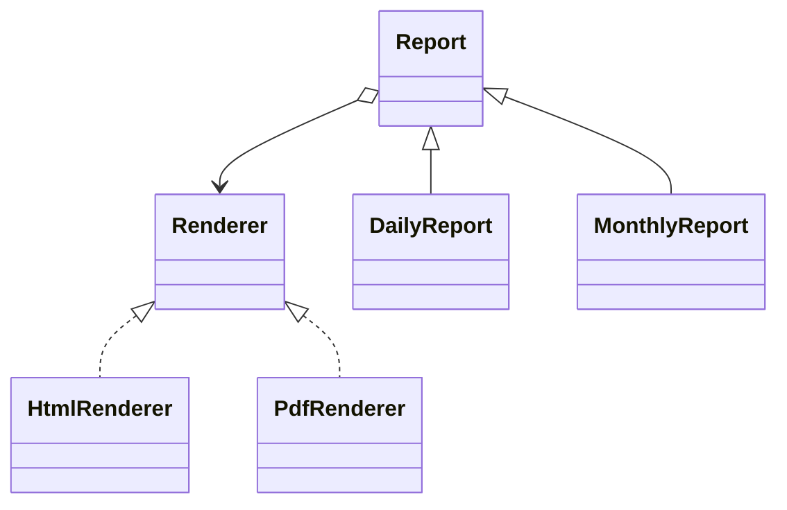

# Patterns estruturais

Patterns estruturais organizam fronteiras e composição. Diagramas parecidos podem esconder intenções distintas: incompatibilidade de interface, eixos independentes, árvore uniforme, responsabilidade adicional, subsistema simplificado, compartilhamento de memória ou controle de acesso.

## O problema que eles resolvem

Conforme um sistema cresce, objetos e componentes precisam colaborar sem que todo consumidor conheça detalhes concretos. O problema não é apenas “organizar classes”, mas controlar **como dependências atravessam fronteiras**.

Exemplos:

- uma API legada usa unidades e erros incompatíveis com o domínio;
- duas dimensões variam e uma hierarquia de subclasses explode;
- uma árvore precisa ser tratada uniformemente;
- logging, cache e retry precisam envolver uma operação;
- um subsistema oferece dezenas de APIs para um caso simples;
- milhões de objetos repetem estado idêntico;
- acesso precisa ser remoto, lazy ou protegido.

Cada força pede um pattern diferente, mesmo quando todos parecem “wrappers” no diagrama.

## Modelo mental: forma não é intenção

Adapter, Decorator e Proxy podem ter a mesma forma externa: um objeto recebe outro e expõe uma interface. A diferença está na razão da indirection.

- **Adapter:** traduz contrato.
- **Decorator:** adiciona responsabilidade.
- **Proxy:** controla acesso/lifecycle/localização.

Nomeie primeiro a força. Se você só olha o diagrama, é fácil escolher pattern errado.

## Guia de decisão

| Força | Pattern | Pergunta diagnóstica |
| --- | --- | --- |
| Interfaces existentes não combinam | Adapter | “Posso traduzir na fronteira?” |
| Dois eixos variam independentemente | Bridge | “Herança criaria produto cartesiano?” |
| Folhas e grupos compartilham operações | Composite | “Cliente pode tratar árvore uniformemente?” |
| Responsabilidades empilháveis | Decorator | “Composição varia por instância?” |
| Entrada simples para subsistema | Facade | “Maioria usa contrato menor?” |
| Estado intrínseco repetido em escala | Flyweight | “Repetição imutável domina memória?” |
| Acesso controlado pelo mesmo contrato | Proxy | “Acesso, localização ou lifecycle é a força?” |

## Adapter

**Intenção:** converter interface existente para contrato esperado. Ex.: `LegacyCarrier.quote(zip, grams)` vira `ShippingRate.price(destination, weight)`.

**Use** em fronteira third-party/legado/protocolo. **Evite** adapter universal que vaza todos os conceitos do fornecedor.

**Trade-offs:** localiza tradução/testes, mas pode esconder perda semântica; valide unidades, erros, timeouts e idempotência. Composição costuma ser mais segura que herança. Anti-Corruption Layer é mais ampla e pode conter vários adapters.

### Failure modes

- centavos convertidos como reais;
- timezone/unidade incorreta;
- erro externo genérico vira erro de negócio;
- campo novo do provider é ignorado silenciosamente;
- retry do adapter duplica efeito externo.

Contract tests com fixtures reais ajudam a proteger a tradução.

## Bridge

**Intenção:** separar abstração da implementação para ambas evoluírem. `Report` delega renderização a `Renderer`, evitando `DailyPdfReport`, `DailyHtmlReport`, `MonthlyPdfReport` etc.

**Use** quando os dois eixos mudam. **Evite** com uma implementação estável.

**Trade-offs:** evita explosão de subclasses e permite escolha runtime, mas coordena duas abstrações.



Bridge só compensa quando os eixos realmente são independentes. Se cada tipo de relatório exige renderer específico, a independência prometida é falsa.

## Composite

**Intenção:** representar árvores parte-todo para que cliente trate folha e grupo igualmente; arquivo e diretório implementam `size()`.

**Use** quando recursão e operação uniforme dominam. **Evite** se invariantes de folha/container tornam API comum desonesta.

**Trade-offs:** algoritmos recursivos elegantes, mas restrições por tipo viram checks runtime. Proteja ciclos/recursão ilimitada e defina ownership dos filhos.

### Performance

Árvores grandes podem transformar operação aparentemente simples em travessia O(n). Cache de agregados pode ajudar, mas introduz invalidação. Meça profundidade, quantidade de nós e frequência de mutação.

## Decorator

**Intenção:** envolver objeto pelo mesmo contrato e adicionar responsabilidades por instância. Um `HttpClient` recebe tracing, retry e metrics.

**Use** quando features combinam. **Evite** quando ordem de wrappers oculta política ou middleware nativo basta.

**Trade-offs:** composição aberta versus muitos objetos, identidade e ordem. Retry fora de metrics mede diferente de metrics fora de retry. Não mude silenciosamente invariantes centrais.

```text
Metrics(Retry(Auth(HttpClient)))
```

A ordem acima é comportamento. Teste-a.

### Risco operacional

Um Decorator de retry pode triplicar carga. Um cache decorator pode servir staleness. Um authorization decorator pode falhar aberto por erro. Pattern estrutural não remove necessidade de política explícita.

## Facade

**Intenção:** expor entrada coesa sobre subsistema complicado. `Checkout.placeOrder()` coordena preço, estoque, pagamento e persistência sem exportar coreografia.

**Use** para estabilizar fronteira/use-case API. **Evite** god object ou ocultar capacidades legítimas.

**Trade-offs:** menor acoplamento para uso comum; facade pode virar gargalo. Prefira várias facades orientadas a tarefa.

Uma facade não precisa possuir toda regra. Ela pode coordenar use cases enquanto domínio permanece em componentes especializados.

## Flyweight

**Intenção:** compartilhar estado **intrínseco** imutável, enquanto caller fornece contexto **extrínseco**. Milhões de posições de glyph compartilham dados da fonte.

**Use** só após profiling provar custo de memória. **Evite** estado mutável/específico ou lookup mais caro que economia.

**Trade-offs:** menos memória/cache pressure versus identidade, serialization e concorrência mais difíceis. Interning/Value Objects são técnicas relacionadas.

### Segurança e isolamento

Estado compartilhado precisa ser realmente imutável. Se um tenant consegue alterar Flyweight usado por outro, a otimização virou vazamento entre contextos.

## Proxy

**Intenção:** representar outro objeto pelo mesmo contrato e controlar acesso. Variantes: remoto, virtual/lazy, proteção e cache.

**Use** quando localização, autorização ou lifecycle caro deve ficar transparente. **Evite** esconder falibilidade da rede atrás de chamada “local”: timeout, cancelamento, retry e falha parcial devem ser explícitos. Decorator adiciona responsabilidade; Proxy governa acesso, mesmo com forma igual.

### Proxy remoto

Uma chamada local pode lançar exceção imediatamente. Uma chamada remota pode timeout depois de o servidor concluir. Portanto, interface idêntica não significa semântica idêntica. Inclua cancelamento, deadlines e erros de outcome desconhecido.

### Protection Proxy

Autorização precisa considerar identidade e recurso, não apenas “tem token”. Falhe fechado quando necessário e audite decisões sensíveis.

## Segurança transversal

Patterns estruturais frequentemente vivem em boundaries, então valide:

- input externo antes da tradução;
- autorização antes de acesso;
- secrets não vazando por facade/log/decorator;
- plugins/implementações allowlisted;
- estado compartilhado sem cross-tenant leakage;
- proxies remotos com TLS/identidade adequados.

## Observabilidade

A indirection pode esconder a origem da latência. Instrumente boundaries:

- Adapter: provider e resultado da tradução;
- Decorator: duração por camada quando necessário;
- Proxy: latência/erro remoto;
- Facade: duração da jornada e componentes;
- Flyweight: hit/miss e memória;
- Composite: nós visitados/profundidade em operações caras.

Não gere spans para cada objeto minúsculo. Observe onde a estrutura muda custo ou failure mode.

## Testes

- Adapter: contract tests com unidades, erros e versões.
- Bridge: combine abstrações e implementações suportadas.
- Composite: folhas/grupos, ciclos e profundidade extrema.
- Decorator: ordem, repetição e preservação de contrato.
- Facade: jornada principal e propagação de erro.
- Flyweight: identidade de estado intrínseco e imutabilidade.
- Proxy: autorização, timeout, retry e cache/lifecycle.

## Exercício comparativo

Num serviço de imagem: loader lazy é **virtual Proxy**, conversão de formato é **Adapter**, watermark é **Decorator** e `MediaService` simplificado pode ser **Facade**. Um sistema pode usar os quatro; cada um deve possuir apenas sua força.

## Laboratório

Construa um pequeno serviço de documentos.

1. Integre um storage legado por Adapter e traduza erros/unidades.
2. Use Facade para expor `publishDocument` sem revelar o subsistema.
3. Adicione metrics e cache como Decorators em uma leitura.
4. Crie Protection Proxy para download privado.
5. Injete timeout no storage remoto e garanta que a API não trate como chamada local infalível.
6. Troque a ordem dos decorators e observe como métricas/cache mudam.
7. Meça memória antes de introduzir Flyweight para metadados repetidos; só mantenha se houver ganho real.
8. Escreva quais patterns removeria se o sistema ficasse menor.

## Anti-patterns

- Adapter que vira cópia completa do provider;
- Decorator cuja ordem é desconhecida;
- Facade como god service;
- Proxy remoto que esconde timeout;
- Flyweight sem profiling;
- Composite com ciclos não controlados;
- Bridge para dois eixos que nunca variam.

## Referências

- [Livro GoF — Pearson](https://www.pearson.com/en-us/subject-catalog/p/design-patterns-elements-of-reusable-object-oriented-software/P200000009480/9780201633610)
- [Refactoring.Guru — estruturais](https://refactoring.guru/design-patterns/structural-patterns)

---

[← Criacionais](creational.md) · [↑ Índice](README.md) · [Comportamentais →](behavioral.md)
