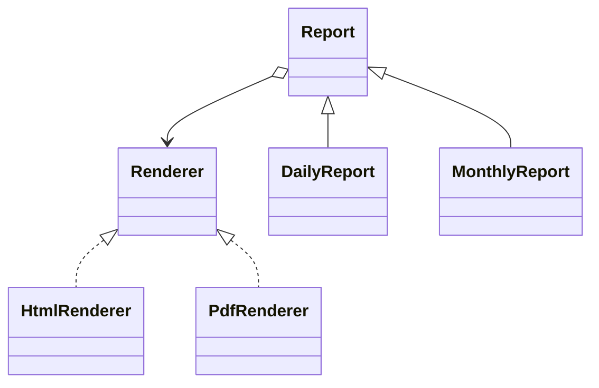

# Patterns estruturais

Patterns estruturais organizam fronteiras e composição. Diagramas parecidos podem esconder intenções distintas: incompatibilidade de interface, eixos independentes, árvore uniforme, responsabilidade adicional, subsistema simplificado, compartilhamento de memória ou controle de acesso.

## Guia de decisão

| Força | Pattern | Pergunta diagnóstica |
| --- | --- | --- |
| Interfaces existentes não combinam | Adapter | “Posso traduzir na fronteira?” |
| Dois eixos variam independentemente | Bridge | “Herança criaria produto cartesiano?” |
| Folhas e grupos compartilham operações | Composite | “Cliente pode tratar árvore uniformemente?” |
| Responsabilidades empilháveis | Decorator | “Composição varia por instância?” |
| Entrada simples para subsistema | Facade | “Maioria usa contrato menor?” |
| Estado intrínseco repetido em escala | Flyweight | “Repetição imutável domina memória?” |
| Acesso controlado pelo mesmo contrato | Proxy | “Acesso, localização ou lifecycle é a força?” |

## Adapter

**Intenção:** converter interface existente para contrato esperado. Ex.: `LegacyCarrier.quote(zip, grams)` vira `ShippingRate.price(destination, weight)`. **Use** em fronteira third-party/legado/protocolo. **Evite** adapter universal que vaza todos os conceitos do fornecedor. **Trade-offs:** localiza tradução/testes, mas pode esconder perda semântica; valide unidades, erros, timeouts e idempotência. Composição costuma ser mais segura que herança. Anti-Corruption Layer é mais ampla e pode conter vários adapters.

## Bridge

**Intenção:** separar abstração da implementação para ambas evoluírem. `Report` delega renderização a `Renderer`, evitando `DailyPdfReport`, `DailyHtmlReport`, `MonthlyPdfReport` etc. **Use** quando os dois eixos mudam. **Evite** com uma implementação estável. **Trade-offs:** evita explosão de subclasses e permite escolha runtime, mas coordena duas abstrações.

## Composite

**Intenção:** representar árvores parte-todo para que cliente trate folha e grupo igualmente; arquivo e diretório implementam `size()`. **Use** quando recursão e operação uniforme dominam. **Evite** se invariantes de folha/container tornam API comum desonesta. **Trade-offs:** algoritmos recursivos elegantes, mas restrições por tipo viram checks runtime. Proteja ciclos/recursão ilimitada e defina ownership dos filhos.

## Decorator

**Intenção:** envolver objeto pelo mesmo contrato e adicionar responsabilidades por instância. Um `HttpClient` recebe tracing, retry e metrics. **Use** quando features combinam. **Evite** quando ordem de wrappers oculta política ou middleware nativo basta. **Trade-offs:** composição aberta versus muitos objetos, identidade e ordem: retry fora de metrics mede diferente. Não mude silenciosamente invariantes centrais.

## Facade

**Intenção:** expor entrada coesa sobre subsistema complicado. `Checkout.placeOrder()` coordena preço, estoque, pagamento e persistência sem exportar coreografia. **Use** para estabilizar fronteira/use-case API. **Evite** god object ou ocultar capacidades legítimas. **Trade-offs:** menor acoplamento para uso comum; facade pode virar gargalo. Prefira várias facades orientadas a tarefa.

## Flyweight

**Intenção:** compartilhar estado **intrínseco** imutável, enquanto caller fornece contexto **extrínseco**. Milhões de posições de glyph compartilham dados da fonte. **Use** só após profiling provar custo de memória. **Evite** estado mutável/específico ou lookup mais caro que economia. **Trade-offs:** menos memória/cache pressure versus identidade, serialization e concorrência mais difíceis. Interning/Value Objects são técnicas relacionadas.

## Proxy

**Intenção:** representar outro objeto pelo mesmo contrato e controlar acesso. Variantes: remoto, virtual/lazy, proteção e cache. **Use** quando localização, autorização ou lifecycle caro deve ficar transparente. **Evite** esconder falibilidade da rede atrás de chamada “local”: timeout, cancelamento, retry e falha parcial devem ser explícitos. Decorator adiciona responsabilidade; Proxy governa acesso, mesmo com forma igual.

## Exercício comparativo

Num serviço de imagem: loader lazy é **virtual Proxy**, conversão de formato é **Adapter**, watermark é **Decorator** e `MediaService` simplificado pode ser **Facade**. Um sistema pode usar os quatro; cada um deve possuir apenas sua força.

## Referências

- [Livro GoF — Pearson](https://www.pearson.com/en-us/subject-catalog/p/design-patterns-elements-of-reusable-object-oriented-software/P200000009480/9780201633610)
- [Refactoring.Guru — estruturais](https://refactoring.guru/design-patterns/structural-patterns)

---

[← Criacionais](creational.md) · [↑ Índice](README.md) · [Comportamentais →](behavioral.md)
