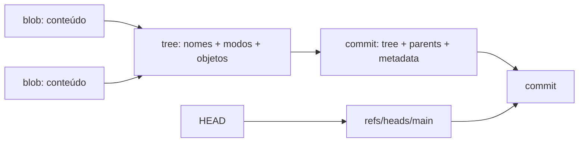

# Git

Git é um sistema distribuído de controle de versões. Seu núcleo é um content-addressed object store; branches e tags são nomes que apontam para objetos. O modelo explica tanto colaboração diária quanto recuperação.

## Modelo mental

Git fica muito mais simples quando você deixa de pensar em “arquivos que mudam” e passa a pensar em **snapshots imutáveis conectados por um grafo de commits**.

Uma branch não contém commits. Ela é apenas um nome mutável que aponta para um commit. Um commit aponta para seu snapshot e para parent(s). `HEAD` indica qual ref ou commit está selecionado.



- **blob:** bytes de um arquivo, sem nome de caminho;
- **tree:** diretório que relaciona nomes/modos a blobs e subtrees;
- **commit:** aponta a uma tree raiz, parent(s) e metadados;
- **ref:** nome mutável para um object ID;
- **HEAD:** ref simbólica da branch atual ou commit direto em detached state;
- **index:** snapshot candidato entre working tree e commit.

Git deduplica conteúdo pelo hash e registra snapshots, embora visualizações possam apresentá-los como diffs.

## Três estados

```text
working tree --git add--> index --git commit--> repository
       ^                    |
       +---- restore -------+
```

Antes de comandos que reescrevem ou descartam, pergunte qual desses estados será alterado e se o objeto continuará alcançável por alguma ref/reflog.

## O que Git garante e o que não garante

Objetos são endereçados pelo conteúdo, então alterar bytes produz outro object ID. Isso ajuda integridade e deduplicação. Commits formam história verificável por hashes e parents.

Mas Git não é automaticamente:

- backup remoto;
- controle de acesso;
- secret manager;
- garantia de autoria sem mecanismos adicionais de assinatura;
- garantia de que um merge textual preserve comportamento;
- substituto para CI/testes.

Um commit pode ser perfeitamente íntegro e ainda conter bug ou segredo.

## Operações essenciais

| Comando | Efeito conceitual | Risco/uso |
| --- | --- | --- |
| `commit` | cria snapshot com parent | mantenha mudança coesa e mensagem causal |
| `branch` | cria/move nome para commit | barato; não copia diretório |
| `merge` | une histórias, às vezes com novo commit | preserva topologia |
| `rebase` | recria commits sobre nova base | muda IDs; evite em história pública compartilhada |
| `cherry-pick` | aplica mudança como novo commit | útil para backport; duplica identidade |
| `revert` | cria commit inverso | preferível para desfazer história publicada |
| `reset` | move ref e opcionalmente index/worktree | `--hard` pode descartar trabalho local |
| `restore` | restaura paths no index/worktree | resolva source/target explicitamente |
| `stash` | commits especiais para estado temporário | não é backup permanente |
| `reflog` | histórico local de movimentos de refs | recuperação após reset/rebase |
| `bisect` | busca binária no grafo | combine com teste determinístico |
| `worktree` | múltiplas working trees no mesmo repositório | paraleliza branches sem stashes |

## Merge versus rebase

Merge preserva a forma da colaboração; rebase lineariza ao recriar commits. Nenhum é moralmente superior. Rebase local pode facilitar revisão; merge em história compartilhada evita invalidar refs de colegas. A política da equipe deve otimizar auditabilidade e fluxo, não estética isolada.

O motivo de rebase mudar IDs é estrutural: o parent faz parte do conteúdo do commit. Colocar o mesmo patch sobre outro parent cria outro commit.

## Conflitos

Conflito significa que Git não consegue inferir a intenção combinada. Leia base, ours e theirs; compile/teste o resultado sem presumir que remover markers basta. Conflitos semânticos podem ocorrer mesmo quando o merge textual é limpo.

Exemplo: uma branch renomeia `maxRetries` para `retryLimit`; outra adiciona lógica usando o nome antigo em arquivo diferente. Git pode unir sem conflito textual e ainda produzir código inconsistente. Por isso teste e revisão continuam necessários.

## Recuperação

1. Pare antes de executar mais comandos destrutivos.
2. Registre `git status` e refs atuais.
3. Consulte `git reflog` para localizar estado anterior.
4. Crie uma branch de resgate apontando ao commit desejado.
5. Compare e só então mova a branch original.

Objetos inalcançáveis podem permanecer até garbage collection; não trate isso como estratégia de backup.

### Exemplo mental de recuperação

Se `main` apontava para `C3` e um `reset --hard C1` moveu a ref, `C2` e `C3` podem deixar de ser alcançáveis pela branch, mas o reflog registra o movimento local por algum tempo. Criar `git branch rescue <sha-de-C3>` torna o commit novamente alcançável.

O princípio é: **primeiro preserve o objeto, depois conserte a ref**.

## Remotes e distribuição

`origin/main` é uma remote-tracking ref local, atualizada por fetch. Ela não é a branch do servidor “ao vivo”. `git fetch` baixa objetos/refs; `git merge` ou `git rebase` decide como integrar.

Isso explica por que `fetch` costuma ser uma operação segura: ela traz informação sem modificar a working branch. `pull` combina fetch com uma estratégia de integração e, por isso, precisa de política clara.

## Performance em repositórios grandes

Git é eficiente por usar objetos e packfiles, mas grandes monorepos ou histórico com binários exigem atenção.

Alguns fatores:

- milhões de paths aumentam custo de status/index;
- arquivos binários grandes não delta-compressam tão bem em todos os cenários;
- histórico enorme aumenta transferência inicial;
- hooks e ferramentas podem dominar o tempo, não o Git em si;
- sparse-checkout e partial clone podem reduzir working set;
- Git LFS pode ser adequado para binários grandes que não pertencem ao object store normal.

Meça antes de culpar “monorepo”. `git status` lento, clone lento e CI lento são problemas diferentes.

## Segurança e supply chain

- revise hooks e configurações de repositórios não confiáveis;
- não versione secrets; removê-los do último commit não revoga nem apaga história;
- assine commits/tags quando provenance exigir;
- fixe Actions e dependências conforme threat model;
- `.gitignore` evita novos arquivos, não deixa de rastrear arquivos já versionados.

Se um segredo foi commitado, trate como incidente: revogue/rotacione primeiro; depois reescreva histórico se necessário. Apagar o arquivo em novo commit não invalida cópias anteriores.

## Observabilidade do fluxo de desenvolvimento

Git também oferece sinais sobre saúde de engenharia:

- frequência de commits/reverts;
- tamanho e tempo de vida de branches;
- conflitos recorrentes por área;
- arquivos que mudam juntos;
- hotspots de mudança.

Esses sinais não devem virar ranking de pessoas. Servem para identificar coupling, ownership confuso e áreas que merecem refatoração.

## Laboratório

Crie um repositório descartável.

1. Faça três commits e desenhe o grafo.
2. Crie branch, altere o mesmo arquivo em duas linhas conflitantes e faça merge.
3. Rebase a branch e compare object IDs antes/depois.
4. Execute `reset --hard` para um commit antigo e recupere o topo via reflog.
5. Faça `revert` de um commit publicado e compare com reset.
6. Use `git cat-file` para inspecionar blob, tree e commit.
7. Rode `git bisect` com um script que detecta uma regressão.
8. Crie uma segunda working tree com `git worktree` e trabalhe em duas branches sem stash.

O objetivo é conseguir prever o efeito de um comando antes de executá-lo.

## Exercícios

- **Beginner:** crie commits e desenhe o grafo após branch/merge.
- **Intermediate:** provoque conflito e explique base/ours/theirs antes de resolver.
- **Advanced:** recupere commit após reset usando reflog e uma branch de resgate.
- **Expert:** automatize `git bisect run` sobre uma regressão intermitente estabilizada.

## Perguntas de entrevista

- Por que editar um arquivo não muda um blob já commitado?
- Quando revert é mais seguro que reset?
- Por que rebase muda commit IDs mesmo se o patch parece igual?
- Como investigar um segredo publicado e quais ações não podem esperar?
- Qual diferença entre `main` e `origin/main`?
- Por que merge limpo ainda pode gerar bug semântico?

## Documentação oficial

- [Pro Git](https://git-scm.com/book/en/v2) — livro oficial e gratuito.
- [Git Reference](https://git-scm.com/docs) — semântica de cada comando.
- [Git internals](https://git-scm.com/book/en/v2/Git-Internals-Plumbing-and-Porcelain)

---

[← Ferramentas](../README.md) · [↑ Ferramentas](../README.md) · [Vim →](../vim/README.md)
