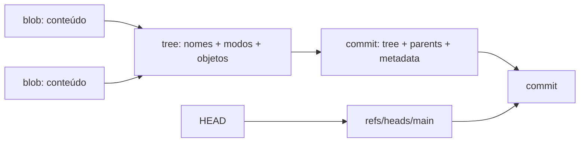

# Git

Git é um sistema distribuído de controle de versões. Seu núcleo é um content-
addressed object store; branches e tags são nomes que apontam para objetos. O
modelo explica tanto colaboração diária quanto recuperação.

## Internals



- **blob:** bytes de um arquivo, sem nome de caminho;
- **tree:** diretório que relaciona nomes/modos a blobs e subtrees;
- **commit:** aponta a uma tree raiz, parent(s) e metadados;
- **ref:** nome mutável para um object ID;
- **HEAD:** ref simbólica da branch atual ou commit direto em detached state;
- **index:** snapshot candidato entre working tree e commit.

Git deduplica conteúdo pelo hash e registra snapshots, embora visualizações
possam apresentá-los como diffs.

## Três estados

```text
working tree --git add--> index --git commit--> repository
       ^                    |
       +---- restore -------+
```

Antes de comandos que reescrevem ou descartam, pergunte qual desses estados
será alterado e se o objeto continuará alcançável por alguma ref/reflog.

## Operações essenciais

| Comando | Efeito conceitual | Risco/uso |
| --- | --- | --- |
| `commit` | cria snapshot com parent | mantenha mudança coesa e mensagem causal |
| `branch` | cria/move nome para commit | barato; não copia diretório |
| `merge` | une histórias, às vezes com novo commit | preserva topologia |
| `rebase` | recria commits sobre nova base | muda IDs; evite em história pública compartilhada |
| `cherry-pick` | aplica mudança como novo commit | útil para backport; duplica identidade |
| `revert` | cria commit inverso | preferível para desfazer história publicada |
| `reset` | move ref e opcionalmente index/worktree | `--hard` pode descartar trabalho local |
| `restore` | restaura paths no index/worktree | resolva source/target explicitamente |
| `stash` | commits especiais para estado temporário | não é backup permanente |
| `reflog` | histórico local de movimentos de refs | recuperação após reset/rebase |
| `bisect` | busca binária no grafo | combine com teste determinístico |
| `worktree` | múltiplas working trees no mesmo repositório | paraleliza branches sem stashes |

## Merge versus rebase

Merge preserva a forma da colaboração; rebase lineariza ao recriar commits.
Nenhum é moralmente superior. Rebase local pode facilitar revisão; merge em
história compartilhada evita invalidar refs de colegas. A política da equipe
deve otimizar auditabilidade e fluxo, não estética isolada.

## Conflitos

Conflito significa que Git não consegue inferir a intenção combinada. Leia base,
ours e theirs; compile/teste o resultado sem presumir que remover markers basta.
Conflitos semânticos podem ocorrer mesmo quando o merge textual é limpo.

## Recuperação

1. Pare antes de executar mais comandos destrutivos.
2. Registre `git status` e refs atuais.
3. Consulte `git reflog` para localizar estado anterior.
4. Crie uma branch de resgate apontando ao commit desejado.
5. Compare e só então mova a branch original.

Objetos inalcançáveis podem permanecer até garbage collection; não trate isso
como estratégia de backup.

## Segurança e supply chain

- revise hooks e configurações de repositórios não confiáveis;
- não versione secrets; removê-los do último commit não revoga nem apaga história;
- assine commits/tags quando provenance exigir;
- fixe Actions e dependências conforme threat model;
- `.gitignore` evita novos arquivos, não deixa de rastrear arquivos já versionados.

## Exercícios

- **Beginner:** crie commits e desenhe o grafo após branch/merge.
- **Intermediate:** provoque conflito e explique base/ours/theirs antes de resolver.
- **Advanced:** recupere commit após reset usando reflog e uma branch de resgate.
- **Expert:** automatize `git bisect run` sobre uma regressão intermitente estabilizada.

## Perguntas de entrevista

- Por que editar um arquivo não muda um blob já commitado?
- Quando revert é mais seguro que reset?
- Por que rebase muda commit IDs mesmo se o patch parece igual?
- Como investigar um segredo publicado e quais ações não podem esperar?

## Documentação oficial

- [Pro Git](https://git-scm.com/book/en/v2) — livro oficial e gratuito.
- [Git Reference](https://git-scm.com/docs) — semântica de cada comando.
- [Git internals](https://git-scm.com/book/en/v2/Git-Internals-Plumbing-and-Porcelain)

---

[← Ferramentas](../README.md) · [↑ Ferramentas](../README.md) · [Vim →](../vim/README.md)
