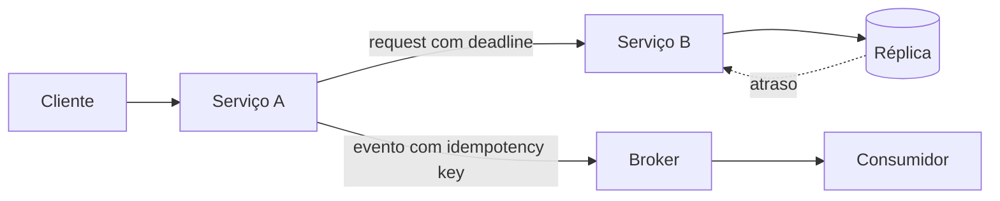

# Sistemas distribuídos

Um sistema distribuído é um conjunto de processos independentes que coopera por mensagens enquanto relógios, rede e nós podem falhar de forma parcial. O desafio central não é “escalar”, mas raciocinar sobre conhecimento incompleto.

## Mapa

| Guia | Foco |
| --- | --- |
| [Fundamentos](fundamentals.md) | tempo, falhas, modelos de consistência e impossibilidades |
| [Padrões de resiliência](resilience-patterns.md) | timeout, retry, idempotência, backpressure e isolamento |
| [Consenso e coordenação](consensus.md) | quorum, leader election, Raft e limites |
| [Exercícios](exercises.md) | laboratórios progressivos com fault injection |

## Um mapa de causalidade

Em cada seta pergunte: pode perder, duplicar, reordenar, atrasar ou entregar depois do timeout? Em cada estado: quem é autoridade, como converge e como reparar?

## Vocabulário operacional

- **safety:** algo ruim nunca ocorre, como dois líderes efetivos na mesma época;
- **liveness:** algo bom eventualmente ocorre, sob hipóteses declaradas;
- **quorum:** subconjunto cuja interseção cria informação comum;
- **linearizabilidade:** operações parecem instantâneas e respeitam tempo real;
- **serializabilidade:** transações equivalem a alguma ordem serial;
- **idempotência:** repetir com a mesma identidade não repete o efeito lógico;
- **backpressure:** consumidor limita trabalho aceito, evitando fila/memória ilimitada.

## Processo de design

1. Defina SLO, volume, geografia, RTO/RPO e invariantes.
2. Desenhe trust, failure e consistency boundaries.
3. Faça orçamento de deadline e capacidade por hop.
4. Declare semântica de entrega, ordering e deduplicação.
5. Modele degradação e recuperação; só então o caminho feliz.
6. Teste com latência, partição, crash, clock skew e retry storm.

## Anti-patterns

- retry automático em todas as camadas, multiplicando carga;
- timeout maior que o deadline do caller;
- “exactly once” sem delimitar fronteira e efeitos externos;
- lock distribuído sem lease, fencing e falha do holder;
- health check que apenas responde `200` enquanto dependências saturam;
- fila ilimitada que transforma sobrecarga em latência e colapso tardio.

## Consistência entre serviços e dados

- **Saga:** sequência de transações locais com ações compensatórias; choreography ou orchestration.
- **Outbox:** grava mudança e mensagem na mesma transação; relay pode duplicar publicação.
- **Inbox:** registra identidade e efeito no consumidor para tolerar redelivery.
- **CDC:** transforma log de mudanças em stream, com schema/lifecycle governados.
- **Transação distribuída/2PC:** atomicidade coordenada entre participantes compatíveis, pagando locks, coordenação e disponibilidade.

Esses padrões não são equivalentes. Saga modela workflow de negócio; outbox/inbox fecham janelas de persistência/entrega; CDC replica mudanças; 2PC coordena commit. Detalhes e falhas estão em [Padrões de resiliência](resilience-patterns.md).

## Leituras fundamentais

- van Steen & Tanenbaum. [*Distributed Systems*, 4ª ed.](https://www.distributed-systems.net/index.php/books/ds4/).
- Kleppmann & Riccomini. [*Designing Data-Intensive Applications*, 2ª ed.](https://www.oreilly.com/library/view/designing-data-intensive-applications/9781098119058/).
- Lamport. [Time, Clocks, and the Ordering of Events](https://lamport.azurewebsites.net/pubs/time-clocks.pdf).
- Fischer, Lynch & Paterson. [Impossibility of Distributed Consensus with One Faulty Process](https://groups.csail.mit.edu/tds/papers/Lynch/jacm85.pdf).

---

[← Arquitetura](../architecture/README.md) · [↑ Início](../README.md) · [Fundamentos →](fundamentals.md)
