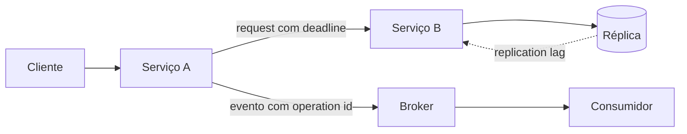

# Sistemas distribuídos

Um sistema distribuído é um conjunto de processos independentes que coopera por
mensagens enquanto relógios, rede e nós podem falhar de forma parcial. O desafio
central não é simplesmente “escalar”. É tomar decisões corretas quando cada
participante possui apenas uma visão incompleta e potencialmente atrasada do
estado global.

Esta área deve mudar a forma de pensar: falha de rede deixa de ser exceção rara e
passa a fazer parte do modelo normal do sistema.

## Problema central: conhecimento incompleto

Considere uma API que chama outro serviço e recebe timeout. O caller não sabe se:

- request nunca chegou;
- request chegou e falhou antes do efeito;
- efeito aconteceu e resposta se perdeu;
- efeito aconteceu e servidor apenas está lento.

Essa ambiguidade parece pequena, mas explica por que sistemas distribuídos
precisam de idempotência, deadlines, reconciliation e state machines explícitas.

## Modelo mental

Para cada sistema, desenhe quatro coisas:

```text
processos + canais + estado durável + autoridades
```

Depois pergunte, para cada seta:

- pode atrasar?
- pode perder?
- pode duplicar?
- pode reordenar?
- pode entregar depois do timeout?

E, para cada estado:

- quem pode alterar?
- quem é fonte de verdade?
- qual versão é atual?
- como reparar divergência?

## Mapa de estudos

| Guia | Foco |
| --- | --- |
| [Fundamentos](fundamentals.md) | tempo, falhas, consistência, replicação e impossibilidades |
| [Padrões de resiliência](resilience-patterns.md) | deadline, retry, idempotência, overload e recovery |
| [Consenso e coordenação](consensus.md) | quorum, leader election, Raft, leases e fencing |
| [Exercícios](exercises.md) | laboratórios progressivos com fault injection |

## Um mapa de causalidade



Esse diagrama já contém várias perguntas de engenharia:

- A pode repetir a chamada a B?
- B é idempotente?
- a réplica pode retornar estado stale?
- o broker pode redeliver?
- o consumer pode cair após o efeito e antes do ack?
- qual deadline sobrevive à cadeia?

## Safety e liveness

### Safety

Propriedade que nunca deve ser violada.

Exemplos:

- um assento não é confirmado para duas pessoas;
- uma versão antiga de leader não sobrescreve dados novos;
- débito não é aplicado duas vezes para a mesma operação lógica.

### Liveness

Propriedade de progresso eventual sob hipóteses.

Exemplos:

- uma mensagem válida eventualmente é processada;
- um novo leader é eleito quando quorum saudável existe;
- backlog eventualmente volta ao SLO depois de recovery.

Durante uma partição, pode ser correto sacrificar progresso para preservar safety.

## Falhas parciais

Em processo único, crash costuma ser evidente. Em distribuição, um componente pode
falhar enquanto outros continuam.

Exemplos:

- banco responde, broker não;
- região A está saudável, link A↔B caiu;
- serviço está vivo, pool de conexões esgotou;
- consumer processa, mas ack se perde;
- DNS aponta para endereço antigo.

Projetar apenas “tudo funciona” e “tudo caiu” ignora a maior parte dos incidentes
reais.

## Tempo e clocks

Wall clock não cria verdade global. Máquinas podem divergir ou sofrer ajustes.

Use:

- monotonic clock para duração/deadline;
- wall clock para data/auditoria;
- logical clocks quando causalidade importa.

Não decida ownership apenas com “timestamp mais recente” se clocks não são parte
de uma garantia formal.

## Replicação

Replicação adiciona cópias para tolerância, leitura ou geografia. Ela também cria
lag e conflito.

Pergunte:

- quando write é considerado committed?
- quantas cópias precisam persistir?
- read pode vir de réplica?
- quanto stale é aceitável?
- failover pode perder write já confirmado?

“Tem três réplicas” não responde nada disso.

## Consistency por operação

Não classifique sistema inteiro como “forte” ou “eventual” sem necessidade.

Um produto pode usar:

- linearizable allocation para estoque;
- read-your-writes para perfil;
- eventual consistency para feed;
- stale cache para catálogo;
- append-only log para eventos.

A garantia deve acompanhar a invariante.

## CAP e geografia

CAP descreve trade-off durante partição sob modelo específico. PACELC lembra que,
mesmo sem partição, consistência forte entre regiões cobra latência.

Por isso, multi-region é decisão de produto e operação:

- usuários precisam write local?
- conflito é aceitável?
- RPO/RTO?
- custo de egress?
- compliance permite replicar dados?

## Quorum

Quorum cria interseção entre grupos de participantes. Em consenso, maioria evita
dois grupos disjuntos decidirem independentemente sob as regras do protocolo.

Quorum não significa “mais da metade = sempre correto” para qualquer banco. A
semântica depende de protocol, versioning e failure model.

## Leader election e fencing

Eleger leader não basta. Um leader antigo pode pausar, perder lease e voltar.

Para efeitos externos, use term/epoch/fencing token que o recurso protegido
consiga rejeitar quando stale.

Sem fencing, distributed lock pode permitir dois writers válidos ao mesmo tempo.

## Entrega de mensagens

### At-most-once

Evita repetição observada, mas pode perder.

### At-least-once

Tenta garantir entrega, aceitando duplicidade.

### Exactly-once

Sempre delimitado a uma fronteira. Broker não controla todo efeito externo.

O design prático normalmente combina at-least-once com efeito idempotente.

## Idempotência

Idempotência é propriedade da **operação lógica**, não da tentativa.

Use operation ID estável:

```text
operation_id = checkout-42-payment-1
```

Persista a identidade junto ao resultado/efeito. Retry com a mesma identidade
retorna ou confirma o mesmo resultado.

## Outbox

Outbox resolve dual write entre banco local e publicação.

Na mesma transação:

```text
UPDATE business_state
INSERT outbox_event
COMMIT
```

Relay publica depois. Ele pode publicar duas vezes, portanto consumer continua
precisando idempotência.

## Inbox

Inbox registra event/message ID junto ao efeito local do consumidor.

Isso fecha a janela:

```text
efeito commitado → processo cai → ack não enviado → redelivery
```

## Saga

Saga coordena transações locais em workflow maior.

Compensação não é rollback temporal. É outra ação de negócio que também pode
falhar.

Exemplo:

```text
reserve inventory
→ authorize payment
→ confirm order
```

Se confirmação falha, talvez seja necessário liberar reserva e estornar
autorização.

## 2PC

Two-phase commit oferece atomicidade entre participantes compatíveis, ao custo de
coordenação, locks e failure recovery.

Não é universalmente proibido. Também não deve ser usado para esconder boundary
que deveria ser redesenhado.

## Backpressure

Quando producer é mais rápido que consumer por tempo suficiente, backlog cresce.

Fila não cria throughput. Ela apenas desloca o tempo do trabalho.

Meça:

- arrival rate;
- processing rate;
- queue depth;
- idade da mensagem mais antiga;
- saturation;
- recovery time.

Autoscaling precisa responder a capacidade real, não apenas “tem muitas
mensagens”.

## Overload

Sistemas frequentemente falham por lentidão antes de crash.

Uma dependência fica 10x mais lenta:

1. requests permanecem em voo;
2. pools enchem;
3. filas crescem;
4. timeouts disparam;
5. retries adicionam carga;
6. caller também satura.

Use deadline, concurrency limit, bounded queues e load shedding.

## Retry budget

Retry é tráfego novo. Limite o quanto ele pode amplificar o volume normal.

Uma política madura define:

- quais erros são transitórios;
- máximo de tentativas;
- backoff/jitter;
- deadline restante;
- budget global.

## Tail latency

Em uma jornada com muitas dependências, o componente mais lento domina p99.

Fan-out amplo aumenta chance de ao menos uma chamada cair na cauda. Soluções
incluem:

- reduzir chamadas críticas;
- pré-computar;
- cache;
- async;
- hedging controlado para leitura.

## Particionamento

Distribuir dados por chave aumenta paralelismo, mas cria hot key e operações
cross-partition.

Escolha partition key a partir de:

- access pattern;
- cardinalidade;
- distribuição;
- ordering necessário;
- crescimento.

## Rebalance e headroom

Recovery exige capacidade extra. Se cluster opera constantemente a 95%, perder
um nó pode tornar impossível redistribuir carga sem nova saturação.

Reserve headroom para:

- failover;
- replay;
- rebuild;
- deploy;
- backfill.

## Cache em sistema distribuído

Cache introduz segunda representação do estado.

Defina:

- TTL;
- invalidation;
- stale policy;
- stampede control;
- tenant isolation.

Cache inconsistente pode ser aceitável para catálogo e inaceitável para saldo.

## Disaster Recovery

Replicação online e backup são mecanismos diferentes.

Replicação pode copiar corrupção/deleção imediatamente. Backup permite retornar a
um ponto anterior.

Defina:

- RPO;
- RTO;
- restore procedure;
- quem declara desastre;
- failback.

Teste restore. Backup nunca restaurado é uma suposição.

## Geografia e multi-region

Arquitetura multi-region precisa responder:

- active/active ou active/passive?
- write authority?
- failover automático ou manual?
- conflict resolution?
- data residency?
- quorum atravessa regiões?

Active/active pode reduzir latência local e aumentar complexidade de consistência.

## Observabilidade

Uma investigação distribuída precisa reconstruir causalidade.

Sinais:

- request/operation ID;
- trace context;
- attempt number;
- deadline restante;
- partition/shard;
- leader/term;
- replication lag;
- queue age;
- retry rate;
- circuit state;
- SLO burn.

Métricas por componente sem visão da jornada deixam incidentes mais lentos.

## Segurança

Cada hop é trust boundary potencial.

Modele:

- workload identity;
- authorization;
- replay protection;
- secrets;
- encryption;
- tenant isolation;
- data classification;
- audit.

Não confie em “rede interna”. Serviço comprometido dentro da rede continua sendo
atacante.

## Processo de design

1. Defina usuário e resultado.
2. Escreva invariantes.
3. Defina SLO, volume e geografia.
4. Identifique estado e autoridade.
5. Declare consistency/delivery semantics.
6. Faça budget de deadline/capacidade.
7. Desenhe failure paths antes dos produtos.
8. Planeje recovery e reconciliation.
9. Modele segurança.
10. Instrumente.
11. Injete falhas.
12. Registre trade-offs em ADR.

## Trade-offs recorrentes

### Consistency versus latency

Coordenação forte pode aumentar RTT.

### Availability versus safety durante partition

Algumas operações precisam rejeitar para não violar invariante.

### Throughput versus ordering

Mais paralelismo pode reduzir ordem global.

### Simplicidade versus autonomia

Mais serviços podem dar ownership e aumentar custo operacional.

### Freshness versus custo

Replicar/indexar tudo imediatamente é caro; aceitar lag pode simplificar.

Não existe combinação universalmente ótima.

## Anti-patterns

- retry automático em todas as camadas;
- timeout maior que deadline;
- exactly-once sem fronteira;
- distributed lock sem fencing;
- health check `200` com pool saturado;
- fila ilimitada;
- timestamp como autoridade global;
- active/active sem conflito definido;
- backup não testado;
- cache stale usado para decisão crítica;
- “eventual consistency” sem SLA.

## Laboratório obrigatório: timeout ambíguo

Crie serviço A chamando B. B persiste efeito e aguarda antes de responder. Corte a
conexão após commit.

A deve receber timeout enquanto efeito existe.

Depois implemente operation ID + status query e prove recovery sem duplicação.

## Laboratório: retry storm

1. limite B a pequena concorrência;
2. aumente sua latência;
3. configure retry imediato em A;
4. observe amplificação;
5. substitua por deadline, backoff, jitter e budget.

Compare throughput e p99.

## Laboratório: stale replica

Implemente leader/follower ou use banco de laboratório. Atrase replicação e faça
read após write.

Teste políticas:

- sempre follower;
- leader para read-your-writes;
- wait for version;
- stale explícito.

## Laboratório: partição

Divida dois componentes. Antes de executar, escreva comportamento esperado:

- rejeita write?
- serve stale?
- aceita conflito?

Depois compare com realidade.

## Projeto de síntese

Construa processamento de pedidos com:

1. API idempotente;
2. banco transacional;
3. outbox;
4. broker;
5. consumer idempotente;
6. read model;
7. retry budget;
8. DLQ;
9. reconciliation;
10. SLO;
11. fault injection;
12. runbook.

Injete falha em cada fronteira e produza tabela:

| Falha | Estado durável | Sintoma | Recovery | Garantia preservada |
| --- | --- | --- | --- | --- |

O projeto termina quando você consegue prever o estado possível antes de rodar o
experimento.

## Critério de conclusão

Você está pronto para avançar quando consegue olhar uma seta em um diagrama e
perguntar automaticamente:

- qual semântica de falha?
- qual identidade?
- qual deadline?
- qual consistency?
- qual recovery?
- qual observabilidade?

## Leituras fundamentais

- van Steen & Tanenbaum. [*Distributed Systems*, 4ª ed.](https://www.distributed-systems.net/index.php/books/ds4/).
- Kleppmann & Riccomini. [*Designing Data-Intensive Applications*, 2ª ed.](https://www.oreilly.com/library/view/designing-data-intensive-applications/9781098119058/).
- Lamport. [Time, Clocks, and the Ordering of Events](https://lamport.azurewebsites.net/pubs/time-clocks.pdf).
- Fischer, Lynch & Paterson. [Impossibility of Distributed Consensus with One Faulty Process](https://groups.csail.mit.edu/tds/papers/Lynch/jacm85.pdf).

---

[← Arquitetura](../architecture/README.md) · [↑ Início](../README.md) · [Fundamentos →](fundamentals.md)
