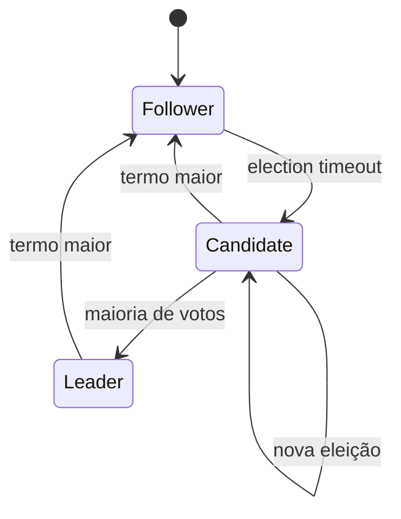

# Consenso e coordenação

Consenso resolve um problema específico: permitir que participantes concordem
sobre uma decisão mesmo quando mensagens atrasam, processos reiniciam e alguns
nós deixam de responder. O objetivo não é “deixar tudo distribuído mais seguro”.
É preservar propriedades de acordo quando uma decisão precisa ser compartilhada.

Consenso aparece em logs replicados, configuration stores, leader election,
metadata de clusters e serviços que precisam de uma ordem comum de operações.
Colocá-lo no caminho de toda decisão de domínio sem necessidade aumenta latência,
complexidade operacional e dependência de quorum.

## Modelo mental: separar segurança de progresso

Protocolos de consenso normalmente perseguem duas classes de propriedade:

- **safety:** participantes corretos não decidem valores incompatíveis;
- **liveness:** o sistema eventualmente progride quando as condições necessárias
  voltam a existir.

Essa separação é essencial. Durante uma partição, um cluster pode preferir parar
de escrever para preservar safety. Isso não significa que “o consenso falhou”.
Pode ser exatamente o comportamento correto.

## Hipóteses importam

Nenhum protocolo existe sem hipóteses sobre:

- quais falhas são consideradas: crash, perda de mensagem, Byzantine etc.;
- persistência local;
- conectividade eventual;
- clocks e timeouts usados apenas para progresso;
- número de participantes que pode falhar;
- identidade/autenticação dos nós.

Antes de dizer “tem consenso”, diga sob qual modelo de falha.

## Intuição do FLP

Em um sistema completamente assíncrono, não existe limite conhecido para atraso
de mensagens ou execução de processos. Nesse modelo, um processo lento é
indistinguível de um processo parado. O resultado clássico de FLP mostra que um
algoritmo determinístico de consenso tolerante a uma falha por crash não consegue
garantir termination em todas as execuções possíveis.

Sistemas reais contornam isso assumindo algum grau de sincronismo eventual:
timeouts e failure detectors ajudam a escolher líderes e tentar novamente. Esses
timeouts não provam que um nó morreu; são mecanismos de progresso.

## Raft como modelo operacional

Raft organiza o protocolo em três papéis:

- follower;
- candidate;
- leader.



O tempo é dividido em **terms**. Cada term tem no máximo um líder válido.
Followers esperam heartbeats; ausência por election timeout permite candidatura.
O candidato incrementa term, vota em si e pede votos.

Election timeout costuma ser randomizado para reduzir eleições simultâneas.
Heartbeat frequente demais desperdiça recursos; lento demais aumenta tempo de
detecção e failover.

## Persistência antes da resposta

Estado crítico como current term, voto e entradas do log precisa seguir as regras
de persistência do protocolo. Responder antes de tornar estado durável pode quebrar
safety após crash/restart.

Isso é uma diferença importante entre “algoritmo no quadro” e implementação real:
fsync, storage latency, corrupção e recovery fazem parte da garantia.

## Replicação do log

O líder recebe comandos, anexa entradas e replica para followers. Cada entrada
carrega term e index. Followers verificam o prefixo esperado antes de aceitar.

A propriedade de log matching faz com que logs que compartilham index/term
compatível compartilhem o prefixo relevante. Se um follower divergiu, o líder
retrocede até encontrar ponto comum e corrige o sufixo.

Não basta “a maioria recebeu”. As regras de commit de Raft consideram term e
posição para evitar que uma entrada antiga seja considerada segura de forma
incorreta após troca de liderança.

## Commit e aplicação à state machine

Uma entrada só deve ser aplicada à state machine quando está committed segundo o
protocolo. Todos os nós corretos aplicam entradas committed na mesma ordem, o que
permite construir uma replicated state machine determinística.

Se a state machine possui comportamento não determinístico, como ler horário
local ou random sem registrar a decisão no log, réplicas podem divergir mesmo com
consenso perfeito sobre as entradas.

## Quorum

Quorum funciona porque maiorias se intersectam. Em um cluster de `N=3`, quorum é
2. Dois quorums de tamanho 2 compartilham pelo menos um nó.

Com cinco nós, quorum é 3 e o sistema tolera dois nós indisponíveis para progresso,
desde que os três restantes consigam se comunicar.

Mas topologia física importa.

### Exemplo de zonas

Três nós distribuídos `2 + 1` em duas zonas toleram perda da zona com um nó, mas
não da zona com dois. “Três réplicas” não implica tolerância simétrica a qualquer
falha de zona.

Planeje placement a partir do failure domain real.

## Quorum não é consistência automática para qualquer operação

Um banco com `W + R > N` pode obter interseção entre escrita e leitura, mas ainda
há detalhes:

- versões concorrentes;
- clocks;
- hinted handoff;
- sloppy quorum;
- leitura de nós stale;
- failure detection;
- semântica específica do sistema.

Não reduza consistência distribuída a uma fórmula isolada.

## Linearizable reads

Um líder pode estar isolado e ainda acreditar temporariamente que é líder. Para
responder leitura linearizável, a implementação precisa confirmar que ainda possui
a autoridade necessária, por exemplo através de quorum/lease segura ou mecanismo
específico do protocolo.

Uma leitura local no líder antigo pode retornar estado stale mesmo que todas as
escritas committed estejam corretas.

## Leases e clocks

Lease atribui autoridade por uma janela de tempo. Isso exige muito cuidado com
clocks e pauses.

Um holder pode sofrer:

- GC pause;
- suspensão de VM;
- scheduler starvation;
- partition.

Ao voltar, ele pode acreditar que ainda possui recurso enquanto outro owner já
recebeu nova lease.

Por isso, para efeitos externos, use **fencing token** monotônico.

## Fencing tokens

Cada aquisição recebe token crescente:

```text
owner A → token 41
lease expira
owner B → token 42
```

O recurso protegido rejeita qualquer operação com token menor que o maior já
observado. Assim, quando A retorna e tenta escrever com 41, a escrita é rejeitada.

Sem validação no recurso, o distributed lock não consegue impedir um holder antigo
de continuar agindo.

## Leader election não é autorização eterna

Leader election apenas determina quem possui papel em certo período/term. Toda
operação precisa estar associada à autoridade atual.

Um erro comum é eleger líder via sistema externo e depois permitir que o líder
faça efeitos indefinidamente sem term/fencing. Em failover, dois processos podem
agir simultaneamente.

## Membership changes

Trocar membros do cluster é delicado porque uma mudança ingênua pode permitir
maiorias disjuntas.

Protocolos seguros usam transição controlada, como joint consensus em Raft, para
que configurações antiga e nova se sobreponham durante a mudança.

Operacionalmente, membership change precisa considerar:

- bootstrap de novo nó;
- transferência de snapshot;
- lag;
- remoção de nó morto;
- automação que não remova múltiplos membros simultaneamente.

## Snapshots e compaction

Log cresce indefinidamente se nada for compactado. Snapshot materializa estado até
um índice/term e permite descartar entradas antigas conforme as regras do sistema.

Riscos:

- snapshot corrompido;
- instalação parcial;
- incompatibilidade de versão;
- snapshot tão grande que bloqueia recovery;
- compaction removendo evidência necessária à aplicação.

Teste criação e restauração. Snapshot não é “backup” automaticamente; geralmente
é mecanismo de operação do protocolo.

## Paxos em perspectiva

Paxos e Raft resolvem família semelhante de problemas, com abstrações diferentes.
Paxos é frequentemente apresentado por proposers, acceptors e learners. Multi-
Paxos otimiza sequência de decisões usando liderança estável.

O ponto de estudo não é decorar mensagens, e sim entender:

- por que quorums precisam se intersectar;
- como valores previamente aceitos influenciam novas propostas;
- por que mudança de liderança não pode esquecer decisões anteriores.

## Gossip não é consenso

Gossip dissemina membership ou estado por trocas periódicas. Ele converge bem e
remove coordenador central, mas permite informação temporariamente stale.

Use gossip para descoberta, health dissemination e metadata tolerante a atraso.
Não use como substituto de decisão única quando duas decisões conflitantes seriam
incorretas.

## Consistent hashing não é consenso

Consistent hashing reduz remapeamento de chaves ao mudar membros. Virtual nodes e
weights ajudam distribuição.

Ele decide **onde uma chave deveria ir**, não qual valor é verdadeiro nem quem é
líder. Membership incorreto pode fazer dois clientes calcularem destinos
diferentes.

## Quando não usar consenso

Evite consenso adicional quando o problema pode ser resolvido por:

- particionamento determinístico;
- single writer natural;
- fila que já oferece ownership;
- conditional update na fonte de verdade;
- tolerância a duplicidade;
- coordenação best-effort;
- CRDT/merge quando conflitos podem ser reconciliados.

Cada nova dependência de quorum reduz o conjunto de falhas em que existe progresso.

## Performance e capacidade

O caminho de escrita de um log replicado costuma incluir:

1. entrada chega ao líder;
2. líder persiste localmente;
3. envia para followers;
4. quorum persiste/acknowledges;
5. entrada torna-se committed;
6. state machine aplica.

Latência depende de storage e RTT até quorum, não apenas CPU.

Meça:

- commit latency p50/p95/p99;
- fsync latency;
- replication lag por follower;
- election count;
- heartbeat RTT;
- log size;
- snapshot duration;
- apply lag;
- requests rejeitadas por ausência de leader/quorum.

Cross-region quorum pode aumentar durabilidade/failure tolerance e também colocar
RTT inter-regional no caminho crítico.

## Observabilidade

Um dashboard de consenso deve responder:

- quem é o líder atual?
- qual term/epoch?
- quantos membros estão healthy?
- existe quorum?
- qual follower está atrasado?
- houve election storm?
- commit index avança?
- state machine apply acompanha commit?
- snapshot/recovery está preso?

Logs precisam incluir term, index, peer e reason de mudança de estado.

## Segurança

Se um atacante consegue se passar por membro, votar, replicar ou alterar
membership, a hipótese do protocolo quebra.

Proteja:

- identidade mútua entre peers;
- autorização de membership change;
- criptografia de transporte quando necessário;
- secrets/certificados de curta duração e rotação;
- integridade do storage local;
- endpoints administrativos.

Protocolos crash-fault tolerant não protegem contra nós Byzantine arbitrários.
Esse é outro modelo de falha.

## Modos de falha

### Election storm

Sintomas: líder muda repetidamente, throughput despenca, latency cresce.

Causas possíveis:

- election timeout baixo;
- GC pauses;
- packet loss;
- CPU starvation;
- storage lento;
- assimetria de rede.

### Follower muito atrasado

Pode exigir snapshot em vez de replay de log enorme. Investigue rede, disco e
capacidade de aplicação.

### Perda de quorum

Escrita deve parar se safety exigir. Não “force leader” sem entender risco de
split brain e histórico divergente.

### Split brain aparente no cliente

Dois processos podem se anunciar como leader temporariamente, mas apenas um deve
conseguir produzir efeitos válidos se term/quorum/fencing forem respeitados.

## Testes

Teste o protocolo e a operação:

- atraso/reordenação de mensagens;
- perda de pacote;
- crash antes/depois de persistir voto;
- restart com log parcial;
- leader isolado;
- follower lento;
- perda de maioria;
- snapshot durante carga;
- mudança de membership;
- clock jump para componentes que usam lease;
- disk full/corruption conforme tolerância esperada.

Property/model-based testing é especialmente útil porque o espaço de interleavings
é grande.

## Laboratório progressivo

### Beginner

Simule eleição em três nós com election timeouts diferentes. Registre term e voto.

### Intermediate

Implemente log simplificado e force divergência após leader crash. Faça o novo
líder reconciliar o follower.

### Advanced

Pause o líder, permita eleição de outro e retome o antigo. Use term/fencing para
impedir efeito stale.

### Expert

Execute cinco nós em três failure domains. Injete perda de zona, latência, disk
slow e election storm. Defina SLO de commit, runbook de perda de quorum, processo
de membership change e recovery por snapshot.

## Projeto de síntese

Construa um configuration store mínimo:

1. log replicado;
2. key/value state machine determinística;
3. write via leader;
4. read com semântica claramente documentada;
5. snapshot;
6. membership change controlado;
7. métricas de term/index/lag;
8. testes de partição;
9. fencing para um worker externo eleito pelo store.

Não use o projeto para “reinventar etcd em produção”. Use-o para tornar as
propriedades observáveis.

## Critério de conclusão

Você domina o tema quando consegue distinguir:

- safety de availability;
- timeout de prova de falha;
- leader election de exclusão efetiva;
- quorum de consistência de domínio;
- snapshot operacional de backup;
- disseminação por gossip de decisão por consenso.

## Referências primárias

- Ongaro & Ousterhout. [In Search of an Understandable Consensus Algorithm](https://raft.github.io/raft.pdf).
- Lamport. [Paxos Made Simple](https://lamport.azurewebsites.net/pubs/paxos-simple.pdf).
- Chandra, Griesemer & Redstone. [Paxos Made Live](https://research.google/pubs/pub33002).

---

[← Resiliência](resilience-patterns.md) · [↑ Sistemas distribuídos](README.md) · [Exercícios →](exercises.md)
