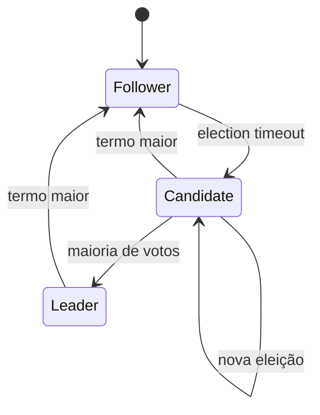

# Consenso e coordenação

Consenso faz participantes não faltosos escolherem o mesmo valor, preservando agreement e validity e buscando termination sob hipóteses. Ele sustenta configuration stores, leader election e logs replicados; não deve estar no caminho de cada decisão de domínio sem necessidade.

## Raft como modelo

Raft replica um log por termos. Followers recebem heartbeats; ausência dispara candidatura. Uma maioria elege líder. O líder anexa entradas e as considera committed quando replicadas conforme as regras do protocolo; followers aplicam a state machine na ordem.

Termos funcionam como epochs/fencing. Log matching e restrição de commit evitam histórias divergentes. Membership change requer protocolo seguro; simplesmente trocar lista pode formar maiorias disjuntas.

## Quorum e disponibilidade

Com `N=3`, maioria tolera um nó indisponível; perder maioria impede progresso seguro. Distribuir três nós por duas zonas não tolera perda de qualquer zona simetricamente. Quorum não elimina latência nem necessidade de snapshot/compaction.

## Locks distribuídos

Lease expira, mas holder pausado pode continuar agindo. Um fencing token monotônico deve ser rejeitado pelo recurso se antigo. Se o recurso não valida o token, exclusão é apenas esperança. Para dinheiro/inventário, prefira conditional update/transaction na autoridade.

## Quando não usar

- eleição que pode ser evitada por particionamento determinístico;
- fila que já fornece consumer ownership;
- cache ou coordenação best-effort sem risco relevante;
- tentativa de tornar transação multi-serviço “simples”.

## Gossip e consistent hashing

Gossip dissemina membership/estado por trocas periódicas, convergindo sem coordenador único; informações podem estar stale e failure detectors são suspeitas, não fatos. Consistent hashing coloca nós/keys em anel (ou variantes) e reduz remapeamento ao mudar membros; virtual nodes/weights melhoram balanço. Ambos ajudam membership/routing, mas não fornecem consenso nem consistência de dados por si sós.

## Exercícios

1. Simule eleições Raft em cinco nós com mensagens atrasadas e termos.
2. Calcule tolerância e latência para 3/5 réplicas em três regiões.
3. Demonstre um lock sem fencing corrompendo um arquivo após pausa longa.
4. Leia uma implementação real e mapeie persistência, snapshot, membership e métricas.

## Referências primárias

- Ongaro & Ousterhout. [In Search of an Understandable Consensus Algorithm](https://raft.github.io/raft.pdf).
- Lamport. [Paxos Made Simple](https://lamport.azurewebsites.net/pubs/paxos-simple.pdf).
- Chandra, Griesemer & Redstone. [Paxos Made Live](https://research.google/pubs/pub33002).

---

[← Resiliência](resilience-patterns.md) · [↑ Sistemas distribuídos](README.md) · [Exercícios →](exercises.md)
