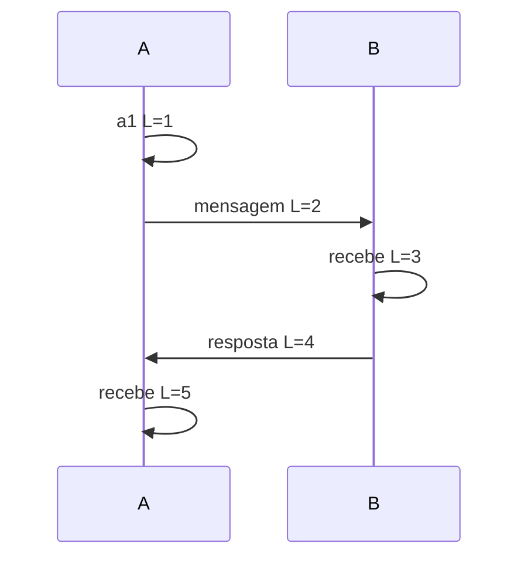

# Fundamentos distribuídos

Sistemas distribuídos não são difíceis porque possuem muitos servidores. Eles são
difíceis porque nenhum participante possui uma visão instantânea e perfeita do
mundo. Mensagens atrasam, respostas se perdem, processos reiniciam, relógios
divergem e componentes diferentes podem observar histórias diferentes durante
algum tempo.

O problema central é decidir **o que ainda podemos garantir quando conhecimento e
comunicação são incompletos**.

## Modelo mental: estado local + mensagens + hipóteses

Comece qualquer análise separando três coisas:

```text
estado local de cada processo
        +
mensagens que podem atrasar/falhar
        +
hipóteses declaradas sobre tempo e falhas
        =
garantias possíveis
```

Uma garantia distribuída só é válida dentro de um modelo. Dizer “o sistema sempre
elege um líder” é incompleto. Sob quais falhas? Existe quorum? A rede eventualmente
se recupera? O storage local sobrevive a crash?

## Por que timeout não prova falha

Considere um cliente que envia `charge(order-123)` e recebe timeout.

Existem várias histórias compatíveis:

1. request nunca chegou;
2. request chegou, mas servidor morreu antes do efeito;
3. efeito ocorreu, resposta se perdeu;
4. efeito ocorreu, servidor ficou lento;
5. resposta está a caminho e chegará tarde.

Do ponto de vista do cliente, todas parecem “timeout”. Por isso, retry de escrita
precisa de identidade da operação, status consultável ou mecanismo equivalente.

Essa ambiguidade é uma das raízes da idempotência.

## Modelos de sincronismo

### Síncrono

Existem limites conhecidos para:

- tempo de processamento;
- atraso de mensagem;
- clock drift.

É um modelo forte e raro como descrição perfeita da internet real.

### Assíncrono

Não existe limite conhecido para atraso. Um nó lento e um nó morto são
indistinguíveis por observação finita.

Esse modelo ajuda a entender impossibilidades teóricas.

### Parcialmente síncrono

É uma aproximação prática: durante períodos normais, limites razoáveis costumam
valer; durante incidentes, podem ser violados. Muitos protocolos dependem de
**eventual synchrony** para recuperar progresso.

Timeouts são então suspeitas operacionais, não provas matemáticas de morte.

## Modelos de falha

### Crash-stop

Processo para e não volta.

### Crash-recovery

Processo pode voltar. Precisamos distinguir estado:

- persistido antes do crash;
- apenas em memória;
- reconstruível a partir de outro lugar.

### Omission

Mensagens podem ser perdidas ou não enviadas/recebidas.

### Byzantine

Componente pode agir arbitrariamente, inclusive enviar informações conflitantes.
Protocolos crash-fault tolerant como Raft não resolvem Byzantine faults.

### Falha de zona/região

Failure domain físico importa. Três réplicas no mesmo rack não toleram perda do
rack. Replicação lógica sem distribuição de failure domains cria falsa sensação
de resiliência.

## Safety e liveness

Separe duas classes de propriedade.

### Safety

Algo ruim nunca acontece.

Exemplo: dois owners não conseguem confirmar a mesma reserva exclusiva.

### Liveness

Algo bom eventualmente acontece, sob hipóteses declaradas.

Exemplo: uma escrita eventualmente conclui quando quorum e rede estão saudáveis.

Durante uma partição, preservar safety pode exigir sacrificar liveness. Um banco
que rejeita escrita sem quorum talvez esteja funcionando corretamente.

## Tempo físico

Wall clock representa data/hora humana, mas pode saltar por sincronização, ajuste
manual ou mudança de sistema.

Use wall clock para:

- auditoria;
- timestamps de negócio;
- ordenação aproximada quando suficiente.

Não use para medir duração se um monotonic clock estiver disponível.

## Monotonic clock

Avança em uma direção dentro do processo e é apropriado para:

- timeout;
- deadline;
- duração;
- benchmark.

Mesmo monotonic clock local não cria uma ordem global entre máquinas.

## Causalidade

Se evento `a` pode influenciar `b`, escrevemos:

`a → b`

Essa relação happens-before é parcial. Dois eventos podem ser concorrentes sem uma
ordem causal definida.

## Lamport clocks

Lamport clock atribui contador lógico.

Regras simplificadas:

1. incremente antes de evento local;
2. envie contador junto da mensagem;
3. ao receber, `clock = max(local, recebido) + 1`.



Se `a → b`, então `L(a) < L(b)`. A inversa não vale. Dois eventos concorrentes
podem receber números ordenados sem relação causal real.

## Vector clocks

Vector clock mantém componente por participante. Permite distinguir:

- `a` aconteceu antes de `b`;
- `b` antes de `a`;
- eventos concorrentes.

O custo cresce com número de participantes/identidades. É útil como modelo de
causalidade, mas sistemas reais podem usar versões comprimidas ou outros
mecanismos.

## Replicação

Replicar estado melhora disponibilidade de leitura, throughput ou tolerância a
falha, mas cria pergunta inevitável:

> quando cópias discordam, qual versão pode ser usada?

## Leader-based replication

Um líder recebe writes e replica para followers.

Vantagens:

- ordem de escrita mais simples;
- uma autoridade clara.

Custos:

- failover;
- replication lag;
- hot leader;
- split-brain se autoridade não for bem cercada.

A semântica depende de quando o líder confirma commit. Se responde antes de uma
réplica durável, a janela de perda é diferente de quorum sync.

## Multi-leader

Vários leaders aceitam escrita, geralmente por região.

Benefícios:

- baixa latência local;
- maior disponibilidade geográfica.

Preço:

- conflitos;
- resolução;
- loops de replicação;
- invariantes globais mais difíceis.

Não use timestamp “última escrita vence” para domínio onde perder uma operação é
incorreto.

## Leaderless

Clientes ou coordinators escrevem/leem múltiplas réplicas.

Mecanismos comuns:

- quorums;
- version vectors;
- read repair;
- anti-entropy;
- hinted handoff.

A fórmula `R + W > N` cria interseção matemática sob certas hipóteses, mas não
prova linearizabilidade em toda implementação. Sloppy quorum, concorrência,
versionamento e clocks importam.

## Consistency models

“Consistente” sozinho é vago.

### Linearizabilidade

Cada operação parece ocorrer instantaneamente entre início e fim, respeitando
tempo real.

É forte e intuitiva para registers/locks, mas exige coordenação sob replicação.

### Serializabilidade

Transações parecem executar em alguma ordem serial. Não exige necessariamente
respeitar tempo real entre transações.

### Causal consistency

Operações causalmente relacionadas são observadas na ordem correta.

### Eventual consistency

Se updates cessam e comunicação continua, réplicas convergem eventualmente.
Não define automaticamente:

- quanto tempo leva;
- quais valores intermediários aparecem;
- como conflitos são resolvidos.

### Session guarantees

Read-your-writes e monotonic reads podem fornecer UX previsível sem exigir
linearizabilidade global.

## CAP sem slogans

CAP considera partição de rede. Sob as hipóteses do teorema, durante partição não
é possível garantir simultaneamente:

- **availability** no sentido formal de toda request a nó não falho receber
  resposta não-erro;
- **atomic consistency/linearizability**.

“P” não é opção que você desliga. Redes podem particionar. A decisão aparece no
comportamento durante essa situação.

Disponibilidade CAP não é igual a “99.99% uptime”. São conceitos diferentes.

## PACELC

PACELC amplia a discussão:

- durante Partition: Availability ou Consistency;
- Else: Latency ou Consistency.

Mesmo sem incidente, coordenação forte entre regiões pode aumentar latência.

Em vez de rotular um produto inteiro como AP/CP, documente por operação:

- write quorum;
- read consistency;
- região;
- failover;
- stale-read policy.

## Particionamento de dados

Particionamento distribui dataset e carga.

### Hash partitioning

Distribui chaves aproximadamente uniformemente.

Bom para lookup por chave. Pior para range/locality.

### Range partitioning

Preserva ordem e ranges, mas chaves sequenciais podem concentrar writes.

### Consistent hashing

Reduz quantidade de remapeamento quando membros mudam. Virtual nodes/weights
ajudam balanceamento.

Consistent hashing não resolve consenso nem conflito de dados.

## Hot partitions

Mesmo com muita capacidade total, uma partition key muito popular limita sistema.

Causas:

- celebrity/user muito acessado;
- timestamp como chave crescente;
- tenant gigante;
- chave constante.

Mitigações:

- sharding da chave;
- cache;
- isolamento de tenant;
- repartition;
- pré-agregação.

Cada mitigação muda query/consistency.

## Rebalanceamento

Mover partições consome rede, disco e CPU justamente quando cluster pode estar
sob falha.

Planeje headroom. Sistema operando a 95% de capacidade pode não ter espaço para
se recuperar após perder um nó.

## Secondary indexes

Índice global cruza partition ownership. Atualizá-lo pode exigir coordenação ou
propagação assíncrona.

Pergunte:

- index é strongly consistent?
- quanto lag é aceitável?
- rebuild é possível?
- custo de write amplification?

## Consenso versus merge

Nem todo conflito precisa de consenso.

Se operações são combináveis, CRDTs ou merge de versões podem preservar
availability. Se existe invariante exclusiva, como “uma vaga para um vencedor”,
coordenação forte pode ser necessária.

A arquitetura depende da semântica do domínio.

## CRDT como ideia

CRDTs definem estruturas cujas operações/estados convergem sem coordenação sob
regras específicas.

Exemplo: grow-only set pode unir elementos por `union`.

Eles não tornam qualquer dado automaticamente mergeable. “Saldo de conta” não
vira simples soma de versões sem modelar invariantes adequadas.

## Entrega de mensagens

### At-most-once

Pode perder, mas não repete entrega observada pelo consumidor.

### At-least-once

Pode repetir, mas tenta não perder sob as hipóteses do broker.

### Exactly-once

Sempre delimitado a uma fronteira. Broker pode transacionar consume+produce, mas
não controla side effect arbitrário externo.

Por isso, consumidores frequentemente precisam idempotência.

## Ordering

Ordem global é cara. Prefira ordem pelo menor scope que preserva regra:

- por aggregate;
- por partition;
- por customer.

Se pedidos independentes podem processar em paralelo, não os force em uma fila
global.

## Idempotência

Uma operação é idempotente quando repetir a mesma operação lógica não repete o
efeito final.

Isso requer identidade estável da operação.

Exemplo:

```text
POST /payments
Idempotency-Key: checkout-123
```

Servidor associa key ao payload/result. Mesmo key com payload diferente deve
falhar.

## Reconciliation

Em sistemas distribuídos, algumas divergências são inevitáveis. Reconciliation
compara estado esperado e observado e corrige.

Exemplos:

- pedido pago sem evento confirmado;
- projeção atrasada;
- recurso cloud divergente do desired state.

Recovery não deve depender exclusivamente de “retry até funcionar”.

## RTO e RPO

**RTO:** quanto tempo para restaurar serviço aceitável.

**RPO:** quanto dado podemos perder em um desastre.

Esses números orientam:

- replicação;
- backup;
- frequência de snapshot;
- failover;
- custo.

Multi-region sem RTO/RPO é topologia, não estratégia de disaster recovery.

## Performance e tail latency

Distribuição adiciona network hops. p99 de uma jornada com várias dependências
pode ser dominado pelo componente mais lento.

Meça:

- p50/p95/p99;
- queue time;
- replication lag;
- retry volume;
- quorum latency;
- bytes transferidos;
- saturation.

Retries podem melhorar success rate em falha transitória e simultaneamente piorar
p99 e overload.

## Observabilidade

Toda fronteira distribuída precisa permitir responder:

- qual operação lógica é esta?
- qual tentativa?
- qual versão/epoch?
- qual deadline resta?
- qual replica/partition respondeu?
- houve stale read?
- qual lag?
- qual efeito já foi persistido?

Use traces, métricas e IDs de correlação. Não dependa apenas de logs textuais
isolados por serviço.

## Segurança

Distribuição cria novas trust boundaries.

Considere:

- autenticação entre workloads;
- autorização por recurso;
- replay de mensagens;
- spoofing de membro do cluster;
- secrets replicados;
- criptografia em trânsito;
- PII em eventos;
- tenant isolation.

mTLS autentica conexão, mas não decide autorização de domínio.

## Falácias práticas da computação distribuída

As falácias clássicas viram testes concretos:

- **a rede é confiável:** injete perda/reset;
- **latência é zero:** adicione 500 ms e observe pools;
- **bandwidth é infinita:** teste payload grande/rebuild;
- **topologia não muda:** simule failover;
- **há um administrador:** considere serviços/provedores diferentes;
- **transporte é grátis:** estime egress/serialization;
- **rede é homogênea:** teste regiões e versões distintas;
- **segurança é automática:** modele identidade/autorização.

## Modos de falha

### Split brain

Dois lados acreditam possuir autoridade. Mitigue com quorum, term/epoch e fencing.

### Replication lag

Writes confirmam no líder e leitura da réplica retorna antigo. Defina freshness e
routing.

### Retry storm

Falha reduz capacidade e clients multiplicam requests. Use budget/backoff/jitter.

### Hot shard

Capacidade total está livre, mas uma partição satura. Mude key/distribuição.

### Recovery overload

Nó volta e precisa replay/rebuild, competindo com tráfego normal. Reserve headroom.

## Testes de propriedades

Não teste só happy path. Reproduza:

- atraso;
- duplicação;
- reordenação;
- packet loss;
- crash antes/depois de persistir;
- clock skew;
- partição;
- failover;
- stale replica;
- disk slow.

Antes de executar, escreva qual propriedade espera preservar. Chaos sem hipótese
é apenas barulho.

## Laboratório progressivo

### Beginner

Crie dois processos que trocam mensagens e registre wall clock e Lamport clock.
Introduza atraso e compare a ordem.

### Intermediate

Implemente key/value replicado simples leader/follower. Atrase follower e observe
stale read.

### Advanced

Modele reserva única em duas regiões. Compare três estratégias: last-write-wins,
quorum forte e single authority. Injete partição e documente o comportamento de
cada uma.

### Expert

Execute um fluxo com banco + broker + consumer. Force crash entre cada fronteira,
registre estados possíveis e construa reconciliation que converge sem duplicar
efeito.

## Exercício de síntese

Escreva a state machine de uma transferência:

1. cliente cria `operation_id`;
2. débito é reservado;
3. crédito é aplicado;
4. confirmação é publicada;
5. timeout pode ocorrer em qualquer etapa.

Para cada ponto, responda:

- o que é durável?
- o que pode repetir?
- qual é a autoridade?
- como detectar estado intermediário?
- como reconciliar?
- o que o cliente vê?

Não implemente dinheiro real com esse exercício sem requisitos contábeis e
regulatórios. O objetivo é raciocínio de falhas.

## Referências

- Lynch. [*Distributed Algorithms*](https://www.elsevier.com/books/distributed-algorithms/lynch/978-1-55860-348-6).
- Bailis et al. [Highly Available Transactions](https://www.vldb.org/pvldb/vol7/p181-bailis.pdf).
- Jepsen. [Consistency Models](https://jepsen.io/consistency).
- Gilbert & Lynch. [Brewer's conjecture and the feasibility of consistent, available, partition-tolerant web services](https://doi.org/10.1145/564585.564601).
- Abadi. [Consistency Tradeoffs in Modern Distributed Database System Design](https://www.cs.umd.edu/~abadi/papers/abadi-pacelc.pdf).

---

[← Sistemas distribuídos](README.md) · [↑ Sistemas distribuídos](README.md) · [Resiliência →](resilience-patterns.md)
