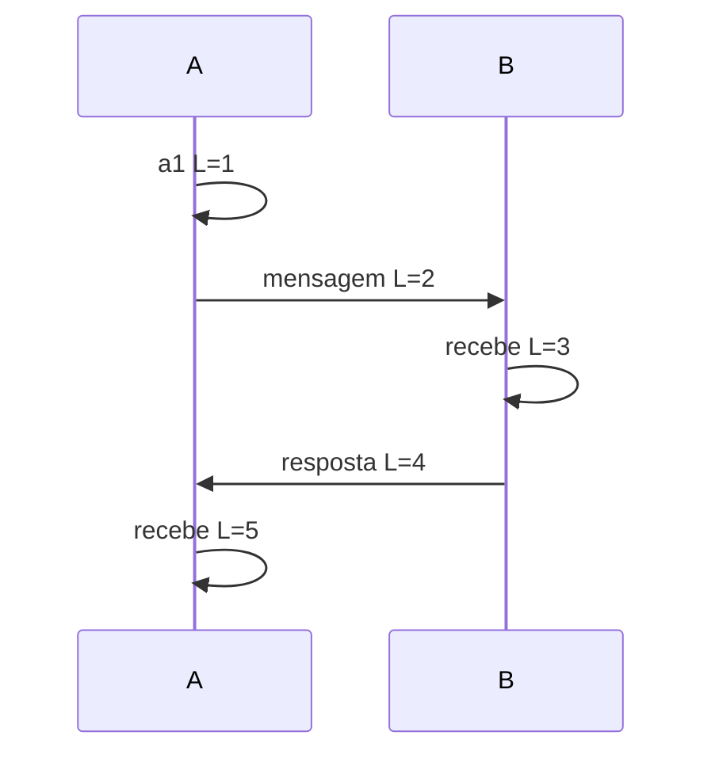

# Fundamentos distribuídos

## Modelos antes de algoritmos

No modelo síncrono há limites conhecidos para processamento e entrega; no assíncrono não há. Sistemas reais são parcialmente síncronos: limites costumam valer, mas não sempre. Um timeout informa ausência de resposta até agora—não distingue nó morto, rede lenta ou resposta perdida.

Falha crash-stop encerra um processo; crash-recovery permite retorno com estado persistido; Byzantine admite comportamento arbitrário. Escolher protocolo sem declarar modelo torna qualquer garantia ambígua.

## Tempo e ordem

Relógio físico pode saltar ou divergir. Use monotonic clock para duração; wall clock para data humana/auditoria com tolerância explícita. Lamport clocks capturam `a → b` implicando `L(a) < L(b)`, mas a inversa não vale. Vector clocks detectam concorrência ao custo de metadados.

## Replicação e consistência

Leader-based replication simplifica ordem de writes, mas eleição e lag importam. Multi-leader favorece disponibilidade geográfica e exige conflito. Leaderless usa quorums/versionamento, com read repair/anti-entropy. `R + W > N` sozinho não garante linearizabilidade: sloppy quorums, relógios e operações concorrentes mudam o resultado.

## CAP e PACELC

CAP pergunta o que ocorre durante partição de rede: sob o modelo do teorema, um sistema não pode garantir ao mesmo tempo resposta não-erro de toda operação e consistência atômica/linearizável. “P” não é botão opcional em rede distribuída; a escolha aparece por operação e situação. Disponibilidade CAP não é o mesmo percentual de uptime.

PACELC acrescenta: **se há partição (P), availability ou consistency; else (E), latency ou consistency**. Uma base pode oferecer leitura local stale e escrita quorum forte; por isso classificar produto inteiro como AP/CP perde configuração, operação e geografia. Documente a garantia observável de cada command/query e teste com partição realista.

## Particionamento

Hash distribui carga, range preserva scans e locality; ambos podem criar hotspot. Consistent hashing reduz movimento ao mudar nós. Rebalanceamento consome rede/I/O justamente durante falha; reserve capacidade. Secondary indexes e transações cruzando partições reintroduzem coordenação.

## Falácias práticas

A rede não é confiável, latência não é zero, largura não é infinita, topologia muda, segurança não é automática, transporte não custa zero, rede não é homogênea e não há um único administrador. Transforme cada falácia em teste ou métrica.

## Exercício

Escreva o state machine de uma transferência. Duplique, atrase e reordene mensagens. Defina identificador da operação, condição de commit, reconciliação e o que o cliente observa ao receber timeout.

## Referências

- Lynch. [*Distributed Algorithms*](https://www.elsevier.com/books/distributed-algorithms/lynch/978-1-55860-348-6).
- Bailis et al. [Highly Available Transactions](https://www.vldb.org/pvldb/vol7/p181-bailis.pdf).
- Jepsen. [Consistency Models](https://jepsen.io/consistency).
- Gilbert & Lynch. [Brewer's conjecture and the feasibility of consistent, available, partition-tolerant web services](https://doi.org/10.1145/564585.564601).
- Abadi. [Consistency Tradeoffs in Modern Distributed Database System Design](https://www.cs.umd.edu/~abadi/papers/abadi-pacelc.pdf).

---

[← Sistemas distribuídos](README.md) · [↑ Sistemas distribuídos](README.md) · [Resiliência →](resilience-patterns.md)
