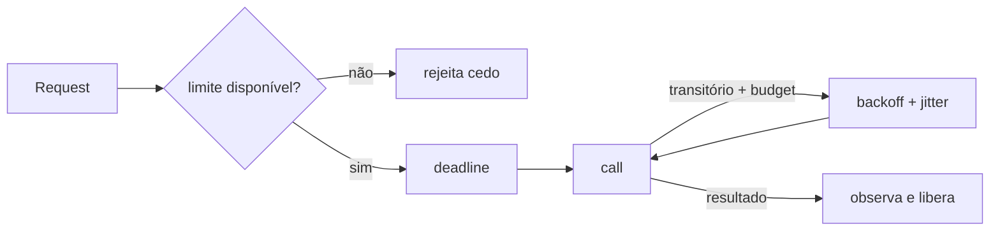

# Padrões de resiliência

Resiliência é capacidade de manter resultado aceitável e recuperar sob falhas, não esconder toda falha.

## Timeout e deadline

Propague deadline absoluto e reserve tempo para retorno. Diferencie connect, TLS, request e idle timeout. Cancelamento deve interromper trabalho inútil. Um timeout curto demais produz retries; longo demais retém recursos.

## Retry

Retry somente erro transitório, operação segura/idempotente, dentro do deadline e com orçamento. Exponential backoff com full jitter evita sincronização. Um único nível deve coordenar retries: três tentativas em três camadas podem gerar 27 chamadas.

## Idempotência

Receba `idempotency_key`, reserve-a atomicamente, associe payload hash e resultado, e expire conforme janela de retry. A mesma key com payload diferente é erro. Consumidores registram message ID junto ao efeito ou usam versão/conditional update.

## Isolamento e fluxo

| Padrão | Resolve | Risco |
| --- | --- | --- |
| circuit breaker | para chamadas quando falha é persistente | flapping e estado compartilhado confuso |
| bulkhead | limita blast radius por dependência/tenant | capacidade ociosa ou fila escondida |
| rate limit | protege orçamento | justiça e coordenação distribuída |
| load shedding | rejeita cedo sob saturação | experiência degradada precisa ser planejada |
| bounded queue | torna overload visível | decisão sobre drop/block |
| hedging | reduz cauda para leituras | duplica carga e efeitos se mal aplicado |

## Recuperação

Degradação serve dados stale somente se política e UI o admitem. Reconciliation compara fonte de verdade e projeção. Dead-letter queue é quarentena com owner, alert, replay seguro e retenção—não cemitério.

## Saga, outbox, inbox e CDC

Saga coordena transações locais por choreography (eventos) ou orchestration (coordenador). Compensação é nova ação de negócio, não rollback temporal; pode falhar e precisa idempotência/audit. Choreography reduz ponto central, mas fluxo emerge de muitos consumers; orchestration explicita estado, ao custo de coupling ao workflow.

Outbox persiste evento junto à mudança e um relay publica. Inbox registra message ID junto ao efeito no consumidor. Change Data Capture lê log de mudanças e cria streams/projeções, mas schema de tabela não é contrato de domínio automaticamente. Em todos, replay, ordering, deleção de PII e versionamento precisam design.

Distributed transaction/2PC oferece atomicidade entre participantes compatíveis, mas coordinator/locks e indisponibilidade têm custo. Compare com redesenhar invariant boundary, saga ou reconciliation; não declare 2PC sempre proibido ou transparente.

## Testes

Teste overload gradual, dependency brownout, retry storm, pool exhaustion e recovery. Confirme que métricas distinguem rejeição deliberada, timeout do caller e falha upstream. Chaos engineering valida hipóteses depois de controles e rollback existirem.

## Referências

- AWS Builders' Library. [Timeouts, retries, and backoff with jitter](https://aws.amazon.com/builders-library/timeouts-retries-and-backoff-with-jitter/).
- Google. [Site Reliability Engineering](https://sre.google/sre-book/table-of-contents/).
- Nygard. [*Release It!*, 2ª ed.](https://pragprog.com/titles/mnee2/release-it-second-edition/).

---

[← Fundamentos](fundamentals.md) · [↑ Sistemas distribuídos](README.md) · [Consenso →](consensus.md)
