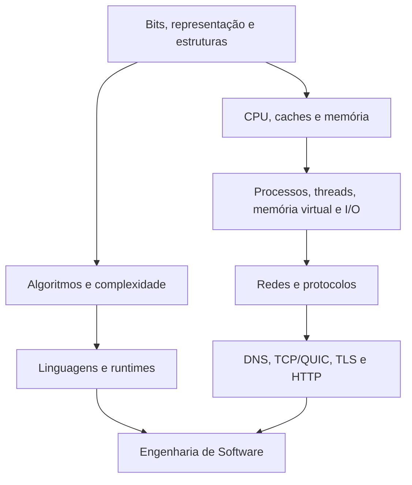
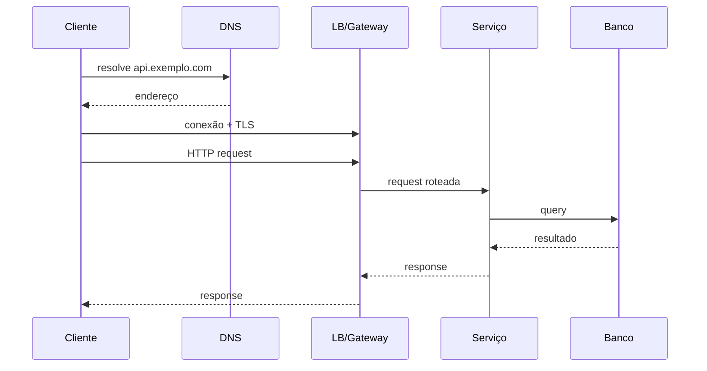

# Fundamentos

Fundamentos são mecanismos que continuam úteis quando frameworks mudam. Esta
trilha conecta representação de dados, execução de programas, sistemas
operacionais, redes e raciocínio quantitativo ao trabalho cotidiano de quem
projeta e opera software.

O objetivo não é memorizar como uma CPU ou um kernel funciona em todos os
detalhes. É ganhar um modelo suficiente para responder perguntas como:

- por que esta aplicação usa 2 GB de memória depois de algumas horas?
- por que aumentar concorrência piorou o throughput?
- por que uma chamada de 30 ms virou 800 ms no p99?
- por que um serviço aparentemente saudável parou de aceitar conexões?
- por que um algoritmo `O(n)` pode vencer um `O(log n)` em um caso pequeno?

## Mapa



## 1. Dados não são abstrações gratuitas

Todo valor acaba representado em bytes. A forma escolhida muda espaço, precisão,
compatibilidade e custo de processamento.

### Inteiros e overflow

Um inteiro de 32 bits possui um conjunto finito de valores. Em linguagens com
overflow silencioso, somar além desse conjunto pode produzir wraparound. Em
outras, o runtime lança erro ou promove o valor. Portanto, "é um número" não é
informação suficiente. Pergunte largura, sinal, regra de overflow e origem do
dado.

### Ponto flutuante

IEEE 754 representa muitos valores por aproximação. `0.1 + 0.2` não precisa ser
exatamente `0.3` em representação binária. Para dinheiro, a pergunta não é
"float é ruim?", mas qual domínio exige precisão decimal, arredondamento e
invariantes auditáveis.

### Texto e Unicode

Caractere, code point e byte não são sinônimos. UTF-8 usa quantidade variável de
bytes. Cortar uma string por byte pode quebrar codificação; contar code points
também não equivale necessariamente ao número de símbolos percebidos pelo
usuário.

Um laboratório simples:

```python
values = ["a", "á", "🙂", "👨‍👩‍👧‍👦"]

for value in values:
    encoded = value.encode("utf-8")
    print(value, len(value), len(encoded), encoded)
```

A observação útil é que "tamanho de texto" precisa de unidade explícita.

## 2. Estruturas de dados são contratos de custo

Escolher uma estrutura significa favorecer certas operações e pagar por outras.

| Estrutura | Boa quando | Custo escondido frequente |
| --- | --- | --- |
| array contíguo | acesso sequencial/indexado | realocação e inserção no meio |
| hash table | lookup por chave | memória extra, hash e colisões |
| árvore balanceada | ordem e range queries | ponteiros, rebalanceamento e cache locality |
| heap | mínimo/máximo recorrente | busca arbitrária não é seu objetivo |
| grafo | relações são parte do problema | expansão combinatória e representação |

Complexidade assintótica é uma lente, não um cronômetro. Uma busca linear sobre
32 itens contíguos pode ser excelente por causa de cache locality e baixo
overhead. Uma estrutura teoricamente melhor pode perder por alocação, pointer
chasing ou constantes maiores.

### Invariantes antes da implementação

Ao estudar uma estrutura, escreva primeiro o que deve permanecer verdadeiro. Em
uma heap mínima, por exemplo, cada pai precisa ser menor ou igual aos filhos. O
algoritmo existe para preservar esse invariante após inserção e remoção.

Essa forma de pensar transfere diretamente para bancos, filas, caches, state
machines e sistemas distribuídos.

## 3. O caminho de uma instrução até a CPU

Código fonte normalmente passa por uma ou mais etapas de parsing, compilação,
bytecode, JIT ou interpretação antes de virar instruções executáveis. O detalhe
varia por linguagem, mas o caminho sempre consome recursos reais.

A CPU busca instruções e dados, executa operações e depende de uma hierarquia de
memória. Registradores e caches são muito mais rápidos que RAM; RAM é muito mais
rápida que storage persistente. Uma aplicação pode estar "CPU-bound" não porque
faz aritmética sofisticada, mas porque perde tempo esperando dados chegarem à
unidade de execução.

### Cache locality

Percorrer memória contígua tende a aproveitar melhor cache lines e prefetching.
Estruturas cheias de ponteiros podem causar mais cache misses. Isso explica por
que duas implementações com a mesma complexidade Big O podem divergir muito em
performance.

### Branch prediction

Pipelines de CPU tentam prever branches. Dados imprevisíveis podem aumentar
mispredictions e descartar trabalho especulativo. Em código comum, não otimize
isso por intuição. Use profiler e hardware counters quando realmente houver um
hot path comprovado.

## 4. Stack, heap e tempo de vida

A divisão exata depende do runtime, mas o modelo é útil:

- a **stack** acompanha frames de chamadas e dados de vida curta associados à
  execução;
- o **heap** guarda objetos cuja vida não cabe simplesmente no frame atual;
- runtimes com garbage collector rastreiam alcançabilidade e recuperam memória;
- runtimes com ownership/manual management usam outros contratos para liberar
  recursos.

O erro clássico é confundir "memória alocada" com "vazamento". Um runtime pode
reter arenas para reutilização, enquanto um leak lógico mantém objetos
alcançáveis que já não deveriam existir. Diagnóstico exige heap profile,
contadores e comparação temporal.

## 5. Processo, thread e scheduler

Um processo oferece isolamento de endereço e recursos. Threads compartilham
muito desse estado e podem executar concorrentemente. O scheduler do sistema
operacional decide quem recebe CPU e por quanto tempo.

Mais threads não significam mais throughput de forma ilimitada. Há custos de:

- context switch;
- memória por stack;
- contenção por locks;
- cache invalidation;
- fila de trabalho maior;
- pressão sobre dependências externas.

Para CPU-bound, paralelismo útil tende a ser limitado pelos cores e pelo runtime.
Para I/O-bound, concorrência permite aproveitar o tempo em que operações esperam
rede ou disco, desde que exista backpressure.

## 6. Syscalls e I/O

Aplicações em user space pedem serviços ao kernel por system calls. Abrir um
arquivo, criar socket, ler dados ou mapear memória atravessa essa fronteira.

I/O pode ser:

- bloqueante, quando a thread fica sem progredir até o resultado;
- não bloqueante, quando o programa consulta disponibilidade;
- assíncrono/event-driven, quando readiness ou completion é entregue ao loop ou
  runtime.

"Async" não remove custo. Ele muda como a espera é representada. Se um callback
faz CPU intensa por 500 ms em um event loop, as outras operações continuam
esperando.

### File descriptors também acabam

Sockets, pipes e arquivos usam descritores. Um serviço pode ter CPU e memória
livres e ainda falhar porque atingiu limite de file descriptors, portas efêmeras
ou conexões no pool.

Durante um incidente, recursos invisíveis no dashboard principal frequentemente
são os culpados.

## 7. Memória virtual

Cada processo trabalha com um espaço de endereços virtual. O sistema operacional
mapeia páginas virtuais para memória física e, dependendo do ambiente, storage.
Isso habilita isolamento, compartilhamento controlado e alocação esparsa.

Page faults não são todos iguais. Um minor fault pode apenas estabelecer um
mapeamento já residente; um major fault pode exigir leitura de storage e custar
ordens de grandeza mais.

Em containers, limite de memória não muda o fato de que o kernel é compartilhado.
Pressão de memória, OOM killer e page cache fazem parte do comportamento real.

## 8. Uma requisição HTTPS ponta a ponta

Considere `GET https://api.exemplo.com/orders/42`.



O tempo total inclui potencialmente:

1. resolução DNS;
2. estabelecimento de conexão;
3. handshake TLS;
4. espera em filas no cliente, proxy e servidor;
5. parsing e autenticação;
6. chamada a dependências;
7. serialização e transmissão da resposta.

Se cada hop tem retry próprio, uma única request pode se multiplicar durante uma
falha. Se o timeout do serviço interno é maior que o deadline do cliente, ele
pode continuar gastando CPU e conexões depois que o resultado já foi descartado.

## 9. Latência: média é uma história incompleta

Média esconde cauda. Em sistemas interativos, p50 mostra o caso típico, enquanto
p95/p99 revelam usuários mais afetados e efeitos de filas, GC, cache miss,
contenção ou dependências lentas.

Fan-out amplifica a cauda. Se uma página depende de 30 chamadas paralelas e basta
uma delas atrasar para a resposta atrasar, o sistema começa a observar o pior
caso entre várias amostras.

### Little's Law como ferramenta de bolso

Em estado estável:

`L = λ × W`

onde:

- `L` é o número médio de itens no sistema;
- `λ` é a taxa média de chegada;
- `W` é o tempo médio no sistema.

Se um serviço recebe 1.000 requests/s e cada request permanece 200 ms, espere
aproximadamente 200 requests concorrentes em média. Essa conta rápida ajuda a
raciocinar sobre pools, memória e limites.

## 10. Throughput, saturação e filas

Antes da saturação, mais carga pode aumentar throughput quase linearmente. Perto
do limite, filas crescem. Depois do limite, latência explode e throughput pode
até cair devido a retries, context switches, lock contention e cache thrashing.

É por isso que "CPU em 100%" é consequência, não diagnóstico completo. Pergunte:

- qual recurso saturou primeiro?
- a fila está onde?
- existe limite explícito?
- trabalho pode ser descartado, degradado ou adiado?
- o retry está ajudando ou alimentando o colapso?

## 11. Big O, constantes e ordens de grandeza

Big O responde como o custo cresce, mas engenharia exige números aproximados.
Antes de projetar um sistema, estime:

- itens por segundo;
- bytes por item;
- retenção;
- fan-out;
- cardinalidade;
- conexões simultâneas;
- percentis de latência;
- crescimento esperado.

Exemplo: 5.000 eventos/s com 2 KB cada produzem aproximadamente 10 MB/s antes de
replicação, índices e overhead. Em um dia, isso já passa de centenas de GB. A
ordem de grandeza muda a conversa sobre retenção e armazenamento.

## 12. Modos de falha fundamentais

| Falha | Sintoma | Evidência útil | Mitigação típica |
| --- | --- | --- | --- |
| leak lógico | RSS/heap cresce com o tempo | heap snapshots por tipo/retainer | corrigir ownership e lifecycle |
| pool esgotado | requests aguardam apesar de CPU baixa | wait time e utilização do pool | limite, timeout, capacidade da dependência |
| retry storm | tráfego cresce durante falha | attempts por operação | backoff, jitter, budget e circuit breaker |
| event loop bloqueado | p99 alto e timers atrasados | event-loop lag/profiler | mover CPU, limitar callback |
| FD exhaustion | erro ao abrir socket/arquivo | contagem de FDs e limites | fechar recursos, pooling e limites adequados |
| page/cache thrash | CPU e latência irregulares | faults, cache misses, I/O | reduzir working set ou melhorar locality |

## 13. Laboratório de base

### Beginner

1. Inspecione bytes UTF-8 de caracteres com comprimentos diferentes.
2. Compare array e hash table para lookup em tamanhos crescentes.
3. Desenhe stack frames de uma função recursiva simples.

### Intermediate

1. Observe processos, threads, file descriptors e sockets de um servidor local.
2. Compare uma tarefa I/O-bound sequencial e concorrente.
3. Introduza um limite pequeno de conexões e observe a fila surgir.

### Advanced

1. Use profiler para separar CPU time de wall time.
2. Injete 200 ms em uma dependência e compare p50, p95 e p99.
3. Configure retries em duas camadas, provoque falha e meça amplificação.

### Expert

Monte um pequeno serviço com carga controlada. Aumente throughput até saturação e
registre, em sequência, utilização, fila, latência, erro e throughput. Explique o
ponto de joelho da curva e proponha uma política de overload explícita.

## 14. Como investigar performance sem adivinhar

Use um ciclo simples:

1. defina o resultado ruim e a métrica;
2. reproduza a carga;
3. encontre o recurso limitante;
4. formule uma hipótese causal;
5. altere uma variável;
6. compare com o baseline;
7. verifique efeitos colaterais.

Microbenchmark responde uma pergunta estreita. Ele não prova que a mudança melhora
produção. Perfis, traces e testes de carga complementam a história.

## Checkpoints

- **Beginner:** explica representação, valor, referência, mutabilidade e uma
  stack trace.
- **Intermediate:** relaciona processo, thread, I/O, concorrência, backpressure e
  cancelamento.
- **Advanced:** estima capacidade e investiga CPU, memória, disco e rede com
  evidência.
- **Expert:** transforma um problema vago de performance em hipóteses testáveis e
  consegue explicar por que uma otimização aparentemente boa pode piorar o
  sistema.

## Referências

- Bryant & O'Hallaron. [*Computer Systems: A Programmer's Perspective*](https://csapp.cs.cmu.edu/)
  conecta programas a CPU, memória, linking, processos e rede.
- Linux Kernel. [Documentation](https://docs.kernel.org/) é referência para
  mecanismos de memória, scheduler, networking e cgroups no Linux.
- IETF. [RFC 9110: HTTP Semantics](https://www.rfc-editor.org/rfc/rfc9110.html)
  define a semântica normativa do HTTP.
- Unicode Consortium. [Unicode Standard](https://www.unicode.org/standard/standard.html)
  documenta o modelo de caracteres e codificações.
- Drepper. [What Every Programmer Should Know About Memory](https://people.freebsd.org/~lstewart/articles/cpumemory.pdf)
  é uma leitura histórica útil sobre hierarquia e caches; valide detalhes contra
  hardware moderno.

---

[← Atlas](../atlas/README.md) · [↑ Início](../README.md) · [Ciência da Computação →](../computer-science/README.md)
