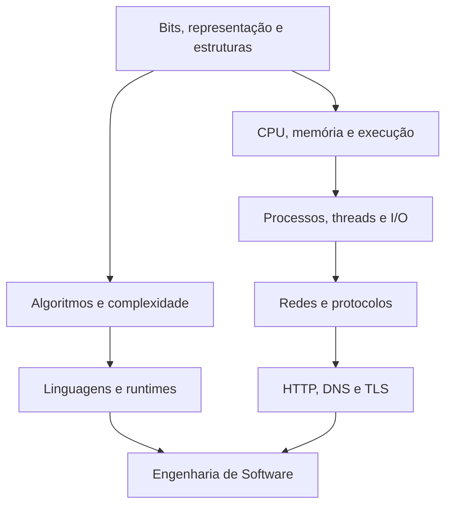

# Fundamentos

Fundamentos são mecanismos que permanecem úteis quando frameworks mudam. Esta
trilha conecta representação de dados, execução de programas, sistemas
operacionais, redes e raciocínio quantitativo ao trabalho cotidiano.

## Mapa

## Núcleo mínimo

### Representação e estruturas

- números binários, inteiros com e sem sinal, ponto flutuante e Unicode;
- arrays, listas, hash tables, árvores, heaps, grafos e seus invariantes;
- custo de acesso, inserção, remoção, busca e localidade de memória;
- serialização, schema, compatibilidade e validação em fronteiras.

Uma estrutura não é “rápida” em abstrato. O custo depende da operação dominante,
do tamanho, do layout de memória e das garantias exigidas.

### Execução

Um programa passa por tradução ou interpretação, carregamento, alocação de
memória, chamadas ao sistema e scheduling. Pergunte sempre onde o código executa,
quem possui cada recurso e como o trabalho é interrompido.

| Conceito | Pergunta operacional |
| --- | --- |
| stack e heap | qual é o tempo de vida e quem libera a memória? |
| processo e thread | o que é isolado e o que é compartilhado? |
| syscall | onde ocorre a transição para o kernel? |
| blocking I/O | qual recurso fica indisponível enquanto espera? |
| event loop | que trabalho impede progresso dos demais callbacks? |
| garbage collection | quais pausas e pressões de alocação existem? |

### Redes

Para uma requisição HTTPS, acompanhe DNS, estabelecimento de conexão,
negociação TLS, framing HTTP, balanceamento, aplicação e dependências. Latência
é soma de esperas; timeout deve refletir orçamento fim a fim, não um número
copiado.

### Complexidade e estimativas

Big O descreve crescimento assintótico, não tempo de parede. Combine análise com
ordens de grandeza: bytes por item, requests por segundo, fan-out, percentis de
latência e custo por operação. Meça antes e depois de otimizar.

## Laboratório de base

1. Inspecione bytes UTF-8 de caracteres com comprimentos diferentes.
2. Compare busca linear e hash sob tamanhos crescentes; registre distribuição.
3. Observe processos, file descriptors e sockets de um servidor local.
4. Use DNS e um cliente HTTP verboso para decompor uma requisição.
5. Introduza 200 ms em uma dependência e veja o efeito no p95 e no p99.

## Checkpoints

- **Beginner:** explica valor, referência, mutabilidade e uma stack trace.
- **Intermediate:** relaciona I/O, concorrência, backpressure e cancelamento.
- **Advanced:** estima capacidade e investiga CPU, memória, disco e rede.
- **Expert:** transforma um problema vago de performance em hipóteses testáveis.

## Referências oficiais

- [Computer Systems: A Programmer's Perspective](https://csapp.cs.cmu.edu/) —
  página dos autores e material complementar sobre a interação hardware/software.
- [RFC 9110 — HTTP Semantics](https://www.rfc-editor.org/rfc/rfc9110) — semântica
  normativa do HTTP.
- [Unicode Standard](https://www.unicode.org/standard/standard.html) — padrão de
  caracteres e codificação.
- [What every programmer should know about memory](https://people.freebsd.org/~lstewart/articles/cpumemory.pdf) — material técnico de Ulrich Drepper; leia criticamente por refletir hardware de sua época.

---

[← Atlas](../atlas/README.md) · [↑ Início](../README.md) · [Ciência da Computação →](../computer-science/README.md)
