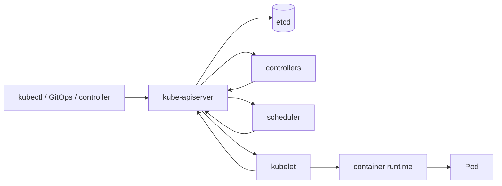
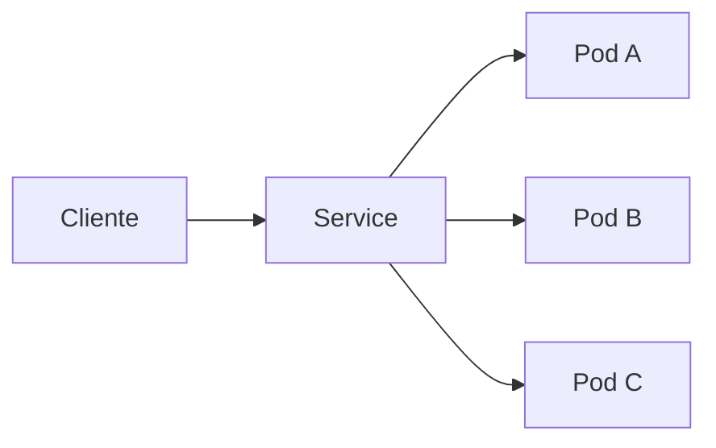

# Kubernetes

Kubernetes é uma API declarativa apoiada por control loops. Você descreve estado
desejado; controllers observam o estado atual e tentam reduzir a diferença. Essa
ideia explica mais do Kubernetes do que decorar dezenas de objetos.

Ele automatiza scheduling, rollout, service discovery e recuperação de workloads.
Não modela domínio, não cria disponibilidade por conta própria e não corrige uma
aplicação sem timeouts, limites e semântica de health.

## Trilha

| Guia | Foco |
| --- | --- |
| [Workloads e rede](workloads-and-networking.md) | Pod, Deployment, Service, Gateway/Ingress e storage |
| [Operação e segurança](operations-and-security.md) | recursos, probes, rollout, RBAC, policies e troubleshooting |
| [Exercícios](exercises.md) | deploy, falhas, autoscaling e incidente |

## 1. O modelo central: desired state e reconciliation

Um objeto normalmente contém `metadata`, uma `spec` desejada e um `status`
observado. O API server persiste intenção; controllers transformam intenção em
ações.

Reconciliation é eventual. Criar um Deployment não significa que os Pods já
estão disponíveis quando a API retorna sucesso. Significa que a intenção foi
aceita e o sistema passará a trabalhar para materializá-la.

Esse detalhe explica muitos bugs de automação: scripts que criam um objeto e
imediatamente assumem que dependências já estão prontas.

## 2. API server e etcd

O `kube-apiserver` é a fronteira principal do control plane. Ele autentica,
autoriza, aplica admission e valida objetos antes de persistir estado.

`etcd` armazena o estado canônico do cluster. Perder o estado do etcd sem backup
adequado pode significar perder a descrição do cluster, mesmo que containers
ainda estejam executando por algum tempo nos nodes.

Por isso backup de aplicações e backup do control plane são problemas
diferentes.

### Watch em vez de polling ingênuo

Controllers normalmente usam list/watch e caches locais para reagir a mudanças.
A lógica precisa tolerar reconexão, eventos repetidos e estado já alterado. Um
controller correto é idempotente: reconciliar duas vezes deve convergir para o
mesmo objetivo.

## 3. Scheduler: escolher um node é um problema de restrições

O scheduler encontra Pods sem node e procura placement compatível com recursos e
políticas.

Fatores comuns:

- requests de CPU/memória;
- labels e node affinity;
- taints/tolerations;
- topology spread constraints;
- volumes e zonas;
- prioridades/preemption;
- recursos estendidos como GPU.

Um Pod `Pending` não significa "Kubernetes travou". Pode significar que nenhuma
combinação de nodes satisfaz as restrições.

### Requests versus limits

Requests influenciam scheduling e representam a quantidade usada para decidir se
um Pod cabe no node. Limits definem teto aplicado no runtime, conforme o recurso.

Subestimar requests pode empacotar workloads demais no mesmo node. Superestimar
pode desperdiçar capacidade e deixar Pods sem placement mesmo com uso real baixo.

## 4. Pod é unidade de scheduling, não uma VM

Um Pod agrupa um ou mais containers que compartilham lifecycle, networking e
alguns volumes. Containers no mesmo Pod podem falar por `localhost`.

Use múltiplos containers quando o lifecycle for realmente compartilhado, por
exemplo um sidecar que precisa acompanhar a aplicação. Não use Pod como gaveta
para serviços independentes apenas porque conseguem conversar.

Pods são substituíveis. Seu nome/IP podem mudar. Persistir estado importante no
filesystem efêmero do Pod cria acoplamento ao lifecycle errado.

## 5. Deployment, ReplicaSet e rollout

Deployment descreve uma estratégia para manter réplicas de Pods e evoluir uma
versão para outra. ReplicaSets materializam conjuntos de Pods para uma revisão.

Durante rolling update, versões antigas e novas podem coexistir. Isso tem
consequências:

- schema e APIs precisam tolerar versões adjacentes;
- consumidores podem receber tráfego em ambas;
- migrações incompatíveis podem quebrar rollback;
- readiness precisa impedir tráfego cedo demais.

### Reversibilidade é requisito de arquitetura

Um `kubectl rollout undo` não desfaz migração de banco destrutiva. Rollback de
manifest não é rollback do sistema inteiro. Prefira expand/migrate/contract para
mudanças de schema e contratos.

## 6. Probes não são sinônimos

### Startup probe

Responde: a aplicação concluiu inicialização? Enquanto falha, pode proteger
workloads lentos de serem reiniciados por liveness cedo demais.

### Readiness probe

Responde: este Pod deve receber novo tráfego agora? Falha de readiness remove o
endpoint do conjunto elegível sem necessariamente matar o processo.

### Liveness probe

Responde: reiniciar o processo é uma ação capaz de recuperar esta condição?

Esse último ponto é crítico. Se a dependência externa está indisponível,
reiniciar todos os Pods pode apenas criar uma tempestade de startup. Liveness
deve detectar estados locais irrecuperáveis, não toda falha do universo.

## 7. Service: identidade estável para endpoints instáveis

Pods mudam, Services fornecem uma identidade de rede estável e selecionam
endpoints. O dataplane do cluster encaminha tráfego conforme a implementação.

Problemas de Service costumam estar em uma destas camadas:

1. DNS;
2. Service existe, mas selector não encontra Pods;
3. Endpoint existe, mas aplicação não escuta na porta esperada;
4. NetworkPolicy/firewall bloqueia tráfego;
5. dataplane/CNI está degradado;
6. aplicação aceita conexão, mas falha internamente.

Investigue em ordem em vez de alterar manifests aleatoriamente.

## 8. CNI e modelo de rede

Kubernetes define um modelo de conectividade e delega implementação a plugins de
rede. CNI configura interfaces/endereços; o dataplane pode usar iptables, IPVS,
eBPF ou mecanismos específicos da solução.

O ponto operacional é distinguir:

- IP do Pod;
- IP/virtual identity do Service;
- entrada externa via load balancer ou Gateway/Ingress;
- políticas east-west;
- DNS e service discovery.

Overlays, MTU e encapsulamento podem adicionar comportamento que não aparece no
código da aplicação.

## 9. Storage: scheduling encontra persistência

Volumes persistentes conectam lifecycle de workload a storage com lifecycle
separado. O scheduler pode precisar considerar zona e access mode.

Perguntas obrigatórias:

- o volume pode ser montado por quantos nodes?
- a aplicação tolera detach/attach lento?
- snapshots são backups suficientes para o requisito?
- restore já foi testado?
- stateful workload precisa de identidade estável por réplica?

StatefulSet ajuda com identidade e ordenação de Pods, mas não transforma software
stateful em sistema distribuído correto. Replicação, quorum, backup e recovery
continuam responsabilidade da aplicação/banco.

## 10. ConfigMap e Secret

ConfigMaps e Secrets injetam configuração por environment ou volume. O nome
`Secret` não garante, sozinho, criptografia forte, rotação ou acesso adequado.

Trate secrets como lifecycle:

- origem confiável;
- armazenamento e encryption at rest quando aplicável;
- RBAC mínimo;
- distribuição;
- rotação;
- revogação;
- prevenção de vazamento em logs/env dumps.

Para clouds, workload identity/credenciais curtas costumam ser preferíveis a
chaves estáticas de longo prazo.

## 11. Autoscaling não cria capacidade de dependência

HPA ajusta réplicas usando métricas. O loop tem atraso: observar, decidir,
schedule, pull image, iniciar aplicação e ficar ready leva tempo.

Se o sinal escolhido sobe apenas depois que o serviço já está saturado, scaling
chega tarde. Se a dependência suporta 100 conexões e cada Pod abre 20, aumentar de
5 para 20 Pods pode derrubar o banco.

Uma política útil conecta:

- métrica antecipatória ou de saturação;
- tempo de startup;
- capacidade por réplica;
- limite da dependência;
- stabilization windows;
- comportamento durante scale-down.

## 12. Overload e requests/limits

Kubernetes pode iniciar mais Pods, mas a aplicação precisa impor limites locais.
Sem backpressure, filas internas crescem até memória, timeout ou GC virar o
limitador.

Combine:

- limites de concorrência;
- connection pools bounded;
- deadlines;
- filas com tamanho/política explícitos;
- shed/degradação quando necessário;
- autoscaling como camada complementar.

## 13. Segurança do cluster

Pense em trust boundaries:

- usuário → API server;
- workload → API server/cloud APIs;
- workload → workload;
- image registry → node;
- node → control plane.

Controles incluem:

- RBAC mínimo;
- service accounts específicos;
- admission policies;
- Pod Security Standards/policies equivalentes;
- NetworkPolicy;
- imagens por digest/provenance;
- runtime hardening;
- secrets e workload identity;
- audit logs.

Dar `cluster-admin` para resolver um deploy é o equivalente operacional de usar
`chmod 777`: reduz fricção destruindo informação de segurança.

## 14. Observabilidade orientada a camadas

Separe control plane, node e workload.

### Workload

- request rate/errors/duration;
- restarts e termination reasons;
- readiness;
- CPU/memory e throttling;
- fila/pool interno.

### Node

- allocatable versus requests;
- CPU/memory/disk pressure;
- filesystem/inodes;
- network errors;
- kubelet/runtime health.

### Control plane

- API latency/errors;
- etcd health/latency;
- work queue dos controllers;
- scheduling latency;
- admission failures.

Um dashboard apenas de Pods não detecta todas as falhas de plataforma.

## 15. Modos de falha recorrentes

| Falha | Sintoma | Evidência | Mitigação |
| --- | --- | --- | --- |
| request subestimado | node pressionado/evictions | usage vs requests | sizing e quotas |
| liveness agressiva | restart storm | probe failures/restarts | probe semântica e thresholds |
| rollout incompatível | erros entre versões | version-tagged telemetry | compatibilidade adjacente |
| DB saturado após scale-out | app aumenta e banco cai | pool/connections/DB saturation | limite global e scaling coordenado |
| selector incorreto | Service sem endpoint | EndpointSlice/selectors | corrigir labels/selector |
| image pull lento/falha | Pod preso em startup | events/registry latency | cache, registry HA, digest |
| volume zonal | Pod não agenda/attach falha | events/PV topology | topology-aware placement |

## 16. Um método de troubleshooting

Ao receber "o Pod não funciona", siga o lifecycle:

1. **Objeto aceito?** Validação/admission/RBAC.
2. **Foi agendado?** Events e constraints.
3. **Imagem chegou?** Registry/auth/digest/network.
4. **Container iniciou?** Command, config, mounts, permissions.
5. **Ficou ready?** Probe e dependências.
6. **Recebe tráfego?** Service/endpoints/DNS/network policy.
7. **Executa corretamente?** logs/traces/metrics da aplicação.
8. **Permanece saudável sob carga?** recursos, filas e dependências.

`kubectl describe` e events frequentemente explicam estado de plataforma antes
de qualquer log da aplicação.

## 17. Quando Kubernetes não é a resposta

Evite adotar por prestígio técnico. Um serviço de containers gerenciado, PaaS ou
serverless pode ser melhor quando:

- há poucos workloads;
- a equipe não quer operar plataforma;
- requirements de scheduling/policies são simples;
- portabilidade não compensa complexidade;
- serviço gerenciado atende SLO e compliance.

Kubernetes paga quando automação, número de workloads/equipes, políticas,
portabilidade e extensibilidade justificam o custo de uma plataforma.

## 18. Laboratórios

### Beginner

- crie Deployment e Service e acompanhe `spec` versus `status`;
- mate um Pod e observe reconciliation;
- altere readiness e veja endpoint entrar/sair.

### Intermediate

- configure requests/limits e provoque CPU throttling/OOM;
- quebre selector de Service e diagnostique por EndpointSlice;
- execute rolling update com duas versões observáveis.

### Advanced

- configure HPA e descubra o atraso real até nova capacidade ficar ready;
- aplique NetworkPolicy deny-by-default e libere apenas fluxos necessários;
- simule indisponibilidade de banco e verifique se probes pioram ou contêm o
  incidente.

### Expert

Crie um cenário de overload com aplicação + banco. Faça scale-out automático,
limite de conexão e fault injection. Demonstre uma configuração que derruba o
banco e outra que preserva degradação controlada. Registre as fitness functions.

## Referências

- Kubernetes. [Documentation](https://kubernetes.io/docs/home/) e
  [Concepts](https://kubernetes.io/docs/concepts/) são a fonte operacional
  principal.
- Kubernetes Community. [API conventions](https://github.com/kubernetes/community/blob/master/contributors/devel/sig-architecture/api-conventions.md)
  explica padrões de objetos e API.
- Kubernetes SIG Architecture. [Architecture](https://github.com/kubernetes/community/tree/master/sig-architecture)
  reúne decisões e princípios de design.
- CNCF. [Cloud Native Security Whitepaper](https://github.com/cncf/tag-security/blob/main/community/resources/security-whitepaper/v2/cloud-native-security-whitepaper.md)
  conecta plataforma, workload e supply chain.

---

[← Containers](../containers/README.md) · [↑ Início](../README.md) · [Workloads e rede →](workloads-and-networking.md)
