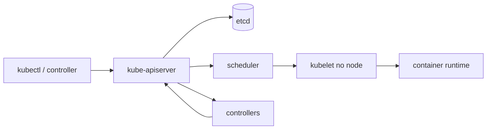

# Kubernetes

Kubernetes é uma API declarativa e um conjunto de control loops que reconcilia estado desejado com observado. Ele automatiza scheduling, rollout e recuperação de workloads; não modela domínio nem corrige aplicações sem limites e health semantics.

## Trilha

| Guia | Foco |
| --- | --- |
| [Workloads e rede](workloads-and-networking.md) | Pod, Deployment, Service, ingress e storage |
| [Operação e segurança](operations-and-security.md) | recursos, probes, rollout, RBAC e policies |
| [Exercícios](exercises.md) | deploy, falhas, autoscaling e incidente |

## Control plane

API server é o boundary; etcd guarda estado; scheduler escolhe node; controllers reconciliam; kubelet materializa Pods via runtime. Objetos têm `spec` desejado e `status` observado. Reconciliation é eventual e precisa de operações idempotentes.

O controller manager executa controllers centrais; cloud controller integra recursos do provedor. `kube-proxy` ou implementação equivalente programa encaminhamento de Services nos nodes. CoreDNS resolve descoberta. CNI implementa rede, CSI storage e CRI liga kubelet ao runtime.

## Antes de adotar

Confirme que número de workloads/equipes, portabilidade e automação justificam plataforma. Um serviço gerenciado mais simples pode reduzir risco. Kubernetes adiciona API, upgrades, políticas, networking, storage, observabilidade e capacidade do control plane.

## Referências oficiais

- Kubernetes. [Documentation](https://kubernetes.io/docs/home/).
- [Concepts](https://kubernetes.io/docs/concepts/).
- [API conventions](https://github.com/kubernetes/community/blob/master/contributors/devel/sig-architecture/api-conventions.md).

---

[← Containers](../containers/README.md) · [↑ Início](../README.md) · [Workloads e rede →](workloads-and-networking.md)
