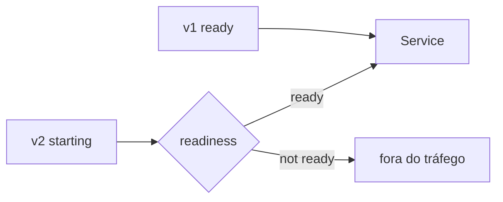
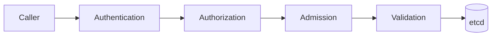

# Operação e segurança no Kubernetes

Operar Kubernetes é administrar loops de controle sobre recursos finitos. O
cluster tenta reconciliar estado desejado, mas não sabe sozinho qual erro de
negócio é aceitável, quanto backlog pode crescer ou se reiniciar uma aplicação
piora um incidente.

Este capítulo trata operação como engenharia de limites, evidências e recovery.

## 1. Rollout seguro começa antes do deploy

Um rollout depende de quatro coisas ao mesmo tempo:

- capacidade para versões coexistirem;
- readiness que represente capacidade real de receber tráfego;
- compatibilidade entre versões adjacentes;
- reversibilidade de banco e efeitos externos.



`maxSurge` aumenta capacidade temporária; `maxUnavailable` permite redução
controlada. Se nodes já estão cheios, surge pode deixar Pods Pending e travar o
rollout.

Antes do deploy, valide:

- budget de CPU/memória;
- conexão máxima do banco;
- compatibilidade de schema;
- feature flags;
- duração de startup;
- comportamento de shutdown;
- critérios objetivos de rollback.

## 2. PodDisruptionBudget não cria disponibilidade

PDB limita certas disruptions voluntárias para workloads selecionados. Ele não
protege contra toda falha e não cria réplicas extras.

Um PDB muito rígido pode bloquear manutenção de node. Um PDB frouxo pode permitir
remover capacidade demais.

Defina em conjunto com:

- quantidade de réplicas;
- distribuição entre zonas/nodes;
- tempo de recovery;
- política de autoscaling;
- SLO da aplicação.

Disponibilidade nasce da combinação, não de um único objeto.

## 3. Requests, limits e capacidade

### Requests

São a declaração usada para placement e parte do planejamento de capacidade.
Requests muito baixos aumentam overcommit e pressão no node. Requests muito
altos desperdiçam capacidade e podem deixar Pods Pending.

### CPU limits

CPU pode ser throttled. Uma aplicação com `usage` aparentemente aceitável pode
ter latência ruim se passa tempo significativo throttled durante bursts.

### Memory limits

Ao ultrapassar memória disponível/limites, o processo pode sofrer OOM kill. A
causa pode estar fora do heap principal: buffers, page cache, runtime, threads e
bibliotecas nativas também contam.

Observe recursos com distribuição temporal, não apenas média diária.

## 4. Node pressure e eviction

Quando node sofre pressão de memória, disco ou outros recursos, kubelet pode
reivindicar recursos e evictar Pods conforme regras aplicáveis.

Sinais úteis:

- node conditions;
- evictions;
- filesystem/inodes;
- working set;
- OOM events;
- image/filesystem pressure;
- Pods Pending em outros nodes após movimentação.

Uma workload mal dimensionada pode virar incidente de vizinhança, afetando
serviços que não mudaram.

## 5. HPA é um control loop com atraso

Horizontal Pod Autoscaler observa métricas e ajusta réplicas. Entre observar
carga e ter capacidade nova existe uma cadeia:

```text
métrica
→ decisão do HPA
→ criação de Pod
→ scheduling
→ image pull
→ startup
→ readiness
→ tráfego
```

Esse atraso precisa caber no perfil do burst.

Escalar por CPU funciona quando CPU correlaciona com trabalho e requests estão
bem calibrados. Para filas, backlog/idade ou taxa de trabalho pode ser sinal mais
útil.

## 6. Scaling e dependências

Mais réplicas multiplicam consumo downstream.

Exemplo:

```text
5 Pods × pool 20 = 100 conexões
20 Pods × pool 20 = 400 conexões
```

Se o banco suporta 150, HPA pode transformar saturação da aplicação em saturação
do banco.

Modele limites globais:

- conexões;
- QPS de APIs externas;
- throughput de broker;
- quotas cloud;
- largura de banda;
- locks/partitions quentes.

Autoscaling não substitui concurrency limit e backpressure.

## 7. Cluster autoscaling e provisioning

Escalar Pods não cria node instantaneamente. Quando falta capacidade, um
provisioner/autoscaler pode adicionar nodes, mas há tempo para:

- detectar Pod não agendável;
- solicitar infraestrutura;
- boot;
- registrar node;
- carregar imagens;
- iniciar workload.

Para bursts rápidos, mantenha capacity buffer, use signals antecipatórios ou
reduza tempo de startup. Planeje quotas e capacidade por zona antes de precisar
delas.

## 8. VPA e right-sizing

Vertical Pod Autoscaler pode recomendar ou alterar requests conforme modo
configurado. Atualizações podem exigir recriar Pods e interagir com HPA.

Use recomendações como evidência, não piloto automático sem contexto. Workloads
com picos raros, caches ou startup pesado podem exigir interpretação além da
média observada.

## 9. Scheduling: disponibilidade versus restrições

Affinity, anti-affinity e topology spread ajudam a distribuir risco. Taints e
tolerations controlam elegibilidade.

Uma regra rígida pode ser ótima em estado normal e impossível durante perda de
zona. Pergunte para cada constraint:

- é requisito ou preferência?
- o que acontece se uma zona some?
- existe capacidade alternativa?
- o scheduler consegue explicar o `Pending` por events?

Use o mínimo de rigidez necessário para o atributo de qualidade desejado.

## 10. Autenticação, autorização e admission

O caminho de uma chamada ao API server pode ser pensado em camadas:



### Authentication

Responde quem é o caller: humano, ServiceAccount ou identidade federada.

### Authorization

Responde se aquela identidade pode executar o verbo no recurso.

### Admission

Pode validar ou modificar objetos antes da persistência. É um ponto central para
policy, mas também um novo dependency path do control plane.

Webhook de admission lento/indisponível pode bloquear deploys. Modele timeout,
failure policy e HA conscientemente.

## 11. RBAC

RBAC deve aproximar least privilege por:

- verb;
- resource/subresource;
- namespace;
- resource name quando aplicável;
- identidade específica.

Evite wildcards amplos. `get secrets` pode ser equivalente a acesso a muitas
credenciais do namespace.

Faça revisão periódica de bindings e mantenha acesso break-glass separado,
temporário e auditado.

## 12. ServiceAccounts e workload identity

Cada workload deve ter identidade própria quando precisa chamar API do cluster ou
cloud.

Não monte token automaticamente quando ele não é necessário. Para cloud, prefira
federação/workload identity com credenciais curtas em vez de chaves estáticas em
Secrets.

Isso reduz blast radius e melhora revogação.

## 13. Pod Security

Uma baseline forte inclui, quando compatível:

- usuário non-root;
- `allowPrivilegeEscalation: false`;
- filesystem read-only;
- drop de capabilities;
- seccomp;
- evitar host namespaces;
- evitar `hostPath` sem necessidade explícita;
- imagens controladas por digest/provenance.

`privileged: true` remove várias barreiras de uma vez. Deve ser exceção
arquitetural, não atalho para permission denied.

## 14. NetworkPolicy e zero trust pragmático

Restrinja ingress e egress conforme fluxos reais. Comece identificando:

```text
frontend → API
API → database
API → broker
workload → DNS
workload → cloud API específica
```

Depois negue por padrão e libere o mínimo.

Isso reduz movimento lateral, mas não substitui TLS, identidade e autorização de
negócio.

## 15. Secrets

Kubernetes Secret é um mecanismo de distribuição/armazenamento de dados
sensíveis, não uma solução completa de gestão de segredos.

Trate lifecycle:

1. geração;
2. armazenamento;
3. acesso;
4. distribuição;
5. rotação;
6. revogação;
7. remoção de logs/backups quando aplicável.

Habilite proteção at rest adequada no control plane e limite RBAC. Considere
integração com secret managers externos conforme threat model.

## 16. Supply chain e admission policy

O cluster é o último ponto antes de executar um artefato. Policies podem impedir:

- tags mutáveis proibidas;
- imagens de registries não autorizados;
- containers privilegiados;
- ausência de requests;
- capabilities perigosas;
- imagens sem assinatura/provenance conforme política.

Policy sem mecanismo de exceção gera bypass humano. Defina processo de break-glass
com prazo, owner e evidência.

## 17. Helm sem esconder Kubernetes

Helm é um empacotador/template engine, não um novo runtime.

Boas práticas:

- values pequenos e documentados;
- schema para validar inputs;
- manifests renderizados inspecionáveis;
- abstrações que preservam conceitos Kubernetes;
- hooks raros e idempotentes;
- diferenças de ambiente explícitas.

Um chart genérico de centenas de opções pode reduzir duplicação enquanto aumenta
a complexidade cognitiva. Extraia abstrações apenas quando o padrão realmente se
repete.

## 18. GitOps e source of truth

GitOps usa repositório versionado como descrição do estado desejado e um
reconciler para aplicar/detectar drift.

Separe:

- build do artefato;
- promoção do digest;
- alteração de configuração;
- reconciliação do cluster.

Não deixe dois controllers com ownership conflitante do mesmo campo. E não
armazene secrets em claro apenas porque o Git é privado.

## 19. Control plane e etcd

O API server, scheduler, controllers e etcd possuem SLO próprio.

Observe:

- API request latency/errors;
- admission latency;
- etcd latency/capacity;
- leader changes;
- workqueues de controllers;
- scheduling latency;
- certificados e storage.

Backup de etcd/configuração do control plane é diferente de backup dos dados das
aplicações. Teste restore do cluster e restore dos bancos separadamente.

## 20. Upgrades

Upgrade de cluster envolve compatibilidade entre API, nodes, controllers, CRDs,
webhooks, CNI, CSI e workloads.

Antes:

- leia deprecations;
- identifique APIs removidas;
- teste controllers/operators;
- valide add-ons;
- confirme backup/restore;
- defina rollback possível.

Faça upgrade por etapas e observe sinais. "Cluster ficou Ready" não prova que
todos os caminhos de aplicação continuam corretos.

## 21. Observabilidade da plataforma

Separe três níveis.

### Control plane

- API latency/error;
- etcd;
- scheduling;
- admission;
- controller queues.

### Node

- CPU/memory/disk pressure;
- kubelet/container runtime;
- filesystem/inodes;
- network;
- allocatable versus requests.

### Workload

- startup/readiness;
- restarts/OOM;
- throttling;
- application SLI;
- queue/pool/downstream saturation.

Correlacione deploy, HPA e mudanças de node com o SLO da aplicação.

## 22. Events são evidência operacional

Events frequentemente explicam:

- falha de scheduling;
- image pull;
- mount;
- probe;
- eviction;
- autoscaling.

Eles podem ser efêmeros. Se são importantes para post-incident review, exporte ou
preserve por mecanismo adequado.

## 23. Runbook: Pod Pending

Pergunte:

1. scheduler emitiu qual razão?
2. requests cabem em algum node?
3. affinity/taints/topology eliminam opções?
4. PVC impõe zona?
5. quota/limit range bloqueia?
6. provisioner está criando capacidade?
7. a região/zona possui quota real?

Não recrie o Pod esperando que matemática de scheduling mude sozinha.

## 24. Runbook: CrashLoopBackOff

Investigue:

1. exit code/reason;
2. logs da execução anterior;
3. OOM;
4. command/args;
5. config/secret/mount;
6. liveness;
7. dependency no startup;
8. permissão/capability;
9. mudança recente da imagem.

`CrashLoopBackOff` é política de retry, não causa raiz.

## 25. Runbook: tráfego não chega

Siga o caminho:

```text
DNS
→ Gateway/Ingress
→ Service
→ EndpointSlice
→ Pod readiness
→ NetworkPolicy/dataplane
→ processo/porta
```

Teste de dentro e de fora da boundary relevante. Evite conclusões baseadas apenas
em `kubectl get pods`.

## 26. Runbook: rollout travado

Cheque:

- Pods novos Pending?
- readiness falha?
- capacity para surge existe?
- PDB impede eviction?
- image pull falha?
- migration bloqueou startup?
- versão nova quebra contrato com antiga?

Rollback só é seguro se estado externo continua compatível.

## 27. Falhas recorrentes

| Falha | Sintoma | Evidência | Mitigação |
| --- | --- | --- | --- |
| HPA tardio | p99 explode antes de escalar | metric → ready delay | buffer/sinal/startup |
| scale-out derruba DB | erro cresce com réplicas | connections/QPS | limite global |
| webhook admission cai | deploys bloqueados | admission latency/errors | HA/failure policy |
| RBAC amplo | blast radius alto | bindings/audit | least privilege |
| request errado | waste ou eviction | usage/request | right-sizing |
| PDB rígido | drain trava | eviction errors | alinhar disponibilidade |
| GitOps conflita | drift infinito | managed fields/reconciler | ownership único |
| upgrade quebra addon | cluster parcial | controller/API errors | compatibilidade/teste |

## 28. Laboratórios

### Beginner

- provoque `Pending` com request impossível e explique pelo event;
- provoque `CrashLoopBackOff` com command inválido;
- compare liveness e readiness.

### Intermediate

- aplique HPA e meça tempo até nova réplica ready;
- limite conexões por Pod e observe impacto do scale-out;
- aplique RBAC mínimo a um ServiceAccount.

### Advanced

- implemente default-deny de rede;
- valide Pod Security/admission;
- faça drain de node com PDB e topology spread.

### Expert

Execute um game day: perda de node durante rollout enquanto HPA escala e banco
se aproxima do limite de conexões. Registre timeline, desired/observed state,
SLO, decisões do control plane e ações humanas. Depois transforme as descobertas
em limits, alerts, policies e testes reproduzíveis.

## Referências oficiais

- Kubernetes. [Security](https://kubernetes.io/docs/concepts/security/).
- Kubernetes. [Pod Security Standards](https://kubernetes.io/docs/concepts/security/pod-security-standards/).
- Kubernetes. [RBAC](https://kubernetes.io/docs/reference/access-authn-authz/rbac/).
- Kubernetes. [Resource management](https://kubernetes.io/docs/concepts/configuration/manage-resources-containers/).
- Helm. [Documentation](https://helm.sh/docs/).
- Argo CD. [Documentation](https://argo-cd.readthedocs.io/).

---

[← Workloads e rede](workloads-and-networking.md) · [↑ Kubernetes](README.md) · [Exercícios →](exercises.md)
