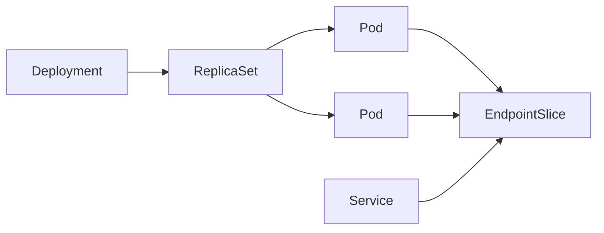
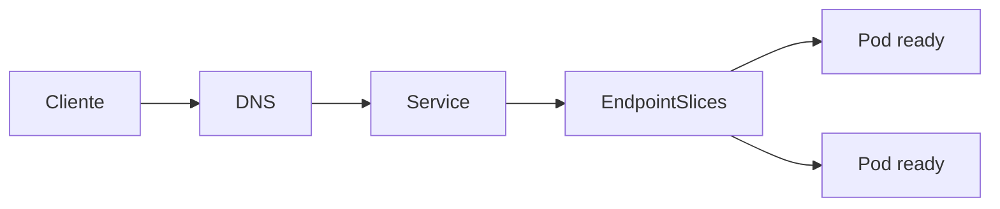
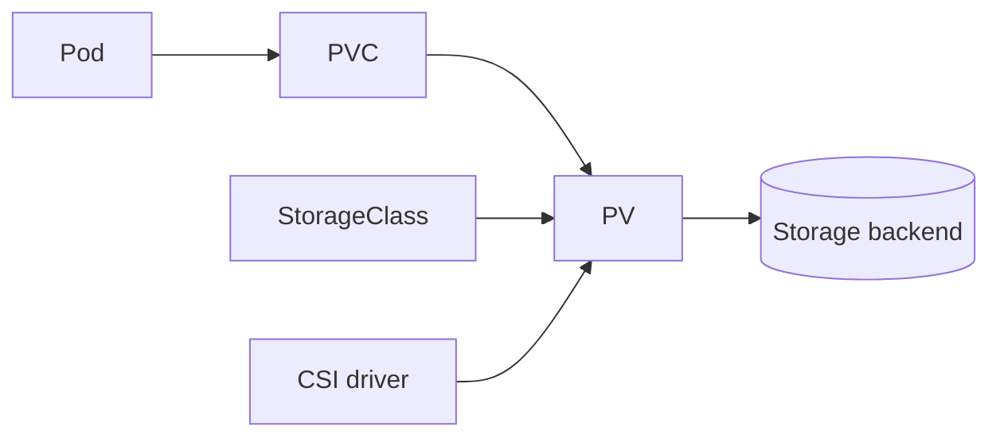

# Workloads, rede e storage no Kubernetes

Este capítulo conecta os objetos do Kubernetes ao caminho real de uma workload:
ser criada, agendada, receber rede e storage, entrar no tráfego, sofrer rollout e
ser encerrada. Decorar YAML sem esse lifecycle costuma produzir clusters que
"funcionam" até a primeira falha.

## 1. Objetos são intenções reconciliadas

A API armazena estado desejado. Controllers observam objetos e criam outros
objetos para aproximar o estado atual da intenção.



Um Deployment não "executa containers" diretamente. Ele controla ReplicaSets,
que controlam Pods. Essa cadeia de ownership é importante no troubleshooting:
apagar um Pod controlado não corrige a causa, porque o controller apenas cria
outro.

Use `ownerReferences`, `status`, conditions e events para descobrir quem está
reconciliando o quê.

## 2. Pod: unidade de scheduling e lifecycle

Pod é a menor unidade agendada pelo Kubernetes. Containers do mesmo Pod
compartilham network namespace e podem compartilhar volumes.

Isso significa:

- containers conversam por `localhost`;
- o IP pertence ao Pod, não a um container individual;
- containers devem ter lifecycle realmente acoplado;
- reiniciar/substituir o Pod pode trocar seu IP;
- filesystem efêmero não é storage durável.

Não agrupe serviços independentes num Pod apenas para "economizar rede". Isso
acopla rollout, scaling, recursos e falhas.

## 3. Init containers e sidecars

Init containers executam preparação antes dos containers principais, de acordo
com a semântica suportada pelo workload. Use-os para tarefas finitas que precisam
terminar antes da aplicação.

Evite transformar init container em dependência externa infinita. Um init que
fica aguardando banco sem deadline pode deixar centenas de Pods presos durante
um incidente compartilhado.

Sidecars fazem sentido quando compartilham lifecycle e contexto local com a
aplicação, por exemplo proxy ou agente. O custo é real:

- mais CPU/memória por Pod;
- mais processos para observar;
- ordering de startup/shutdown;
- falhas adicionais no caminho;
- upgrades coordenados.

## 4. Deployment e rolling update

Deployment é adequado a workloads replicáveis em que Pods podem ser
substituídos. Durante rollout, versões antiga e nova podem coexistir.

Parâmetros como `maxSurge` e `maxUnavailable` controlam a troca entre capacidade
extra e indisponibilidade temporária.

Exemplo mental:

```text
10 réplicas
maxSurge = 2
maxUnavailable = 1
```

O rollout pode temporariamente criar capacidade acima de 10 e também tolerar
alguma indisponibilidade. Isso exige folga real no cluster. Uma estratégia que
parece segura no YAML pode travar se não houver CPU/memória para o surge.

### Compatibilidade entre versões adjacentes

Durante rollout, assuma que `v1` e `v2` vão conversar com:

- o mesmo banco;
- as mesmas filas;
- clientes em versões diferentes;
- schemas em transição.

Migrações devem favorecer expand/migrate/contract. `rollout undo` não desfaz
DDL destrutivo ou efeito externo.

## 5. StatefulSet: identidade, não consenso

StatefulSet oferece identidade previsível de Pod, ordenação de certas operações e
integração com volumes persistentes por réplica.

Ele não fornece automaticamente:

- eleição de leader;
- quorum;
- replicação de aplicação;
- backup;
- failover correto;
- split-brain protection.

Rodar um banco em StatefulSet continua exigindo entender o protocolo daquele
banco. Kubernetes gerencia processos e recursos, não inventa semântica de dados.

## 6. Job e CronJob

Job modela trabalho finito. Retry de Pod não significa retry seguro do negócio.
Se o job envia cobrança, gera arquivo ou altera banco, ele precisa ser
idempotente.

CronJob adiciona agenda e políticas de concorrência. Pergunte:

- o que acontece se uma execução demora mais que o intervalo?
- duas execuções podem coexistir?
- uma execução perdida pode ser ignorada?
- qual é o deadline útil para começar?
- o efeito suporta retry?

Cron não é orquestrador de workflow complexo.

## 7. DaemonSet

DaemonSet mantém Pods nos nodes elegíveis. É comum para agentes de observabilidade,
rede ou segurança.

Como cresce junto com nodes, seu consumo precisa entrar no orçamento de cada
node. Um DaemonSet pesado pode reduzir capacidade de todas as workloads ao mesmo
tempo.

## 8. Requests e limits começam no scheduler

O scheduler usa requests para decidir se um Pod cabe em um node. O runtime aplica
limites conforme recurso e configuração.

Sem requests coerentes, o cluster perde informação de planejamento.

### CPU

CPU é compressível: ao atingir quota, o processo pode ser throttled. Sintoma
comum é p99 alto mesmo sem OOM.

### Memória

Memória não é compressível da mesma maneira. Pressão pode levar a OOM kill ou
eviction.

### QoS

A relação entre requests e limits influencia classes de QoS e comportamento sob
pressão. Não copie números entre serviços. Faça sizing com perfil real de carga,
GC/runtime, buffers e picos.

## 9. Scheduling além de "tem CPU?"

Placement também pode depender de:

- node selectors;
- node affinity;
- pod affinity/anti-affinity;
- taints/tolerations;
- topology spread constraints;
- prioridade/preemption;
- volumes e zonas;
- recursos especializados.

Regras rígidas aumentam previsibilidade até a falha reduzir opções. Um Pod
`Pending` pode ser o scheduler dizendo "nenhum node satisfaz todas as condições".

## 10. Service e EndpointSlice

Service cria identidade estável para um conjunto dinâmico de endpoints. Selectors
normalmente associam Pods, e EndpointSlices representam os endpoints descobertos.



Quando um Service "não funciona", separe:

1. DNS resolveu?
2. Service existe na porta correta?
3. selector encontra os Pods esperados?
4. EndpointSlice contém endpoints ready?
5. aplicação está ouvindo no endereço/porta?
6. NetworkPolicy/firewall permite o fluxo?
7. dataplane encaminha corretamente?

Essa decomposição é muito mais eficiente que reiniciar Pods ao acaso.

## 11. DNS e service discovery

CoreDNS ou solução equivalente resolve nomes dentro do cluster. DNS saudável é
parte do caminho crítico de quase todo microserviço.

Problemas comuns:

- search domains gerando consultas inesperadas;
- `ndots`/resolução ampliando tráfego;
- cache insuficiente;
- upstream DNS lento;
- NetworkPolicy bloqueando DNS;
- aplicação usando TTL/caching de maneira inadequada.

Observe latência e erro de DNS quando várias dependências parecem falhar ao mesmo
tempo.

## 12. O modelo de rede do Pod

Cada Pod recebe conectividade conforme o modelo implementado pelo plugin CNI.
Conceitualmente, um Pod possui network namespace, interfaces e rotas próprias.

O CNI pode conectar Pods por roteamento nativo, overlay ou outras técnicas. O
caminho concreto importa para:

- MTU;
- encapsulamento;
- latência;
- observabilidade;
- políticas;
- troubleshooting.

Não presuma que "é TCP, então a rede é transparente". Overlays e tradução podem
introduzir limites que só aparecem com payloads, rotas ou nós específicos.

## 13. Dataplane de Service

O encaminhamento de Service pode ser implementado por mecanismos como iptables,
IPVS, eBPF ou soluções específicas do ambiente.

A aplicação normalmente não precisa depender da implementação, mas quem opera o
cluster precisa saber onde observar quando:

- endpoints existem mas tráfego não chega;
- apenas alguns nodes falham;
- conexões antigas persistem durante rollout;
- uma policy parece não ser aplicada.

## 14. Ingress e Gateway API

Ingress e Gateway API representam configuração de entrada L7/L4, mas precisam de
um controller que implemente o comportamento.

Gateway API separa responsabilidades com recursos como GatewayClass, Gateway e
Routes, permitindo ownership mais explícito entre plataforma e times de
aplicação.

Pergunte sempre:

- qual controller implementa este recurso?
- quem controla TLS/certificados?
- como ocorre timeout/retry?
- como health do upstream é determinado?
- qual source of truth configura a rota?
- como uma mudança é promovida e revertida?

O objeto Kubernetes sozinho não garante o dataplane esperado.

## 15. NetworkPolicy

NetworkPolicy descreve fluxos permitidos para Pods selecionados, dentro das
capacidades implementadas pelo plugin.

Uma postura comum é:

```text
default deny
→ liberar DNS
→ liberar ingress necessário
→ liberar egress necessário
```

Policies são aditivas no modelo Kubernetes: múltiplas policies podem contribuir
com permissões. Teste o comportamento real do plugin.

Erros frequentes:

- aplicar default deny e esquecer DNS;
- liberar CIDR amplo para "fazer funcionar";
- assumir que policy seleciona Service em vez de endpoints;
- não modelar egress para APIs/cloud metadata;
- acreditar que NetworkPolicy substitui autorização da aplicação.

Rede restringe caminho. Não decide se o usuário pode ler o pedido `123`.

## 16. PV, PVC, StorageClass e CSI

PersistentVolume representa storage disponível; PersistentVolumeClaim expressa
uma solicitação; StorageClass descreve classe/provisionamento; CSI conecta o
cluster ao sistema de storage.



O scheduler pode precisar respeitar topologia. Um volume zonal pode impedir que o
Pod seja colocado em outra zona até existir detach/attach compatível.

## 17. Access modes e topologia

Não traduza `ReadWriteMany` como "qualquer storage faz isso". Access modes
descrevem capacidades/uso suportado pelo volume e driver.

Antes de escolher storage para workload stateful, responda:

- um ou vários nodes montam ao mesmo tempo?
- qual consistência existe entre writers?
- qual throughput/IOPS/latência?
- quanto demora attach/detach?
- existe snapshot?
- snapshot é consistente com a aplicação?
- restore já foi testado?

Volume persistente não substitui backup.

## 18. ConfigMap e Secret

ConfigMap é configuração não sensível. Secret é um objeto voltado a dados
sensíveis, mas seu nome não cria criptografia, rotação ou least privilege por si
só.

Mudanças podem aparecer de forma diferente conforme montagem por volume,
environment e mecanismo da aplicação. Defina explicitamente se configuração é:

- carregada apenas no startup;
- observada dinamicamente;
- versionada junto com deploy;
- capaz de rollback independente.

Para secrets, prefira credenciais curtas/workload identity quando a plataforma
permite e modele rotação antes do primeiro incidente.

## 19. Probes como controles diferentes

### Startup

Pergunta se inicialização terminou. Evita liveness prematura em apps lentos.

### Readiness

Pergunta se este endpoint deve receber novo tráfego agora.

### Liveness

Pergunta se reiniciar o processo pode recuperar um estado local ruim.

Não coloque indisponibilidade de uma dependência compartilhada diretamente em
liveness. Se o banco cai e todos os Pods começam a reiniciar, o cluster adiciona
uma tempestade de startup ao incidente original.

## 20. Graceful shutdown

Durante encerramento, a aplicação recebe sinal e possui uma janela para sair.
Um fluxo robusto é:

1. parar de aceitar trabalho novo;
2. ficar não-ready quando apropriado;
3. permitir propagação da remoção de endpoints;
4. concluir trabalho em andamento dentro do deadline;
5. fechar conexões e buffers;
6. encerrar antes do grace period.

`preStop` pode ajudar em situações específicas, mas não deve mascarar uma
aplicação incapaz de tratar sinais.

Teste o shutdown com tráfego real. Deploy sem perda é uma propriedade do sistema,
não uma expectativa.

## 21. Falhas recorrentes

| Falha | Sintoma | Evidência | Resposta |
| --- | --- | --- | --- |
| selector errado | Service sem backend | EndpointSlice vazio | corrigir labels/selector |
| readiness agressiva | capacidade oscila | probe failures | rever semântica/threshold |
| request alto | Pod Pending | scheduler events | sizing/constraints |
| request baixo | node pressionado | usage vs request | recalibrar recursos |
| MTU/overlay | requests grandes falham | packet/route evidence | ajustar caminho/CNI |
| default deny incompleto | DNS/API falha | policy + flow test | liberar fluxos mínimos |
| volume zonal | attach/schedule trava | PV topology/events | placement/storage correto |
| rollout incompatível | erros entre versões | telemetry por versão | compatibilidade adjacente |

## 22. Laboratórios

### Beginner

- crie Deployment + Service;
- compare Pods, ReplicaSet e `ownerReferences`;
- altere readiness e observe EndpointSlice.

### Intermediate

- configure requests/limits e provoque throttling/OOM;
- aplique default-deny e libere apenas DNS + dependência;
- faça rollout com duas versões observáveis.

### Advanced

- quebre selector, DNS e NetworkPolicy separadamente e diagnostique sem restart;
- monte volume zonal e observe impacto no scheduling;
- teste graceful shutdown durante carga.

### Expert

Construa uma aplicação com Gateway, Service, Deployment e banco. Injete falha de
node, rollout incompatível, CNI/policy incorreta e storage indisponível. Para
cada incidente, registre qual objeto representa intenção, onde o estado observado
divergiu e qual evidência permitiu localizar a camada defeituosa.

## Referências

- Kubernetes. [Workloads](https://kubernetes.io/docs/concepts/workloads/).
- Kubernetes. [Services, Load Balancing, and Networking](https://kubernetes.io/docs/concepts/services-networking/).
- Kubernetes. [Storage](https://kubernetes.io/docs/concepts/storage/).
- Kubernetes. [Probes](https://kubernetes.io/docs/concepts/configuration/liveness-readiness-startup-probes/).

---

[← Kubernetes](README.md) · [↑ Kubernetes](README.md) · [Operação e segurança →](operations-and-security.md)
