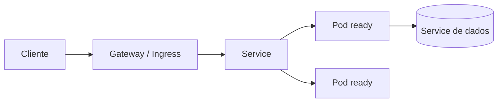

# Workloads, rede e storage no Kubernetes

## Objetos

- **Pod:** unidade de scheduling; containers compartilham rede e volumes.
- **Deployment/ReplicaSet:** réplicas stateless e rolling update.
- **StatefulSet:** identidade/ordem e volumes estáveis, não “HA automático”.
- **Job/CronJob:** trabalho finito/agendado com políticas de retry/concurrency.
- **DaemonSet:** um Pod por node elegível.
- **Service:** endpoint virtual sobre Pods; não espera readiness de negócio além da probe.

Labels são contrato: selector de Deployment é difícil de mudar e deve ser estável. Requests influenciam scheduling; limits influenciam enforcement. QoS e eviction tornam dimensionamento parte da confiabilidade.

## Rede

Cada Pod recebe IP no modelo de rede do cluster; CNI implementa conectividade. Service `ClusterIP` oferece descoberta/balanceamento L4. Ingress/Gateway API trata tráfego north-south via controller. NetworkPolicy depende do plugin e deve partir de default deny, liberando fluxos explícitos inclusive DNS.

## Storage e configuração

PVC solicita storage por StorageClass/CSI. Volume persistente não substitui backup/application consistency. ConfigMap não é secret; Secret Kubernetes é uma API object e precisa encryption at rest, RBAC e integração/rotação. Evite variável imutável para secret que precisa rotacionar sem restart ou documente rollout.

## Probes

- startup protege inicialização lenta;
- readiness remove endpoint do tráfego;
- liveness reinicia processo irrecuperável.

Liveness não deve depender de serviço externo: uma queda compartilhada reiniciaria tudo. Readiness excessivamente estrita pode retirar toda capacidade. Graceful shutdown marca not-ready, drena e termina dentro de `terminationGracePeriodSeconds`.

## Referências

- Kubernetes. [Workloads](https://kubernetes.io/docs/concepts/workloads/).
- [Services, Load Balancing, and Networking](https://kubernetes.io/docs/concepts/services-networking/).
- [Storage](https://kubernetes.io/docs/concepts/storage/).

---

[← Kubernetes](README.md) · [↑ Kubernetes](README.md) · [Operação e segurança →](operations-and-security.md)
