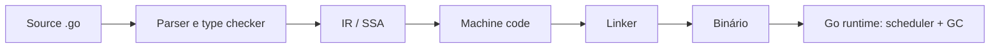

# Go

Go — frequentemente chamada de Golang para facilitar buscas — é uma linguagem compilada, com tipagem estática, Garbage Collector e concorrência integrada. Seu design favorece software de infraestrutura legível, builds rápidos e operação previsível.

> Trilha: [Fundamentos](fundamentals.md) → [Internals](internals.md) → [Exercícios](exercises.md) → [Referências](references.md)

## O que é

Go nasceu no Google e é desenvolvida como projeto open source. A especificação define sintaxe e semântica; a toolchain oficial (`go`) integra compilação, modules, formatação, análise e testes. O runtime fornece scheduler de goroutines, Garbage Collector, stacks que crescem e primitives de concorrência.

A linguagem é deliberadamente pequena. Ela oferece interfaces estruturais, composition, functions first-class e generics, mas evita inheritance de classes, exceptions para fluxo comum e metaprogramação extensa.

## Para que serve

- serviços de rede, APIs, gateways e microsserviços;
- CLIs e ferramentas distribuídas como binários nativos;
- agentes, controllers, proxies e software cloud-native;
- pipelines concorrentes e sistemas com muitas conexões;
- bibliotecas e serviços que valorizam compatibilidade e simplicidade operacional.

Go se destaca quando deploy simples, concorrência e manutenção por equipes pesam mais que máxima expressividade da linguagem.

## Quando utilizar

Use Go para serviços de longa duração, ferramentas de plataforma e componentes de rede que precisam de boa performance baseline, baixo atrito de build e runtime observável. Interfaces implícitas pequenas facilitam separar domínio de infraestrutura sem frameworks pesados.

É uma boa escolha quando a equipe quer uma convenção forte: `gofmt`, testes integrados, import paths e compatibilidade Go 1 reduzem decisões locais e variação estilística.

## Quando não utilizar

- interfaces gráficas ricas ou mobile quando o ecossistema dominante oferece integração melhor;
- kernels, firmware e hard real-time, pois há runtime e GC;
- computação numérica/GPU ou Data Science quando bibliotecas especializadas dominam;
- domínio que se beneficia muito de algebraic data types, pattern matching exaustivo ou DSLs expressivas;
- hot path que exige controle manual de layout, allocation e pausas além do oferecido pelo runtime.

Go não substitui desenho de protocolo, capacity planning nem disciplina de concorrência. Goroutines baratas ainda consomem memória, file descriptors, conexões e atenção operacional.

## Como funciona

O compilador faz parsing, type checking, transforms e otimização sobre SSA, gera machine code e o linker produz o executável. O runtime inicializa scheduler, memória, GC e suporte a goroutines. Cross-compilation é simples quando dependências não exigem toolchains externas, mas CGO muda essa equação.



O scheduler multiplexa goroutines (`G`) sobre threads do sistema (`M`) usando processors lógicos (`P`). Channels coordenam envio e recebimento; não tornam qualquer objeto compartilhado seguro. A semântica de visibilidade entre goroutines é definida pelo Go Memory Model.

Veja o modelo detalhado em [Internals](internals.md).

## Conceitos fundamentais

- **Packages:** unidade de namespace, compilação e encapsulamento.
- **Tipos:** bool, strings UTF-8 em bytes, inteiros, floats, arrays, structs e aliases/defined types.
- **Slices:** views sobre arrays com pointer, length e capacity.
- **Maps:** hash maps não seguros para escrita concorrente sem sincronização.
- **Functions:** múltiplos retornos, closures, variadic parameters e `defer`.
- **Methods/interfaces:** behavior por method sets e satisfação implícita.
- **Errors:** valores retornados, inspecionados com `errors.Is`/`errors.As`.
- **Pointers:** permitem compartilhar/mutar, sem pointer arithmetic comum.
- **Modules:** versionam conjuntos de packages com `go.mod` e `go.sum`.
- **I/O:** interfaces pequenas como `io.Reader` e `io.Writer` favorecem composition.

Pratique em [Fundamentos](fundamentals.md).

## Conceitos intermediários

- ownership de goroutines, cancellation e deadlines com `context.Context`;
- channels buffered/unbuffered, `select` e fechamento;
- mutexes, atomics e regra de quem possui estado;
- HTTP servers/clients, connection pooling e graceful shutdown;
- interfaces definidas pelo consumidor e dependency injection por constructors;
- error wrapping, classificação de falhas e idempotência;
- table-driven tests, benchmarks, fuzzing e Race Detector;
- profiling com pprof e tracing do runtime.

Concorrência não implica channels em todo lugar. Um `sync.Mutex` protege estado compartilhado de forma direta; channel é adequado quando comunica ownership, eventos ou backpressure.

## Conceitos avançados

- Go Memory Model e relações happens-before;
- scheduler G–M–P, work stealing, syscalls e network poller;
- stack growth, safe points e preemption;
- escape analysis e allocation no heap;
- Garbage Collector concorrente, write barriers e GC pacer;
- generics, type sets e custo de abstração;
- reflection, `unsafe` e CGO como fronteiras de risco;
- profile-guided optimization, execution traces e tuning de `GOMAXPROCS`/`GOMEMLIMIT`.

Não transforme runtime knobs em configuração ritual. Primeiro elimine trabalho, limite concorrência e corrija retenção; depois ajuste com profile e SLO.

## Internals

Uma goroutine começa com stack pequena que pode crescer e ser movida; por isso endereços são gerenciados pelo compilador/runtime. Escape analysis decide se um valor pode viver na stack ou precisa do heap. “Retornar pointer aloca sempre” é uma simplificação incorreta: confira `go build -gcflags=-m` e profile.

O scheduler associa:

| Elemento | Papel |
| --- | --- |
| G | goroutine e seu estado |
| M | thread do sistema operacional |
| P | recursos para executar código Go e fila local |

O GC concorrente reduz pausas, mas usa CPU e memória. Allocation rate, live heap e pointer density afetam seu custo. Detalhes completos em [Internals](internals.md).

## Ecossistema

- **Toolchain:** `go fmt`, `go vet`, `go test`, `go work`, `go tool`.
- **Qualidade:** Staticcheck, golangci-lint e govulncheck.
- **Web/RPC:** `net/http`, chi, Gin, Echo, Connect, gRPC.
- **Dados:** `database/sql`, pgx, sqlc, ORMs quando justificados.
- **CLI:** `flag`, Cobra e urfave/cli.
- **Testes:** package `testing`, fuzzing, `httptest`, Testcontainers.
- **Observabilidade:** `log/slog`, OpenTelemetry, Prometheus, pprof e runtime/trace.
- **Cloud:** Kubernetes, Terraform, containerd e grande parte do ecossistema CNCF usa Go.

Comece pela Standard Library e adicione frameworks quando eles removerem complexidade concreta.

## Boas práticas

- faça a zero value útil quando isso não violar invariantes;
- aceite interfaces e retorne concrete types, sem aplicar a frase como dogma;
- declare interfaces pequenas no package consumidor;
- passe `context.Context` como primeiro parâmetro, não o armazene em struct;
- dê a cada goroutine owner, condição de término e política de erro;
- wrap errors com contexto e preserve identidade para `errors.Is`/`As`;
- limite concorrência, filas, corpo de requests e tempo de I/O;
- use `defer` perto da aquisição do recurso, verificando errors de flush/close quando importam;
- mantenha packages coesos e evite `util`, `common` e import cycles.

## Anti-patterns

- iniciar goroutine sem saber como termina: goroutine leak;
- concorrência ilimitada, especialmente “uma goroutine por item” sem semaphore;
- copiar `sync.Mutex`, `WaitGroup` ou structs que os contêm após uso;
- enviar em channel que pode ser fechado por outro produtor;
- usar `panic` para falhas esperadas de negócio;
- ignorar error com `_` ou logar e retornar o mesmo error em todas as camadas;
- criar interface ao lado da implementação “por precaução”;
- usar pointer para todo valor, aumentando aliasing e allocations;
- `defer` dentro de loop longo sem delimitar o escopo;
- reutilizar o `http.DefaultClient` sem timeout como política implícita;
- usar `time.Sleep` para coordenar testes concorrentes.

## Performance

Meça o serviço e o hot path. Benchmarks com `go test -bench` precisam de dados representativos e controle de setup. Use `-benchmem` para allocations, pprof para CPU/heap/block/mutex e execution trace para scheduler/latência.

Ordem útil:

1. melhore algoritmo, acesso a dados e round trips;
2. limite work-in-progress e reutilize conexões;
3. reduza allocations no caminho quente quando profiles confirmarem;
4. ajuste layout/buffers e evite conversões `string`↔`[]byte` repetidas;
5. considere PGO e runtime knobs com experimento controlado.

Pools podem prolongar memória e aumentar complexidade; `sync.Pool` é cache efêmero orientado ao GC, não um pool geral de recursos.

## Segurança

- use `html/template`, não `text/template`, para HTML não confiável;
- parameterize SQL e argumentos de comandos; evite shell parsing;
- normalize e confine paths, considerando symlinks e TOCTOU;
- limite request body, headers, decompression, tempo e concorrência;
- configure TLS, autenticação e autorização explicitamente;
- não exponha pprof, metrics sensíveis ou debug endpoints publicamente;
- evite incluir secrets e PII em errors, logs e traces;
- execute `govulncheck`, revise modules e proteja o build pipeline;
- trate `unsafe`, reflection e CGO como boundaries de alto risco.

O Race Detector encontra data races executadas pelo teste, não prova ausência delas. Segurança também exige threat model e isolamento operacional.

## Testes

Use table-driven tests para casos, subtests para diagnóstico e fakes pequenos nas boundaries. Integration tests devem exercitar banco/protocolo real quando a diferença importa. Fuzzing encontra inputs inesperados; benchmarks impedem regressões mensuráveis; Race Detector cobre execuções concorrentes.

```go
func TestParsePort(t *testing.T) {
	tests := []struct {
		name string
		in   string
		want int
		ok   bool
	}{
		{"minimum", "1", 1, true},
		{"too high", "65536", 0, false},
		{"not a number", "http", 0, false},
	}
	for _, tt := range tests {
		t.Run(tt.name, func(t *testing.T) {
			got, err := ParsePort(tt.in)
			if (err == nil) != tt.ok || got != tt.want {
				t.Fatalf("ParsePort(%q) = %d, %v", tt.in, got, err)
			}
		})
	}
}
```

Teste timeout, cancellation, partial read/write, duplicate delivery e graceful shutdown, não apenas funções puras.

## Observabilidade

Instrumente HTTP/RPC, database, queue e chamadas externas. Logs estruturados devem carregar IDs e causa sem alta cardinalidade descontrolada. Métricas RED cobrem rate, errors e duration; acrescente saturation: goroutines, file descriptors, connection pools, queue depth e GC.

Traces mostram critical path, mas sampling precisa preservar erros e latência rara. Profiles explicam consumo; não são substitutos de telemetry contínua. Exponha debug endpoints apenas em listener administrativo autenticado ou rede restrita.

Sinais úteis: p95/p99, heap live, allocation rate, GC CPU fraction, goroutine count, mutex/block profiles, scheduler latency, pool wait e backlog age.

## Exemplos

Servidor HTTP com dependencies, limites e shutdown explícitos:

```go
type Server struct {
	log *slog.Logger
	db  *sql.DB
}

func (s *Server) health(w http.ResponseWriter, r *http.Request) {
	ctx, cancel := context.WithTimeout(r.Context(), 500*time.Millisecond)
	defer cancel()
	if err := s.db.PingContext(ctx); err != nil {
		http.Error(w, "unavailable", http.StatusServiceUnavailable)
		return
	}
	w.WriteHeader(http.StatusNoContent)
}

func newHTTPServer(handler http.Handler) *http.Server {
	return &http.Server{
		Addr:              ":8080",
		Handler:           http.MaxBytesHandler(handler, 1<<20),
		ReadHeaderTimeout: 2 * time.Second,
		WriteTimeout:      5 * time.Second,
		IdleTimeout:       60 * time.Second,
	}
}
```

Health check de dependência pode ser inadequado para liveness; se o banco cair, reiniciar todas as instances agrava a falha. Separe liveness, readiness e diagnóstico.

## Exercícios

A trilha completa está em [Exercícios](exercises.md):

- **Beginner:** parser streaming e CLI transacional.
- **Intermediate:** crawler limitado com cancellation e telemetry.
- **Advanced:** worker pool com backpressure e fault injection.
- **Expert:** serviço distribuído de jobs com idempotência e recovery.

Toda solução deve rodar `go test`, `go test -race`, análise estática aplicável e benchmark quando houver requisito de performance.

## Projeto prático

Construa um gateway de webhooks:

```text
Internet → HTTP server → validação/HMAC → durable inbox
                                      ↓
                              workers → destinos
                                      ↓
                           logs/metrics/traces
```

**Requisitos:** body limitado, verificação HMAC em bytes originais, deduplicação, fan-out limitado, timeout, retry com jitter, graceful shutdown e replay.

**Milestones:** contrato e threat model; persistence; worker/cancellation; idempotência; telemetry; load/chaos tests; runbook.

**Conclusão:** nenhum recurso cresce sem limite; corrida não aparece sob testes relevantes; crash converge; p99 atende SLO; operação identifica destino lento sem ler payload sensível.

## Perguntas de entrevista

1. Slice e array diferem em ownership, capacity e cópia como?
2. Quando um valor escapa para o heap e por que não se deve adivinhar?
3. O que interface `nil` contém e como surge o “typed nil”?
4. Quando channel é melhor que mutex, e quando não é?
5. Quem deve fechar um channel com múltiplos produtores?
6. Como `context` propaga cancellation e o que não deveria transportar?
7. Como distinguir error transitório, permanente e de programação?
8. Como encontrar goroutine leak e contention em produção?
9. O que acontece quando uma goroutine entra em syscall bloqueante?
10. Como desenhar shutdown que não perde trabalho confirmado?

Respostas fortes conectam semântica, modo de falha, ferramenta de diagnóstico e trade-off.

## Comparações

| Aspecto | Go | Python | Rust |
| --- | --- | --- | --- |
| Tipos | estáticos, interfaces estruturais | dinâmicos com hints | estáticos, ownership/lifetimes |
| Memória | GC concorrente | GC/refcount na implementação comum | ownership sem GC geral |
| Concorrência | goroutines/channels/mutexes | threads/processes/asyncio | threads/async, garantias fortes |
| Distribuição | binário nativo simples | runtime + ambiente/bundle | binário nativo |
| Força | serviços e infraestrutura | dados, IA, automação | sistemas e controle fino |

Go oferece modelo operacional simples e produtividade, mas menos controle que Rust e ecossistema científico menor que Python. CGO aproxima bibliotecas nativas ao custo de builds, scheduler interactions e segurança mais complexos.

## Próximos estudos

1. implemente [Fundamentos](fundamentals.md) sem framework;
2. estude [Internals](internals.md) junto a profiles e traces reais;
3. domine HTTP, SQL, transações, filas e contratos;
4. avance para observabilidade, segurança e sistemas distribuídos;
5. leia source da Standard Library antes de adotar abstrações equivalentes.

## Livros

- *The Go Programming Language*, Alan A. A. Donovan e Brian W. Kernighan — fundamentos e modelo da linguagem; confirme APIs contra versões atuais.
- *Learning Go*, Jon Bodner — práticas modernas e design idiomático.
- *100 Go Mistakes and How to Avoid Them*, Teiva Harsanyi — armadilhas de produção e runtime.
- *Concurrency in Go*, Katherine Cox-Buday — patterns, cancellation e pipelines.

Links oficiais estão em [Referências](references.md).

## Papers

- [Go at Google: Language Design in the Service of Software Engineering](https://go.dev/talks/2012/splash.article) — artigo primário de Rob Pike sobre contexto e decisões de design.
- [Communicating Sequential Processes](https://doi.org/10.1145/359576.359585) — base conceitual para comunicação por processos.
- [The Go Memory Model](https://go.dev/ref/mem) — especificação normativa, não paper acadêmico, indispensável para concorrência correta.

## Documentação oficial

- [Go Documentation](https://go.dev/doc/)
- [The Go Programming Language Specification](https://go.dev/ref/spec)
- [Effective Go](https://go.dev/doc/effective_go)
- [Go Memory Model](https://go.dev/ref/mem)
- [Go Modules Reference](https://go.dev/ref/mod)
- [Standard Library](https://pkg.go.dev/std)

## Outras referências

- [Go Blog](https://go.dev/blog/)
- [Go source code](https://go.googlesource.com/go)
- [Go Security](https://go.dev/security/)
- [OpenTelemetry Go](https://opentelemetry.io/docs/languages/go/)
- seleção comentada por tópico em [Referências](references.md).

---

[← Referências](references.md) · [↑ Índice de linguagens](../README.md) · [Fundamentos →](fundamentals.md)
