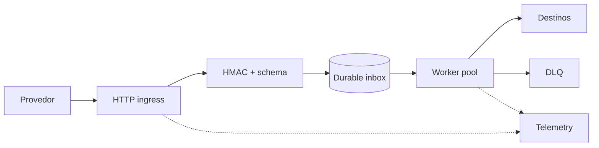

# Exercícios de Go

Cada exercício deve resultar em um module reproduzível com `gofmt`, testes e uma nota de engenharia. Quando houver concorrência, execute cenários relevantes com Race Detector; quando houver meta de performance, entregue benchmark e profile, não apenas impressão subjetiva.

## Beginner

### 1. Agregador streaming

Leia CSV de transações por `io.Reader`, valide moeda/valor e grave um resumo por `io.Writer`.

**Pratique:** packages, structs, maps, parsing, errors e interfaces de I/O.

**Critérios:** memória não cresce com o arquivo; line number aparece no error; input e token têm limites; output é determinístico; tests cobrem partial read e dados inválidos.

### 2. Value object de dinheiro

Modele `Money` com constructor, `Add`, `Subtract` e formatação. Não use float.

**Critérios:** moeda incompatível e overflow são tratados; zero value tem semântica documentada; table-driven tests e fuzz test cobrem parser; decisão value/pointer receiver é justificada.

### 3. Slice aliasing lab

Reproduza três bugs: append que sobrescreve view, subslice que retém 100 MB e API que guarda slice mutável do chamador.

**Critérios:** teste falha antes da correção; heap profile comprova retenção; solução estabelece ownership sem cópias indiscriminadas.

### 4. CLI com escrita segura

Implemente uma CLI de bookmarks usando `flag` e arquivo JSON.

**Critérios:** exit codes úteis; permissão restrita; escrita temp + sync/close/rename conforme garantia escolhida; interruption não corrompe último arquivo válido; path é injetável em tests.

## Intermediate

### 5. Crawler limitado

Busque URLs do mesmo host e extraia links, com `context`, workers e deduplicação.

**Requisitos:** concurrency global e por host, timeout, body máximo, redirects controlados, User-Agent e proteção contra SSRF.

**Critérios:** nenhuma goroutine vaza após cancellation; server de teste simula lentidão/erro; logs não registram query sensível; métricas separam operação e tentativa.

### 6. Cache TTL concorrente

Implemente cache com capacidade, TTL, clock injetável e política LRU aproximada ou exata.

**Critérios:** invariantes passam sob `-race`; nenhuma goroutine de limpeza fica órfã; benchmark mede contention; documento compara mutex único, sharding e owner goroutine.

### 7. Refactoring de interfaces

Um serviço recebe interface `Repository` com 18 methods e usa apenas dois. Mova o contrato ao consumidor, separe transaction boundary e elimine mocks acoplados à implementação.

**Critérios:** fake pequeno; error identity preservada; integration test exercita SQL real; antes/depois discute coesão e custo de muitas interfaces.

### 8. HTTP client de produção

Implemente client para API idempotente com transport reutilizado.

**Requisitos:** deadline total, dial/TLS/header timeouts, retry budget, jitter, limite de body, fechamento e redaction.

**Critérios:** respeita `Retry-After`; não repete erro permanente; cancellation interrompe backoff; test detecta connection reuse sem depender de sleep.

## Advanced

### 9. Worker pool com backpressure

Construa pipeline `reader → validate → batch → persist` com capacidade limitada.

**Critérios:** falha cancela stages; channels têm ownership de fechamento claro; shutdown drena apenas o trabalho contratado; memory/goroutine count são limitados; trace mostra saturação.

Compare implementação com channels a uma com mutex/condition ou semaphore, escolhendo a mais simples para as garantias.

### 10. Caça ao goroutine leak

Crie e diagnostique leaks por send sem receiver, ticker não encerrado, HTTP body não fechado e child context abandonado.

**Entrega:** profile antes/depois, teste que detecta estabilização sem assert frágil de contagem exata e runbook para produção.

### 11. Índice concorrente persistente

Mantenha índice em memória e grave snapshots enquanto readers continuam.

**Critérios:** consistência definida; atomic publish de snapshot; limite de memória; crash recovery; `-race`; benchmarks de read/write e análise de `RWMutex`, copy-on-write e sharding.

### 12. Performance investigation

Uma API aloca 50 KB/request e perde SLO p99 sob 500 RPS. Forneça implementação propositalmente ineficiente e investigue.

**Entrega:** benchmark estável, CPU/heap profiles, trace, mudança mínima e comparação estatística. Verifique se `sync.Pool` realmente ajuda e se aumenta memória retida.

## Expert

### 13. Dispatcher durável

Implemente dispatcher de jobs at-least-once com leases e múltiplas instances.

**Restrições:** crash antes/depois do efeito, clock skew, job venenoso, provedor lento e deploy concorrente.

**Critérios:** state machine, idempotency key, recovery de lease, retry budget, DLQ, backlog age, chaos tests e migration compatível.

### 14. Gateway multi-tenant

Projete gateway que aplica quotas e concurrency limits por tenant sem permitir noisy neighbor.

**Critérios:** fairness definida; memória proporcional e limitada; cardinalidade de metrics controlada; config reload atômico; benchmark com distribuição desigual; threat model inclui spoofing de tenant.

### 15. Investigação de GC e memory limit

Crie workload com grande live heap, allocation churn e cache sem limite. Execute em container com CPU/memory quotas.

**Entrega:** profiles, runtime metrics, variação de `GOGC`/`GOMEMLIMIT`, identificação da retenção real e recomendação. Demonstre o risco de GC thrashing com limite inviável.

### 16. System design: control plane

Desenhe e implemente um vertical slice de control plane que reconcilia desired state em workers distribuídos.

**Restrições:** eventos duplicados e fora de ordem, leader failover, API rate limit, rollout e rollback.

**Critérios:** reconciliation idempotente; work queue limitada; per-key serialization; retry/jitter; status observado separado da intenção; traces e métricas de queue; testes de convergência.

## Projeto integrador: gateway de webhooks

### Objetivo

Receber webhooks de vários provedores, autenticar bytes originais, persistir antes de confirmar e entregar a destinos com comportamento observável.

### Requisitos

- body e headers limitados;
- segredo rotacionável e comparação constante de HMAC;
- deduplicação por provedor/ID;
- entrega at-least-once com idempotency key;
- concorrência global, por tenant e por destino;
- graceful shutdown dentro do budget;
- replay com autorização e audit log.

### Milestones

1. contratos HTTP, threat model e modelo de domínio;
2. inbox transacional e migrations;
3. worker pool com cancellation/backpressure;
4. retries, jitter, circuit breaker e DLQ;
5. logs, metrics, traces, profiles administrativos;
6. load, fuzz, race e chaos tests;
7. runbook, capacity plan, ADR e rollback.

### Critérios de conclusão

- confirmação nunca ocorre antes da durabilidade prometida;
- repetir evento não duplica estado lógico;
- crash em boundaries converge após restart;
- overload é rejeitado/atrasado de maneira limitada;
- tenant lento não bloqueia os demais além do contrato;
- p95/p99, pool wait e backlog age atendem SLO definido;
- telemetry não contém payload, signature ou secrets;
- `go test ./...`, `go test -race ./...`, fuzz corpus e análise de vulnerabilidades são reproduzíveis.

## Checklist de revisão

1. Quem cria e encerra cada goroutine?
2. Quem fecha cada channel e por que não há send-after-close?
3. Onde slices/maps podem ser compartilhados?
4. Qual limite controla memória, conexões e trabalho em progresso?
5. Que error é recuperável e quem decide retry?
6. Como context cancellation alcança I/O real?
7. Qual profile sustenta a otimização?
8. Que métrica detecta regressão e qual runbook responde?

## Simulação de entrevista

Apresente um exercício em 45 minutos: requisitos, desenho, slice testável, falhas, performance e evolução. Explique por que escolheu channel, mutex ou ausência de concorrência. A qualidade está no raciocínio verificável, não em quantidade de goroutines.

---

[← Internals](internals.md) · [↑ Trilha Go](README.md) · [Referências →](references.md)
