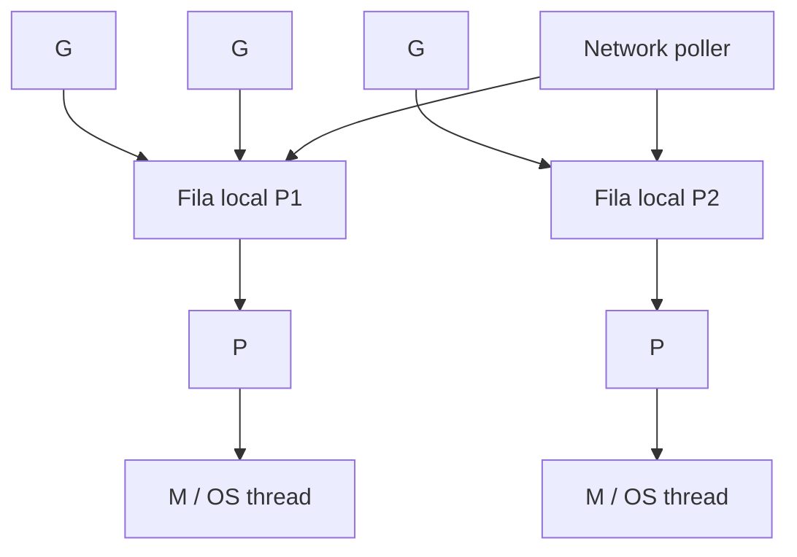

# Internals de Go

Internals explicam custos e modos de falha, mas não substituem a [especificação](https://go.dev/ref/spec). Detalhes do compilador e runtime podem mudar; valide sempre na versão implantada.

## Compilação e linking

A toolchain oficial transforma packages segundo um pipeline conceitual:

```text
source → AST/type checking → IR/SSA → machine code → object archives → executable
```

O build cache evita recompilar packages inalterados. Imports formam DAG; ciclos são rejeitados, incentivando boundaries direcionais. O linker elimina parte de código inalcançável e inclui runtime/metadata necessários.

`go build -x` mostra comandos; `go tool compile` e packages de análise expõem aspectos mais baixos. Flags internas não são API estável. Cross-compilation costuma ser direta em código Go puro; CGO exige toolchain e bibliotecas do alvo.

## SSA, inlining e bounds-check elimination

O compiler usa Static Single Assignment para otimizações. Inlining remove custo de algumas chamadas e abre novas otimizações; bounds checks podem ser eliminados quando segurança é provada.

```go
func sum(values []int64) int64 {
	var total int64
	for _, value := range values {
		total += value
	}
	return total
}
```

Não reescreva código legível com “truques” sem benchmark. Veja diagnósticos com `go build -gcflags=-m=2`, lembrando que a saída e heurísticas mudam por versão.

## Valores, headers e cópias

Tudo é passado por valor. O valor de um slice é um header que referencia backing array; map, channel, function e interface também carregam descritores/referências gerenciadas. Copiar o header não copia o conteúdo.

```text
slice header
┌─────────┬─────┬─────┐
│ pointer │ len │ cap │────▶ backing array
└─────────┴─────┴─────┘
```

Consequências:

- append pode alterar array visível por outro slice ou migrar para novo array;
- subslice pequeno pode reter array grande;
- copiar struct copia fields superficialmente;
- copiar interface copia o par dynamic type/value, não necessariamente objeto apontado.

Estabeleça ownership em APIs concorrentes. “Não mutar após publicar” é uma estratégia simples e eficaz.

## Escape analysis: stack ou heap

O compiler decide onde armazenar valores com base em lifetime e uso, não apenas sintaxe. Um pointer pode apontar para valor de stack se não escapar; um valor aparentemente local pode ir ao heap por interface, closure ou lifetime.

```go
func id(value int) *int {
	return &value // seguro; compiler move conforme necessário
}
```

Heap allocation aumenta trabalho do GC, mas otimizar escape sem profile pode piorar design. Meça `allocs/op`, heap profile e allocation rate. Às vezes remover conversão para interface ou pré-dimensionar slice ajuda; às vezes I/O domina tudo.

## Stacks de goroutines

Goroutines começam com stacks pequenas e o runtime as cresce/copia conforme necessário. Isso permite muitas goroutines, mas “barata” não significa gratuita:

- stack mínima × milhões ainda consome memória;
- timers, buffers, TLS e closures podem dominar;
- uma goroutine bloqueada retém referências no stack;
- observação e scheduling também têm custo.

Pointers são ajustados quando stack se move porque o runtime conhece seu mapa. `unsafe.Pointer` pode romper essas garantias; regras de `unsafe` são estritas.

## Scheduler G–M–P

O scheduler multiplexa goroutines:

- **G:** goroutine, stack e estado;
- **M:** OS thread que executa;
- **P:** capacidade lógica e recursos necessários para executar Go code.

Cada P mantém fila local; work stealing redistribui trabalho. Há fila global e mecanismos especiais para timers, syscalls e network poller. `GOMAXPROCS` limita Ps executando Go simultaneamente, não número de goroutines ou threads.



Quando uma goroutine bloqueia em I/O integrado ao poller, M pode executar outra G. Em syscall bloqueante, runtime pode destacar P e criar/reusar outra M. CGO e locks de thread exigem atenção adicional.

Preemption evita que uma goroutine CPU-bound monopolize um P, mas latência do scheduler ainda depende de runnable goroutines, syscalls, GC e CPU quota. Em containers, use versão/runtime que respeite limites disponíveis e valide `GOMAXPROCS` efetivo.

## Channels internamente e semanticamente

Channel mantém buffer opcional, filas de senders/receivers e sincronização interna. Unbuffered send encontra receive; buffered send pode concluir ao copiar para buffer.

As garantias de happens-before importam mais que a estrutura interna:

- send é sincronizado com receive correspondente segundo o Memory Model;
- close é sincronizado com receive que observa channel fechado;
- capacidade altera quando bloqueio ocorre e, portanto, a coordenação.

Não use `len(ch)` para decidir se um send futuro bloqueará: é snapshot racy. Não feche channel para coletar recursos internos; feche para comunicar “não haverá novos valores”.

`select` escolhe entre cases prontos; não use sua pseudoaleatoriedade como garantia de fairness de negócio. Um `default` pode virar busy loop e consumir CPU.

## Mutexes, atomics e Memory Model

Data race ocorre quando acessos conflitantes concorrentes, ao menos um write, não são sincronizados. O resultado não se torna aceitável só porque “funciona no teste”. `sync.Mutex`, channels, atomics e outras primitives estabelecem ordens específicas.

```go
type Registry struct {
	mu    sync.RWMutex
	items map[string]Item
}

func (r *Registry) Get(id string) (Item, bool) {
	r.mu.RLock()
	defer r.mu.RUnlock()
	item, ok := r.items[id]
	return item, ok
}
```

`RWMutex` não é automaticamente mais rápido: readers, write frequency e critical section determinam. Atomics servem para counters/flags simples; uma state machine multi-field costuma precisar de lock. Copiar structs com locks quebra identidade da sincronização.

## Network poller e deadlines

O runtime integra sockets não bloqueantes ao scheduler nas plataformas suportadas. `net.Conn` deadlines acordam operações; `context` por si só não interrompe toda API que ignora contexto. A Standard Library conecta cancellation nas variantes `...Context` onde documentado.

No HTTP client:

- `Client.Timeout` limita a operação de alto nível;
- `Transport` controla dial, TLS, idle pool e response headers;
- request context permite cancellation por request;
- body streaming ainda precisa de consumo/fechamento correto.

Timeout não é retry. Retry muda semântica e pode duplicar efeitos; exige idempotência, budget e jitter.

## Garbage Collector

O GC do runtime é concorrente, tracing e non-generational nas implementações atuais da toolchain oficial. Conceitualmente marca objetos alcançáveis e recupera os demais. Write barriers preservam invariantes enquanto aplicação e mark phase executam simultaneamente.

Custos dependem principalmente de:

- tamanho do live heap;
- allocation rate;
- quantidade/densidade de pointers a examinar;
- CPU disponível e limite de memória;
- frequência de ciclos e assists cobrados às goroutines.

`GOGC` relaciona meta do próximo heap ao live heap; `GOMEMLIMIT` fornece limite suave ao runtime. Diminuir `GOGC` reduz memória e aumenta CPU; elevar faz o oposto. Um memory limit irreal pode causar thrashing de GC. Memory limit do runtime não inclui necessariamente toda memória de CGO, mapping e kernel.

Pool e cache ilimitados aumentam live heap e não serão “consertados” pelo GC. Primeiro estabeleça limites e ownership.

## Interfaces e dispatch

Uma interface guarda informações de tipo dinâmico e dado. Satisfação é implícita, verificada em compile time quando atribuição é conhecida. Chamada por interface pode impedir algumas otimizações e envolver allocation em certos contextos, mas o custo é normalmente menor que uma chamada de rede ou banco.

Typed nil surge quando dynamic type existe e dynamic value é nil. A interface como conjunto não é nil. Retorne `nil` literal no caminho sem error.

Type assertions precisam do resultado `ok` quando falha é esperada. Type switches são adequados em boundaries fechadas; uma longa cascata pode sinalizar interface mal modelada.

## Maps e crescimento

Map é uma estrutura hash gerenciada pelo runtime; algoritmo/layout são detalhes internos. O contrato não garante ordem nem segurança de escrita concorrente. Crescimento pode redistribuir armazenamento, por isso elementos de map não são addressable como variáveis estáveis.

Para modificar struct dentro de map:

```go
item := items[id]
item.Count++
items[id] = item
```

ou armazene pointers com ownership claro. Pointer reduz cópia, mas aumenta aliasing, heap e mutação compartilhada.

## Reflection, `unsafe` e CGO

Reflection habilita serializers, DI frameworks e tooling, mas troca verificações de compile time por paths de runtime e pode alocar. Cache de metadata e geração de código são alternativas em hot paths.

`unsafe` permite reinterpretar memória sob regras estreitas. Mudanças de runtime, GC ou arquitetura podem invalidar suposições. Exija benchmark, teste multiplataforma e comentário com invariantes.

CGO cruza runtimes:

- chamadas têm overhead e regras sobre pointers;
- C memory não é gerenciada pelo Go GC;
- blocking e callbacks interagem com threads;
- cross-compilation e builds reproduzíveis ficam mais difíceis;
- sanitizers e debuggers precisam cobrir ambos os lados.

## Diagnóstico com as ferramentas certas

| Sintoma | Evidência inicial |
| --- | --- |
| CPU alta | CPU profile + métricas de workload |
| heap cresce | heap profiles por `inuse_space` e cardinalidades |
| allocation/GC alto | `alloc_space`, `allocs/op`, gctrace controlado |
| latência com CPU baixa | trace, block/mutex profiles, downstream latency |
| goroutines crescem | goroutine profile agrupado por stack |
| race suspeita | `go test -race` com cenário representativo |
| scheduler estranho | runtime trace e CPU quota |

pprof é endpoint poderoso e potencialmente sensível. Colete em listener administrativo e por janela curta quando perfis de contention adicionarem overhead.

## Experimentos guiados

1. Faça um slice pequeno reter buffer de 100 MB; confirme com heap profile e corrija por cópia.
2. Compare mutex e channel para contador/state owner; reporte clareza e throughput.
3. Gere goroutine leak bloqueada em send; detecte pelo profile e implemente cancellation.
4. Varie allocation rate e `GOMEMLIMIT`; observe heap, GC CPU e p99.
5. Compare HTTP client novo por request com client reutilizado; observe conexões e latência.
6. Force syscall/CGO bloqueante e examine o trace do scheduler.

Cada experimento precisa de hipótese, versão do Go, hardware/limits, workload, medidas e ameaça à validade.

## Modelo de decisão

Antes de otimizar ou paralelizar:

1. qual SLO está ameaçado e qual profile aponta o custo?
2. podemos remover trabalho ou round trip?
3. quem possui dados, goroutines e fechamento?
4. qual limite impede overload de virar fila/memória?
5. qual relação happens-before torna o estado correto?
6. como cancellation e error chegam ao chamador?
7. como validar melhoria sem esconder regressão de p99 ou memória?

---

[← Fundamentos](fundamentals.md) · [↑ Trilha Go](README.md) · [Exercícios →](exercises.md)
