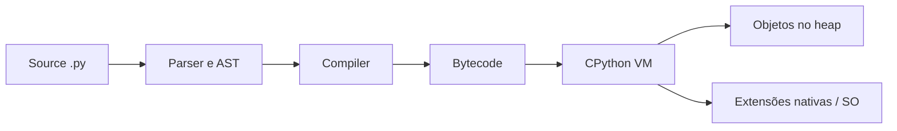

# Python

Python é uma linguagem de propósito geral que privilegia legibilidade e velocidade de desenvolvimento sem esconder as decisões de engenharia exigidas por sistemas em produção.

> Trilha: [Fundamentos](fundamentals.md) → [Internals](internals.md) → [Exercícios](exercises.md) → [Referências](references.md)

## O que é

Python é uma linguagem de alto nível, dinâmica e com gerenciamento automático de memória. A especificação define a linguagem; CPython é sua implementação de referência e a mais usada. Essa distinção importa: `asyncio`, bytecode, Garbage Collector e GIL descrevem sobretudo CPython, enquanto PyPy, GraalPy e outras implementações tomam decisões diferentes.

O design combina objetos, funções, iteradores, exceptions e módulos. O lema “batteries included” aparece na Standard Library: uma aplicação pode manipular arquivos, HTTP, JSON, concorrência e bancos SQLite sem dependências externas.

## Para que serve

- APIs, backends, automações e CLIs;
- análise de dados, Machine Learning e computação científica;
- ETL, orquestração e integração entre sistemas;
- testes, protótipos e ferramentas de desenvolvimento;
- aplicações assíncronas com muitas operações de I/O.

Python reduz o tempo entre ideia e feedback. O ganho vem com custos: erros de tipo podem aparecer em runtime, abstrações têm overhead e a distribuição de aplicações nativas exige cuidado.

## Quando utilizar

Use quando produtividade, ecossistema e clareza forem mais importantes que latência de cauda mínima ou controle preciso de memória. É particularmente forte quando bibliotecas nativas fazem o trabalho pesado — NumPy, PyTorch e drivers de banco — ou quando a aplicação é I/O-bound.

Também é uma boa escolha para serviços cuja complexidade dominante está nas regras de negócio. Type hints, testes e boundaries bem definidos compensam parte da flexibilidade dinâmica.

## Quando não utilizar

- hard real-time, firmware ou ambientes com memória estritamente limitada;
- hot paths CPU-bound que não podem ser delegados a código nativo ou processos;
- binários minúsculos e autocontidos como requisito central;
- sistemas onde pausas e consumo de memória precisam de controle determinístico;
- equipes sem disciplina para testes, análise estática e gestão de dependências em uma base grande.

Não descarte Python apenas por benchmark sintético: meça o fluxo completo. Da mesma forma, não o escolha só pela rapidez do protótipo se operação e distribuição dominarem o ciclo de vida.

## Como funciona

Em CPython, source code é tokenizado, parseado em AST, compilado para bytecode e executado por uma virtual machine. Objetos vivem em memória privada do processo; referências são contadas e um Garbage Collector complementar detecta ciclos. Threads compartilham o heap, mas o GIL tradicional limita a execução simultânea de bytecode Python em uma única instância do interpreter.



Imports executam o módulo uma vez e o armazenam em `sys.modules`. `asyncio` usa um Event Loop cooperativo: uma coroutine cede controle em `await`; isso melhora concorrência de I/O, mas não transforma código CPU-bound em paralelo.

Detalhes e implicações estão em [Internals](internals.md).

## Conceitos fundamentais

- **Names e objects:** variáveis são nomes ligados a objetos, não caixas tipadas.
- **Tipos:** `int`, `float`, `bool`, `str`, `bytes`, `None` e tipos definidos pelo usuário.
- **Collections:** `list`, `tuple`, `dict`, `set` e `frozenset`, com diferentes semânticas de ordem e mutabilidade.
- **Controle:** `if`, `match`, `for`, `while` e comprehensions.
- **Funções:** first-class objects, parâmetros posicionais/nominais, `*args`, `**kwargs` e closures.
- **Erros:** exceptions comunicam falhas; `try/except/else/finally` controla recuperação e cleanup.
- **Módulos:** arquivos e packages formam namespaces e unidades de distribuição.
- **I/O:** context managers garantem fechamento de arquivos e conexões.
- **Ambientes:** `venv` isola dependências; `pyproject.toml` descreve build e ferramentas.

Veja exemplos progressivos em [Fundamentos](fundamentals.md).

## Conceitos intermediários

- iterables, iterators, generators e lazy evaluation;
- decorators e context managers;
- data model (`__iter__`, `__enter__`, `__eq__`, `__hash__`);
- `dataclasses`, enums e protocols;
- type hints, generics e narrowing;
- composition, dependency injection explícita e separação entre domínio e I/O;
- `async`/`await`, cancellation e timeouts;
- packaging, semantic versioning e dependency locking.

O data model torna APIs idiomáticas: em vez de `obj.get_length()`, implemente `__len__` quando o conceito realmente for uma coleção.

## Conceitos avançados

- descriptors, metaclasses e hooks de criação de classes;
- `Protocol`, covariance/contravariance e tipos recursivos;
- `contextvars` para contexto por task assíncrona;
- structured concurrency com `asyncio.TaskGroup`;
- multiprocessing, shared memory e filas;
- extensão nativa, buffer protocol e interoperabilidade;
- profiling, alocação, cache locality e vectorization;
- subinterpreters e builds free-threaded, considerando maturidade e compatibilidade do ecossistema.

Recursos avançados devem pagar o custo cognitivo. Uma metaclass raramente é melhor que uma factory ou decorator simples.

## Internals

CPython representa valores como estruturas `PyObject` com type pointer e reference count. Inteiros e strings têm otimizações internas; containers armazenam referências. Frames mantêm locals, evaluation stack e posição de execução. O bytecode pode mudar entre versões e não deve ser tratado como API estável.

O GIL simplifica a segurança interna de referências e extensões, mas condiciona o paralelismo. Há quatro estratégias comuns:

| Carga | Estratégia inicial | Limite principal |
| --- | --- | --- |
| I/O-bound | `asyncio` ou threads | backpressure e dependências bloqueantes |
| CPU-bound, isolável | processos | serialização e memória duplicada |
| CPU-bound, vetorizável | biblioteca nativa | cópias e layout de dados |
| CPU-bound, baixa latência | extensão/outra linguagem | complexidade operacional |

Mais detalhes em [Internals](internals.md).

## Ecossistema

- **Qualidade:** Ruff, Black, mypy, Pyright, pre-commit.
- **Testes:** `unittest`, pytest, Hypothesis, coverage.py.
- **Web:** Django, Flask, FastAPI, Starlette.
- **Dados:** NumPy, pandas, Polars, SciPy, scikit-learn.
- **IA:** PyTorch, TensorFlow, JAX.
- **CLI:** `argparse`, Click, Typer.
- **Packaging:** `pip`, `venv`, build, uv, Poetry e pip-tools.
- **Observabilidade:** `logging`, OpenTelemetry, Prometheus clients e profilers.

Escolha ferramentas por restrições do projeto e mantenha o build descrito por padrões interoperáveis, especialmente `pyproject.toml`.

## Boas práticas

- modele interfaces pequenas com `Protocol` e prefira composition a inheritance profunda;
- torne I/O, tempo e aleatoriedade dependências explícitas;
- use type hints nas fronteiras e execute um type checker no CI;
- capture exceptions específicas e preserve a causa com `raise ... from ...`;
- use context managers para recursos e timeouts para operações remotas;
- mantenha funções puras no domínio e efeitos nas bordas;
- fixe dependências de aplicações, publique intervalos compatíveis em bibliotecas e teste a instalação limpa;
- meça antes de otimizar; registre decisões que alterem legibilidade ou correção.

## Anti-patterns

- `except Exception: pass`, que elimina evidência e pode deixar estado inconsistente;
- default mutável, como `def add(item, items=[])`;
- `from module import *`, que torna dependências implícitas;
- usar `eval`, `exec` ou `pickle` com dados não confiáveis;
- misturar sync I/O bloqueante dentro do Event Loop;
- criar uma task sem guardar referência, cancellation ou tratamento de erro;
- ORM em loops, causando N+1 queries;
- transformar tudo em class quando funções e dados bastariam;
- adicionar cache sem política de invalidação, limite e métricas.

## Performance

Comece por SLOs e perfil representativo. `timeit` serve para microbenchmarks; `cProfile` encontra custo acumulado; `tracemalloc` rastreia alocações. Evite conclusões com warm-up, I/O ou dados irreais.

Melhorias frequentes:

1. selecione algoritmo e estrutura de dados adequados;
2. reduza round trips e trabalho repetido;
3. processe em batches e use generators quando streaming for possível;
4. mova loops numéricos para operações vetorizadas;
5. só então considere native code, processos ou caches.

Performance inclui memória e p99, não apenas média. `list` materializa; generator reduz memória, mas pode repetir I/O se consumido novamente. Threads podem aumentar throughput de I/O, porém também contention e complexidade.

## Segurança

- trate input como não confiável e valide esquema, tamanho e formato;
- nunca desserialize `pickle` de origem externa; use formatos de dados, não de execução;
- não monte SQL ou shell command por concatenação; use parâmetros e `subprocess` sem `shell=True` por padrão;
- aplique timeout, limites de corpo, rate limiting e backpressure;
- armazene secrets fora do source e impeça sua presença em logs;
- mantenha interpreter e dependências atualizados, faça audit e gere SBOM quando exigido;
- evite expor traceback e configuração interna ao cliente;
- execute serviços com least privilege e separe parsing de ações privilegiadas.

Sandboxing de código Python arbitrário dentro do próprio processo não é uma fronteira de segurança confiável; use isolamento no sistema operacional.

## Testes

Combine camadas pelo risco:

- testes unitários para regras de domínio;
- integration tests para banco, fila e APIs;
- contract tests para compatibilidade entre serviços;
- end-to-end tests para poucos journeys críticos;
- property-based tests para invariantes e espaços grandes de entrada;
- load tests para capacity e comportamento sob saturação.

Evite mockar detalhes internos. Fakes pequenos e adapters reais em containers costumam produzir sinais melhores. Teste também timeout, retry, cancellation, duplicidade e falhas parciais.

```python
from decimal import Decimal

def total(prices: list[Decimal]) -> Decimal:
    if any(price < 0 for price in prices):
        raise ValueError("preço negativo")
    return sum(prices, start=Decimal("0"))

def test_total_rejeita_preco_negativo() -> None:
    import pytest
    with pytest.raises(ValueError):
        total([Decimal("10"), Decimal("-1")])
```

## Observabilidade

Logs devem ser estruturados e conter `request_id`/`trace_id`, sem dados sensíveis. Métricas devem responder volume, erros e duração; traces explicam dependências e critical path. Propague contexto entre tarefas e processos explicitamente.

Instrumente boundaries — HTTP, banco, fila — e não cada função. Monitore Event Loop lag, pool saturation, queue depth, retries, exceptions e GC quando relevantes. Use profiling contínuo somente com overhead conhecido. Alertas devem se basear em sintomas ligados a SLOs, não na simples existência de uma exception.

## Exemplos

Um adapter assíncrono com timeout e erro de domínio preserva as fronteiras:

```python
from dataclasses import dataclass
import asyncio

@dataclass(frozen=True, slots=True)
class Quote:
    symbol: str
    cents: int

class QuoteUnavailable(RuntimeError):
    pass

async def fetch_quote(client, symbol: str) -> Quote:
    try:
        async with asyncio.timeout(1.0):
            payload = await client.get_json(f"/quotes/{symbol}")
    except TimeoutError as exc:
        raise QuoteUnavailable(symbol) from exc
    return Quote(symbol=symbol, cents=int(payload["cents"]))
```

A imutabilidade de `Quote` reduz estados inválidos; o timeout cria um limite; o erro de domínio impede que a camada interna dependa do cliente HTTP.

## Exercícios

A progressão completa está em [Exercícios](exercises.md). Amostra:

- **Beginner:** parser de log com tipos, exceptions e testes.
- **Intermediate:** cliente HTTP assíncrono com timeout, retry com jitter e limite de concorrência.
- **Advanced:** pipeline multiprocess com backpressure, métricas e benchmark.
- **Expert:** desenhar e operar um serviço de jobs idempotente sob falhas parciais.

Cada entrega deve incluir decisão técnica, testes, medições e análise de falhas — não apenas código que passa no happy path.

## Projeto prático

Construa um serviço de ingestão de eventos:

```text
HTTP API → validação → fila limitada → workers → PostgreSQL
                         ↓
                  métricas e traces
```

**Requisitos:** endpoint batch, idempotency key, schema versionado, persistência atômica, graceful shutdown, retry apenas para falhas transitórias e DLQ simulada.

**Milestones:**

1. domínio puro e API síncrona com testes;
2. repository adapter e migrations;
3. workers assíncronos, timeout e backpressure;
4. logs estruturados, métricas RED e tracing;
5. load test, threat model e runbook de incidente.

**Conclusão:** duplicatas não alteram o resultado, cancellation não perde item confirmado, p95 atende ao SLO definido e uma instalação limpa reproduz build e testes.

## Perguntas de entrevista

1. Qual a diferença entre name, object, identidade, igualdade e mutabilidade?
2. Por que default mutável persiste entre chamadas e como corrigi-lo?
3. Como iterator, iterable e generator se relacionam?
4. O que o GIL protege e o que ele não protege?
5. Quando threads, `asyncio` e multiprocessing são apropriados?
6. Como cancellation e backpressure devem atravessar uma aplicação assíncrona?
7. Quais garantias um context manager oferece sob exception?
8. Como diagnosticar crescimento de memória em produção?
9. Como publicar uma biblioteca sem quebrar consumidores?
10. Como impedir retries de multiplicarem um efeito externo?

Uma boa resposta explicita contexto, trade-offs, método de medição e modos de falha.

## Comparações

| Aspecto | Python | Go | TypeScript/Node.js |
| --- | --- | --- | --- |
| Tipos | dinâmicos, hints graduais | estáticos | estáticos no build, apagados em runtime |
| Concorrência | threads, processes, `asyncio` | goroutines e channels | Event Loop e workers |
| Distribuição | interpreter/venv ou bundle | binário nativo | runtime + pacote/bundle |
| CPU-bound | depende de native code/processos | bom baseline compilado | workers/native addons |
| Força típica | dados, IA, automação, backend | serviços e infraestrutura | aplicações web full-stack |

Python oferece feedback rápido e ampla interoperabilidade. Go troca expressividade por previsibilidade operacional; TypeScript compartilha modelos com o frontend. A escolha depende do sistema e da equipe, não de um ranking universal.

## Próximos estudos

1. complete [Fundamentos](fundamentals.md) e implemente os exercícios;
2. estude [Internals](internals.md) para prever custo e concorrência;
3. pratique SQL, HTTP, modelagem de dados e testes de integração;
4. avance para arquitetura modular, sistemas distribuídos e observabilidade;
5. especialize-se em web, dados/IA, automação ou platform engineering.

## Livros

- *Fluent Python*, Luciano Ramalho — data model, funções e abstrações idiomáticas.
- *Effective Python*, Brett Slatkin — práticas e armadilhas organizadas em itens.
- *Python Cookbook*, David Beazley e Brian K. Jones — soluções práticas e internals.
- *Architecture Patterns with Python*, Harry Percival e Bob Gregory — domínio, ports/adapters e eventos.

Use os links de editoras e autores catalogados em [Referências](references.md); nenhum conteúdo protegido é reproduzido aqui.

## Papers

- [Array programming with NumPy](https://doi.org/10.1038/s41586-020-2649-2) — arquitetura e impacto do array computing.
- [SciPy 1.0: fundamental algorithms for scientific computing in Python](https://doi.org/10.1038/s41592-019-0686-2) — visão do ecossistema científico.
- [PEP 703 — Making the Global Interpreter Lock Optional](https://peps.python.org/pep-0703/) — proposta técnica primária, útil como especificação de evolução embora não seja paper acadêmico.

## Documentação oficial

- [Python Documentation](https://docs.python.org/3/)
- [Python Language Reference](https://docs.python.org/3/reference/)
- [Python Standard Library](https://docs.python.org/3/library/)
- [Python Packaging User Guide](https://packaging.python.org/)
- [Python Enhancement Proposals](https://peps.python.org/)

## Outras referências

- [Python Developer’s Guide](https://devguide.python.org/)
- [CPython source code](https://github.com/python/cpython)
- [OWASP Cheat Sheet Series](https://cheatsheetseries.owasp.org/)
- [OpenTelemetry Python](https://opentelemetry.io/docs/languages/python/)
- catálogo comentado e trilhas por assunto em [Referências](references.md).

---

[← Referências](references.md) · [↑ Índice de linguagens](../README.md) · [Fundamentos →](fundamentals.md)
