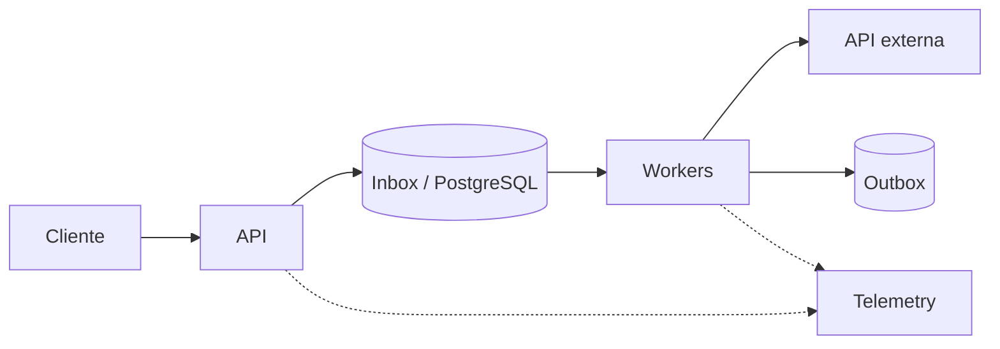

# Exercícios de Python

Os exercícios são entregas de engenharia. Para cada um, inclua README curto, testes automatizados, comandos reproduzíveis e uma nota sobre decisões e limitações. Não use uma biblioteca para apagar justamente o conceito estudado.

## Beginner

### 1. Normalizador de eventos

Leia um arquivo JSON Lines e produza eventos válidos com `id`, `type` e timestamp UTC.

**Pratique:** tipos, collections, arquivos, exceptions e funções puras.

**Critérios:** linhas inválidas são reportadas com número; input vazio não quebra; encoding é explícito; nenhuma linha carrega todo o arquivo em memória; testes cobrem schema, duplicatas e arquivo truncado.

### 2. Carrinho de compras

Modele `Money`, `Item` e `Cart`, sem `float`. Implemente subtotal, desconto e total.

**Pratique:** dataclasses, imutabilidade, invariantes e composition.

**Critérios:** moedas incompatíveis falham; quantidade negativa é impossível; regras de desconto são funções substituíveis; property-based test garante `total >= 0`.

### 3. Debugging de estado compartilhado

Explique e corrija:

```python
def register(user, users=[]):
    users.append(user)
    return users
```

Depois encontre dois bugs adicionais envolvendo shallow copy e `[[0] * 3] * 3`.

**Critérios:** teste reproduz cada falha antes da correção; o texto distingue identity, equality e mutability.

### 4. CLI de inventário

Crie uma CLI com `argparse` para adicionar, listar e remover itens de um JSON local.

**Critérios:** exit codes úteis; escrita atômica; help completo; path configurável; interruption não deixa arquivo parcial; tests não dependem do diretório pessoal.

## Intermediate

### 5. Cliente HTTP resiliente

Implemente um adapter assíncrono para uma API paginada.

**Requisitos:** timeout por tentativa e total, concurrency limit, retry apenas para falhas transitórias, exponential backoff com jitter, respeito a `Retry-After` e redaction de token em logs.

**Critérios:** testes usam servidor fake/controlado; cancellation interrompe sleeps e requests; métricas distinguem tentativa de operação lógica.

### 6. Refactoring de relatório

Você recebe uma função que lê banco, calcula regras, renderiza HTML e envia e-mail. Separe domínio de adapters sem criar uma class por função.

**Critérios:** regras são testadas sem mocks; transação tem boundary visível; envio é idempotente; comparação antes/depois discute coupling e custo das abstrações.

### 7. Cache LRU com TTL

Implemente cache thread-safe com capacidade, TTL e clock injetável.

**Critérios:** O(1) amortizado para get/set; limite nunca é excedido; evicções têm razão observável; sem thread de limpeza obrigatória; teste concorrente valida invariantes, não timing frágil.

**Trade-off:** compare expiração lazy e eager, precisão de TTL e custo de lock.

### 8. Plugin protocol

Defina um `Protocol` para transformadores de evento e carregue implementações configuradas.

**Critérios:** plugin incompatível falha na inicialização; import não faz I/O externo; type checker roda no CI; uma implementação stateful documenta thread safety.

## Advanced

### 9. Pipeline com backpressure

Construa `reader → parser → batcher → writer` com filas limitadas e graceful shutdown.

**Critérios:** não perde item confirmado; falha de stage cancela o conjunto; memória permanece limitada; métricas mostram queue depth, throughput e latency; um load test encontra saturação.

Implemente uma versão `asyncio` para I/O e justifique se uma etapa CPU-bound deve ir para processo.

### 10. Diagnóstico de Event Loop lag

Uma API async apresenta p99 alto enquanto CPU média parece normal. Crie uma reprodução com parsing CPU-bound, chamada sync escondida e pool esgotado.

**Entrega:** traces, Event Loop lag, profiles e um plano de correção priorizado. Diferencie causa de correlação e valide a melhoria sob a mesma carga.

### 11. Worker multiprocess

Calcule hashes de arquivos grandes usando pool de processos.

**Critérios:** memória limitada; tasks pequenas não são dominadas por serialização; worker crash é detectado; shutdown não aceita trabalho novo; benchmark compara sequencial, threads e processos.

**Análise:** métodos de start, tamanho do chunk, file cache do SO e validade do benchmark.

### 12. Dependency supply chain

Prepare um pequeno serviço para release reproduzível.

**Requisitos:** `pyproject.toml`, lock para aplicação, hashes quando suportados, vulnerability audit, SBOM, licença das dependências e atualização automatizada proposta.

**Critérios:** uma máquina limpa instala/testa; package malicioso simulado não alcança secret no build; documento separa risco do build e do runtime.

## Expert

### 13. Scheduler durável e idempotente

Projete e implemente um serviço que recebe jobs, persiste intenção, executa adapters externos e suporta retry.

**Restrições:** entrega at-least-once; múltiplas instances; crash em qualquer linha; clock não confiável; um provedor sem idempotency key.

**Critérios:** state machine explícita; lease recuperável; inbox/outbox ou alternativa justificada; poison jobs isolados; métricas de age/attempts; chaos tests matam workers durante efeitos.

### 14. Runtime observability lab

Crie uma aplicação com três vazamentos diferentes: cache sem limite, tasks retidas e memória nativa de uma extensão ou buffer. Diagnostique sem reiniciar como primeira ação.

**Entrega:** dashboard, snapshots, hipótese, evidência, mitigação imediata e fix definitivo. Explique por que RSS não retorna necessariamente ao sistema após liberar objetos.

### 15. Migração sync → async

Avalie uma API síncrona de 20 endpoints. Não presuma que migrar tudo é a resposta.

**Entrega:** workload model, dependency audit, experimento de capacidade, estratégia incremental, rollback e risco de dual stack. Implemente um vertical slice e compare throughput, p95/p99, CPU, memória e complexidade de testes.

### 16. Free-threaded readiness

Audite uma aplicação e extensões para execução em um build free-threaded de CPython.

**Critérios:** matriz de compatibilidade; races reproduzíveis; invariantes protegidas explicitamente; benchmark contra build tradicional; decisão go/no-go baseada em workload, não em entusiasmo.

## Projeto integrador: plataforma de ingestão

Implemente uma plataforma pequena, mas operável:



### Objetivo

Receber eventos versionados, rejeitar conteúdo inválido, deduplicar, processar efeitos externos e permitir replay seguro.

### Restrições

- 500 eventos/s sustentados e bursts de 2.000/s;
- corpo máximo e batch máximo definidos;
- API externa instável, com rate limit;
- nenhuma garantia de exactly-once distribuído;
- deploy precisa fazer graceful shutdown em 20 segundos.

### Milestones

1. modelo de domínio, schema e API contract;
2. persistence adapter e migrations;
3. worker, idempotência e state machine;
4. retry, jitter, circuit breaking e DLQ;
5. logs, metrics, traces e SLO;
6. load/chaos/security tests;
7. runbook, capacity estimate e retrospectiva técnica.

### Critérios de conclusão

- repetir a mesma requisição não duplica efeito;
- crash antes/depois de cada boundary converge para estado conhecido;
- overload responde de forma limitada, sem fila infinita;
- trace conecta request, item persistido e tentativa externa;
- dashboard mostra rate, errors, duration, saturation e backlog age;
- threat model cobre auth, injection, SSRF, secrets e dependency risks;
- benchmark e ADR justificam concorrência escolhida.

## Roteiro de revisão

Para qualquer solução, responda:

1. Quais invariantes o código protege?
2. Onde estão os efeitos e quem possui os recursos?
3. O que ocorre com input inválido, timeout, duplicata e cancellation?
4. Como o sistema reage quando a entrada supera a capacidade?
5. Que teste falha se a garantia principal regredir?
6. Que métrica detecta a falha antes do usuário?
7. Qual simplificação você faria com requisitos menores?

## Entrevista prática

Escolha um exercício e apresente-o em 45 minutos:

- cinco minutos para requisitos e hipóteses;
- dez para modelo e trade-offs;
- vinte para um slice testado;
- cinco para performance/segurança;
- cinco para evolução e observabilidade.

O objetivo não é terminar tudo, mas tornar raciocínio, prioridades e feedback visíveis.

---

[← Internals](internals.md) · [↑ Trilha Python](README.md) · [Referências →](references.md)
