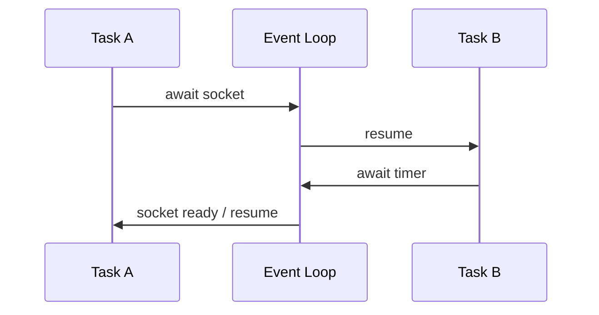

# Internals do Python

Este capítulo usa CPython como referência. A linguagem Python não exige bytecode, reference counting nem GIL; trate detalhes internos como dependentes de implementação e versão.

## Do source ao bytecode

O pipeline conceitual é:

```text
source → tokens → AST → code object → bytecode → evaluation loop
```

`compile` cria um code object; `dis` permite estudar instruções sem torná-las contrato:

```python
import dis

def gross(price: int, quantity: int) -> int:
    return price * quantity

dis.dis(gross)
```

CPython pode especializar instruções com informação observada em runtime. Por isso, contar opcodes não substitui benchmark. Arquivos `.pyc` armazenam bytecode em `__pycache__` para acelerar import; não escondem source nem são artefatos portáveis entre todas as versões.

## Frames, stack e chamadas

Cada chamada cria ou ativa um frame com referência ao code object, namespaces e estado de execução. Recursão profunda consome stack e encontra um limite deliberado; Python não garante tail-call optimization. Para grafos profundos, uma stack explícita costuma ser mais segura:

```python
def count_nodes(root) -> int:
    count = 0
    pending = [root]
    while pending:
        node = pending.pop()
        count += 1
        pending.extend(node.children)
    return count
```

Chamadas Python, criação de objetos e dispatch dinâmico têm custo. Mover uma função curta para outra linha raramente importa; multiplicar milhões de dispatches pode importar e deve ser medido.

## Objetos, identidade e layout

Em CPython, objetos começam conceitualmente com reference count e type pointer. O tipo aponta para operações do data model. Names, listas e dictionaries guardam referências, não cópias automáticas do valor.

```python
matrix = [[0] * 3] * 3
matrix[0][0] = 1
assert matrix == [[1, 0, 0], [1, 0, 0], [1, 0, 0]]

independent = [[0] * 3 for _ in range(3)]
```

A primeira forma replica a mesma referência. Esse modelo também explica shallow copy, parâmetros e closures.

Instances com `__dict__` permitem atributos dinâmicos. `__slots__` pode reduzir overhead por instance e impedir atributos inesperados, mas complica inheritance, weak references e algumas ferramentas. Meça com a quantidade real de objetos.

## Dictionaries e hashing

`dict` é hash table e preserva a ordem de inserção como garantia da linguagem. Keys precisam ter hash estável e igualdade coerente. Um objeto mutável geralmente não deve ser key:

```python
from dataclasses import dataclass

@dataclass(frozen=True)
class UserId:
    value: str

cache: dict[UserId, str] = {UserId("u-1"): "Ana"}
```

Lookup é O(1) amortizado, não garantido em todo caso. Hash collisions, resize e tamanho do objeto afetam CPU e memória. Nunca aceite crescimento ilimitado de dictionary usado como cache.

## Reference counting e Garbage Collector

Quando o reference count chega a zero, CPython normalmente finaliza o objeto imediatamente. Ciclos exigem o cyclic Garbage Collector:

```text
A ──ref──▶ B
▲          │
└──ref─────┘
```

Consequências:

- tempo de vida costuma ser previsível, mas não é contrato portável da linguagem;
- ciclos, caches, filas e referências globais podem prolongar retenção;
- finalizers tornam ciclos e shutdown mais difíceis de raciocinar;
- `weakref` pode quebrar ownership quando a semântica realmente é não proprietária.

Use context managers para liberar recursos externos; não dependa de `__del__`. Para investigar memória:

1. confirme RSS, heap Python e memória nativa separadamente;
2. compare snapshots de `tracemalloc`;
3. procure crescimento de cardinalidade em caches/registries;
4. inspecione referências apenas em ambiente controlado;
5. reproduza com workload representativo.

Coletar GC mais vezes pode piorar throughput sem resolver retenção legítima.

## GIL e threads

No modelo tradicional de CPython, uma thread por interpreter executa bytecode Python por vez. O GIL:

- não torna uma sequência de operações de negócio atômica;
- pode ser liberado em I/O e por extensões nativas;
- não elimina races sobre estado compartilhado;
- limita scale-up de bytecode CPU-bound em threads.

```python
from threading import Lock

class Counter:
    def __init__(self) -> None:
        self._value = 0
        self._lock = Lock()

    def increment(self) -> None:
        with self._lock:
            self._value += 1
```

Mesmo que um detalhe pareça atômico hoje, não o use como protocolo implícito entre threads. Locks devem proteger invariantes, ter escopo pequeno e ordem conhecida.

CPython também evolui com builds free-threaded. Eles mudam o perfil de overhead e exigem extensões compatíveis; avalie a versão, o suporte do ecossistema e benchmarks reais antes de adotar.

## `asyncio` e Event Loop

Uma coroutine não executa ao ser criada. Uma task a agenda no Event Loop; `await` permite que outra task progrida enquanto a operação aguarda:



O modelo é cooperativo. Código CPU-bound ou I/O síncrono bloqueia todas as tasks daquele loop. Use adapters assíncronos, `asyncio.to_thread` para compatibilidade pontual com I/O bloqueante e processos/native code para CPU.

Cancellation é controle normal, não erro exótico. Cleanup precisa de `try/finally`; swallowing de cancellation pode impedir shutdown. `TaskGroup` oferece structured concurrency: child tasks pertencem ao escopo e falhas são agregadas.

Backpressure não aparece automaticamente. Limite filas, requests concorrentes e batch size. Uma fila ilimitada converte overload em memória crescente e latência impossível.

## Multiprocessing e IPC

Processos contornam o GIL tradicional para CPU-bound, mas trazem:

- startup e diferenças entre `fork`, `spawn` e `forkserver`;
- serialização de argumentos e resultados;
- memória duplicada ou shared memory explícita;
- cancellation, supervisão e observabilidade interprocesso;
- limites de conexão a banco e recursos herdados.

Não abra pools no import. Crie-os sob entry point, envie mensagens pequenas e trate worker crash. Para grandes arrays, shared memory ou biblioteca nativa pode evitar cópias.

## Imports e cache de módulos

O import procura um module spec, pode carregar/compilar código, cria um module object e o registra em `sys.modules`. Código top-level executa na primeira carga bem-sucedida.

Circular imports geralmente revelam boundaries ruins. Soluções melhores incluem extrair contratos, inverter dependência ou mover composição para um entry point. Import local pode quebrar um ciclo pontual, mas também esconder arquitetura e custo.

Import side effects causam problemas em testes e preloading. Prefira:

```python
def create_app(settings):
    app = Application()
    app.register(build_routes(settings))
    return app
```

em vez de conectar a banco e ler secrets ao importar o módulo.

## Descriptors, methods e lookup de atributos

Functions definidas em classes são descriptors: ao acessar `instance.method`, Python cria um bound method que carrega `instance`. Attribute lookup considera instance, classe e Method Resolution Order, com regras para data/non-data descriptors.

`property`, `classmethod`, ORM fields e validators usam esse protocolo. É poderoso, porém custo e controle implícito podem surpreender. APIs comuns devem preferir código explícito; descriptors cabem em frameworks ou repetição realmente transversal.

## Extensões nativas e fronteiras

Extensões C/C++/Rust podem:

- liberar o GIL durante trabalho nativo seguro;
- operar em buffers sem copiar;
- introduzir crashes, leaks e undefined behavior fora das garantias de Python;
- complicar builds multiplataforma e observabilidade.

Wheels evitam compilação para consumidores quando existem para plataforma e ABI. A Stable ABI reduz matriz de builds com possíveis limitações. Trate a fronteira nativa como parte crítica de segurança e supply chain.

## Profiling sem adivinhação

Ferramenta e pergunta devem combinar:

| Pergunta | Ferramenta inicial |
| --- | --- |
| qual função consome CPU? | `cProfile` ou sampling profiler |
| quanto uma expressão custa? | `timeit`/`pyperf` |
| quem aloca memória Python? | `tracemalloc` |
| onde tasks assíncronas esperam? | tracing + Event Loop diagnostics |
| por que o processo usa muita memória? | métricas RSS + profiler Python/nativo |

Benchmark deve registrar versão, hardware, dataset, warm-up e variação. Otimização que reduz 20% de um trecho responsável por 5% do tempo total melhora no máximo cerca de 1% do todo.

## Experimentos guiados

1. Desmonte funções com `dis` e compare comprehension e loop; não confunda opcode count com tempo.
2. Crie um ciclo, remova referências externas e observe `gc.collect()` em ambiente de laboratório.
3. Compare threads, `asyncio` e processos em cargas separadas de sleep, hashing e requests locais.
4. Provoque Event Loop lag com uma função CPU-bound e depois mova-a para processo.
5. Compare memória de classes comuns, dataclasses com slots e tuples em cem mil instances.

Registre hipótese, método, resultado e ameaças à validade.

## Modelo de decisão

Ao enfrentar problema de performance ou concorrência, pergunte:

1. é CPU, I/O, lock contention, alocação ou serviço externo?
2. qual métrica e perfil confirmam isso?
3. podemos remover trabalho antes de paralelizá-lo?
4. qual ownership de estado e recursos?
5. como timeout, cancellation e overload se propagam?
6. como a mudança falha e como será observada?

---

[← Fundamentos](fundamentals.md) · [↑ Trilha Python](README.md) · [Exercícios →](exercises.md)
