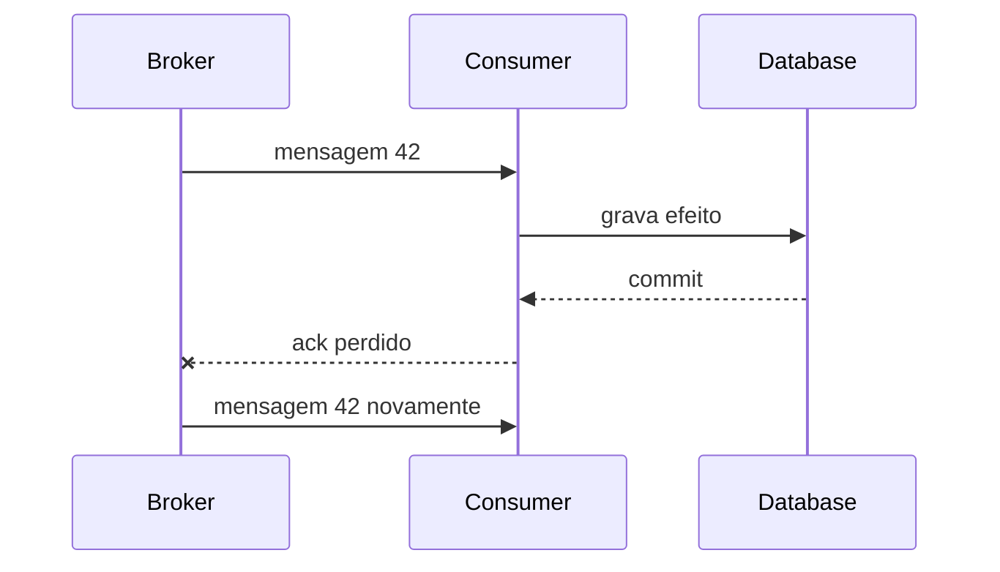
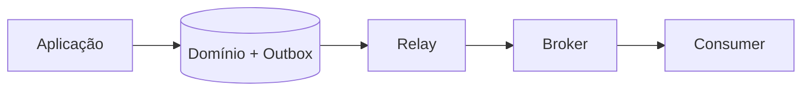

# Mensageria e streaming

Mensageria desacopla disponibilidade e ritmo entre produtores e consumidores.
Isso pode melhorar resiliência e throughput, mas desloca complexidade para
contratos, ordering, duplicação, retenção, backlog, replay e operação.

A pergunta central não é "Kafka ou SQS?". É: **qual semântica de comunicação e
recuperação este fluxo precisa?**

## Trilha

| Guia | Foco |
| --- | --- |
| [Fundamentos e comparação](comparison.md) | fila, log, pub/sub e critérios de decisão |
| [Apache Kafka](kafka/README.md) | log particionado, consumer groups e replay |
| [Amazon SQS](sqs/README.md) | fila gerenciada Standard/FIFO e visibility timeout |
| [Laboratório Docker](docker-lab.md) | produtor/consumidor Kafka, falha e idempotência |
| [Exercícios](exercises.md) | contratos, poison messages, lag e recovery |

## 1. Por que introduzir uma mensagem

Sem broker:

```text
A → B
```

A precisa encontrar B, esperar B e lidar com sua disponibilidade. Com broker:

```text
A → broker → B
```

A pode concluir sua parte depois que a mensagem atinge a durabilidade exigida,
mesmo que B esteja temporariamente fora. O preço é que o sistema passa a lidar
com estado intermediário e entrega posterior.

Mensageria é boa quando desacoplamento temporal é valioso. Para uma consulta
síncrona em que o usuário precisa da resposta agora, inserir fila pode apenas
criar latência e complexidade.

## 2. Fila, pub/sub e log

### Fila de trabalho

Mensagens representam trabalho a ser processado. Consumidores competem e cada
item normalmente tem um processador lógico.

### Pub/sub

Um evento é distribuído para múltiplos assinantes independentes.

### Log persistente

Registros são anexados a uma sequência ordenada por partição e consumidores
mantêm posição. Replay e múltiplas leituras independentes tornam o log diferente
de uma fila destrutiva clássica.

Produtos misturam características. Modele a semântica necessária antes do nome
do serviço.

## 3. Command, event e document message

### Command

Expressa intenção para um dono: `ReserveInventory`.

### Event

Expressa fato ocorrido: `InventoryReserved`.

### Document message

Transporta um documento/dado sem necessariamente representar intenção ou fato de
domínio.

Nomes importam. Um evento no passado deve descrever algo que já ocorreu. Usar
`UserCreated` como comando escondido cria confusão de ownership e retry.

## 4. Contrato de mensagem

Um envelope útil pode carregar:

```json
{
  "message_id": "uuid",
  "type": "order.created",
  "version": 2,
  "occurred_at": "...",
  "producer": "orders",
  "correlation_id": "...",
  "causation_id": "...",
  "tenant_id": "...",
  "payload": {}
}
```

Campos não são obrigatórios universalmente. O princípio é tornar identidade,
versão, causalidade e ownership explícitos quando necessários.

Não inclua secret. Minimize PII porque brokers, DLQs, logs e replays aumentam o
número de lugares onde a mensagem pode sobreviver.

## 5. Schema evolution

Produtor e consumidor nem sempre são atualizados juntos. O contrato precisa
tolerar evolução.

Mudanças geralmente mais seguras:

- adicionar campo opcional com default semântico;
- manter significado de campos existentes;
- versionar quando semântica muda;
- permitir coexistência durante rollout.

Mudanças perigosas:

- renomear/remover campo imediatamente;
- mudar unidade de `amount` sem versão;
- transformar campo opcional em obrigatório sem janela;
- reutilizar nome com outro significado.

Schema Registry ajuda compatibilidade sintática. Não detecta toda quebra
semântica.

## 6. Delivery semantics: seja preciso

### At-most-once

O sistema evita redelivery deliberado, aceitando possibilidade de perda.

### At-least-once

Redelivery pode ocorrer. Consumidores precisam tolerar repetição.

### Exactly-once

A expressão só é útil quando a fronteira é definida. Um broker pode garantir
processamento transacional entre seu log e um estado compatível, enquanto uma
chamada HTTP externa ainda duplica efeito.

Prefira dizer qual propriedade é garantida em qual fronteira.

### Effectively-once

Na prática, muitos sistemas produzem um efeito lógico único usando identidade,
deduplicação e fronteira transacional.

## 7. Por que duplicação acontece

Fluxo:



O consumidor realizou o efeito, mas o broker não observou confirmação. Redelivery
é a única escolha segura para não perder trabalho.

A solução não é "aumentar visibility timeout" indefinidamente. É tornar o efeito
idempotente ou deduplicável.

## 8. Idempotência é identidade + estado

Uma operação idempotente produz o mesmo efeito lógico quando repetida com a
mesma identidade.

Exemplo:

```text
idempotency_key = order_id + operation_type
```

O consumidor pode registrar a chave na mesma transação do efeito. Se a mensagem
retorna, encontra resultado anterior e não repete a mudança.

A chave precisa representar a operação lógica. Usar um UUID novo a cada retry
destrói deduplicação.

## 9. Outbox fecha uma janela específica

Sem outbox:

```text
1. commit no banco
2. publish no broker
```

Se o processo cai entre 1 e 2, estado existe sem evento.

Transactional outbox grava mudança de domínio e registro de publicação na mesma
transação local. Um relay publica depois.



O relay pode publicar duplicado se cair depois do publish e antes de marcar como
enviado. Portanto outbox reduz perda, mas não remove necessidade de idempotência
no consumidor.

## 10. Inbox

Inbox registra mensagens já processadas, normalmente junto do efeito local. Ela
é o complemento do consumidor para at-least-once.

Cuidados:

- crescimento da tabela;
- retenção maior que janela de redelivery/replay;
- chave de deduplicação correta;
- transação entre inbox e efeito.

Se o consumidor chama serviço externo, a atomicidade deixa de ser local e pode
exigir idempotency key no destino ou workflow compensatório.

## 11. Ordering: global quase sempre custa demais

Ordering normalmente existe dentro de uma partição, message group ou sequência
específica.

Pergunte qual entidade precisa de ordem. Se updates de um `order_id` precisam ser
sequenciais, use essa aggregate key. Não force ordering global entre pedidos
independentes.

### Hot partition

Uma key muito concentrada preserva ordem e cria gargalo. Uma celebridade, tenant
gigante ou chave constante pode limitar todo throughput ao de uma partição.

Particionamento é uma decisão entre paralelismo e ordem.

## 12. Reordering também pode acontecer no consumidor

Mesmo se broker entrega em ordem, processamento paralelo pode terminar fora de
ordem:

```text
msg 1: processamento de 2 s
msg 2: processamento de 100 ms
```

Se ambos executam juntos, o efeito de `2` pode aparecer primeiro.

Ordering precisa ser preservado em toda a fronteira relevante, não apenas no
broker.

## 13. Backpressure e backlog

Quando entrada supera capacidade de consumo, backlog cresce.

Little's Law ajuda a estimar concorrência/itens no sistema. Mas para operação de
fila, observe principalmente:

- publish rate;
- consume rate;
- age do item mais antigo;
- lag/backlog;
- processing duration;
- redelivery;
- erro;
- saturation do consumidor e downstream.

Uma fila esconde indisponibilidade temporária. Se entrada permanece maior que
saída, ela apenas adia o incidente.

## 14. Autoscaling de consumers

Escalar pelo número bruto de mensagens pode ser enganoso.

1. 10.000 mensagens de 5 ms são diferentes de 10.000 jobs de 30 s.
2. aumentar consumers pode saturar banco/API downstream.
3. partitions podem limitar paralelismo efetivo.
4. startup do consumer pode ser lento.

Um sinal melhor combina backlog/age com taxa de processamento e limites das
dependências.

## 15. Poison messages

Uma mensagem que falha deterministicamente pode bloquear processamento ou
consumir retries infinitos.

Diferencie:

- erro transitório, que merece retry;
- erro permanente de validação/schema;
- bug de código;
- dependência indisponível;
- dado que exige intervenção.

Depois de retries limitados, quarentena/DLQ preserva progresso do restante.

## 16. DLQ não é cemitério

Dead-letter queue precisa de owner e processo:

1. alerta por crescimento/idade;
2. classificação da causa;
3. correção do código/dado;
4. decisão de replay ou descarte;
5. auditoria do resultado.

Replay em massa pode repetir o incidente ou competir com tráfego vivo. Controle
rate e capacidade.

## 17. Retry e backoff

Retry imediato de milhares de consumers pode criar thundering herd quando uma
dependência volta.

Use:

- limite de tentativas/tempo;
- exponential backoff;
- jitter;
- classificação de erro;
- budget total;
- circuit breaker/pausa quando apropriado.

Broker retry e application retry precisam ser coordenados para não multiplicar
attempts.

## 18. Retenção e replay

Logs como Kafka permitem reprocessar histórico. Isso é poderoso e perigoso.

Antes de replay:

- consumidor é idempotente?
- efeitos externos serão repetidos?
- schema antigo ainda é compreendido?
- volume cabe na capacidade atual?
- replay afeta SLO do tráfego vivo?
- há timestamp/offset inicial correto?

Replay de evento não significa necessariamente reconstruir o mesmo mundo se
dependências externas e regras atuais mudaram.

## 19. Event sourcing não é "usar Kafka"

Event Sourcing persiste eventos de domínio como fonte de verdade para reconstruir
estado. Um broker de eventos pode participar, mas não transforma automaticamente
uma arquitetura em Event Sourcing.

Diferencie:

- integração por eventos;
- CDC;
- log de mensageria;
- event store de domínio.

Cada um possui ownership e garantias diferentes.

## 20. CDC

Change Data Capture observa log de mudanças de um banco e transforma alterações
em stream.

É útil para:

- replicação;
- integração legada;
- materialização de projeções;
- analytics.

Mas row change não é automaticamente domain event. `UPDATE orders SET status=2`
não carrega contexto de por que a mudança ocorreu. Evite vender CDC cru como
linguagem de domínio sem modelagem adicional.

## 21. Segurança e privacidade

Mensagens podem permanecer mais tempo e em mais sistemas que requests HTTP.
Controle:

- IAM por topic/queue;
- encryption;
- minimização de PII;
- retenção;
- DLQ access;
- cross-tenant isolation;
- schema de dados sensíveis;
- audit;
- secrets fora do payload.

Consumer deve tratar mensagem como input não confiável, mesmo quando broker é
interno.

## 22. Observabilidade

Envelope e telemetria devem permitir causalidade:

- `message_id`;
- correlation/causation ID;
- producer version;
- schema version;
- topic/queue/partition;
- offset/receive count quando aplicável;
- processing outcome/duration;
- downstream effects.

Para traces, propague contexto por message metadata sem colocar PII em baggage.

## 23. Kafka versus SQS como exemplo de decisão

| Força | Kafka tende a favorecer | SQS tende a favorecer |
| --- | --- | --- |
| replay longo | log persistente e offsets | não é seu modelo principal |
| ordering | por partição | FIFO por message group |
| operação | cluster/serviço de streaming | fila gerenciada simples |
| fan-out | múltiplos consumer groups | múltiplas filas/subscrições via integração |
| throughput/streams | ecossistema forte | jobs desacoplados e simples |
| semântica | log | queue |

A tabela não escolhe por você. Volume, equipe, retenção, ordering, ecossistema e
custo operacional decidem.

## 24. Modos de falha

| Falha | Sintoma | Evidência | Mitigação |
| --- | --- | --- | --- |
| ack perdido | duplicação | receive count/message ID | idempotência/inbox |
| poison message | retry infinito | erro repetido mesma ID | DLQ/quarentena |
| consumer lento | age/lag cresce | processing rate | otimizar/scale com downstream |
| hot partition | uma partição atrasa | lag por partition | key/modelagem |
| retry storm | dependência degrada mais | attempts/sec | backoff+jitter+budget |
| schema incompatível | falha após deploy | version/deserialize errors | compatibilidade + rollout |
| replay sem controle | downstream satura | replay rate/queue | throttle e janela |
| DLQ abandonada | perda operacional silenciosa | oldest age | ownership/runbook |

## 25. Laboratórios

### Beginner

- publique/consuma uma mensagem e registre identidade;
- force redelivery e demonstre efeito duplicado;
- torne o consumidor idempotente.

### Intermediate

- implemente outbox + relay;
- provoque crash depois do publish;
- crie DLQ e fluxo de replay controlado.

### Advanced

- crie duas partitions e demonstre ordering por key;
- gere hot partition;
- escale consumers até saturar uma dependência e aplique backpressure.

### Expert

Modele workflow de pagamento/pedido com command, events, outbox e consumidores.
Injete ack perdido, mensagem atrasada, duplicação e indisponibilidade do broker.
Defenda qual estado é fonte de verdade e como cada divergência converge.

## Referências

- Apache Kafka. [Documentation](https://kafka.apache.org/documentation/) documenta
  log, partitions, consumer groups e transações.
- AWS. [Amazon SQS Developer Guide](https://docs.aws.amazon.com/AWSSimpleQueueService/latest/SQSDeveloperGuide/welcome.html)
  cobre Standard/FIFO, visibility timeout e DLQ.
- CloudEvents. [Specification](https://github.com/cloudevents/spec) define um
  envelope interoperável para descrição de eventos.
- Kleppmann & Riccomini. [*Designing Data-Intensive Applications*, 2ª ed.](https://www.oreilly.com/library/view/designing-data-intensive-applications/9781098119058/)
  aprofunda logs, streams, processamento e consistência.

---

[← Sistemas distribuídos](../distributed-systems/README.md) · [↑ Início](../README.md) · [Comparação →](comparison.md)
