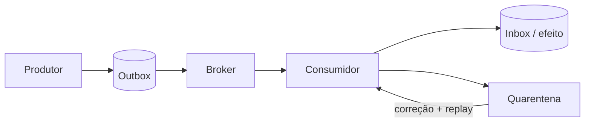

# Mensageria e streaming

Mensageria desacopla disponibilidade e ritmo entre produtores e consumidores, mas transfere complexidade para contratos, ordering, duplicação, retenção, backlog e operação.

## Trilha

| Guia | Foco |
| --- | --- |
| [Fundamentos e comparação](comparison.md) | fila, log, pub/sub e critérios de decisão |
| [Apache Kafka](kafka/README.md) | log particionado, consumer groups e replay |
| [Amazon SQS](sqs/README.md) | fila gerenciada Standard/FIFO e visibility timeout |
| [Laboratório Docker](docker-lab.md) | produtor/consumidor Kafka, falha e idempotência |
| [Exercícios](exercises.md) | contratos, poison messages, lag e recovery |

## Contrato de mensagem

Inclua `message_id`, tipo, versão, instante, produtor, correlation/causation ID, tenant/classificação e payload. Não coloque secret; minimize PII. Schema registry ou validação no boundary evita que incompatibilidade silenciosa contamine o stream.

## Semântica honesta

- **at-most-once:** pode perder, não redeliver deliberadamente;
- **at-least-once:** redelivery é esperado; idempotência é requisito;
- **effectively-once:** deduplicação + fronteira transacional dão um efeito lógico;
- **exactly-once:** só significa algo ao delimitar broker, estado e efeitos externos.

Ordering costuma valer por partition/group, não globalmente. Use uma aggregate key que preserve ordem onde necessária sem criar hot partition.

## Operação

Meça publish/consume rate, age do item mais antigo, lag, redelivery, processing latency, falhas por causa, DLQ e saturation. Autoscaling baseado apenas em número de mensagens ignora tempo de processamento. Pause replay quando ele ameaça tráfego vivo.

## Referências

- Apache Kafka. [Documentation](https://kafka.apache.org/documentation/).
- AWS. [Amazon SQS Developer Guide](https://docs.aws.amazon.com/AWSSimpleQueueService/latest/SQSDeveloperGuide/welcome.html).
- CloudEvents. [Specification](https://github.com/cloudevents/spec).

---

[← Sistemas distribuídos](../distributed-systems/README.md) · [↑ Início](../README.md) · [Comparação →](comparison.md)
