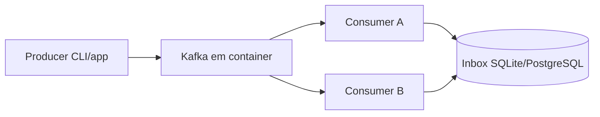

# Laboratório Kafka com Docker

Objetivo: observar partitioning, redelivery e consumer lag localmente. Fixe versões de imagens e confirme checksums/signatures conforme sua política; nomes e opções de imagens mudam, por isso siga o [quickstart oficial do Kafka](https://kafka.apache.org/quickstart) para o comando atual.

## Topologia

## Roteiro

1. Suba um broker em KRaft pelo procedimento oficial e publique a porta apenas em loopback.
2. Crie `orders.v1` com três partitions e fator de replicação compatível com o laboratório de um broker.
3. Escreva 30 eventos com keys de três pedidos; registre partition/offset.
4. Execute dois consumers no mesmo group e confirme distribuição por partition.
5. Adicione atraso, mate um consumer antes de confirmar offset e observe redelivery/lag.
6. Persista `message_id` com efeito em uma transação local; repita a falha e prove efeito único.
7. Use um novo group para replay e reconstrua uma projeção vazia.

## Evidências

- comandos/manifesto e versões;
- tabela `key → partition → offsets`;
- logs com message/correlation ID sem payload sensível;
- gráfico de lag/idade durante falha e recovery;
- explicação de onde duplicação ocorre;
- limpeza dos volumes ao final somente após confirmar que são dados descartáveis.

## Extensões

- adicione Schema Registry e demonstre uma mudança incompatível bloqueada;
- compare commit síncrono por item versus batches;
- use três brokers e teste perda de um com replication factor 3;
- limite replay para não prejudicar consumer de produção simulado.

---

[← SQS](sqs/README.md) · [↑ Mensageria](README.md) · [Exercícios →](exercises.md)
