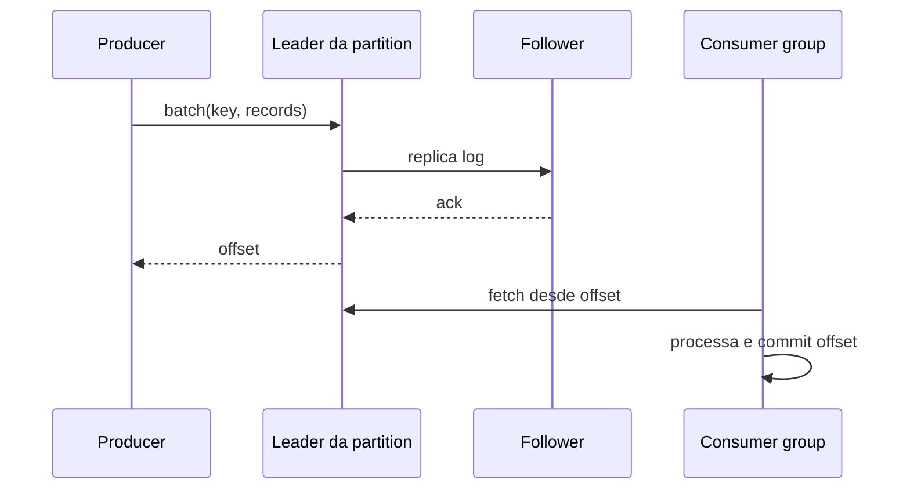

# Apache Kafka

Kafka é um log distribuído. Topics são divididos em partitions; cada partition tem ordem total, offsets e réplicas. Consumer groups dividem partitions entre membros: o máximo de consumidores ativos úteis por grupo é limitado pelo número de partitions.

## Escrita e leitura

Key escolhe partition e, portanto, ordering/locality. `acks`, min in-sync replicas e retries afetam durabilidade/disponibilidade. Producer idempotente evita duplicatas de retry dentro de sua sessão/protocolo. Transactions coordenam writes e offsets Kafka, não chamadas externas arbitrárias.

## Consumer correto

Desabilitar auto-commit e confirmar depois do efeito reduz perda, mas crash antes do commit redeliver. Faça efeito idempotente. Rebalance revoga partitions; encerre trabalho/commit com cuidado. Poll lento pode expulsar membro; separe fetch de processamento com limites e preserve ordering por key.

## Schema e evolução

Prefira envelope estável e Avro/Protobuf/JSON Schema com regras de compatibilidade. Mudança aditiva com defaults costuma ser mais segura. Evento é fato no passado; não o altere semanticamente. Dados sensíveis permanecem no log e backups até retenção—minimize e criptografe campos quando necessário.

Kafka Streams é uma biblioteca cliente para topologias de processamento com state stores, repartition topics e changelogs. A semântica exactly-once cobre o estado/offsets/produções Kafka configurados, não email, HTTP ou banco externo. Dimensione tasks por partitions, monitore restore de state stores e teste evolução de topologia.

## Operação

- planeje partitions por throughput, paralelismo, ordering e custo de rebalance;
- monitore under-replicated/offline partitions, ISR, request latency, disk, controller e consumer lag/age;
- retenção por tempo/tamanho e log compaction têm semânticas diferentes;
- teste perda de broker/zona, expansão de partitions e recuperação;
- TLS/SASL, ACLs least privilege e quotas por cliente;
- não exponha brokers diretamente a clientes não confiáveis.

## Anti-patterns

- aumentar partitions sem considerar mudança no hash/order;
- um tópico por usuário;
- usar lag em offsets como tempo ou trabalho sem considerar custo por record;
- commit antes do efeito;
- replay de anos contra dependências atuais sem throttling/sandbox;
- mensagem mutable/compactada sem key correta.

## Exercícios

1. Produza por `order_id` e prove ordering por pedido, não global.
2. Mate consumer entre efeito e commit; implemente inbox/deduplicação.
3. Faça consumer lento, observe lag e rebalance, depois limite concorrência.
4. Recrie projeção em novo consumer group com rate limit e validação.

## Referências oficiais

- Apache Kafka. [Documentation](https://kafka.apache.org/documentation/).
- [Design](https://kafka.apache.org/documentation/#design).
- [Protocol](https://kafka.apache.org/protocol.html).

---

[← Comparação](../comparison.md) · [↑ Mensageria](../README.md) · [SQS →](../sqs/README.md)
