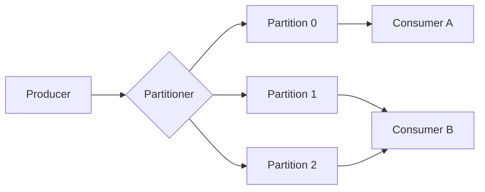
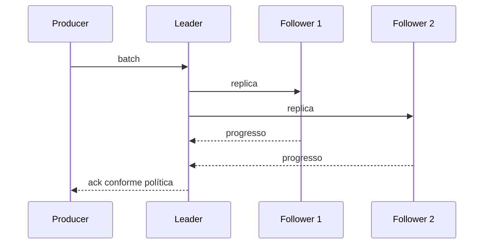
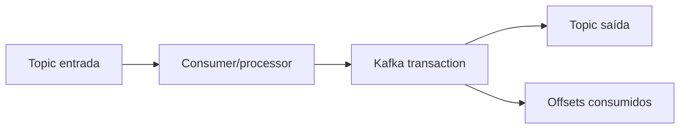

# Apache Kafka

Kafka é um log distribuído particionado. A ideia central não é "uma fila muito
rápida": producers anexam records a logs ordenados, brokers replicam esses logs e
consumers controlam até onde leram por meio de offsets.

Esse modelo explica replay, consumer groups, retenção, compaction e também boa
parte das armadilhas. Kafka oferece garantias fortes dentro de limites bem
definidos, mas não transforma efeitos externos em exactly-once por mágica.

## 1. O modelo de dados: topic, partition, record e offset

Um topic é dividido em partitions. Dentro de cada partition, records recebem
offsets crescentes e possuem ordem total. Entre partitions diferentes não há
ordem global.



A key normalmente participa da escolha da partition. Isso faz da key uma decisão
de arquitetura: ela define quais eventos compartilham ordering e tende a definir
também onde hotspots aparecem.

Se todos os eventos de uma loja usam a mesma key, existe ordem por loja, mas uma
loja desproporcional pode concentrar throughput em uma partition. Se a key muda,
a semântica de ordenação também muda.

## 2. O log por baixo da abstração

Uma partition é persistida como um log append-only dividido em segmentos. O
broker mantém estruturas auxiliares para localizar offsets e timestamps sem
varrer o arquivo inteiro.

Esse formato favorece:

- escrita sequencial;
- leitura em batches;
- page cache do sistema operacional;
- retenção por segmentos;
- transferência eficiente entre broker e consumidor.

"Está em disco" não significa necessariamente "cada record fez uma escrita
síncrona isolada". Durabilidade depende da combinação entre replicação,
confirmações do producer, conjunto de réplicas sincronizadas e falhas possíveis.

## 3. Producer: batching antes de paralelismo cego

O producer normalmente acumula records em batches por partition. Batching e
compressão reduzem overhead por request e podem aumentar muito o throughput.

As principais dimensões são:

- tamanho do batch;
- tempo máximo aguardando batch;
- compressão;
- quantidade de requests em voo;
- buffer local;
- retry e timeout total;
- política de acknowledgements.

Aumentar batching troca latência individual por eficiência. Em tráfego baixo,
um batch muito agressivo pode adicionar espera sem ganho relevante.

### `acks` e durabilidade

Conceitualmente:

- confirmação apenas pelo leader reduz coordenação, mas pode perder dados se o
  leader falhar antes da réplica acompanhar;
- confirmação após o requisito configurado de réplicas sincronizadas aumenta a
  resistência à perda;
- exigir réplicas demais reduz disponibilidade quando brokers estão degradados.

`min.insync.replicas` e a política de ack precisam ser pensados juntos. Uma
configuração que diz "prefiro falhar a aceitar escrita com replicação
insuficiente" é diferente de uma que prioriza continuar aceitando tráfego.

## 4. Leaders, followers e ISR

Cada partition possui um leader para atender o fluxo principal e followers que
replicam o log. O conjunto de réplicas suficientemente acompanhadas forma o ISR
(in-sync replicas).



Se uma réplica fica lenta por disco, rede ou GC/runtime, ela pode sair do ISR.
Isso não é apenas uma métrica "do Kafka": indica redução da margem de segurança
da partition.

Monitore pelo menos:

- under-replicated partitions;
- offline partitions;
- tamanho e oscilações de ISR;
- latência de produce/fetch;
- throughput de rede e disco;
- utilização e filas do broker.

## 5. Control plane e KRaft

Clusters modernos usam o modo KRaft para metadata e coordenação do control
plane. Controllers mantêm metadata de topics, partitions, leaders e membros do
cluster.

É útil separar mentalmente:

- **data plane:** produce, fetch e replicação dos records;
- **control plane:** metadata, eleições e alterações de topologia.

Um problema de controller pode impedir mudanças de metadata mesmo quando parte
do tráfego de dados ainda parece saudável. Um problema de disco em um broker,
por outro lado, pode degradar partitions específicas.

## 6. Idempotent producer e retries

Retries são inevitáveis em sistemas distribuídos porque o producer pode perder a
resposta sem saber se o broker aceitou a escrita.

Sem mecanismo de deduplicação, o cenário é clássico:

```text
producer envia A
→ broker persiste A
→ resposta se perde
→ producer tenta novamente
→ A pode aparecer duas vezes
```

O producer idempotente permite que o protocolo detecte certas duplicatas de
retry e preserve ordering sob a configuração suportada. Isso resolve duplicação
no caminho producer → Kafka dentro do escopo do protocolo. Não deduplica uma
cobrança HTTP, um email ou uma escrita arbitrária em outro banco.

## 7. Transactions e o limite do exactly-once

Transactions permitem coordenar produções Kafka e, em cenários de
consume-transform-produce, commits de offsets com as novas produções.

Um desenho simplificado:



Isso é poderoso porque o estado Kafka pode avançar de forma coordenada. Ainda
assim, uma transaction Kafka não inclui automaticamente:

- chamada REST externa;
- envio de email;
- charge em adquirente;
- commit em PostgreSQL independente.

Quando há efeitos externos, continue pensando em idempotência, outbox/inbox,
chaves de negócio e compensação.

## 8. Consumer groups

Consumers de um mesmo group dividem partitions. Uma partition é processada por
um membro do grupo por vez no modelo normal de atribuição.

Consequência direta: com 12 partitions, adicionar o 13º consumer não cria mais
paralelismo útil para aquele topic/group enquanto a atribuição continuar 1:1.

Mais partitions permitem paralelismo, mas custam metadata, arquivos, replicação,
rebalance e operação. Número de partitions é capacidade e semântica, não um
botão gratuito de performance.

## 9. Poll, processamento e commit

O consumer busca batches e mantém posição de leitura. O offset committed é o
checkpoint compartilhado usado para retomar processamento.

Há duas falhas fundamentais:

### Commit antes do efeito

```text
commit offset
→ processo cai
→ efeito não aconteceu
→ mensagem pode ser considerada concluída
```

Isso cria risco de perda lógica.

### Efeito antes do commit

```text
efeito acontece
→ processo cai
→ offset não foi committed
→ record volta
```

Isso cria redelivery. Por isso consumers robustos geralmente assumem
at-least-once e tornam o efeito idempotente.

## 10. Rebalance

Quando membros entram, saem ou deixam de cumprir requisitos de liveness/poll, o
group pode redistribuir partitions.

Rebalance é importante operacionalmente porque partitions podem mudar de dono
enquanto existe trabalho em andamento. O consumer deve definir como:

- parar intake;
- concluir ou cancelar trabalho atual;
- commit de offsets pendentes;
- liberar estado associado à partition;
- retomar sem violar ordering.

Processamento muito demorado dentro do loop de poll pode fazer o broker concluir
que o membro não progride como esperado. Separe fetch e processamento quando
necessário, mas mantenha filas bounded e ordering por partition/key.

## 11. Lag não é uma unidade de tempo

Consumer lag em offsets responde quantos records existem entre posição produzida
e consumida. Isso não diz sozinho quantos segundos de atraso existem.

Mil records podem representar:

- alguns milissegundos de trabalho barato;
- horas de processamento pesado;
- records enormes;
- uma partition quente enquanto outras estão vazias.

Combine:

- lag por partition;
- idade do record mais antigo relevante;
- taxa de entrada;
- taxa de processamento;
- duração por record/batch;
- saturação da dependência downstream.

Uma aproximação útil de drain time é:

```text
backlog / (processing_rate - arrival_rate)
```

Ela só faz sentido quando a taxa de processamento é maior que a chegada e o
sistema permanece aproximadamente estável.

## 12. Retention e compaction

Kafka pode reter records por tempo/tamanho e pode usar log compaction.

### Retention

Remove segmentos antigos conforme a política. Um consumer parado por mais tempo
que a retenção pode perder a possibilidade de replay completo.

### Compaction

Preserva, de forma assíncrona, o estado mais recente por key conforme a semântica
de compaction. Não é equivalente a "topic tem apenas uma mensagem por key o
tempo inteiro".

Tombstones participam da remoção lógica de keys. Se compaction sustenta uma
projeção importante, teste bootstrap, deletes e retenção de tombstones em vez de
assumir comportamento intuitivo.

## 13. Schema evolution

Eventos são contratos de dados. Prefira schema explícito e regras de
compatibilidade adequadas ao fluxo de rollout.

Perguntas práticas:

- producers novos convivem com consumers antigos?
- consumer novo consegue ler histórico antigo?
- campo removido ainda é necessário durante replay?
- default muda semântica ou apenas representação?
- PII pode permanecer em backups e segmentos históricos?

Mudança sintaticamente compatível pode ser semanticamente incompatível. Trocar
`status = "paid"` por uma interpretação diferente continua sendo breaking change
mesmo que o schema aceite a string.

## 14. Partitions e capacity planning

O número de partitions precisa considerar:

- throughput máximo por partition medido no hardware real;
- paralelismo de consumers;
- necessidade de ordering;
- distribuição das keys;
- replication factor;
- custo de recovery/reassignment;
- crescimento esperado.

Não escolha somente pela média. Uma key muito quente pode saturar uma partition
mesmo com cluster ocioso.

Aumentar partitions de um topic existente também pode alterar o mapeamento de
keys dependendo do partitioner. Se ordering histórico por key importa, trate a
mudança como migração, não como tuning casual.

## 15. Segurança

Kafka costuma transportar dados centrais do negócio. Aplique:

- TLS para tráfego em trânsito;
- SASL/mTLS conforme identidade escolhida;
- ACLs com least privilege por topic/group/cluster operation;
- quotas para limitar noisy neighbors;
- rede privada e exposição controlada;
- secrets rotacionáveis;
- política para PII nos eventos;
- auditoria das mudanças administrativas.

Não confie em nome de topic como boundary de autorização de negócio. Consumer
que recebe dado sensível já está dentro do perímetro desse dado.

## 16. Falhas recorrentes

| Falha | Sintoma | Evidência | Resposta |
| --- | --- | --- | --- |
| broker/disk lento | ISR encolhe, latência sobe | ISR, disk latency, request queues | remover gargalo e recuperar réplica |
| hot partition | uma partition acumula lag | bytes/records por partition | rever key ou distribuir carga |
| consumer preso | lag cresce sem CPU alta | poll/process latency, downstream | limitar trabalho e dependências |
| rebalance storm | consumo oscila | group events, restarts, poll interval | estabilizar members e processamento |
| commit cedo | efeitos faltantes | offsets avançados sem side effect | commit após efeito durável |
| efeito duplicado | duplicatas após crash | retry/redelivery | idempotência/inbox |
| retenção curta | replay impossível | earliest offset | alinhar retenção ao requisito |
| schema incompatível | consumer quebra | deserialization errors | compatibilidade + rollout |

## 17. Troubleshooting por camadas

Quando "Kafka está lento", investigue em ordem:

1. **Entrada:** taxa de produce mudou? batches/compressão mudaram?
2. **Broker:** request latency, filas, CPU, rede e disco.
3. **Replicação:** ISR, leaders, partitions offline/under-replicated.
4. **Distribuição:** existe partition ou key desproporcional?
5. **Consumer:** lag por partition, poll e tempo de processamento.
6. **Downstream:** banco/API limita o consumer?
7. **Rebalance:** partitions trocam de dono com frequência?
8. **Mudança recente:** schema, partition count, config ou deploy alterou o perfil?

A média do cluster pode esconder uma única partition ruim.

## 18. Kafka Streams

Kafka Streams constrói topologias de processamento com tasks, state stores,
repartition topics e changelogs.

State store local melhora processamento, mas introduz tempo de restore após
movimentação de task. Operação deve observar:

- tamanho do estado;
- restore rate/tempo;
- repartition topics;
- lag por task;
- evolução da topologia;
- compatibilidade do estado.

Exactly-once da topologia continua limitado às operações coordenadas pelo Kafka.

## 19. Laboratórios

### Beginner

- crie topic com três partitions;
- produza com e sem key;
- prove ordem por partition e ausência de ordem global.

### Intermediate

- mate um consumer entre efeito e commit;
- implemente inbox/deduplicação;
- compare auto-commit e commit explícito.

### Advanced

- induza consumer lento e observe lag/rebalance;
- crie hot key e compare distribuição por partition;
- reduza disponibilidade de uma réplica e observe ISR.

### Expert

Monte um pipeline `orders → processor → projections`. Meça throughput, p99 e
recovery. Depois injete perda de broker, consumer crash, schema incompatível,
hot partition e replay massivo. Documente quais garantias permanecem verdadeiras
e quais dependem da aplicação.

## Referências oficiais

- Apache Kafka. [Documentation](https://kafka.apache.org/documentation/).
- Apache Kafka. [Design](https://kafka.apache.org/documentation/#design).
- Apache Kafka. [Protocol](https://kafka.apache.org/protocol.html).

---

[← Comparação](../comparison.md) · [↑ Mensageria](../README.md) · [SQS →](../sqs/README.md)
