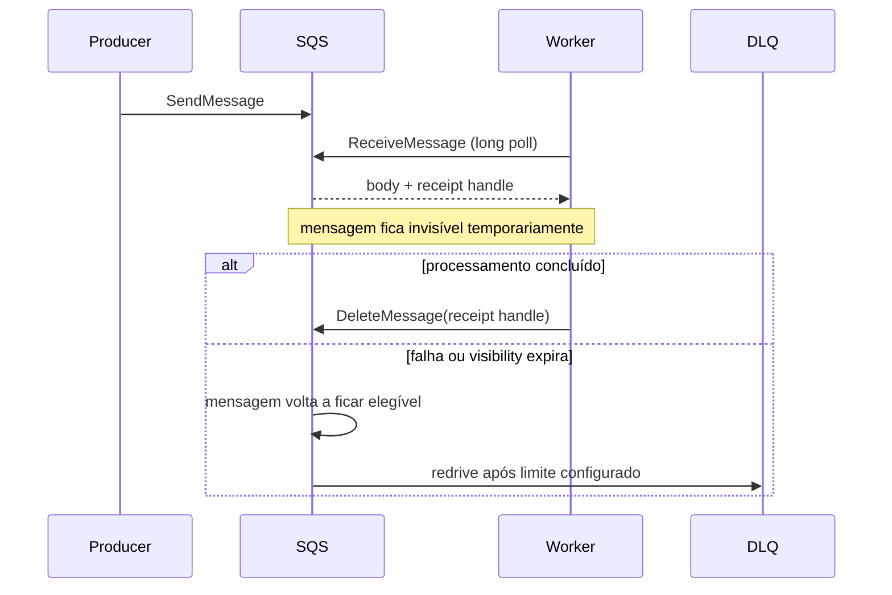

# Amazon Simple Queue Service

SQS é uma fila gerenciada que desacopla produtores e workers sem exigir operação
de brokers. A simplicidade da API esconde decisões importantes sobre
redelivery, visibility timeout, paralelismo, DLQ, autoscaling e idempotência.

A regra mental mais útil é: receber uma mensagem não a remove. O worker recebe
uma tentativa temporária de processamento e só conclui o trabalho ao deletar a
mensagem com o receipt handle válido.

## 1. Standard versus FIFO

### Standard

Filas Standard priorizam escala e disponibilidade. A aplicação deve assumir
entrega at-least-once e ordering best effort.

Isso significa que dois fatos são normais, não incidentes por si só:

- uma mensagem pode aparecer novamente;
- mensagens podem ser observadas em ordem diferente da produção.

### FIFO

FIFO adiciona ordering por `MessageGroupId` e mecanismos de deduplicação no
escopo documentado pelo serviço. O ganho de ordem vem acompanhado de uma unidade
de serialização: mensagens do mesmo grupo precisam avançar de forma coordenada.

Uma única `MessageGroupId` para toda a fila transforma toda a carga em uma linha
serial. A escolha do grupo é equivalente a escolher a fronteira de ordering.

## 2. Lifecycle de uma mensagem



O receipt handle identifica aquela tentativa de recebimento. Em uma nova entrega,
um novo handle pode ser emitido. Não trate `messageId` e receipt handle como a
mesma coisa.

## 3. Por que at-least-once exige idempotência

Considere este fluxo:

```text
worker recebe M
→ grava pagamento como processado
→ perde conexão antes de DeleteMessage
→ visibility expira
→ M é entregue novamente
```

Do ponto de vista do SQS, a mensagem não foi concluída. Do ponto de vista do
negócio, o efeito já ocorreu.

Por isso o worker deve conseguir reconhecer que o efeito associado à mesma chave
de negócio já foi aplicado.

Um padrão comum é manter uma inbox/deduplication record na mesma transação do
efeito quando o datastore permite:

```text
BEGIN
  inserir idempotency_key se ainda não existir
  aplicar efeito
COMMIT
DeleteMessage
```

Se a key já existe, a nova tentativa pode ser tratada como sucesso lógico e a
mensagem deletada.

## 4. Visibility timeout é um lease

Ao receber uma mensagem, ela fica invisível para outros consumers durante o
visibility timeout. Esse período funciona como um lease de processamento, não
como lock definitivo.

Se for curto demais:

- a mensagem reaparece enquanto o primeiro worker ainda trabalha;
- dois workers podem processar o mesmo efeito simultaneamente;
- `ApproximateReceiveCount` cresce sem falha real da lógica.

Se for longo demais:

- recovery após crash demora;
- trabalho preso fica invisível por muito tempo;
- feedback de falha fica lento.

Uma configuração inicial deve considerar distribuição real de duração, não só a
média. Para jobs variáveis, o worker pode estender visibility enquanto demonstra
progresso.

### Heartbeat com limite

Estender indefinidamente cria mensagens zumbis. Defina:

- intervalo de heartbeat;
- deadline máximo do job;
- quantidade máxima de extensões;
- comportamento em shutdown;
- métrica para mensagens renovadas repetidamente.

## 5. Long polling

Short polling pode consultar apenas parte da infraestrutura e retornar vazio
mesmo quando existe trabalho. Long polling permite aguardar por mensagens e
reduz empty receives e chamadas desnecessárias.

Em workers contínuos, long polling costuma ser a escolha natural. Ainda assim,
receber zero mensagens é uma condição esperada e deve ser barata.

## 6. Batching

Send, receive e delete possuem operações em batch. Batching reduz número de
requests e overhead de rede, mas adiciona semântica de sucesso parcial.

Um batch não deve ser tratado como "tudo ou nada" por conveniência. Inspecione o
resultado por item e repita somente os itens que realmente falharam.

No receive, batch maior pode aumentar eficiência, mas o worker precisa impor
concorrência bounded. Buscar dez mensagens e abrir dez mil chamadas downstream
por fan-out interno apenas move o gargalo.

## 7. Delete depois do efeito durável

A ordem recomendada é intencional:

```text
receive
→ validar
→ aplicar efeito durável/idempotente
→ delete
```

Deletar antes de persistir o efeito troca duplicação possível por perda possível.
Na maioria dos workflows de negócio, redelivery tratável é preferível a perder o
trabalho silenciosamente.

## 8. Poison messages e DLQ

Retry não corrige erro permanente. Uma mensagem incompatível com schema, dado
inválido ou referência inexistente pode consumir capacidade para sempre.

Classifique falhas:

- **transitória:** timeout, throttling, dependência temporariamente indisponível;
- **permanente:** payload inválido, versão não suportada, regra impossível;
- **desconhecida:** requer investigação antes de decidir.

DLQ é quarentena, não lixeira. Ela precisa de:

- retenção suficiente para investigação;
- alarme;
- contexto seguro sobre a falha;
- processo de correção;
- redrive controlado;
- auditoria de quem reprocessou.

Replay em massa pode recriar o incidente original. Reenvie com rate limit e
observe a dependência downstream.

## 9. Retention não é event log

A retenção define por quanto tempo mensagens não concluídas permanecem na fila.
Ela protege contra backlog temporário, mas não é um histórico de domínio para
replay arbitrário de meses ou anos.

Se replay histórico é requisito, preserve os fatos em armazenamento apropriado
ou use uma tecnologia cuja abstração seja log durável.

## 10. FIFO e `MessageGroupId`

Dentro de um message group, a ordem limita o trabalho concorrente. Entre groups,
há paralelismo.

Exemplo de pedidos:

```text
MessageGroupId = order_id
```

Isso preserva sequência por pedido e permite vários pedidos em paralelo.

Já:

```text
MessageGroupId = tenant_id
```

pode ser correto se a ordem realmente precisa ser global por tenant, mas um
tenant muito grande pode virar hot group.

A pergunta é a mesma de sistemas particionados: qual entidade precisa ordem e
qual capacidade você sacrifica para obtê-la?

## 11. Deduplication FIFO não substitui idempotência de negócio

A deduplicação FIFO possui janela e escopo próprios. Ela ajuda a evitar certas
duplicatas de envio, mas não prova que um efeito externo aconteceu exatamente
uma vez.

Exemplo:

```text
SQS entrega uma vez
→ worker chama API externa
→ API processa
→ worker cai antes de DeleteMessage
→ SQS entrega de novo
```

A duplicata nasceu no consumo, não em um segundo `SendMessage`. O downstream
ainda precisa de idempotency key quando o efeito não pode repetir.

## 12. Large payload

Não transforme a fila em storage de objetos. Para payload maior que o limite ou
que seja caro de duplicar, armazene o conteúdo em object storage e envie uma
referência.

O envelope precisa incluir, quando aplicável:

- localização;
- checksum/versão;
- autorização de leitura;
- lifecycle coordenado;
- classificação do dado.

Evite apagar o objeto antes de todas as tentativas possíveis da mensagem. E não
congele objetos sensíveis indefinidamente porque uma DLQ nunca foi limpa.

## 13. Autoscaling por trabalho, não por vaidade de CPU

Para workers, profundidade da fila é útil, mas não suficiente. Um backlog de 100
mensagens de 10 ms é diferente de 100 jobs de 20 minutos.

Observe:

- idade aproximada da mensagem mais antiga;
- mensagens visíveis;
- mensagens em voo;
- taxa de chegada;
- taxa de conclusão;
- duração p50/p95/p99;
- erro/retry;
- capacidade da dependência downstream.

Uma aproximação de workers necessários pode começar em:

```text
arrival_rate × processing_time
```

Isso estima concorrência para acompanhar a chegada em regime estável. Adicione
margem e valide com distribuição real e limites do downstream.

Escalar workers sem limitar conexões pode apenas derrubar o banco mais rápido.

## 14. Backpressure

SQS absorve bursts, mas backlog infinito não é uma estratégia. Defina:

- SLO máximo de idade;
- capacidade sustentável do consumer;
- alarmes antes de a retenção virar risco;
- política para reduzir produtores ou degradar funcionalidades;
- prioridade, se o domínio exigir classes diferentes de trabalho.

Quando a taxa de chegada permanece acima da saída, autoscaling só ajuda até o
próximo gargalo.

## 15. Shutdown de worker

Durante deploy ou scale-in:

1. pare de buscar novas mensagens;
2. deixe jobs ativos terminar dentro de um deadline;
3. estenda visibility somente se a estratégia permitir;
4. não delete trabalho incompleto;
5. encerre conexões;
6. permita redelivery do restante.

Um worker que recebe SIGTERM e continua buscando trabalho até morrer aumenta
duplicatas e tempo de deploy.

## 16. Segurança

Use IAM com ações e filas específicas. Separe identidade de producer e consumer
quando possível.

Considere:

- queue policy restritiva;
- criptografia server-side/KMS conforme ameaça;
- rotação de credenciais ou workload identity;
- VPC endpoint quando arquitetura exigir caminho privado;
- proteção contra confused deputy em integrações entre serviços;
- não registrar body sensível;
- limitar quem pode redrive/purge.

`PurgeQueue` é uma operação destrutiva. Trate permissões administrativas como
parte do threat model.

## 17. Custo operacional

O custo não vem só de "ter uma fila". O número de requests é influenciado por:

- polling vazio;
- tamanho dos batches;
- retries;
- extensões de visibility;
- deletes individuais;
- chamadas a KMS e integrações associadas.

Long polling e batching podem reduzir chamadas. A otimização correta, porém,
continua subordinada a semântica e latência do negócio.

## 18. Falhas recorrentes

| Falha | Sintoma | Evidência | Resposta |
| --- | --- | --- | --- |
| visibility curta | mesmo job simultâneo | receive count + duração | aumentar/renovar lease e idempotência |
| visibility longa | recovery lento | mensagens in-flight | reduzir lease ou heartbeat bounded |
| poison message | retry infinito/DLQ cresce | mesmo erro por payload | classificar e quarentenar |
| worker sem idempotência | efeito duplicado | chave de negócio repetida | inbox/conditional write |
| hot FIFO group | fila cresce apesar de workers livres | group distribution | reparticionar groups |
| downstream saturado | mais workers pioram erro | pool/throttling downstream | limitar concorrência |
| delete precoce | trabalho desaparece | mensagem ausente sem efeito | delete após commit |
| redrive massivo | nova sobrecarga | spikes após replay | replay rate-limited |

## 19. Troubleshooting

Quando "a fila está acumulando":

1. taxa de chegada aumentou?
2. idade cresce ou só profundidade oscila?
3. existem mensagens in-flight demais?
4. tempo de processamento mudou?
5. retry está consumindo a mesma capacidade?
6. DLQ recebe poison messages?
7. FIFO possui poucos groups ativos?
8. banco/API downstream está throttling?
9. workers realmente aumentaram e ficaram saudáveis?
10. visibility está coerente com p99?

A fila costuma ser o termômetro de um gargalo que está em outro lugar.

## 20. Laboratórios

### Beginner

- produza/consuma com long polling;
- observe receipt handle e visibility;
- deixe visibility expirar e confirme redelivery.

### Intermediate

- aplique um efeito idempotente em banco;
- derrube o worker depois do commit e antes do delete;
- prove que a nova tentativa não duplica o efeito.

### Advanced

- crie poison message e DLQ;
- faça redrive com limite de taxa;
- compare backlog, idade e erros durante o processo.

### Expert

Modele uma fila FIFO de pedidos com vários `MessageGroupId`. Injete hot group,
worker crash, downstream throttling e deploy durante processamento. Defina um
SLO de idade, uma política de scaling e prove por métricas que o sistema se
recupera sem duplicar efeitos de negócio.

## Referências oficiais

- AWS. [SQS Developer Guide](https://docs.aws.amazon.com/AWSSimpleQueueService/latest/SQSDeveloperGuide/welcome.html).
- AWS. [Visibility timeout](https://docs.aws.amazon.com/AWSSimpleQueueService/latest/SQSDeveloperGuide/sqs-visibility-timeout.html).
- AWS. [Exactly-once processing in FIFO queues](https://docs.aws.amazon.com/AWSSimpleQueueService/latest/SQSDeveloperGuide/FIFO-queues-exactly-once-processing.html).
- AWS. [Dead-letter queues](https://docs.aws.amazon.com/AWSSimpleQueueService/latest/SQSDeveloperGuide/sqs-dead-letter-queues.html).

---

[← Kafka](../kafka/README.md) · [↑ Mensageria](../README.md) · [Laboratório Docker →](../docker-lab.md)
