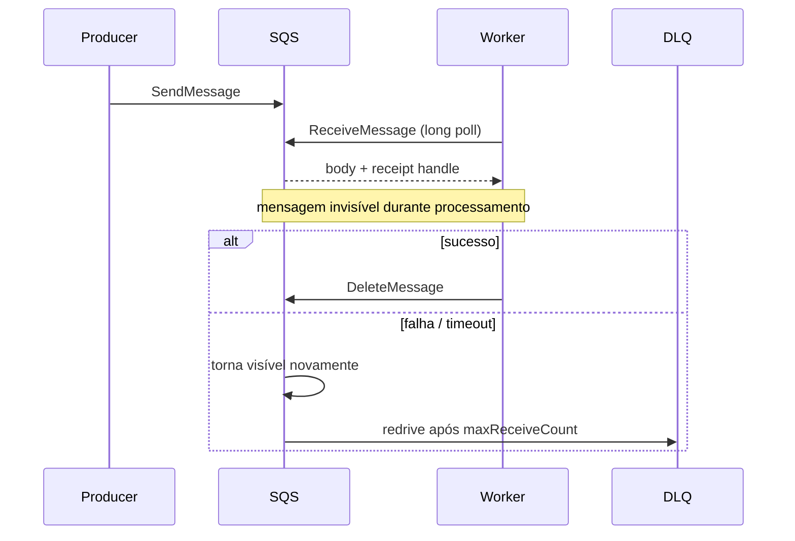

# Amazon Simple Queue Service

SQS desacopla produtores e workers sem operar brokers. Standard prioriza escala e entrega at-least-once com ordering best effort; FIFO usa message groups para ordem e mecanismos de deduplicação dentro dos limites documentados.

## Lifecycle

Visibility timeout deve cobrir processamento normal, podendo ser estendido com heartbeat limitado. Se curto, há processamento concorrente; se longo, recovery demora. Receipt handle muda a cada recebimento. Long polling reduz requests vazias.

Short polling consulta subconjunto de servidores e pode retornar vazio mesmo havendo mensagens; long polling espera até o limite configurado e costuma reduzir custo/empty receives. Retenção define quanto tempo mensagem não deletada permanece disponível; alinhe com pior backlog e DLQ. Ela não é histórico reprocessável indefinido.

## Design do worker

- valide envelope, tamanho e schema;
- idempotency key + conditional write junto ao efeito;
- deadline menor que visibility e shutdown que devolve/estende trabalho conscientemente;
- classifique retryable/permanent; permanent vai a quarentena com contexto seguro;
- delete somente depois de efeito durável;
- monitore idade da mensagem mais antiga, não só profundidade.

Large payload deve ir a object storage com referência, checksum, autorização e lifecycle coordenado. Delay queues/timers são aproximados dentro das garantias do serviço; workflows longos pedem orquestrador apropriado.

## FIFO

`MessageGroupId` define sequência e unidade de paralelismo. Um único grupo serializa toda a fila. Deduplication ID não substitui idempotência de negócio além da janela/escopo. Evite depender de ordem entre grupos.

## Segurança e operação

Use IAM least privilege, queue policy restritiva, encryption/KMS conforme ameaça e VPC endpoint quando aplicável. Não registre body sensível. Configure redrive policy e DLQ com retenção suficiente; replay deve ser autorizado, limitado e auditado.

## Exercícios

1. Dimensione visibility a partir de p99 e implemente heartbeat.
2. Duplique mensagens Standard e prove efeito único.
3. Crie poison message, redrive para DLQ, corrija e reenvie com rate limit.
4. Modele FIFO para pedidos: escolha message group e explique paralelismo.

## Referências oficiais

- AWS. [SQS Developer Guide](https://docs.aws.amazon.com/AWSSimpleQueueService/latest/SQSDeveloperGuide/welcome.html).
- [Visibility timeout](https://docs.aws.amazon.com/AWSSimpleQueueService/latest/SQSDeveloperGuide/sqs-visibility-timeout.html).
- [Exactly-once processing in FIFO queues](https://docs.aws.amazon.com/AWSSimpleQueueService/latest/SQSDeveloperGuide/FIFO-queues-exactly-once-processing.html).
- [Dead-letter queues](https://docs.aws.amazon.com/AWSSimpleQueueService/latest/SQSDeveloperGuide/sqs-dead-letter-queues.html).

---

[← Kafka](../kafka/README.md) · [↑ Mensageria](../README.md) · [Laboratório Docker →](../docker-lab.md)
