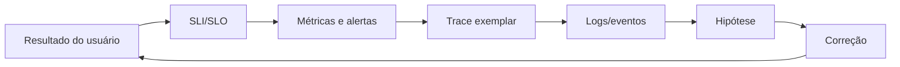

# Observabilidade

Observabilidade é a capacidade de inferir estado interno por sinais externos. Telemetria sem perguntas, contexto e ação é custo; dashboards sem SLO não definem saúde.

## Trilha

| Guia | Foco |
| --- | --- |
| [Logs, métricas e traces](signals.md) | propriedades, correlação, custo e cardinalidade |
| [OpenTelemetry](opentelemetry.md) | API/SDK, Collector, propagação e pipelines |
| [SLOs e incidentes](slos-and-incidents.md) | indicadores, error budgets, alertas e diagnóstico |
| [Exercícios](exercises.md) | instrumentação e investigação progressivas |

## Telemetria orientada a perguntas

Comece por: “usuários conseguem completar checkout dentro do objetivo?” Depois instrumente fronteiras e recursos que explicam falha. RED (rate, errors, duration) cobre serviços; USE (utilization, saturation, errors) cobre recursos.

Os **Four Golden Signals** do SRE—latência, tráfego, erros e saturação—são outra lente compacta. SLA é compromisso externo/negocial e consequências; SLO é objetivo interno de confiabilidade; SLI é a medição. Não copie o SLA diretamente como único alerta: mantenha margem operacional e error budget.

## Ecossistema, sem acoplar o modelo

Prometheus coleta/consulta métricas; Grafana visualiza múltiplas fontes; Loki indexa metadados de logs; Tempo e Jaeger armazenam/consultam traces. OpenTelemetry padroniza geração e pipeline. Produtos são opções composáveis: escolha por escala, tenancy, retenção, custo e operação, preservando OTLP/convenções e exportação para reduzir lock-in.

## Princípios

- timestamp, service/version/environment e correlation context consistentes;
- dados sensíveis minimizados/redigidos antes de exportar;
- cardinalidade e retenção como orçamento de produto;
- sampling baseado em risco, preservando erros/caudas quando possível;
- alerta acionável ligado a impacto, owner e runbook;
- telemetria é parte da API operacional e recebe testes.

## Referências

- OpenTelemetry. [Documentation](https://opentelemetry.io/docs/).
- Google. [Site Reliability Engineering](https://sre.google/sre-book/table-of-contents/).
- W3C. [Trace Context](https://www.w3.org/TR/trace-context/).
- Prometheus. [Documentation](https://prometheus.io/docs/); Grafana Labs. [Grafana](https://grafana.com/docs/grafana/latest/), [Loki](https://grafana.com/docs/loki/latest/) e [Tempo](https://grafana.com/docs/tempo/latest/); Jaeger. [Documentation](https://www.jaegertracing.io/docs/).

---

[← API Gateways](../api-gateways/README.md) · [↑ Início](../README.md) · [Sinais →](signals.md)
