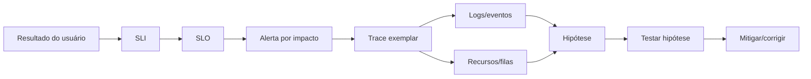
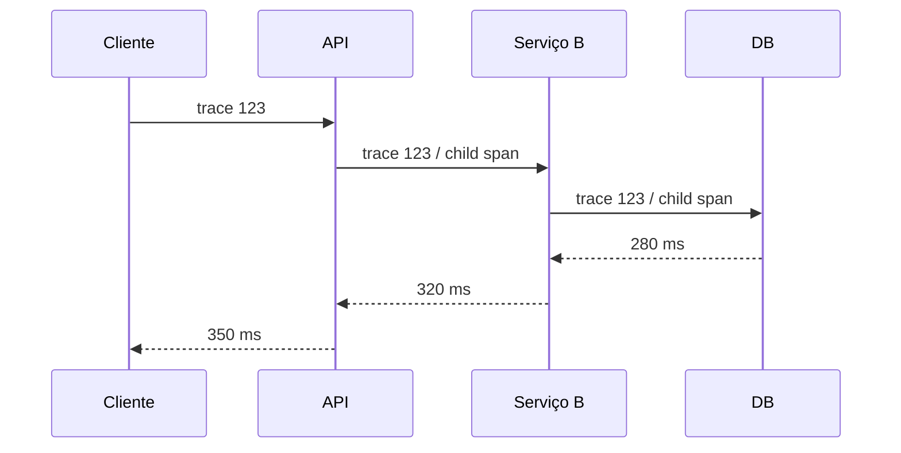
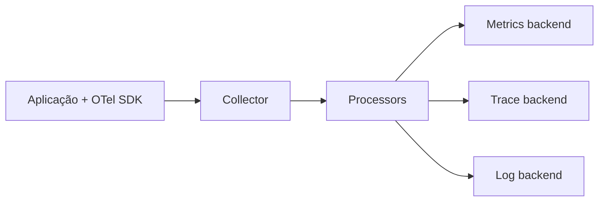

# Observabilidade

Observabilidade é a capacidade de investigar o estado interno de um sistema a
partir de sinais externos. Telemetria é matéria-prima. Observabilidade aparece
quando esses sinais permitem formular e testar hipóteses durante comportamento
normal e falhas que não foram previstas em um dashboard.

Um sistema com milhares de métricas pode continuar pouco observável se ninguém
consegue responder por que um usuário específico falhou ou qual recurso saturou.

## Trilha

| Guia | Foco |
| --- | --- |
| [Logs, métricas e traces](signals.md) | propriedades, correlação, custo e cardinalidade |
| [OpenTelemetry](opentelemetry.md) | API/SDK, Collector, propagação e pipelines |
| [SLOs e incidentes](slos-and-incidents.md) | indicadores, error budgets, alertas e diagnóstico |
| [Exercícios](exercises.md) | instrumentação e investigação progressivas |

## 1. Comece pelo resultado do usuário

Pergunta ruim:

> Quais métricas devemos colocar no dashboard?

Pergunta melhor:

> Usuários conseguem concluir a operação dentro da confiabilidade e latência que
> prometemos?

A segunda pergunta define o que observar antes da ferramenta.



## 2. SLI, SLO e SLA não são sinônimos

### SLI

Service Level Indicator é uma medição da experiência/propriedade relevante.
Exemplo: proporção de requests de leitura consideradas boas.

### SLO

Service Level Objective é o alvo. Exemplo: 99,9% das leituras boas em 30 dias.

### SLA

Service Level Agreement é compromisso externo/negocial e pode incluir
consequências contratuais.

Copiar um SLA como único alerta operacional costuma ser tarde demais. Equipes
precisam de margem para agir antes de violar compromisso externo.

## 3. O que significa uma request "boa"

Disponibilidade não precisa ser apenas `status < 500`. Uma operação pode retornar
`200` com payload incorreto ou levar 25 s quando o usuário abandona em 3 s.

Defina sucesso pelo contrato real:

```text
good = resposta semanticamente válida
       AND latência <= 500 ms
       AND não degradada além do limite aceito
```

O SLI precisa ser computável, estável e próximo da experiência que importa.

## 4. Error budget transforma confiabilidade em decisão

Se o SLO é 99,9%, existe 0,1% de espaço para resultados não bons no período. Esse
orçamento permite negociar velocidade de mudança e risco.

A utilidade está no feedback:

- budget saudável: mudanças seguem normalmente;
- consumo acelerado: reduzir risco e investigar;
- budget esgotado: confiabilidade domina novas mudanças até recuperação.

Error budget não deve ser usado para culpar equipe ou "autorizar" outages. Ele é
uma linguagem quantitativa para priorização.

## 5. Métricas: agregação barata e perigosa

Métricas são ótimas para tendências, alertas e agregações. Normalmente modelam
séries temporais por nome e labels.

### Cardinalidade

Se você cria uma label `user_id`, 10 milhões de usuários podem produzir milhões
de séries. Isso aumenta memória, storage e custo de query.

Labels devem representar dimensões com conjunto controlado, como:

- service;
- environment;
- route normalizada;
- status class;
- region;
- versão.

IDs únicos pertencem melhor a traces/logs com estratégia de retenção e indexação.

### Counter, gauge e histogram

- **counter:** só cresce até reset, útil para eventos acumulados;
- **gauge:** valor atual que sobe/desce;
- **histogram:** distribuição de observações em buckets.

P99 calculado a partir de médias por instância é incorreto. Distribuições exigem
agregação apropriada.

## 6. Percentis e cauda

p50 descreve o caso mediano. p95/p99 revelam a cauda. Durante saturação, a média
pode subir pouco enquanto p99 explode.

Causas comuns de cauda:

- fila;
- lock contention;
- GC;
- cache miss;
- cold start;
- retry;
- dependência lenta;
- shard/partition específico.

### Não faça média de percentis

O p99 de cada instância não pode ser simplesmente promediado para obter p99
global. Você precisa da distribuição combinada, histogramas compatíveis ou
mecanismo apropriado do backend.

## 7. Logs: eventos com contexto

Um bom log descreve um evento útil para investigação. Evite transformar cada
linha em parágrafo ou despejar objetos inteiros.

Campos típicos:

```json
{
  "timestamp": "...",
  "severity": "error",
  "service": "checkout",
  "service_version": "...",
  "environment": "prod",
  "trace_id": "...",
  "operation": "authorize_payment",
  "outcome": "timeout",
  "dependency": "payments",
  "duration_ms": 1800
}
```

### Mensagem versus estrutura

A mensagem serve leitura humana; campos estruturados servem filtro/agregação.
Não esconda informação importante apenas dentro de texto livre.

### PII e secrets

Observabilidade pode virar exfiltração involuntária. Tokens, passwords, bodies,
headers e dados pessoais não devem ser coletados "para ajudar no debug" sem
necessidade, classificação e retenção explícitas.

Redaction preferencialmente acontece perto da geração, antes da exportação.

## 8. Traces: causalidade aproximada de uma operação

Distributed tracing liga spans de uma operação. Um span normalmente registra:

- nome da operação;
- início/duração;
- atributos;
- status;
- eventos;
- links/parent relationships.



O trace ajuda a perguntar "onde o tempo foi gasto?". Não prova sozinho a causa.
Um span lento no banco pode ser consequência de lock, I/O, query plan ou overload.

## 9. Context propagation

Trace IDs só funcionam quando contexto cruza boundaries. HTTP costuma usar
headers padronizados; filas precisam transportar contexto em metadata.

O W3C Trace Context define `traceparent`/`tracestate` para interoperabilidade.

Cuidados:

- não confie em qualquer baggage vindo do cliente;
- evite carregar PII em baggage;
- mantenha tamanho controlado;
- preserve contexto em async boundaries.

## 10. Sampling é uma decisão de informação

Guardar 100% dos traces pode ser caro. Sampling reduz volume, mas pode remover
justamente os casos raros.

### Head sampling

Decide cedo, antes de conhecer resultado completo. É simples e barato, mas pode
perder erros raros.

### Tail sampling

Decide depois de observar a trajetória, permitindo preservar erros, alta
latência ou atributos específicos. Exige buffering/coordenação maior.

Uma estratégia pode combinar baseline probabilístico com retenção prioritária de
falhas e cauda.

`1% sampling` não significa que você verá 1% de cada tipo de erro raro de forma
representativa em todo intervalo. Distribuição e regras importam.

## 11. RED, USE e Golden Signals

### RED para serviços

- Rate;
- Errors;
- Duration.

### USE para recursos

- Utilization;
- Saturation;
- Errors.

### Golden Signals

- latency;
- traffic;
- errors;
- saturation.

São lentes, não checklists rígidos. Um consumer de Kafka precisa também de lag;
um banco precisa de locks/replication lag; um modelo de IA pode precisar tokens,
custo e eval quality.

## 12. Saturação costuma explicar mais que utilização

CPU em 70% parece saudável, mas se uma connection pool de tamanho 20 tem fila de
500 requests, o sistema está saturado.

Saturação é trabalho esperando um recurso:

- queue length;
- pool waiters;
- CPU run queue;
- disk queue;
- thread/event-loop lag;
- broker lag.

Olhe utilização e fila juntas.

## 13. OpenTelemetry como arquitetura de instrumentação

OpenTelemetry separa geração de telemetria de backends específicos.



O Collector pode receber, transformar, batch, sample e exportar. Isso reduz
acoplamento, mas adiciona uma camada que também precisa de capacidade e
observabilidade.

### Collector pode ser gargalo

Observe:

- accepted/dropped telemetry;
- queue usage;
- export failures;
- retry;
- CPU/memory;
- backpressure.

Uma pipeline de observabilidade que descarta dados silenciosamente durante
incidente cria falsa confiança.

## 14. Alertas: páginas devem exigir ação

Um alerta que dispara toda semana e ninguém age virou decoração ruidosa.

Bom page alert responde:

- qual impacto está ocorrendo ou é iminente?
- quem é owner?
- qual primeira investigação?
- existe ação possível agora?

Alertas por SLO burn rate ajudam a combinar intensidade e duração do consumo de
budget.

Métricas de infraestrutura podem gerar tickets ou sinais de diagnóstico sem
necessariamente acordar alguém às 3h.

## 15. Dashboards são mapas, não investigação completa

Um dashboard bom responde uma pergunta específica:

- o serviço está cumprindo SLO?
- qual versão/região está afetada?
- qual recurso está saturado?
- o deploy alterou comportamento?

Evite "dashboard parede de televisão" com 50 gráficos sem narrativa.

Para incidente, use dashboard para localizar região do problema e depois traces,
logs, profiles e queries para testar hipóteses.

## 16. Profiling completa telemetria

Métricas dizem que CPU está alta. Traces mostram operações lentas. Profiler pode
mostrar quais funções consomem CPU/alocações.

Perfis úteis:

- CPU;
- heap/allocation;
- lock/contention;
- goroutines/threads, conforme runtime.

Continuous profiling é especialmente útil para regressões de performance que não
aparecem em um único trace.

## 17. Modos de falha da própria observabilidade

| Falha | Sintoma | Evidência | Mitigação |
| --- | --- | --- | --- |
| cardinalidade explosiva | custo/queries degradam | séries por label | limitar dimensões |
| collector saturado | gaps/drops | queue/drop metrics | capacity + batching |
| log storm | storage/custo explode | bytes/s por source | rate limit/sampling |
| sampling ruim | incidentes raros somem | sampled decisions | tail/rules + eval |
| clock skew | spans fora de ordem | host/time signals | sync + monotonic durations |
| PII em telemetria | incidente de privacidade | field audit | minimização/redaction |
| alerta por sintoma técnico | fadiga | ack/no-action history | SLO/ação explícita |

## 18. Um fluxo de investigação

Cenário: p99 de checkout subiu de 600 ms para 4 s.

1. confirme SLI e início do impacto;
2. segmente por versão/região/route;
3. abra traces lentos representativos;
4. identifique hop dominante;
5. compare recurso/queue do hop;
6. use logs para eventos discretos;
7. use profile se CPU/alocação for hipótese;
8. compare com deploy/configuração;
9. mitigue;
10. confirme recuperação pelo SLI.

A ordem evita buscar uma string de erro antes de saber onde o problema está.

## 19. Testes de observabilidade

Instrumentação também pode regredir.

Teste:

- propagação de trace context;
- nomes/atributos estáveis;
- ausência de secrets;
- métricas em caminhos de erro;
- exemplars/links quando usados;
- comportamento de exporter indisponível;
- pipeline sob carga;
- alert rules com dados sintéticos ou replay.

Uma aplicação não deveria cair porque o backend de observabilidade caiu.
Telemetria precisa de buffers/limites e política de falha adequada.

## 20. Laboratórios

### Beginner

- instrumente rate/errors/duration de uma API;
- crie logs estruturados com `trace_id`;
- gere histogram e compare p50/p99.

### Intermediate

- propague trace por HTTP e fila;
- provoque latência numa dependência e localize no trace;
- crie SLI de sucesso + latência.

### Advanced

- configure head sampling e tail sampling e compare casos preservados;
- gere cardinalidade acidental e observe impacto;
- sature connection pool e mostre que fila explica o p99.

### Expert

Execute game day: injete três falhas diferentes que produzem o mesmo `5xx` no
edge. Use apenas telemetria para distinguir DNS, pool saturado e erro lógico.
Documente quais sinais faltaram e melhore a instrumentação.

## Referências

- OpenTelemetry. [Documentation](https://opentelemetry.io/docs/) define APIs,
  SDKs, Collector e convenções.
- W3C. [Trace Context](https://www.w3.org/TR/trace-context/) padroniza propagação
  distribuída.
- Google. [Site Reliability Engineering](https://sre.google/sre-book/table-of-contents/)
  e [SRE Workbook](https://sre.google/workbook/table-of-contents/) aprofundam
  SLOs, monitoring e alerting.
- Prometheus. [Documentation](https://prometheus.io/docs/) cobre modelo de
  métricas e PromQL.
- Grafana Labs. [Grafana](https://grafana.com/docs/grafana/latest/),
  [Loki](https://grafana.com/docs/loki/latest/) e
  [Tempo](https://grafana.com/docs/tempo/latest/) documentam componentes do
  ecossistema LGTM.
- Jaeger. [Documentation](https://www.jaegertracing.io/docs/) é referência para
  tracing distribuído no projeto.

---

[← API Gateways](../api-gateways/README.md) · [↑ Início](../README.md) · [Sinais →](signals.md)
